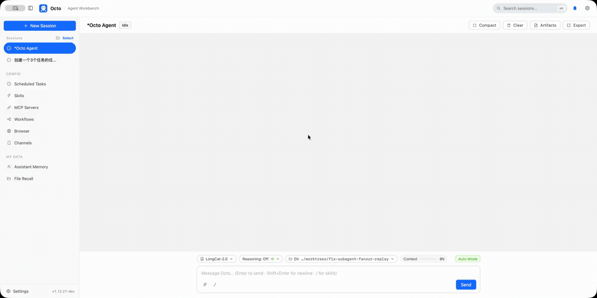

<p align="center">
  
</p>

<div align="center">

# octo-agent

**An open-source, single-binary, self-hosted AI agent.**

A coding agent on par with Claude Code; as a personal assistant, lighter than OpenClaw — one MIT-licensed Go binary, no Node / Python / Ruby, running on **any model** (DeepSeek, Kimi, Anthropic, OpenAI, or anything compatible), with the server and your data staying on your own machine.

[](https://github.com/open-octo/octo-agent/actions)
[](https://github.com/open-octo/octo-agent/stargazers)
[](https://github.com/open-octo/octo-agent/discussions)
[](https://octo-agent.dev)
[](https://go.dev)
[](LICENSE.txt)

[Website](https://octo-agent.dev) · [简体中文](README_CN.md) · [Install Guide](https://octo-agent.dev/docs/getting-started/install/) · [Documentation](https://octo-agent.dev/docs/) · [Community](#community)

If you find octo useful, give it a ⭐ on GitHub!

</div>

## Why octo

octo isn't another agent framework you have to "raise." Projects like OpenClaw or Hermes often need environment tuning, rule writing, and skill configuration before the agent runs smoothly. octo sits closer to Codex or WorkBuddy: **download and use, user-friendly**, while keeping model choice, data ownership, and the runtime firmly in your hands.

```bash
curl -fsSL https://octo-agent.dev/install.sh | sh     # single binary — no Node / Ruby / Python
octo config                                            # pick a provider, paste a key (DeepSeek / Kimi / …)
octo "Add a --json flag to 'octo config show' and run the tests"   # one prompt → full agentic loop
```

octo is built around that positioning:

- **Works out of the box**: shell, file read/write/edit, search, MCP servers, skills, and sub-agents are all on by default — one message after install is enough for it to actually do work.
- **Model choice stays yours**: any OpenAI / Anthropic protocol-compatible endpoint is supported natively; no vendor lock-in.
- **Data stays on your machine**: self-hosted, zero telemetry — except for the model API calls you configure, octo sends no outbound traffic on its own.
- **Everywhere you are**: the same binary serves eight entry points — TUI, CLI, web, desktop, IM, editor extensions, and mobile.
- **Safe defaults**: catastrophic commands are hard-coded denies, and deletes and overwrites are backed up to a recycle bin first — the agent won't edit itself dead and won't go rogue on your data.

If you already have reliable access to a Codex or Claude subscription, keep using it — they remain the best agent harnesses on the planet. Otherwise, octo is worth a serious look.

## Highlights

- **A single ~40 MB Go binary**: one command to download, copy to any server, and run. No Node / Python / Ruby dependency tree; no npm mirror, node-gyp build failure, or version conflict headaches.
- **No cache degradation**: prompt caching is tuned per provider; measured hit rates for Kimi, DeepSeek, and Qwen are all **95%+**, keeping your token bill predictable.
- **Eight interfaces**: TUI, CLI, Web UI, desktop app, IM bridge, VS Code, Obsidian, and mobile — few other agent projects cover this many entry points at once.
- **Zero telemetry**: no IP, device model, model choice, or usage behavior is collected — no telemetry hooks at all.
- **Desktop installer around 100 MB**: compare that to Codex desktop and WorkBuddy, which often weigh in around **1 GB**. A thin agent harness shouldn't need that much space.
- **Stable and safe**: self-protection, graceful restarts, and a recycle-bin safety net (see [Core Features](#core-features)).

Any one of these points might be covered by some other product. But only octo combines out-of-the-box usability, native multi-model support, eight interfaces, a single binary, zero telemetry, a small footprint, high stability, and strong safety.

## One Binary, Eight Interfaces

```text
octo (single binary)
  -> TUI                  interactive terminal session
  -> CLI                  octo "prompt" or piped stdin: one headless agentic turn, then exit — script it from cron, CI, or your own programs
  -> Web UI               octo serve local dashboard
  -> Desktop app          native window + system tray on macOS / Windows / Linux
  -> IM bridge            WeChat iLink, Feishu, DingTalk, WeCom, Discord, Telegram
  -> VS Code extension    open-octo/octo-vscode
  -> Obsidian plugin      open-octo/octo-obsidian
  -> Mobile               iOS + Android developer preview
```

**Stable (1.0)** already covers TUI, CLI, Web UI, Desktop, IM bridge, and the [VS Code](https://github.com/open-octo/octo-vscode) / [Obsidian](https://github.com/open-octo/octo-obsidian) extensions. The eighth — a mobile app (iOS + Android) — is implemented and in **developer preview**: buildable from source today against a self-hosted relay (see [`mobile/`](mobile/)), with a hosted relay and app-store builds next.

## Core Features

### Works out of the box — no "raising" required

Built-in tools (shell, file read/write/edit, search), MCP servers, skills, and sub-agents are on by default. No environment tuning, rule writing, or skill configuration first — one message after install is enough for it to actually do work.

### Native model support, without cache degradation

DeepSeek, Kimi, Qwen, Anthropic, OpenAI, or any OpenAI / Anthropic-compatible endpoint — octo supports them natively. Prompt caching is tuned per provider, with hit rates of 95%+. Unlike setups that front Claude Code with a third-party model and see cache hit rates collapse from misconfiguration, octo keeps your token bill predictable.

### Stable and safe — won't edit itself dead, won't go rogue

- The **terminal** tool refuses any `kill` / `pkill` / `killall` aimed at octo's own process, including detours like `kill $(pgrep octo)`.
- **restart_server** is hard-wired to ask permission first — a browser modal on the web, an explicit reply on IM. Even after approval, the restart is graceful: the current turn drains so your reply reaches you before the supervisor respawns the server and clients reconnect.
- Every delete is validated. Catastrophic commands like `rm -rf /` and `rm -rf ~` are **hard-coded denies** that custom permission rules cannot override. Ordinary file deletes and `write_file` / `edit_file` overwrites are first backed up to a recycle bin (default 14 days / 10 GiB), so nothing is ever truly gone.
- On top of that, opt into [OS-enforced sandboxing](https://octo-agent.dev/docs/guides/sandbox-the-agent/) (macOS Seatbelt / Linux Landlock) when you want it.

### Skills: Claude Code-compatible

The [SKILL.md format](https://octo-agent.dev/docs/guides/use-skills/) is compatible with Claude Code — symlink `~/.claude/skills` and reuse what you have.

### MCP servers

[stdio + HTTP transports, OAuth](https://octo-agent.dev/docs/guides/connect-mcp-servers/), and Tool Search for large tool sets.

### Memory, sub-agents, and workflows

[Cross-session memory](https://octo-agent.dev/docs/guides/memory/), [parallel sub-agents](https://octo-agent.dev/docs/guides/sub-agents/), and [multi-agent workflow orchestration](https://octo-agent.dev/docs/guides/workflows/).

### Browser automation

Go-native CDP [record / replay / self-heal](https://octo-agent.dev/docs/guides/browser-automation/).

### IM channels

[Hook octo up to your chat apps](https://octo-agent.dev/docs/guides/channels/) and put it to work from WeChat, Feishu, or Telegram.

## Quick Start

### Install

- **Linux / macOS** — `curl -fsSL https://octo-agent.dev/install.sh | sh`
- **Windows** — `irm https://octo-agent.dev/install.ps1 | iex`
- **Restricted networks** — if github.com is unreachable, use the download mirror (installs and `octo upgrade` also fall back to it automatically):
  `curl -fsSL https://dl.octo-agent.dev/install.sh | sh` (Windows: `irm https://dl.octo-agent.dev/install.ps1 | iex`)
- **Desktop app** — grab the installer from the [latest release](https://github.com/open-octo/octo-agent/releases/latest):
  `octo-setup.pkg` (macOS), `octo-setup.exe` (Windows), `Octo-x86_64.AppImage` (Linux)
- **Go** — `go install github.com/open-octo/octo-agent/cmd/octo@latest`

Upgrade any time with `octo upgrade`. Platform details — Gatekeeper / SmartScreen warnings, uninstall, building from source — are in the [install guide](https://octo-agent.dev/docs/getting-started/install/). The installers aren't code-signed yet; the full policy and how to verify releases by hash are in [SECURITY.md](SECURITY.md#code-signing-policy).

### First run

```bash
octo config                # one-time: pick provider/model, paste an API key
octo "explain this repo"   # headless one-shot: prompt → agentic tool loop → exit
octo                       # interactive TUI in a terminal; octo -c resumes a session
octo serve -d              # Web UI + IM bridge at http://127.0.0.1:8088
```

Next steps: [quickstart](https://octo-agent.dev/docs/getting-started/quickstart/) · [choose a provider](https://octo-agent.dev/docs/getting-started/choose-a-provider/) · [CLI reference](https://octo-agent.dev/docs/reference/cli/).

## First Journey

1. Install with one command: `curl -fsSL https://octo-agent.dev/install.sh | sh`.
2. Run `octo config` to pick a provider and paste an API key.
3. Verify everything works with a one-shot: `octo "explain this repo"`.
4. Run `octo` for the interactive terminal TUI.
5. Run `octo serve -d` for the Web UI (`http://127.0.0.1:8088`), or use the desktop app.
6. Configure an [IM channel](https://octo-agent.dev/docs/guides/channels/) and keep the conversation going from WeChat / Feishu / Telegram.
7. Add [skills](https://octo-agent.dev/docs/guides/use-skills/), [MCP servers](https://octo-agent.dev/docs/guides/connect-mcp-servers/), and [sub-agents](https://octo-agent.dev/docs/guides/sub-agents/) as you need them.

## Architecture

```text
┌────────────────────────────────┐
│        Eight interfaces        │
│    TUI · CLI · Web UI · IM     │
│  Desktop · VS Code · Obsidian  │
│             Mobile             │
└───────────────┬────────────────┘
                │
┌───────────────▼────────────────┐
│         App bootstrap          │
│ provider wiring · permission   │
│ gate · sub-agent spawner       │
└───────────────┬────────────────┘
                │
┌───────────────▼────────────────┐
│           Agent core           │
│ tool loop · history · session  │
│ persistence                    │
└───────────────┬────────────────┘
                │
┌───────────────▼────────────────┐
│        Provider adapters       │
│ Anthropic / OpenAI protocols   │
│ and compatible endpoints       │
└───────────────┬────────────────┘
                │
┌───────────────▼────────────────┐
│             Tools              │
│ shell · files · search · MCP · │
│ skills · browser automation    │
└────────────────────────────────┘
```

For the layered design, provider protocols, and how to extend it, see the [architecture docs](https://octo-agent.dev/docs/architecture/system-layers/).

## Further Reading

The full documentation lives at **[octo-agent.dev/docs](https://octo-agent.dev/docs/)**:

- [Skills](https://octo-agent.dev/docs/guides/use-skills/) — Claude Code-compatible SKILL.md; symlink `~/.claude/skills` and reuse what you have
- [Sandboxing & recycle bin](https://octo-agent.dev/docs/guides/sandbox-the-agent/) — OS-enforced confinement (Seatbelt / Landlock), plus a file-level trash that backs up agent deletes and overwrites
- [MCP servers](https://octo-agent.dev/docs/guides/connect-mcp-servers/) — stdio + HTTP, OAuth, and Tool Search for large tool sets
- [Memory](https://octo-agent.dev/docs/guides/memory/) · [Sub-agents](https://octo-agent.dev/docs/guides/sub-agents/) · [Workflows](https://octo-agent.dev/docs/guides/workflows/) — persistence and multi-agent orchestration
- [Browser automation](https://octo-agent.dev/docs/guides/browser-automation/) — CDP record / replay / self-heal
- [IM channels](https://octo-agent.dev/docs/guides/channels/) — hook octo up to your chat apps
- [Configuration](https://octo-agent.dev/docs/reference/config-file/) · [Permissions](https://octo-agent.dev/docs/reference/permissions/) · [Tools](https://octo-agent.dev/docs/reference/tools/)
- [Architecture](https://octo-agent.dev/docs/architecture/system-layers/) — the layered design, provider protocols, and how to extend it

## Community

- **Bugs / feature requests** — [GitHub Issues](https://github.com/open-octo/octo-agent/issues)
- **Questions / discussion** — [GitHub Discussions](https://github.com/open-octo/octo-agent/discussions), public and searchable so the next person finds the answer
- **WeChat group** (Chinese-speaking users) — scan the QR code below, add the personal account, and mention `octo` to be invited into the group:

<p align="left">
  
</p>

## Development

```bash
make build         # ./octo
make test          # go test -race ./...
```

Project conventions live in [`CLAUDE.md`](CLAUDE.md) and [`.octorules`](.octorules); the PR workflow in [`CONTRIBUTING.md`](CONTRIBUTING.md).

## Current Status

octo has shipped **1.0 stable** — TUI, CLI, Web UI, desktop, IM bridge, and editor extensions are all safe to rely on; mobile is in developer preview. What you can build on is declared in [COMPATIBILITY.md](COMPATIBILITY.md); the security boundary in [SECURITY.md](SECURITY.md).

## Prior Art & Acknowledgements

octo stands on the shoulders of two projects and doesn't pretend otherwise: **[Claude Code](https://code.claude.com)**, whose agent loop, tool set, SKILL.md format, and harness behavior shaped octo's internal design; and **[OpenClacky](https://github.com/clacky-ai/openclacky)**, which inspired much of the UI and interaction design. Any bugs or bad decisions are octo's own.

## Contributors

Thanks to everyone who has contributed to octo:

<!-- Written out by hand rather than generated by contrib.rocks: that single
     image goes through GitHub's camo proxy, whose edges cache inconsistently,
     so different visitors can see a different number of people at the same
     moment and a new contributor may stay invisible for an unbounded time.
     Leaving someone out is worse than maintaining this list. Add a line here
     when someone new lands a change. -->
<p>
  <a href="https://github.com/Leihb"></a>
  <a href="https://github.com/eternalweightlessness"></a>
  <a href="https://github.com/kunyuanhe-sudo"></a>
  <a href="https://github.com/linauror"></a>
  <a href="https://github.com/yafoo"></a>
</p>

The full record lives in the [contributors graph](https://github.com/open-octo/octo-agent/graphs/contributors).

## License

MIT. See [`LICENSE.txt`](LICENSE.txt).
