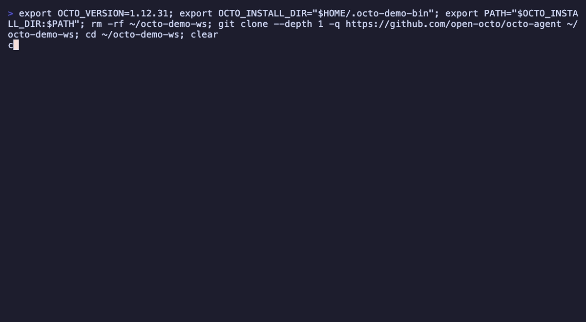

# octo-agent

[](https://github.com/open-octo/octo-agent/actions)
[](https://octo-agent.dev)
[](https://go.dev)
[](LICENSE.txt)

<p align="center">
  <a href="README.md">English</a> · <a href="README_CN.md">简体中文</a>
</p>

> 一个 **MIT 开源、单 Go 二进制、零运行时**的 AI Agent。大厂 coding agent 那套能力（skills、CLI / 网页 /
> 手机 IM、浏览器操作、OS 级沙箱）它都有 —— 区别在于它**完全开源、自包含、不绑任何厂商**，DeepSeek /
> Kimi / Anthropic / OpenAI 任意模型都能接，服务和数据都留在你自己机器上。直接复用你 `~/.claude/skills` 里的技能。
> 它既是 **coding agent**（对标 Claude Code），也是**通用 agent**（对标 Hermes）—— 一个二进制同时接管你的编码
> 和日常自动化，不必装两套工具。

<!-- TODO(demo): 录一段 15–30s 首屏 GIF（装一行 → octo 接 DeepSeek → 解决一个真实编码任务），
     放到 landing/assets/demo.gif，然后取消下面这段注释。 -->
<!--
<p align="center">
  
</p>
-->

```bash
curl -fsSL https://octo-agent.dev/install.sh | sh     # 单二进制，无需 Node / Ruby / Python 环境
octo config                                            # 选 provider，填 key（DeepSeek / Kimi / 百炼 …）
octo "给 octo config show 加一个 --json 参数并跑测试"   # 一句话 → 完整 agentic 工具循环
```

## 为什么用 octo（对比 Claude Code）

octo 不打算在功能上卷赢大厂 agent；它是同一个想法的**开源、可自托管、不绑厂商**版本。如果你乐意用 Claude
订阅，Claude Code 很好用。octo 是给「宁愿把整套东西攥在自己手里、跑自己的模型」的人准备的。

|  | **octo-agent** | Claude Code |
|---|---|---|
| 授权 / 成本 | **MIT 开源，免费，自托管** | 专有，多数场景需 Claude 订阅 |
| 运行时 | **单个自包含 Go 二进制 —— 无需 Node / Python / Ruby，没有依赖树** | 原生安装，绑定 Anthropic 账户 |
| 模型 | **双协议原生 + 任意兼容端点**（DeepSeek/Kimi/百炼/OpenRouter/vLLM） | 以 Anthropic 为主（CLI / VS Code 可接第三方） |
| 部署 / 数据 | **完全自托管，服务与数据都在你手里** | 多数场景由 Anthropic 托管 |
| 技能 | 直接复用 `~/.claude/skills` | 原生（skills 的发源地） |

<sub>Claude Code 信息据其公开文档（2026-07）。它同样具备 skills、MCP、子代理、OS 沙箱、浏览器 / computer-use、
IM channels —— 这些 octo 也都有；上表的区别是开源、自托管与模型自由，而非功能清单。</sub>

**一句话**：你想要 Claude Code 那种体验，但要开源、能自托管、不被订阅和单一厂商绑住 —— octo 就是为这个做的。

## 状态

> **稳定版（1.0）。** 三种界面均已上线：CLI（终端里是交互式 TUI，其余场景是 headless 的 agentic 单发）、本地 Web 服务（`octo serve`）、IM 桥接（随 `octo serve` 运行；微信 iLink、飞书、钉钉、企微、Discord、Telegram）。在 agent 循环之上还有 skills、MCP 客户端、操作系统级沙箱、持久化记忆、子代理、后台工作流，以及用于自主多步目标的任务图。
>
> 哪些接口可以放心依赖，见 [COMPATIBILITY.md](COMPATIBILITY.md)（稳定的配置格式、CLI、退出码，以及不在承诺范围内的部分）；安全边界见 [SECURITY.md](SECURITY.md)。

## 安装

**Linux（安装脚本）。** 自动识别架构，下载对应 release，校验 SHA-256，并把
`octo` 装进 `PATH`：

```bash
curl -fsSL https://octo-agent.dev/install.sh | sh
```

然后启动本地服务、在浏览器里 onboard：

```bash
octo serve -d                  # 后台运行本地服务
xdg-open http://127.0.0.1:8088 # 打开仪表盘
```

`127.0.0.1` 是 loopback，无需 access key；页面直接进入首屏 onboarding（选
provider、贴 key）。之后用 `octo serve --stop` 停服务。想用终端?直接跑 `octo`。

想手动取包的话，linux / darwin / windows × amd64 + arm64 的压缩包和
`checksums.txt` 都在 [最新 release](https://github.com/open-octo/octo-agent/releases/latest)。

**macOS —— 两种安装方式：**

- **安装脚本（命令行）。** 和 Linux 一样的一行命令：

  ```bash
  curl -fsSL https://octo-agent.dev/install.sh | sh
  octo serve -d                  # 后台运行本地服务
  open http://127.0.0.1:8088     # 打开仪表盘
  ```

- **双击安装器。** 从[最新 release](https://github.com/open-octo/octo-agent/releases/latest)
  下载 `octo-setup.pkg`（一个通用包同时覆盖 Apple Silicon 和 Intel），双击
  运行。Installer.app 只提供"仅为我安装"这一个选项 —— 不需要管理员密码。它
  把 octo 装进 `~/Library/Application Support/octo`，把该目录加进你的
  `PATH`（追加到 `~/.zprofile` / `~/.bash_profile` / `~/.profile`），并注册
  一个 LaunchAgent，让 `octo serve -d` 在每次登录时自动启动。安装完成后会
  启动服务并打开 <http://127.0.0.1:8088> —— loopback 地址，无需 access
  key —— 引导你完成首屏 onboarding（选 provider、贴 key）。想用终端的话，
  打开一个**新**终端窗口跑 `octo` 即可。安装器还没有经过 Apple 公证，
  Gatekeeper 会提示"来自身份不明的开发者" —— 右键（或按住 Control 点击）
  该文件 → **打开**，或者去**系统设置 → 隐私与安全性 → 仍要打开**。`.pkg`
  没有 App Store 那种自带卸载器，运行
  `~/Library/Application\ Support/octo/uninstall.sh` 即可清除它装的一切。

**Windows（双击安装器）。** 从[最新 release](https://github.com/open-octo/octo-agent/releases/latest)
下载 `octo-setup.exe`，双击运行。它按用户级安装（不弹管理员提示），把
`octo` 加进你的 `PATH`，并添加一个开始菜单项。安装完成后会在后台启动本地服务
（`octo serve -d`）并打开 <http://127.0.0.1:8088> —— loopback 地址，无需
access key —— 引导你完成首屏 onboarding（选 provider、贴 key）。服务也会
注册为每次登录自动启动（用户级 `Run` 项，无窗口），重启后仪表盘会自动起来；
卸载会一并移除它并停掉后台进程。想用终端的话，打开一个**新**终端窗口跑
`octo` 即可。安装器暂未做代码签名，首次运行时 Windows SmartScreen 会提示
"Windows 已保护你的电脑" —— 点**更多信息 → 仍要运行**即可。卸载走"添加或
删除程序"，和普通软件一样。

**升级：**`octo upgrade` 原地安装最新 release（SHA-256 对照 `checksums.txt`
校验）；`octo upgrade --check` 仅比较版本。Web UI 的版本徽标提供同样的流程。

**用 Go 安装：**

```bash
go install github.com/open-octo/octo-agent/cmd/octo@latest
```

**从源码构建：**

```bash
git clone https://github.com/open-octo/octo-agent.git
cd octo-agent
make build       # 产物 ./octo
```

## 快速上手

```bash
export ANTHROPIC_API_KEY=sk-ant-...      # 或 OPENAI_API_KEY=...

# 一次性设置：保存默认 provider/model（下次免去上面的 export）
octo config

# Headless 单发（claude -p 风格）：一个 prompt → 完整 agentic 工具循环 → 退出。
# 内置工具（shell、读写改文件、搜索）、MCP 服务、skills 全部默认开启，
# 所以一条消息就能真正干活。
octo "给 'octo config show' 加一个 --json 标志，然后跑测试"

# prompt 也可以来自管道或文件 —— 方便脚本 / CI：
echo "总结一下最近一次提交改了什么" | octo
octo --prompt-file ./task.md

# 交互多轮：在终端里不带消息直接运行 octo 进入 TUI（富工具卡片、自动保存
# session）。用 -c 恢复历史 session。
octo
octo sessions
octo -c                  # 从列表里选一个最近的 session
octo -c <session-id>

# 默认流式输出；--stream=false 改为缓冲、只打印最终回复文本（便于重定向到文件捕获）。
octo --stream=false "..."

# OpenAI / DeepSeek / 百炼（OpenAI 兼容）
octo --provider openai --model gpt-4o-mini "..."

# 自托管 / 第三方端点走 `custom` vendor —— 唯一接受自定义 base URL 的 vendor。
# 它的协议（openai | anthropic）按配置项单独选择，先用 `octo config` 设置一次
# （选 Custom → 选协议 → 填 base URL + model），然后：
CUSTOM_BASE_URL=https://api.deepseek.com/anthropic \
CUSTOM_API_KEY=sk-... \
  octo --model deepseek-chat "..."

# 扩展推理：设置思考强度（Anthropic thinking / OpenAI reasoning_effort）。
# --show-reasoning 会把思考轨迹提供给 Web UI 显示；终端始终不渲染。
octo --reasoning-effort high "..."

# 纯聊天，关闭工具 / MCP / skills
octo --no-tools "..."

# 沙箱化工具命令：把 terminal 工具限制在项目目录 + 临时目录，禁网络
octo --sandbox "..."

# 为当前仓库生成 .octorules 指南
octo init

# 列出已发现的 skill
octo skills list

# Web 服务 + 仪表盘（默认绑定 localhost）
octo serve --addr 127.0.0.1:8088

# IM 桥接（微信 iLink）：扫码登录；渠道随 `octo serve` 一起运行
octo serve   # 微信登录：在 Web UI 的 Channels 面板扫码
```

## 配置

Octo 的系统提示由若干可选层叠加而成（后者覆盖前者）：

- `~/.octo/soul.md` —— agent 的身份与行为规范（openclaw/hermes 式 persona）。
- `~/.octo/user.md` —— 你是谁；每次会话都会注入的个人画像。
- `~/.octo/octorules.md` —— 你的全局、跨项目规则与偏好。
- `.octorules` —— 随项目提交的仓库级约定。用 `octo init`（或 TUI 里的 `/init`）生成。
- `--system "..."` —— 单次运行的一次性覆盖。

身份文件与规则文件都支持 `@include path/to/fragment.md` 来引入共享内容。

### 推理

推理模型可以在回答前先思考。两个开关控制它，都同时支持 CLI flag 和 `octo config` 默认值：

- `--reasoning-effort low|medium|high|xhigh|max` —— 思考强度。OpenAI 协议后端作为 `reasoning_effort` 发送；Anthropic 协议后端会按模型 family 映射成自适应思考或扩展思考的 token budget。留空（默认）即关闭。
- `--show-reasoning`（默认**关闭**）—— 把思考轨迹提供给 **Web UI**（`octo serve`）显示。终端始终不渲染思考轨迹。

这把 Anthropic 的 `thinking` 块和 OpenAI 的 `reasoning_content` 统一到同一对开关之下。

### 默认值（`octo config`）

`octo config` 把默认 provider、model、（可选）base URL 和推理设置存到 `~/.octo/config.yml`，这样裸跑 `octo` 就不必每次重敲 `--provider`/`--model`：

```bash
octo config        # 交互式向导
octo config show   # 打印当前生效设置及各项来源
octo config path   # 打印配置文件路径
```

优先级：**命令行 flag > 环境变量 > `~/.octo/config.yml` > 内置默认**。API key 优先从 `ANTHROPIC_API_KEY` / `OPENAI_API_KEY` 读取；向导可选择把 key 存进文件（权限 `0600`），但推荐用环境变量。

### MCP Tool Search

当 MCP 服务暴露大量工具时，每轮请求都上传全部工具 schema 会浪费上下文并降低准确率。Tool Search 保留内置工具直接可见，但把 MCP 工具 schema 延迟到一个小型桥工具之后：

- `mcp_search` —— 按关键词搜索 MCP 工具（返回名称 + 一行描述）。
- `mcp_describe` —— 加载某个发现工具的完整 JSON Schema。
- `mcp_call` —— 用匹配该 schema 的参数调用工具。

模型会自动走这套三步协议。在 `~/.octo/config.yml` 里配置桥工具的激活时机：

```yaml
tools:
  tool_search:
    enabled: auto          # auto（默认）| on | off
    threshold_pct: 10      # auto：延迟 schema 占上下文窗口 N% 时启用
    search_default_limit: 5
    max_search_limit: 20
```

- `auto`（默认）—— 仅当延迟加载的 MCP schema 达到模型上下文窗口的 `threshold_pct` 时才启用。
- `on` —— 只要连了 MCP 工具，就始终延迟加载 schema。
- `off` —— 像之前一样，预先上传全部 MCP schema。

## Skills

Skill 是采用 Claude Code SKILL.md 格式的可复用指令集，从以下位置发现：

- `~/.octo/skills/<name>/SKILL.md` —— 用户级，跨所有项目。
- `.octo/skills/<name>/SKILL.md` —— 项目级（优先于用户级）。

格式与 Claude Code 完全相同，所以你可以把 `~/.claude/skills` 软链到 `~/.octo/skills` 直接复用现有 skill。每个 `SKILL.md` 是 YAML frontmatter 加 markdown 正文：

```markdown
---
name: review
description: Review the current diff for correctness and style
---
逐个 hunk 审查 diff，先标正确性 bug，再看风格。
```

会话启动时 Octo 把每个 skill 的名字和描述列进系统提示；当任务匹配某个 skill 时，模型通过 `skill` 工具按需加载它的完整指令。你也可以显式触发 —— `octo skills list` 查看已发现的 skill，再在 TUI 里用 `/skills` 列出、`/<name>`（如 `/review`）运行某个。

## 沙箱

`--sandbox` 把 `terminal` 工具限制在项目目录加临时目录、禁网络，由操作系统强制执行（macOS Seatbelt、Linux Landlock + seccomp）。默认关闭；当操作系统机制不可用时 fail-closed（直接拒绝运行）。

```bash
octo --sandbox                              # 限制，禁网络
octo --sandbox --sandbox-allow-net          # 允许网络
octo --sandbox --sandbox-write ./build      # 额外可写目录（可重复）
octo --sandbox --sandbox-read /opt/data     # 额外可读目录（可重复）
```

## 已实现

| 领域 | 状态 | 内容 |
|------|------|------|
| 核心 CLI | 完成 | headless agentic 单发（`claude -p` 风格）+ 交互式 TUI，流式输出，Session 持久化（`~/.octo/sessions/`），`/cost` `/save` `/sessions` |
| Provider | 完成 | Anthropic Messages + OpenAI Chat Completions，以及任何兼容的第三方 |
| 推理 | 完成 | 统一的扩展思考（Anthropic）/ `reasoning_content`（OpenAI），`--reasoning-effort`、`--show-reasoning` |
| 工具 | 完成 | `terminal`（含后台），文件读/写/改，glob，grep，web 抓取/搜索 |
| Agentic loop | 完成 | 多步工具调用，权限门控，历史压缩，优雅 Ctrl-C |
| 记忆与配置 | 完成 | `~/.octo/octorules.md`、`.octorules`、`octo init`、`@include` |
| Skills | 完成 | 兼容 Claude Code 的 SKILL.md 加载器（`octo skills`、`/skills`、`/<name>`） |
| 沙箱 | 完成 | 操作系统强制的 `--sandbox`（macOS / Linux） |
| MCP 客户端 | 完成 | `mcp.json` 的 stdio + Streamable HTTP 服务，tools/resources/prompts，device-flow OAuth；Tool Search 按需延迟加载大量 MCP 工具 schema |
| 记忆 | 完成 | `~/.octo/memories/` 下的跨会话持久化记忆，自动抽取/整合 |
| 子代理 | 完成 | `sub_agent` 并行扇出，异步 + 可恢复（`sub_agent_send`、`sub_agent_status`、`sub_agent_kill`） |
| 工作流 | 完成 | `workflow` 工具 —— 确定性多代理编排（parallel/pipeline）、后台运行带 liveness + `workflow_kill`、git worktree 隔离、结构化输出 schema；使用Ruby DSL |
| Web 服务 | 完成 | `octo serve` —— REST + SSE，内嵌 Octo Workbench UI（session、工具输出、artifacts、子代理、任务、记忆、MCP、skills；默认绑定 localhost） |
| IM 桥接 | 完成 | 随 `octo serve` 运行 —— 微信 iLink/飞书/钉钉/企微/Discord/Telegram 适配器（web 扫码登录、按用户隔离 session、斜杠命令） |

## 架构

分层、单向依赖：

```
cmd/octo/          CLI 入口（chat 单发 + TUI / serve / mcp / 斜杠命令）
   ↓
internal/agent/    历史、Session、ContentBlock、Sender 接口、
                   Agent.Turn / TurnStream / Run（工具调用循环）
   ↓
internal/provider/ Provider 接口 + 具体实现
                   ├─ anthropic/   x-api-key，system 顶级字段，content[].text
                   └─ openai/      Bearer 认证，system 放在 messages[0]
   ↓
internal/tools/    ToolExecutor 实现 —— terminal（含后台）、
                   文件读/写/改、glob、grep、web 抓取/搜索、skill
internal/skills/   SKILL.md 发现 + 系统提示清单
internal/permission/  门控每次工具调用的 allow/deny/ask 规则引擎
internal/mcp/      MCP 客户端（stdio + HTTP，OAuth）
internal/server/   octo serve —— HTTP REST + SSE + 内嵌仪表盘
internal/channel/  IM 桥接 —— 适配器接口 + 微信 iLink / 飞书 /
                   钉钉 / 企微 / Discord / Telegram 适配器
```

每个 Provider 同时实现**缓冲式** (`Send`) 和**流式** (`SendStream`) 变体。Agent 层对应有 `Sender` / `StreamingSender` / `ToolSender` / `ToolStreamingSender` —— 接口分层添加，不支持流式的 Provider 也能跑。

## 开发

```bash
make build         # ./octo
make test          # go test -race ./...
make vet           # go vet ./...
make fmt-check     # gofmt -l . 必须为空
```

项目约定写在 [`.octorules`](.octorules)（面向人类的规则）；[`CLAUDE.md`](CLAUDE.md) 在此基础上补充 AI 编程助手在本仓库工作所需的操作细节。[`CONTRIBUTING.md`](CONTRIBUTING.md) 是人类 PR 流程。

## 致谢与前人工作

octo 站在两个项目的肩膀上，这点不遮掩：

- **[Claude Code](https://code.claude.com)** —— octo 的内部实现大量借鉴了 Claude Code 的做法：agent 循环、
  工具集、SKILL.md 格式、权限门控、以及整体的 harness 行为。octo 想做的是一个兼容、开源、可自托管的同类实现。
- **[OpenClacky](https://github.com/clacky-ai/openclacky)** —— octo 的 UI 与交互设计有很大一部分受 OpenClacky
  启发（它本身也是一个开源、BYOK 的同类 agent）。

有 bug 或者设计得不好的地方，都算 octo 自己的。

## 许可

MIT。见 [`LICENSE.txt`](LICENSE.txt)。
