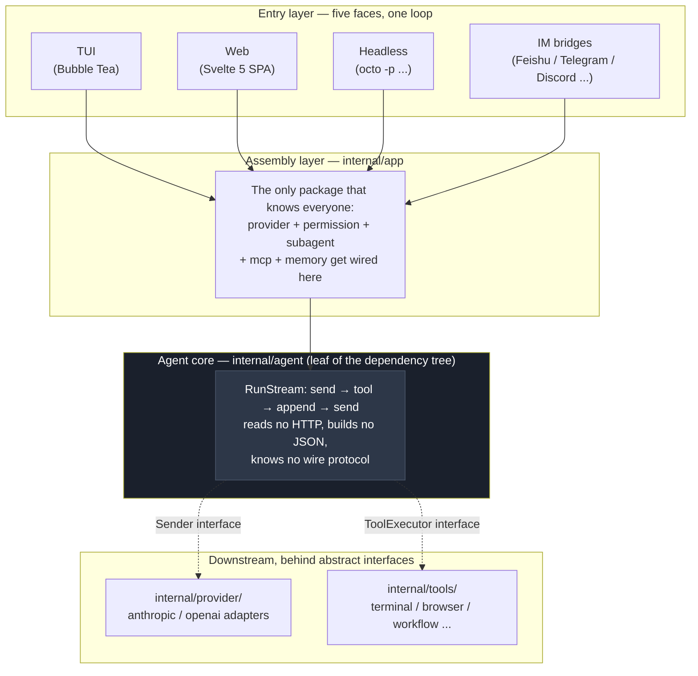
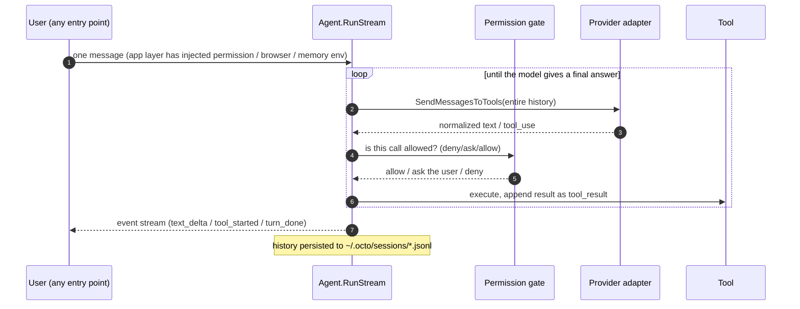
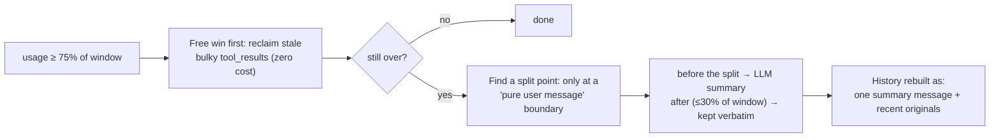
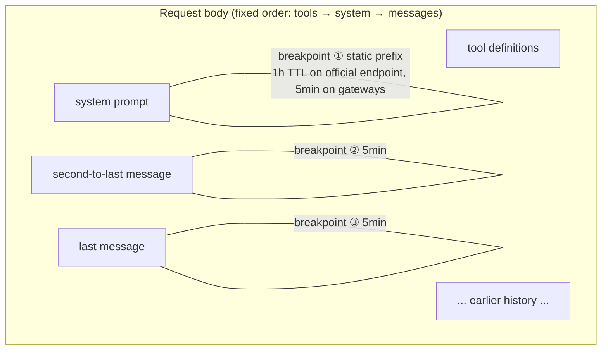
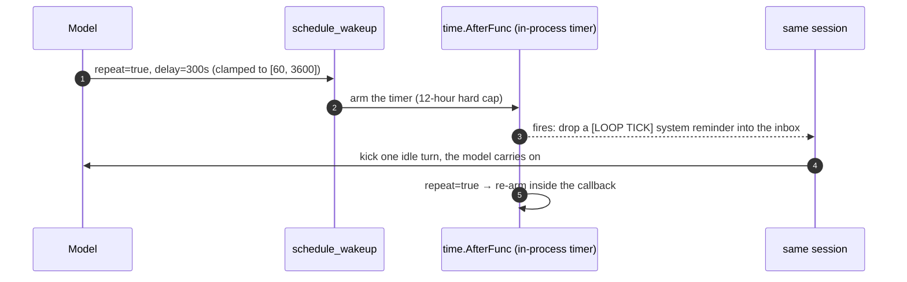
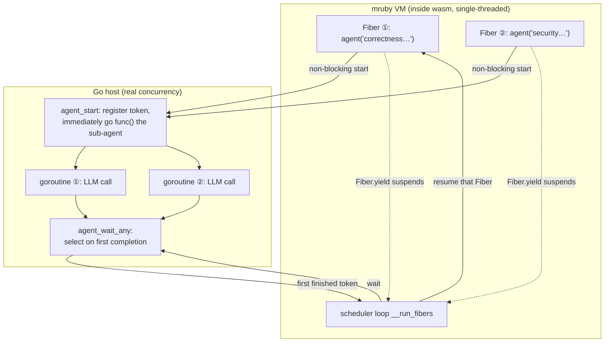
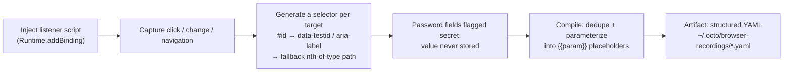
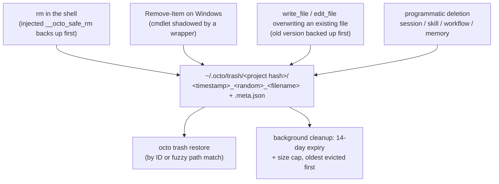

---
title: "octo-agent Deep Dive: The Genuinely Hard Parts of an Agent System"
description: "This post dissects nine core mechanisms of octo-agent across the full stack — foundation, built-in tool contract, context compaction, prompt caching, /loop, workflow, browser, permissions, the trash can, and the batteries-included onboarding — and the trade-offs behind each."
pubDate: 2026-07-08
updatedDate: 2026-07-18
author: "octo-agent team"
tags: ["architecture", "deep-dive", "engineering", "ai-agent"]
locale: en
originalSlug: architecture-deep-dive
---

# octo-agent Deep Dive: The Genuinely Hard Parts of an Agent System


## The Foundation: The Agent Loop Must Stay Ignorant

Start with the big picture. The core of octo-agent is literally a while loop: send the history to the model; the model either answers (loop ends) or asks for a tool; execute the tool, append the result to history, go back to the top.



The loop itself is a few hundred lines. Everything complicated is kept out of it by a single discipline: **`internal/agent` is the leaf package of the entire dependency tree.** It imports neither `provider` nor `tools` nor any UI. It knows exactly two interfaces — `Sender` (send messages, get an abstract reply back) and `ToolExecutor` (run a tool by name, get text back).

The value of that discipline only shows in the details. When the model wants a tool, Anthropic's API says `stop_reason: "tool_use"` while OpenAI says `finish_reason: "tool_calls"`. In OpenAI streaming, tool arguments arrive as JSON fragments scattered across chunks that must be reassembled by index before parsing. Some third-party OpenAI-compatible servers don't even send the `[DONE]` sentinel. Each of these quirks is one temptation to bury an `if provider == "openai"` inside the core loop — and once that starts, the loop is unreadable by the time the third provider lands. octo-agent instead locks all of it inside two adapter packages, `internal/provider/anthropic` and `internal/provider/openai`; the agent loop only ever sees normalized, unified semantics.

The payoff: five kinds of entry points (TUI, Web, Headless, IM, plus sub-agents) all run the same `RunStream`. Plugging in a new LLM backend changes zero lines of agent code; adding a tool means implementing an interface and registering one line. A full turn looks like this:



That's the foundation. Now for the main course: the problems that only start once this loop is actually running.


## Built-In Tool Design: Small Interfaces, Sharp Edges

Every built-in tool implements the same two-method contract (`Definition() ToolDefinition` + `Execute(ctx, name, input) (ToolResult, error)`), discovered by `tools.DefaultRegistry` and dispatched by name through the agent loop. That shared surface is the point: the agent core never branches on tool species, meta-skills are free to reshuffle them, and the browser / workflow / MCP layers all speak the same narrow pipe. The structure is simple. The design tensions live at the edges.

### Streaming Fragments across Provider Borders

A subtler design rule lives in the provider adapters, not the tools: **OpenAI-protocol tool-call arguments stream as JSON fragments across multiple chunks, keyed by `tool_calls[i].index`** — concatenate every fragment for the same index before parsing. Anthropic-style endpoints don't. The principle the codebase enforces is: the agent loop (`internal/agent/agent.go`) never branches on which spelling it got; normalization happens at the provider adapter. The same contract ("fragments in, complete tool call out") is the only way to keep the browser / workflow / MCP layers portable across Anthropic and OpenAI protocols without every layer growing `if provider == …` forks.

### One Registry, Many Species

`tools.DefaultRegistry` (`internal/tools/registry.go`) is a single dispatcher that routes any tool call by name to one entry of the `allTools` slice — `Terminal`, `ReadFile`, `WriteFile`, `EditFile`, `Glob`, `Grep`, `WebFetch`, `WebSearch`, `Skill`, `Agent*`, `Workflow*`, `ScheduleWakeup`, `Browser`, `MemoryRecall`, and the rest. There is "browser: internal/browser", "workflow: Ruby/mruby", and "MCP: a JSON-RPC bridge" — but the agent loop sees only `ToolExecutor`. The late addition of `mcp_describe` / `mcp_call` didn't require touching the agent core either; they entered through a registry entry like every other tool.

That choice is what makes the meta-skills from the previous section possible: a guided "set up your IM channel" flow isn't a bespoke tool, it's `channel-manager` stringing `read_file` / `write_file` / `terminal` together in the order the user's situation demands. Tool composition is the reusable primitive; a new capability usually means a new skill, not a new tool.

### The Read-Before-Write MTime Guard

`internal/tools/ReadTracker` enforces what looks like a nitpick but stops a real class of mistake: the LLM may only write to (or edit) a file it has *already read*, and only while its on-disk mtime still matches what was seen at read time. A file read in turn 3 that an external editor touched by turn 7 is refused, and the agent is told to re-read — which mirrors Claude Code's error wording so the LLM, already trained on that prompt, reacts correctly on the retry.

That last qualifier — "only while mtime matches" — introduces a bootstrapping problem the codebase handles with `RefreshTarget`: a formatter or shell redirect that the session *itself* wrote through the terminal tool stamps a fresh mtime so the next edit doesn't trip the guard on its own output. `RefreshTarget` only ever re-stamps an exact path the tracker already recorded; it never cascades to siblings, never promotes an un-readable path to writable. A file the session never read stays unwritable; a file truly touched by an out-of-band editor (which never flows through the terminal tool) keeps its stale stamp and still trips the guard. The guard catches the real mistakes; the loop-hole is narrow enough that it can't be abused to escape the sandbox.

### Pulling the Floor Out from under SSRF

`web_fetch` can't just `http.Get(userURL)` — that's the textbook SSRF vector. Its answer (`internal/tools/web_fetch.go`) splits the fetch into **two hardened paths** sharing one `secureFetchTransport`:

- **Jina proxy path** — delegates rendering to `r.jina.ai`, but refuses *cross-host* redirects (a redirect off `r.jina.ai` means something unexpected is bouncing the request) and drops the connection if the resolved IP is link-local / cloud-metadata. It forces a direct fetch when the caller passes custom headers (Jina's outbound headers aren't controllable, so it can't honor an override).
- **Direct fetch path** — needed for arbitrary URLs, so it *must* follow cross-host redirects (URL shorteners, `www`-canonical hops). It shares the link-local block and caps the chain at 10 hops so a redirect loop can't hang the agent.

The `net.Dialer.Control` hook fires *after* DNS resolution with the concrete IP, so a hostname that resolves to `169.254.x.x` or `127.0.0.1` via DNS rebinding is refused — even when it public-IP'd at resolve time one moment earlier. Bodied too: `WebFetchInlineBytes` (64 KB) is the inline threshold; `WebFetchMaxBytes` (5 MB) is the hard ceiling; past it the body is truncated and spilled to a temp file. Big page = summary + head/tail preview + a `read_file` path to the rest, never a wall of text dumped into the model's context.

### Five Search Surfaces, One Contract

`web_search` looks simple on the wire (returns title/url/snippet), but the back is a tiered fallback over five backends (`internal/tools/web_search.go`): **Brave → Tavily → Serper → DuckDuckGo HTML → Bing HTML**. The first three activate when their env keys are set (`BRAVE_SEARCH_API_KEY` / `TAVILY_API_KEY` / `SERPER_API_KEY`); the last two need no key and are the default. Every failure gets swallowed into the response's `Error` field and the next tier is tried — the tool never panics, and the tier that actually produced the results is reported back in the `Provider` field so the model knows whether it's looking at an index lookup (Brave) or an HTML scrape (DDG/Bing).

Two details actually matter: **a DuckDuckGo cooldown** (`markDDGUnavailable`, 10 minutes) that keeps a token goroutine from hammering a DDG that just returned nothing — guarded by a `sync.RWMutex` because the web server made concurrent searches routine. And **a landmine on Bing's HTML endpoint**: if you send `Accept-Encoding: gzip`, Bing answers with a ~39 KB JavaScript skeleton instead of the ~120 KB real results page. The fix is the weird rule "never let Go auto-negotiate encoding against `cn.bing.com`" — `browserGet` deliberately omits that header.

### terminal: Time, Anti-Polling, and Backtick Survival

The `terminal` tool runs everything you hand it on the system shell, so its description is the longest entry in the schema — most of it is rules that cost a debugging session each to learn:

- **Three launch modes** — synchronous (default; blocked until the command returns), `run_in_background: "async"` (detached one-shot task, e.g. a build or `npm install`), and `"interactive"` (a long-running service / REPL you'll keep feeding via `terminal_input`). A `detached: true` mode deliberately outlives the session for things like `ngrok` / `cloudflared`.
- **120-second default timeout** with a hard ceiling at `MaxTerminalTimeout` (600 s); anything above that must go background rather than monopolize a turn.
- **Anti-polling window**: `BackgroundManager` tracks concurrent reads — three empty reads inside 30 seconds on a running process get blocked and the LLM is told to wait for the push notification instead of spinning in a `terminal_output` loop.
- **A 1 MiB circular buffer** per background process — older drops are reported as such; only the most recent tail is retained.
- **The backtick problem**: a shell will mangle backticks inside a quoted string (POSIX turns them into command substitution; PowerShell treats backtick as escape). The fix is the dedicated `stdin` parameter, which pipes text verbatim into the child's stdin and closes it — used whenever a command body contains quotes, backticks, or `$`.

Together these turn "the shell can do anything" from a footgun into a bounded surface that the model can reason about without burning tokens polling dead output.

### sub_agent: Forking Without Recursion

The `sub_agent` tool looks like a simple delegate-and-wait, but the design tensions live in what it *doesn't* allow. The most visible rule is in `AgentTool.Execute` (`internal/tools/agent.go`): if the caller is already a sub-agent, the call fails outright — "a sub-agent cannot spawn another sub-agent." No recursion, period. Combined with the `tools` allowlist omitting `sub_agent` itself, that's a shallow hard ceiling rather than the workflow's Turing-complete unconstrained spawn — the design intent is a single level of delegation, not an agent tree.

**Fork vs. fresh** (`subagent_type`): omitting `subagent_type` seeds the child with the *parent's full conversation* (system prompt + messages so far) — a true fork that shares context and has the same conclusion-shaped reply contract. Setting a type (`explore`, `plan`, `general`, `code-review`) starts a zero-context child with a specialized persona, read-only / lean-context defaults, and its own `model` frontmatter. The same tool covers both; a preset fills in what the call leaves unset.

**Sync vs. async**: `run_in_background: true` calls `SubAgentManager.Start`, which returns an `agent_N` ID immediately and pushes a completion notification; `false` (default) calls `RunSync` and blocks the turn. A semaphore (`syncSem`) bounds how many synchronous sub-agents run at once so a wave of fan-outs can't starve the parent. Transport-aware too: synchronous channels (server / IM) have no follow-up-turn path, so `mgr.Synchronous()` silently forces the blocking path and tells the model — rather than silently failing.

When a sub-agent hits its turn limit, the result returns with an explicit `[INCOMPLETE: … partial]` marker rather than passing partial work off as done. The parent is meant to either re-launch narrower or treat it as unfinished. And every `StopReason` (`end_turn`, `tool_use`, `max_turns`, `error`, `killed`) reaches the WS broadcast so the frontend status panel updates without polling.


## Context Compaction: You Can't Delete Messages, Only Fold Time

The first wall you hit is physical: the context window has a fixed size, and agent conversations balloon fast — a single compiler-error tool_result can be thousands of tokens, and an afternoon session piles up to six figures without trying.

The intuitive fix is "when the window fills up, drop the oldest messages." In an agent setting this breaks the API outright: `tool_use` and `tool_result` blocks in history are strictly paired, and deleting messages that sever a pair gets you a 400 from both Anthropic and OpenAI. Worse, the oldest messages usually contain the original task statement — drop them and the agent forgets what it's doing halfway through.

octo-agent's answer is **summary folding**: compress the early history into one summary, keep the recent history verbatim. Three details carry the design.



**First, the split point is always safe.** `safeSplitIndexByBudget` (`internal/agent/compaction.go`) only ever cuts at a "pure user message containing no tool_result," which structurally guarantees no tool_use/tool_result pair is ever severed. That same guarantee is what allows compaction to happen *mid-turn*: a long turn checks usage after every batch of tool calls, and if it's over the line, earlier completed rounds get folded immediately while the in-flight calls stay untouched. For agent tasks that routinely make dozens of tool calls in one turn, mid-turn compaction isn't a nicety — it's table stakes.

**Second, the usage math is counter-intuitive.** Context usage is not whatever `input_tokens` reports — when the prompt cache hits, Anthropic's `input_tokens` is only the uncached remainder, and the real footprint requires adding `cache_read + cache_write` back in (`accrueUsage` in `agent.go`). Get this wrong and the better your cache hit rate, the less compaction triggers — until one cache miss blows straight through the window.

**Third, compaction has damping.** The trigger threshold defaults to 75% (configurable via `compact_auto_pct`), the keep budget is 30% of the window, and there's an anti-thrashing rule: if a fold would reclaim less than 15%, skip it entirely — otherwise a session hovering at the threshold pays for an expensive summarization call every single round.

One pitfall worth knowing: **the persisted `session.jsonl` stores the post-compaction history.** Compaction rebuilds the history wholesale, which triggers a full rewrite of the session file; the verbatim originals survive only if `ArchiveDir` is configured, in which case they're archived as `chunk-*.md` (the summary ends with the file path, so the model can read them back on demand) — otherwise they're gone for good. And since the history just got shorter, every `message_index` held by the Web frontend (edit and branch features depend on it) is silently invalidated; the server watches a length watermark and forces the frontend to re-fetch the whole transcript when the history shrinks below it. These compaction ripple effects have caused more rework than any other part of the mechanism.


## Prompt Caching: An Agent's Bill Is Quadratic

The second problem is money. Every round of the loop re-sends the entire history, which means in an N-round session, message #1 gets billed N times — without caching, cost grows quadratically with conversation length.

Prompt caching fits in one sentence: if this request shares a prefix with the previous one, the matched part is billed at roughly a tenth of the price. The trouble is twofold: different protocols report "how much was cached" in completely different ways, and the Anthropic protocol requires you to **explicitly declare** where the cache boundary sits.

The first point is where self-hosted gateway integrations crash most often:

| Protocol | Cache-hit field | Meaning of `input`/`prompt` tokens |
|---|---|---|
| Anthropic | `cache_read_input_tokens` | **only the uncached remainder**; hits counted separately |
| OpenAI | `prompt_tokens_details.cached_tokens` | **the entire input**; hits are a subset of it |
| DeepSeek | `prompt_cache_hit/miss_tokens` | explicitly split into two buckets |

Same semantics, three encodings. octo-agent performs one subtraction in the openai adapter (`nonCachedInput()`, `internal/provider/openai/types.go`) so the OpenAI-style numbers also become "two non-overlapping buckets" — from that point on, `InputTokens` and `CacheReadTokens` mean the same thing at the agent layer regardless of protocol. The usage arithmetic that compaction depends on (previous section) is built exactly on this unification. Protocol normalization isn't tidiness; it's the precondition for the layers above to be *correct*.

The second point is more interesting: where to place the breakpoints. octo-agent plants exactly three `cache_control` breakpoints in every Anthropic request:



The static prefix (tool definitions + system prompt) needs only one breakpoint — since tools precede system in the request body, a breakpoint on the system block caches the tool definitions along with it. History gets a breakpoint on each of the **last two** messages. Why two? Because the next request appends new messages, so last round's "last message" becomes "N-th from the end"; with a single breakpoint, a retry that drops the trailing message would leave *no* breakpoint anywhere in the common prefix. Two breakpoints guarantee that however the sliding window moves, at least one lands inside the prefix shared with the previous request. Three total, against Anthropic's limit of four — margin left on purpose.


## /loop: A Command That Doesn't Exist

Users keep asking for things like "check every five minutes whether CI passed." octo-agent's answer is `/loop 5m check CI` — but grep the codebase for the implementation of `/loop` and you'll find the server's command router handles it with `return false`: don't intercept, pass it to the model as an ordinary message.

**`/loop` isn't a command. It's a behavior taught by a tool description.** The thing that actually exists is a tool called `schedule_wakeup`, whose description spells out the convention: if the user's message starts with `/loop` plus a duration, parse the duration and call me with `repeat=true`; if it's `/loop` with no duration, enter dynamic mode and decide the next interval yourself each time you wake. Everything else is left to the model's reading comprehension.



What makes this design good is how cleanly it splits three responsibilities: **parsing belongs to the model** (no parser needed for "5m" or "every half hour"), **triggering belongs to Go** (`time.AfterFunc`; on wake, the prompt is wrapped as a system reminder and dropped into the session inbox, reusing the existing pathway for background-task notifications), and **cadence belongs to convention** (in dynamic mode, if the model doesn't re-arm, the loop simply ends — the termination condition is the model's *inaction*, not a state machine).

The cost is that loops live entirely in process memory: the timers are a map on the `Server` struct, gone on restart, with no state file. That's a deliberate division of labor — periodic tasks that must survive restarts belong to a different subsystem, `internal/scheduler` (real cron, JSON-persisted under `~/.octo/tasks/`); `/loop` serves the session-scoped "keep an eye on this for the next few hours" need, which is why it carries a 12-hour hard cap after which it stops re-arming. As for "won't a long-running loop blow up the history" — every tick is just a normal turn, and the compaction machinery above applies unchanged. Loop needs, and gets, no special treatment.


## Workflow: Make Orchestration Turing-Complete, but Keep It Away from the System

Concurrent sub-agents are another recurring need: "review this diff from correctness, security, and performance angles simultaneously, then synthesize." Having the main model call sub-agents one by one is slow and expensive; making users write Go is too heavy. octo-agent's answer is a Ruby DSL:

```ruby
findings = parallel(["correctness", "security", "performance"].map { |view|
  -> { agent("Review this diff from the #{view} angle") }
})
agent("Synthesize these findings: #{findings.join("\n")}")
```

Where does this script run? The answer takes a detour: **an mruby interpreter, compiled to wasm32-wasi, executed by wazero (a pure-Go wasm runtime).** Every layer of the detour has a reason. Turing-complete orchestration (loops, conditionals, retries) demands a real language. Embedding an interpreter without cgo is non-negotiable — cgo destroys Go's "one command, binaries for every platform" cross-compilation, fatal for a project whose selling point is single-file distribution. And the wasm sandbox solves a third problem for free: user scripts physically cannot touch the filesystem or network; their entire capability surface is the handful of functions the host explicitly exports. Even the regex support is a child of this constraint — mruby's official C regex engine won't compile for the wasi target, so `Regexp` is bridged to Go's RE2, with an accidental bonus: RE2 guarantees linear time, so script authors can't write a ReDoS.

The most delicate part is the concurrency model. mruby inside wasm is single-threaded — how does `parallel` actually parallelize? By **two kinds of coroutines shaking hands at the function boundary**: Fibers (cooperative) on the mruby side, goroutines (truly concurrent) on the Go side.



An `agent()` call into the host's `agent_start` is non-blocking: the Go side immediately spawns a goroutine for the real LLM call and hands back a token, while the mruby side suspends itself with `Fiber.yield`. The scheduler loop first advances every branch to its first `agent()` call — launching all the goroutines — then repeatedly calls `agent_wait_any` (a Go `select` parked on a completion channel) and resumes whichever Fiber's work finished first. Concurrency is capped at a hardcoded 8; calls beyond the cap queue on a semaphore, so a `parallel` over a large list can't fan out an unbounded number of concurrent LLM turns.

There's a journal to go with it: every `agent()` result is appended to `~/.octo/workflow-journals/`, and on re-run — after verifying the script+args hash matches — completed calls replay their cached results instead of hitting the LLM again. For a long workflow that died at step 8, fixing one line and re-running doesn't re-pay for the first 7 steps.


## Browser: Never Launch, Only Attach

The industry-standard move in browser automation is to launch a headless Chrome. octo-agent goes the opposite way: **it never launches a browser; it only attaches to the Chrome the user already has open.** The launch capability exists in the code but the production path never calls it, and the comment is blunt about why: a self-launched headless instance carries no login sessions, and on macOS it trips the "Chrome Safe Storage" keychain prompt — for a daily-driver tool, the moment that dialog appears, the user's trust is gone. When no attachable Chrome is found, the tool returns instructions for enabling the remote-debugging port rather than silently falling back to headless.

Underneath is a hand-rolled CDP (Chrome DevTools Protocol) client over `gorilla/websocket` — no chromedp. The needed domains (Target/Page/DOM/Runtime/Input/Network and a few more) are a short list; writing them directly turns out thinner than the dependency.

The part worth unpacking is **record & replay**. What gets recorded is neither a screen capture nor a coordinate sequence — coordinates die with the next window resize — but a **semantic event stream**:



Each recorded step compiles into structured fields — `action / selector / value / verify` — with the repeatable inputs (search terms, dates) lifted into parameters: record once, replay many times with arguments.

But selectors rot: the frontend ships a redesign, `.btn-submit` becomes `.button-primary`, and the script breaks. The replay engine responds in two tiers. Tier one costs nothing: the most common failure is actually a cookie banner covering the target, so first dismiss the overlay and retry. Tier two is **self-healing**: hand the LLM the step's intent description, the dead selector, and a digest of every interactive element on the current page, and ask for exactly one new selector; swap it in and retry, up to three rounds. If the fix works and the whole skill runs green, the new selector is **written back to the YAML on disk** — the healing is durable, so one redesign doesn't cost you an LLM repair fee on every subsequent replay.

One axed feature deserves a footnote: early versions tried auto-triggering recorded skills when the user mentioned certain keywords. Too many false triggers in practice; it was removed. Recorded skills now fire in exactly two ways — an explicit Replay button in the Web UI, or the model explicitly invoking `replay` in conversation. The design doc keeps the record of that failure — knowing what was tried and abandoned is sometimes worth more than knowing what exists.


## Permissions: Admitting It's Just String Matching

An agent that can run arbitrary shell commands needs its security model thought all the way through. octo-agent's permission system has three designs worth telling, and one piece of honesty worth respecting.

**First, precedence is independent of declaration order.** The verdict is not "first matching rule from the top wins" — that would make the line order of a config file part of the security semantics, where reshuffling lines can open a hole. The actual implementation buckets: walk every rule, drop the hits into deny/ask/allow buckets, then read out in fixed precedence — a non-empty deny bucket means denied, regardless of whether an allow was written above or below it. The hardcoded backstop rules (catastrophes like `^rm -rf /usr`, `^dd if=`) ride the same mechanism, so no user-written allow can override them.

**Second, the `^` anchor exists because of real incidents.** Matching is substring-based at its core, and bare substrings over-block: `deny: "format"` was meant to stop disk formatting but also blocked `docker ps --format json`; `deny: "shutdown"` blocked `git commit -m "fix shutdown handling"` — the sensitive word merely appeared inside a commit message. The `^` prefix anchors the match to **command position**: start of line, after `&&`/`;`/`|`, after `sudo` or environment-variable prefixes. `^format` matches format being *executed as a command*, never as an argument or string content. This feature wasn't designed in the abstract; it was forced into existence by those two false positives.

**Third, hot reload plus graceful degradation.** The permission engine is rebuilt every turn, so an edit to `permissions.yml` takes effect on the very next command, no restart. What if the YAML is mid-edit and syntactically broken? Fall back to the last successfully parsed rules (`lastGoodRules`) and log a warning — a briefly broken config file must neither crash the session nor leave it *temporarily unguarded* during that window.

Then the honesty. **By default, octo-agent has no OS-level isolation whatsoever**: without `--sandbox`, the shell tool is a bare `exec.Command("sh", "-c", ...)`, and the only line of defense is the string rules above. Real OS-level isolation is opt-in depth: Seatbelt on macOS, Landlock + seccomp on Linux (inet sockets banned outright), unsupported elsewhere — and if `--sandbox` is requested on an unsupported platform, it refuses to run (fail closed) rather than silently degrading. The package comment in `internal/sandbox` characterizes the relationship precisely: the sandbox is "defense-in-depth *beneath* the permission engine, which only gates command strings." String matching can of course be bypassed — stating the boundary plainly is worth far more than advertising a security model that doesn't exist.

The companion audit log records every deny and every user verdict (one JSON per line, 10 MiB rotation). One detail inside: every field is truncated at 1 KiB. Not to save disk — to prevent a single rejected `write_file` from copying an entire file's contents, or a command containing a secret, verbatim into the audit log. The audit log must not become a new leak surface.


## Trash Can: Designed for the Premise "the Model Will Delete the Wrong File"

The last mechanism is the humblest, and the clearest window into the project's worldview. The premise is simple: the model **will** delete the wrong file. Not might — eventually will. So the right question isn't "how do we prevent wrong deletions" but "what happens after one."

octo-agent's answer is to turn every destructive operation from irreversible into reversible — with broader coverage than you'd guess:



The `rm` interception works by injecting a same-named function into the shell environment; before the real delete, the target is moved into the trash via `cp -al` (hard links, nearly zero cost). On Windows the `Remove-Item` cmdlet is shadowed to run the same flow. Even the model *editing* files is covered — `write_file` overwriting an existing file sends the old version to the trash first.

One judgment call in the overwrite backup shows real craft: **if the target file is git-tracked and the working tree is clean, skip the backup.** Git already has that content; a second copy in the trash is pure waste. One `git ls-files` plus two `git diff --quiet` calls cut the trash noise dramatically — a good safety net must not only catch, it must stay quiet, or users will switch the whole thing off.

Recovery goes through `octo trash restore`, matching by ID or fuzzy path. If the destination is now occupied, three policies apply: abort with an error (default), move the occupant into the trash too and then restore, or restore under a timestamped new name. Each project's trash is isolated by a hash of the project path; it's purely local, with 14-day expiry and a size cap enforced by background cleanup, so it never grows without bound.


## Batteries Included: Discoverability, Meta-Skills, and a Gentler Default

The seven sections above were the "hard parts" — places where a wrong design bleeds context tokens or loses a file. But the genuinely hardest part of shipping an agent isn't the hard parts; it's the first five minutes. If the user has to `apt install` ripgrep before the first search, or hunt down an MCP registry before asking a single question, they leave. octo answers that with three layers of "it just works" — all of which happen to be the same principles (defer what you can, surface what matters, degrade gracefully) applied to the onboarding path.

### MCP Tool Search: The Lazy Registry

Standard MCP wiring has a hidden tax: every tool's full JSON schema gets pushed into the system prompt on every turn. Connect three MCP servers with forty tools between them and you've spent a thousand tokens on the user just to learn *what exists before asking anything*. octo's answer (`internal/tools/tool_search.go`) is to defer the heavy half.

Two bridge tools, `mcp_describe` and `mcp_call`, replace the full upload. Each MCP tool's **name and one-line description** ride along in the system prompt the same way `skills.RenderManifest` surfaces `# Available skills` — so the model can answer "is there a tool for X?" in zero round trips. `mcp_describe` pulls one schema on demand (when the model actually wants to use the tool), and `mcp_call` invokes it — routing straight into the existing `executeMCP` path, so all the `mcp__`-prefix dispatch, permission, and hook machinery runs against the real tool name unchanged.

The mode selector (`auto` / `on` / `off`) is the same instinct as elsewhere: `auto` activates the bridge only when deferred schemas would occupy at least 10% of the context window. Below that, the simpler full-upload path wins; above it, the search mechanism keeps the prompt from drowning in schemas it won't use this turn.

### Two Binaries You Don't Have to Install

**ripgrep.** `internal/tools/rgembed` ships a platform-matched ripgrep binary *inside* the octo binary: the Makefile downloads the BurntSushi/ripgrep release for the build platform, and `go:embed` bakes it in when the `embedrg` tag is set. At runtime, if `rg` is already on `PATH`, that one's used; otherwise the embedded copy is extracted to `~/.octo/bin/rg-<version>`. The `grep` tool gets a fast, consistent search backend with zero user action.

**uv.** `office-xlsx` depends on Python's openpyxl, and openpyxl needs a Python runner. Rather than ask the user to manage that, the macOS and Windows installer packages bundle uv directly. The tradeoff is straightforward: macOS grows ~100MB so the user never sees "install Python" on their first spreadsheet task. It bundles *uv* and not *bun* — uv is a single static binary that resolves dependencies; bun is a full JavaScript runtime for a power-user skill that most people don't need.

### Windows Knows When to Suggest an Upgrade

There's a playful bit of craft in the Windows installer (`packaging/windows/octo.iss`): it runs an `EnsurePowerShell7` check at the end. If `pwsh` isn't on PATH but `winget` is, it asks the user — once, bilingual — whether to install PowerShell 7. Why? octo runs hook scripts and the terminal tool through `pwsh` (7+) when it's present and falls back to the always-there Windows PowerShell 5.1 when it isn't. The 7 path is a better default (faster, predictable `~/.bashrc`-style profile, real `&&` semantics). Every skip-failure path is a silent no-op: if anything goes wrong, octo just keeps using 5.1. The user is prompted, never blocked.

### Five Meta-Skills: octo Learns to Extend Itself

A skill is usually a snippet the model can invoke — but a handful of shipped skills are *about* octo's own setup. They talk the user through configuration that would otherwise require hand-editing YAML, and they lean on agent memory so the conversation carries across sessions.

| Skill | Job |
|---|---|
| `skill-creator` | Scaffold a new skill, edit an existing one, or capture a workflow as a skill. |
| `mcp-creator` | Discover an MCP server package, build the `~/.octo/mcp.json` entry, verify the connection — guided, no manual JSON. |
| `channel-manager` | Walk the user through each IM platform's console, collect credentials, write `~/.octo/channels.yml`, diagnose connection failures. |
| `cron-task-creator` | Create, inspect, enable, and delete scheduled agent prompts stored in `~/.octo/tasks/`. |
| `workflow-creator` | Capture a repeatable multi-step task and turn it into a saved, resumable Ruby (mruby) workflow. |

One thing worth noting: `channel-manager`, `mcp-creator`, `cron-task-creator`, and `workflow-creator` all lean on the file tools (`write_file`, `edit_file`, `terminal`) as much as they do on octo-specific knowledge. That's a deliberate choice — it means a meta-skill doesn't need a bespoke tool for every piece of YAML it writes. The same "tools are composable" principle that powers user workflows powers octo's own onboarding.


## Coda: One Worldview Throughout

Each of the nine mechanisms minds its own patch; together they express a single judgment: **in an agent system, whatever a mechanism can guarantee, never leave to the model's good behavior.**

Compaction relies on token thresholds and safe split points, not on praying the summary loses nothing. Cache breakpoints are placed explicitly, not left to luck. Loop has a 12-hour hard cap to catch a model that forgets to stop. Workflow's concurrency cap is a constant, not a hope that script authors show restraint. Every rule in the permission system — deny precedence, command anchoring — maps to an incident that actually happened. And the trash can simply assumes wrong deletions are inevitable and spends its effort on the *after*.

The model supplies the intelligence; the mechanisms supply the floor. If one sentence is worth taking away from this codebase, it's that.

---

### Appendix: Where to Start Reading the Code

| Mechanism | Entry file |
|---|---|
| Agent loop | `internal/agent/agent.go` |
| Built-in tool contract | `internal/tools/registry.go` (allTools), `internal/agent/tool.go` |
| Context compaction | `internal/agent/compaction.go` |
| Prompt cache breakpoints | `internal/provider/anthropic/client.go` (`markMessagesCacheable`) |
| Protocol token normalization | `internal/provider/openai/types.go` (`nonCachedInput`) |
| /loop | `internal/tools/schedule_wakeup.go`, `internal/server/loop.go` |
| Workflow runtime | `internal/workflow/runtime.go`, `internal/workflow/prelude.rb` |
| Browser record / self-heal | `internal/browser/recorder.go`, `internal/app/browser_heal.go` |
| Permission verdicts | `internal/permission/permission.go` (`classify` / `Check`) |
| OS-level sandbox | `internal/sandbox/` |
| Trash can | `internal/trash/trash.go` |
| MCP tool search | `internal/tools/tool_search.go` |
| Meta-skills | `internal/skills/defaults/{skill-creator,mcp-creator,channel-manager,cron-task-creator,workflow-creator}/SKILL.md` |
| Read-before-write guard | `internal/tools/read_tracker.go` |
| web_fetch SSRF defenses | `internal/tools/web_fetch.go` (`secureFetchTransport` / `directFetchHTTPClient`) |
| web_search backends | `internal/tools/web_search.go` |
| terminal background manager | `internal/tools/background.go` |
| Sub-agent lifecycle | `internal/tools/agent.go`, `internal/tools/subagent_manager.go` |
