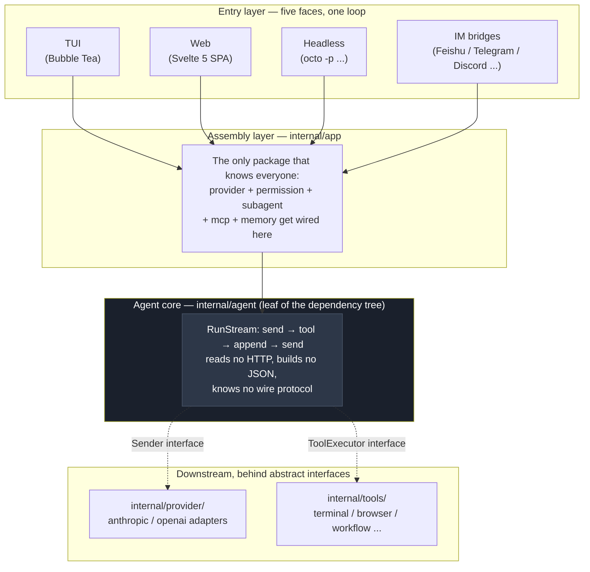
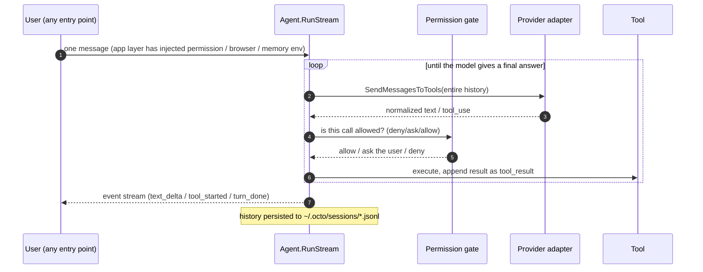
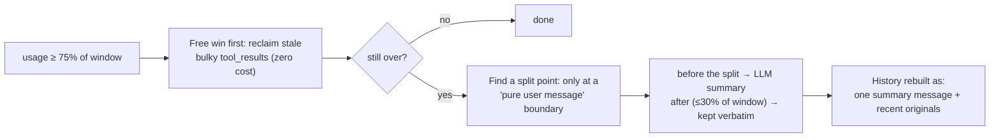
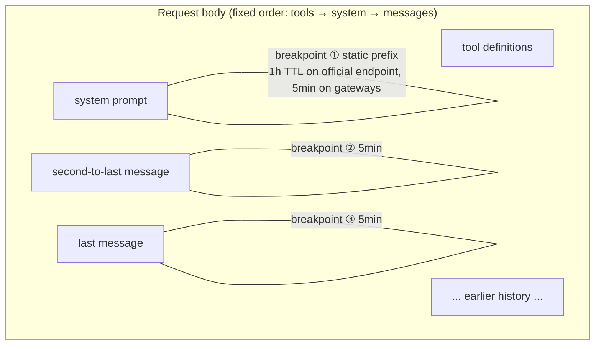
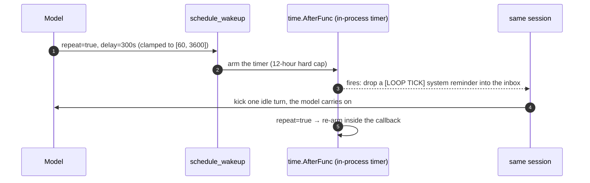
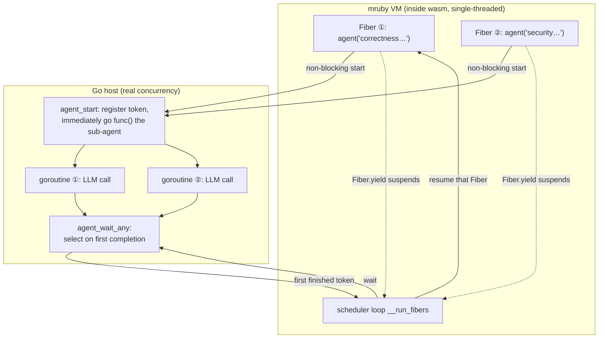
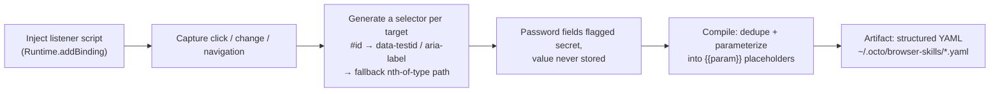
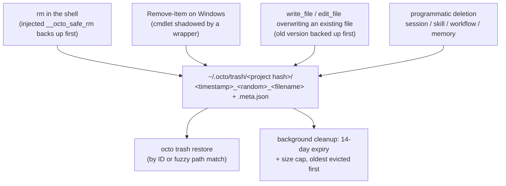

# octo-agent Deep Dive: The Genuinely Hard Parts of an Agent System

Calling an LLM once is easy — it's one HTTP request. Letting the LLM call tools isn't hard either; every vendor ships a ready-made tool-use protocol. What's genuinely hard is the ring of engineering problems around that loop:

- The context window is finite, but conversations only ever grow.
- Input tokens cost money, and an agent re-sends the entire history on every single round.
- Processes exit, but users want tasks that "check back in five minutes."
- Models make mistakes — while holding `rm -rf` and your browser in their hands.

octo-agent is an agent CLI written in Go: a single binary, an embedded Web UI, bridges to six IM platforms, 480+ Go files in the repository. This post doesn't tour the features. Instead it picks the problems above and looks at the answer the codebase gives to each one — and why it's usually not the answer you'd reach for first.

## The Foundation: The Agent Loop Must Stay Ignorant

Start with the big picture. The core of octo-agent is literally a while loop: send the history to the model; the model either answers (loop ends) or asks for a tool; execute the tool, append the result to history, go back to the top.



The loop itself is a few hundred lines. Everything complicated is kept out of it by a single discipline: **`internal/agent` is the leaf package of the entire dependency tree.** It imports neither `provider` nor `tools` nor any UI. It knows exactly two interfaces — `Sender` (send messages, get an abstract reply back) and `ToolExecutor` (run a tool by name, get text back).

The value of that discipline only shows in the details. When the model wants a tool, Anthropic's API says `stop_reason: "tool_use"` while OpenAI says `finish_reason: "tool_calls"`. In OpenAI streaming, tool arguments arrive as JSON fragments scattered across chunks that must be reassembled by index before parsing. Some third-party OpenAI-compatible servers don't even send the `[DONE]` sentinel. Each of these quirks is one temptation to bury an `if provider == "openai"` inside the core loop — and once that starts, the loop is unreadable by the time the third provider lands. octo-agent instead locks all of it inside two adapter packages, `internal/provider/anthropic` and `internal/provider/openai`; the agent loop only ever sees normalized, unified semantics.

The payoff: five kinds of entry points (TUI, Web, Headless, IM, plus sub-agents) all run the same `RunStream`. Plugging in a new LLM backend changes zero lines of agent code; adding a tool means implementing an interface and registering one line. A full turn looks like this:



That's the foundation. Now for the main course: the problems that only start once this loop is actually running.

## Context Compaction: You Can't Delete Messages, Only Fold Time

The first wall you hit is physical: the context window has a fixed size, and agent conversations balloon fast — a single compiler-error tool_result can be thousands of tokens, and an afternoon session piles up to six figures without trying.

The intuitive fix is "when the window fills up, drop the oldest messages." In an agent setting this breaks the API outright: `tool_use` and `tool_result` blocks in history are strictly paired, and deleting messages that sever a pair gets you a 400 from both Anthropic and OpenAI. Worse, the oldest messages usually contain the original task statement — drop them and the agent forgets what it's doing halfway through.

octo-agent's answer is **summary folding**: compress the early history into one summary, keep the recent history verbatim. Three details carry the design.



**First, the split point is always safe.** `safeSplitIndexByBudget` (`internal/agent/compaction.go`) only ever cuts at a "pure user message containing no tool_result," which structurally guarantees no tool_use/tool_result pair is ever severed. That same guarantee is what allows compaction to happen *mid-turn*: a long turn checks usage after every batch of tool calls, and if it's over the line, earlier completed rounds get folded immediately while the in-flight calls stay untouched. For agent tasks that routinely make dozens of tool calls in one turn, mid-turn compaction isn't a nicety — it's table stakes.

**Second, the usage math is counter-intuitive.** Context usage is not whatever `input_tokens` reports — when the prompt cache hits, Anthropic's `input_tokens` is only the uncached remainder, and the real footprint requires adding `cache_read + cache_write` back in (`accrueUsage` in `agent.go`). Get this wrong and the better your cache hit rate, the less compaction triggers — until one cache miss blows straight through the window.

**Third, compaction has damping.** The trigger threshold defaults to 75% (configurable via `compact_auto_pct`), the keep budget is 30% of the window, and there's an anti-thrashing rule: if a fold would reclaim less than 15%, skip it entirely — otherwise a session hovering at the threshold pays for an expensive summarization call every single round.

One pitfall worth knowing: **the persisted `session.jsonl` stores the post-compaction history.** Compaction rebuilds the history wholesale, which triggers a full rewrite of the session file; the verbatim originals survive only if `ArchiveDir` is configured, in which case they're archived as `chunk-*.md` (the summary ends with the file path, so the model can read them back on demand) — otherwise they're gone for good. And since the history just got shorter, every `message_index` held by the Web frontend (edit and branch features depend on it) is silently invalidated; the server watches a length watermark and forces the frontend to re-fetch the whole transcript when the history shrinks below it. These compaction ripple effects have caused more rework than any other part of the mechanism.

## Prompt Caching: An Agent's Bill Is Quadratic

The second problem is money. Every round of the loop re-sends the entire history, which means in an N-round session, message #1 gets billed N times — without caching, cost grows quadratically with conversation length.

Prompt caching fits in one sentence: if this request shares a prefix with the previous one, the matched part is billed at roughly a tenth of the price. The trouble is twofold: different protocols report "how much was cached" in completely different ways, and the Anthropic protocol requires you to **explicitly declare** where the cache boundary sits.

The first point is where self-hosted gateway integrations crash most often:

| Protocol | Cache-hit field | Meaning of `input`/`prompt` tokens |
|---|---|---|
| Anthropic | `cache_read_input_tokens` | **only the uncached remainder**; hits counted separately |
| OpenAI | `prompt_tokens_details.cached_tokens` | **the entire input**; hits are a subset of it |
| DeepSeek | `prompt_cache_hit/miss_tokens` | explicitly split into two buckets |

Same semantics, three encodings. octo-agent performs one subtraction in the openai adapter (`nonCachedInput()`, `internal/provider/openai/types.go`) so the OpenAI-style numbers also become "two non-overlapping buckets" — from that point on, `InputTokens` and `CacheReadTokens` mean the same thing at the agent layer regardless of protocol. The usage arithmetic that compaction depends on (previous section) is built exactly on this unification. Protocol normalization isn't tidiness; it's the precondition for the layers above to be *correct*.

The second point is more interesting: where to place the breakpoints. octo-agent plants exactly three `cache_control` breakpoints in every Anthropic request:



The static prefix (tool definitions + system prompt) needs only one breakpoint — since tools precede system in the request body, a breakpoint on the system block caches the tool definitions along with it. History gets a breakpoint on each of the **last two** messages. Why two? Because the next request appends new messages, so last round's "last message" becomes "N-th from the end"; with a single breakpoint, a retry that drops the trailing message would leave *no* breakpoint anywhere in the common prefix. Two breakpoints guarantee that however the sliding window moves, at least one lands inside the prefix shared with the previous request. Three total, against Anthropic's limit of four — margin left on purpose.

## /loop: A Command That Doesn't Exist

Users keep asking for things like "check every five minutes whether CI passed." octo-agent's answer is `/loop 5m check CI` — but grep the codebase for the implementation of `/loop` and you'll find the server's command router handles it with `return false`: don't intercept, pass it to the model as an ordinary message.

**`/loop` isn't a command. It's a behavior taught by a tool description.** The thing that actually exists is a tool called `schedule_wakeup`, whose description spells out the convention: if the user's message starts with `/loop` plus a duration, parse the duration and call me with `repeat=true`; if it's `/loop` with no duration, enter dynamic mode and decide the next interval yourself each time you wake. Everything else is left to the model's reading comprehension.



What makes this design good is how cleanly it splits three responsibilities: **parsing belongs to the model** (no parser needed for "5m" or "every half hour"), **triggering belongs to Go** (`time.AfterFunc`; on wake, the prompt is wrapped as a system reminder and dropped into the session inbox, reusing the existing pathway for background-task notifications), and **cadence belongs to convention** (in dynamic mode, if the model doesn't re-arm, the loop simply ends — the termination condition is the model's *inaction*, not a state machine).

The cost is that loops live entirely in process memory: the timers are a map on the `Server` struct, gone on restart, with no state file. That's a deliberate division of labor — periodic tasks that must survive restarts belong to a different subsystem, `internal/scheduler` (real cron, JSON-persisted under `~/.octo/tasks/`); `/loop` serves the session-scoped "keep an eye on this for the next few hours" need, which is why it carries a 12-hour hard cap after which it stops re-arming. As for "won't a long-running loop blow up the history" — every tick is just a normal turn, and the compaction machinery above applies unchanged. Loop needs, and gets, no special treatment.

## Workflow: Make Orchestration Turing-Complete, but Keep It Away from the System

Concurrent sub-agents are another recurring need: "review this diff from correctness, security, and performance angles simultaneously, then synthesize." Having the main model call sub-agents one by one is slow and expensive; making users write Go is too heavy. octo-agent's answer is a Ruby DSL:

```ruby
findings = parallel(["correctness", "security", "performance"].map { |view|
  -> { agent("Review this diff from the #{view} angle") }
})
agent("Synthesize these findings: #{findings.join("\n")}")
```

Where does this script run? The answer takes a detour: **an mruby interpreter, compiled to wasm32-wasi, executed by wazero (a pure-Go wasm runtime).** Every layer of the detour has a reason. Turing-complete orchestration (loops, conditionals, retries) demands a real language. Embedding an interpreter without cgo is non-negotiable — cgo destroys Go's "one command, binaries for every platform" cross-compilation, fatal for a project whose selling point is single-file distribution. And the wasm sandbox solves a third problem for free: user scripts physically cannot touch the filesystem or network; their entire capability surface is the handful of functions the host explicitly exports. Even the regex support is a child of this constraint — mruby's official C regex engine won't compile for the wasi target, so `Regexp` is bridged to Go's RE2, with an accidental bonus: RE2 guarantees linear time, so script authors can't write a ReDoS.

The most delicate part is the concurrency model. mruby inside wasm is single-threaded — how does `parallel` actually parallelize? By **two kinds of coroutines shaking hands at the function boundary**: Fibers (cooperative) on the mruby side, goroutines (truly concurrent) on the Go side.



An `agent()` call into the host's `agent_start` is non-blocking: the Go side immediately spawns a goroutine for the real LLM call and hands back a token, while the mruby side suspends itself with `Fiber.yield`. The scheduler loop first advances every branch to its first `agent()` call — launching all the goroutines — then repeatedly calls `agent_wait_any` (a Go `select` parked on a completion channel) and resumes whichever Fiber's work finished first. Concurrency is capped at a hardcoded 8; calls beyond the cap queue on a semaphore, so a `parallel` over a large list can't fan out an unbounded number of concurrent LLM turns.

There's a journal to go with it: every `agent()` result is appended to `~/.octo/workflow-journals/`, and on re-run — after verifying the script+args hash matches — completed calls replay their cached results instead of hitting the LLM again. For a long workflow that died at step 8, fixing one line and re-running doesn't re-pay for the first 7 steps.

## Browser: Never Launch, Only Attach

The industry-standard move in browser automation is to launch a headless Chrome. octo-agent goes the opposite way: **it never launches a browser; it only attaches to the Chrome the user already has open.** The launch capability exists in the code but the production path never calls it, and the comment is blunt about why: a self-launched headless instance carries no login sessions, and on macOS it trips the "Chrome Safe Storage" keychain prompt — for a daily-driver tool, the moment that dialog appears, the user's trust is gone. When no attachable Chrome is found, the tool returns instructions for enabling the remote-debugging port rather than silently falling back to headless.

Underneath is a hand-rolled CDP (Chrome DevTools Protocol) client over `gorilla/websocket` — no chromedp. The needed domains (Target/Page/DOM/Runtime/Input/Network and a few more) are a short list; writing them directly turns out thinner than the dependency.

The part worth unpacking is **record & replay**. What gets recorded is neither a screen capture nor a coordinate sequence — coordinates die with the next window resize — but a **semantic event stream**:



Each recorded step compiles into structured fields — `action / selector / value / verify` — with the repeatable inputs (search terms, dates) lifted into parameters: record once, replay many times with arguments.

But selectors rot: the frontend ships a redesign, `.btn-submit` becomes `.button-primary`, and the script breaks. The replay engine responds in two tiers. Tier one costs nothing: the most common failure is actually a cookie banner covering the target, so first dismiss the overlay and retry. Tier two is **self-healing**: hand the LLM the step's intent description, the dead selector, and a digest of every interactive element on the current page, and ask for exactly one new selector; swap it in and retry, up to three rounds. If the fix works and the whole skill runs green, the new selector is **written back to the YAML on disk** — the healing is durable, so one redesign doesn't cost you an LLM repair fee on every subsequent replay.

One axed feature deserves a footnote: early versions tried auto-triggering recorded skills when the user mentioned certain keywords. Too many false triggers in practice; it was removed. Recorded skills now fire in exactly two ways — an explicit Replay button in the Web UI, or the model explicitly invoking `run_skill` in conversation. The design doc keeps the record of that failure — knowing what was tried and abandoned is sometimes worth more than knowing what exists.

## Permissions: Admitting It's Just String Matching

An agent that can run arbitrary shell commands needs its security model thought all the way through. octo-agent's permission system has three designs worth telling, and one piece of honesty worth respecting.

**First, precedence is independent of declaration order.** The verdict is not "first matching rule from the top wins" — that would make the line order of a config file part of the security semantics, where reshuffling lines can open a hole. The actual implementation buckets: walk every rule, drop the hits into deny/ask/allow buckets, then read out in fixed precedence — a non-empty deny bucket means denied, regardless of whether an allow was written above or below it. The hardcoded backstop rules (catastrophes like `^rm -rf /usr`, `^dd if=`) ride the same mechanism, so no user-written allow can override them.

**Second, the `^` anchor exists because of real incidents.** Matching is substring-based at its core, and bare substrings over-block: `deny: "format"` was meant to stop disk formatting but also blocked `docker ps --format json`; `deny: "shutdown"` blocked `git commit -m "fix shutdown handling"` — the sensitive word merely appeared inside a commit message. The `^` prefix anchors the match to **command position**: start of line, after `&&`/`;`/`|`, after `sudo` or environment-variable prefixes. `^format` matches format being *executed as a command*, never as an argument or string content. This feature wasn't designed in the abstract; it was forced into existence by those two false positives.

**Third, hot reload plus graceful degradation.** The permission engine is rebuilt every turn, so an edit to `permissions.yml` takes effect on the very next command, no restart. What if the YAML is mid-edit and syntactically broken? Fall back to the last successfully parsed rules (`lastGoodRules`) and log a warning — a briefly broken config file must neither crash the session nor leave it *temporarily unguarded* during that window.

Then the honesty. **By default, octo-agent has no OS-level isolation whatsoever**: without `--sandbox`, the shell tool is a bare `exec.Command("sh", "-c", ...)`, and the only line of defense is the string rules above. Real OS-level isolation is opt-in depth: Seatbelt on macOS, Landlock + seccomp on Linux (inet sockets banned outright), unsupported elsewhere — and if `--sandbox` is requested on an unsupported platform, it refuses to run (fail closed) rather than silently degrading. The package comment in `internal/sandbox` characterizes the relationship precisely: the sandbox is "defense-in-depth *beneath* the permission engine, which only gates command strings." String matching can of course be bypassed — stating the boundary plainly is worth far more than advertising a security model that doesn't exist.

The companion audit log records every deny and every user verdict (one JSON per line, 10 MiB rotation). One detail inside: every field is truncated at 1 KiB. Not to save disk — to prevent a single rejected `write_file` from copying an entire file's contents, or a command containing a secret, verbatim into the audit log. The audit log must not become a new leak surface.

## Trash Can: Designed for the Premise "the Model Will Delete the Wrong File"

The last mechanism is the humblest, and the clearest window into the project's worldview. The premise is simple: the model **will** delete the wrong file. Not might — eventually will. So the right question isn't "how do we prevent wrong deletions" but "what happens after one."

octo-agent's answer is to turn every destructive operation from irreversible into reversible — with broader coverage than you'd guess:



The `rm` interception works by injecting a same-named function into the shell environment; before the real delete, the target is moved into the trash via `cp -al` (hard links, nearly zero cost). On Windows the `Remove-Item` cmdlet is shadowed to run the same flow. Even the model *editing* files is covered — `write_file` overwriting an existing file sends the old version to the trash first.

One judgment call in the overwrite backup shows real craft: **if the target file is git-tracked and the working tree is clean, skip the backup.** Git already has that content; a second copy in the trash is pure waste. One `git ls-files` plus two `git diff --quiet` calls cut the trash noise dramatically — a good safety net must not only catch, it must stay quiet, or users will switch the whole thing off.

Recovery goes through `octo trash restore`, matching by ID or fuzzy path. If the destination is now occupied, three policies apply: abort with an error (default), move the occupant into the trash too and then restore, or restore under a timestamped new name. Each project's trash is isolated by a hash of the project path; it's purely local, with 14-day expiry and a size cap enforced by background cleanup, so it never grows without bound.

## Coda: One Worldview Throughout

Each of the seven mechanisms minds its own patch; together they express a single judgment: **in an agent system, whatever a mechanism can guarantee, never leave to the model's good behavior.**

Compaction relies on token thresholds and safe split points, not on praying the summary loses nothing. Cache breakpoints are placed explicitly, not left to luck. Loop has a 12-hour hard cap to catch a model that forgets to stop. Workflow's concurrency cap is a constant, not a hope that script authors show restraint. Every rule in the permission system — deny precedence, command anchoring — maps to an incident that actually happened. And the trash can simply assumes wrong deletions are inevitable and spends its effort on the *after*.

The model supplies the intelligence; the mechanisms supply the floor. If one sentence is worth taking away from this codebase, it's that.

---

### Appendix: Where to Start Reading the Code

| Mechanism | Entry file |
|---|---|
| Agent loop | `internal/agent/agent.go` |
| Context compaction | `internal/agent/compaction.go` |
| Prompt cache breakpoints | `internal/provider/anthropic/client.go` (`markMessagesCacheable`) |
| Protocol token normalization | `internal/provider/openai/types.go` (`nonCachedInput`) |
| /loop | `internal/tools/schedule_wakeup.go`, `internal/server/loop.go` |
| Workflow runtime | `internal/workflow/runtime.go`, `internal/workflow/prelude.rb` |
| Browser record / self-heal | `internal/browser/recorder.go`, `internal/app/browser_heal.go` |
| Permission verdicts | `internal/permission/permission.go` (`classify` / `Check`) |
| OS-level sandbox | `internal/sandbox/` |
| Trash can | `internal/trash/trash.go` |
