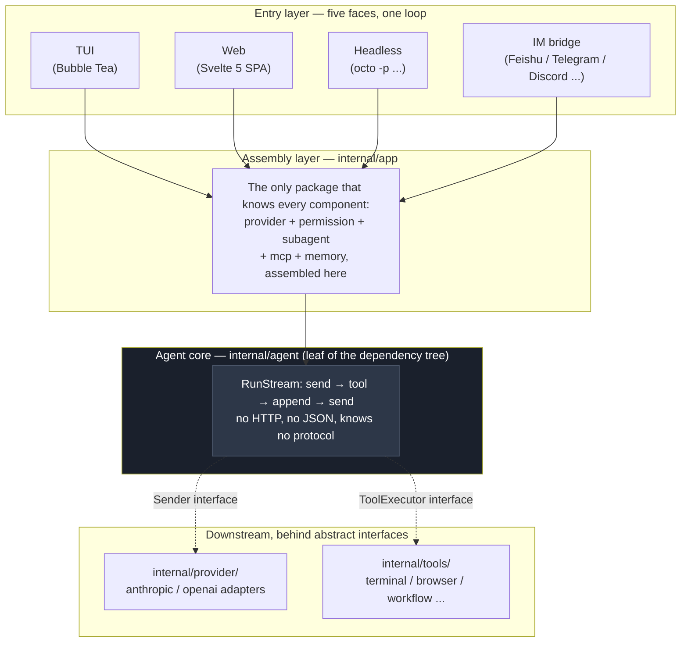
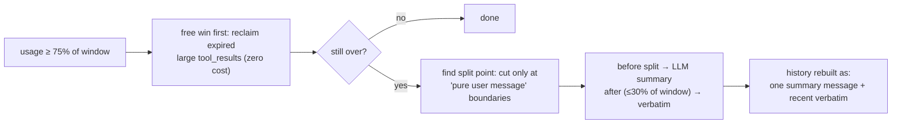
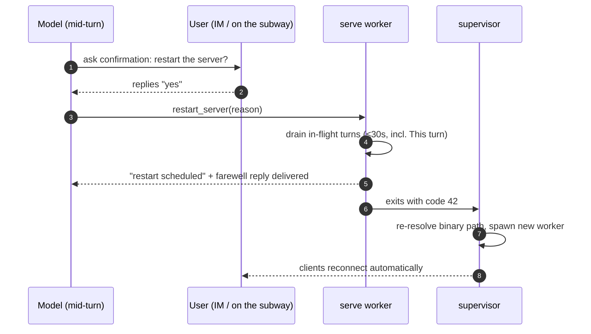
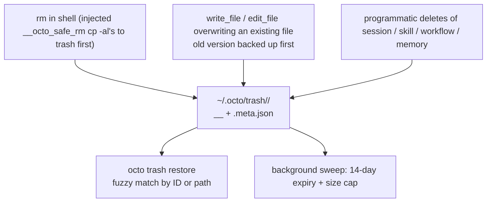

# octo-agent Deep Dive: The Genuinely Hard Parts of an AI Agent System

## Opening: What Happens Behind a Casual "Go Check That For Me"

Between typing `octo "check the error rate in prod"` into your terminal and getting an answer back, what actually happens?

The message enters through any one of the TUI, headless mode, an IM bridge, or the web UI, gets packed into an event structure, and is routed to the agent loop. The loop sends the full history to the LLM; the LLM either answers or asks to call a tool. If it calls a tool, the result is appended to the history and the loop continues.

That loop itself is only a few hundred lines of code. But the ten mechanisms that make it actually work each answer a real design problem. Without them, the agent runs unstable, slow, and expensive.

This post walks through those mechanisms: what they solve, how they solve it, and why it's done that way. By the end you'll see one line running through all of them: **in an agent system, whatever a mechanism can guarantee, never leave to the model's self-discipline.**

## The Foundation: Why the Agent Loop Gets to Be Only a Few Hundred Lines

**The agent loop is small not because it does little, but because it knows only two interfaces (`Sender` + `ToolExecutor`). It is the leaf package of the whole dependency tree.** It doesn't assemble JSON, doesn't speak HTTP, and has no idea how Anthropic's protocol differs from OpenAI's. All of that is quarantined in the adapter layer.

First, the panorama. The core of octo-agent is a single while loop:



One rule of discipline: **`internal/agent` is the leaf package of the dependency tree**. It doesn't import `provider`, doesn't import `tools`, doesn't import any UI. To the outside it knows exactly two interfaces: `Sender` (send messages out, get an abstract reply back) and `ToolExecutor` (execute a tool by name, get a chunk of text back).

The value of this rule only shows in the details. Anthropic's API signals "the model wants to call a tool" with `stop_reason: "tool_use"`; OpenAI uses `finish_reason: "tool_calls"`. In OpenAI's streaming responses, tool-call arguments arrive as JSON fragments spread across multiple chunks and must be reassembled by index before parsing. Some third-party OpenAI-compatible services don't even send the `[DONE]` sentinel. Each of these quirks is enough to plant an `if provider == "openai"` in the core loop. And once that starts, the loop is unreadable by the time a third provider lands. Octo-agent locks all of them inside the two adapter packages `internal/provider/anthropic` and `internal/provider/openai`; the agent loop only ever sees normalized, unified semantics.

So all five entries (TUI, Web, headless, IM, plus sub-agents) run the same `RunStream`; adding a new LLM backend doesn't touch a single line of agent code, and adding a tool means implementing an interface plus one line of registration. The full lifecycle of one turn:

```mermaid
sequenceDiagram
    autonumber
    participant U as User (any entry)
    participant Ag as Agent.RunStream
    participant Perm as Permission gate
    participant Prov as Provider adapter
    participant Tool as Tool

    U->>Ag: one message (app layer already injected permission/browser/memory context)
    loop until the model gives a final answer
        Ag->>Prov: SendMessagesToTools(full history)
        Prov-->>Ag: normalized text / tool_use
        Ag->>Perm: is this call allowed? (deny/ask/allow)
        Perm-->>Ag: pass / ask the user / refuse
        Ag->>Tool: execute; result appended to history as tool_result
    end
    Ag-->>U: event stream (text_delta / tool_started / turn_done)
    Note over Ag: history persisted to ~/.octo/sessions/*.jsonl
```

That's the foundation. Now the main event: the genuinely hard problems that show up once this loop starts running.

## Built-in Tools: A Converged Interface with Sharp Edges

Terminal, browser, workflow, MCP. These tools differ completely in how they're invoked, their parameter shapes, and their lifecycles. If the agent loop had to perceive those differences, every new tool species would mean changing the core loop. That's not architecture; that's piling.

**octo's answer: lock down one pipe.** Every built-in tool implements the same two-method contract (`Definition() ToolDefinition` + `Execute(ctx, name, input) (ToolResult, error)`), discovered and dispatched by name through `tools.DefaultRegistry`, executed through the agent loop. The shared surface is itself the point: the agent core never branches on tool species, meta-skills freely recombine them, and browser / workflow / MCP all travel the same narrow pipe. The structure is simple; the design tension lives at the edges.

### Streaming Fragments Across a Protocol Boundary

OpenAI-protocol tool-call arguments stream as JSON fragments across multiple chunks, keyed by `tool_calls[i].index`. Concatenate every fragment of the same index before parsing. Anthropic-style endpoints don't do this. The rule the codebase enforces: the agent loop (`internal/agent/agent.go`) never branches on which spelling it received; normalization happens in the provider adapter. The same "fragments in, complete tool call out" contract is the only way the browser / workflow / MCP layers stay portable between the Anthropic and OpenAI protocols, without every layer growing its own `if provider == …` forks.

### One Registry, Many Species

`tools.DefaultRegistry` (`internal/tools/registry.go`) is a single dispatcher that routes any tool call by name to one slot of the `allTools` slice: `Terminal`, `ReadFile`, `WriteFile`, `EditFile`, `Glob`, `Grep`, `WebFetch`, `WebSearch`, `Skill`, `Agent*`, `Workflow*`, `ScheduleWakeup`, `Browser`, `MemoryRecall`, and so on. (We left out `TerminalOutput`/`TerminalInput` here. They're companion sub-tools for background processes, not invoked directly by the user.) Behind the browser lives a CDP long connection in `internal/browser`; behind workflow, a Ruby/mruby sandbox; behind MCP, a JSON-RPC bridge. But the agent loop sees only `ToolExecutor`. This choice is exactly what makes meta-skills possible: a guided "set up your IM channel" flow isn't a bespoke tool; it's `channel-manager` stringing `read_file` / `write_file` / `terminal` together in the order the user's situation demands. Tool composition is the reusable primitive; a new capability usually means a new skill, not a new tool.

### Lazy-Loading MCP Tool Schemas

MCP tool schemas can be enormous. With dozens of MCP servers configured in a session, the full set of schemas is easily large enough to overflow the context window. The solution is **lazy loading**: expose only the tool name and a one-line description; when the model actually wants to use one, it pulls the full schema via `mcp_describe`. `auto` mode only kicks in when lazy-loading saves ≥ 10% of the context over uploading everything.

### Read-Before-Write + the mtime Guard

`internal/tools/ReadTracker` enforces a rule that sounds fussy but blocks a real class of bugs: the LLM may only write/edit files it has **already read**, and only while the on-disk mtime still matches what it was at read time. A file read on turn 3 that gets modified by an external editor by turn 7 → refuse, and tell the agent to re-read. The error wording is lifted from Claude Code. Models trained on that corpus react correctly on retry.

Guarding on an external file's mtime is inherently strict. What if a command the agent itself ran changed the file? A compile, a formatter rewrite. All of those touch mtime. The answer is `RefreshTarget`: paths the terminal tool has written get a fresh mtime stamp, so subsequent edits don't false-alarm. `RefreshTarget` re-stamps only the **exact** paths already registered in the tracker. It never spreads to sibling files, and it never promotes an unread file to writable. Files never read stay unwritable; files genuinely changed by an external editor (which never flow through the terminal tool and are never the exact write target of that command) keep their stale stamps and still raise the alarm. The guard catches real mistakes; the escape hatch is too narrow to be abused out of the sandbox.

### Pulling the Floor Out from Under SSRF

`web_fetch` can't just `http.Get(userURL)`. That's textbook SSRF (Server-Side Request Forgery). Its answer (`internal/tools/web_fetch.go`) splits requests into **two hardened paths** sharing one `secureFetchTransport`:

- **The Jina proxy path**. Rendering is handed to `r.jina.ai` (Jina AI's page-parsing service), but **cross-host** redirects are refused (a redirect off `r.jina.ai` means being bounced somewhere unexpected), and the connection is cut if the resolved IP is link-local or cloud metadata. When the caller passes custom headers, the request is forced onto the direct path (Jina's outbound headers aren't controllable, so the overrides can't be enforced).
- **The direct path**. Required for arbitrary URLs, so it **must** follow cross-host redirects (URL shorteners and `www` canonicalization are normal). It shares the link-local ban and caps the redirect chain at 10 hops so a loop can't hang the agent.

The `net.Dialer.Control` hook fires **after** DNS resolution with the concrete IP, so DNS rebinding (a hostname that resolves to a public IP now and `169.254.x.x` / `127.0.0.1` a moment later) is blocked too. Bodies have bounds as well: `WebFetchInlineBytes` (64 KB) is the inline threshold; `WebFetchMaxBytes` (5 MB) is the hard cap; beyond that the body is truncated to a temp file. A big page = summary + head/tail preview + a `read_file` pointer to the rest. Never a wall of text shoved into the model's context.

### Five Search Surfaces, One Contract

`web_search` looks simple on the wire (returns title/url/snippet), but behind it is a tiered fallback over five backends (`internal/tools/web_search.go`): **Brave → Tavily → Serper → DuckDuckGo HTML → Bing HTML**. The first three activate when their env keys (`BRAVE_SEARCH_API_KEY` / `TAVILY_API_KEY` / `SERPER_API_KEY`) are present; the last two need no key and are the default path. Every failure is swallowed into the response's `Error` field and the next tier is tried. The tool never panics, and the tier that actually produced results is reported back in the `Provider` field so the model knows whether it's looking at an index lookup (Brave) or an HTML scrape (DDG/Bing).

Two details stand out: first, the **DuckDuckGo cooldown** (`markDDGUnavailable`, 10 minutes), which stops a stampede of goroutines from hammering DDG right after it returned nothing, guarded by a `sync.RWMutex` because the web server made concurrent searches routine. Second, **a landmine on Bing's HTML endpoint**: if you send `Accept-Encoding: gzip`, Bing answers with a ~39 KB JavaScript skeleton page instead of the ~120 KB real results page. The fix is the odd rule "never let Go auto-negotiate encoding against `cn.bing.com`". `browserGet` deliberately omits that header.

### terminal: Timeouts, Anti-Polling, Backtick Survival

The `terminal` tool runs everything you hand it on the system shell, so its schema description is the longest in the codebase. Most rules cost a debugging session each to learn:

- **Three launch modes**. Synchronous (default; blocks until the command returns), `run_in_background: "async"` (a detached one-shot like a build or `npm install`), and `"interactive"` (a long-running service / REPL you keep feeding via `terminal_input`). A `detached: true` mode is reserved for things that outlive the session (`ngrok` / `cloudflared`).
- **120-second default timeout**, hard ceiling at `MaxTerminalTimeout` (600 s); anything longer must go background instead of hogging a turn.
- **Anti-polling window**: `BackgroundManager` watches concurrent reads. Three empty reads of a running process inside 30 seconds get blocked, and the LLM is told to wait for the push notification instead of spinning in `terminal_output`.
- **A 1 MiB circular buffer per background process**. Older drops are honestly reported; only the recent tail is kept.
- **The backtick problem**: shells mangle backticks inside quotes (POSIX turns them into command substitution; PowerShell treats backtick as an escape). The fix is the dedicated `stdin` parameter, which pipes text verbatim into the child's stdin and closes it. Mandatory whenever the command body contains quotes, backticks, or `$`.

Together these turn "a shell can do anything" from a blunderbuss into a bounded surface the model can reason about. Without burning tokens polling dead output.

### sub_agent: Can Fork, Can't Recurse

The `sub_agent` tool looks like delegate-and-wait, but the design tension lives in what it *refuses* to do. The most visible rule sits in `AgentTool.Execute` (`internal/tools/agent.go`): if the caller is already a sub-agent, fail outright. "a sub-agent cannot spawn another sub-agent." No recursion, period. Combined with the `tools` allowlist deliberately omitting `sub_agent` itself, that's a hard ceiling. Not the workflow's Turing-complete arbitrary spawn. The design intent is "one layer of delegation only"; no agent trees.

**Fork vs. Fresh** (`subagent_type`): omitting `subagent_type` seeds the child with the **parent's full conversation** (system prompt + messages so far), a true fork that shares context and follows the same conclusion-shaped reply contract. Setting a type (`explore`, `plan`, `general`, `code-review`) starts a zero-context child with a specialized persona, read-only / lean-context defaults, and its own `model` frontmatter. One tool covers both; presets fill in whatever the caller left unset.

**Sync vs. Async**: `run_in_background: true` calls `SubAgentManager.Start`, returning an `agent_N` ID immediately and pushing a notification on completion; `false` (default) calls `RunSync`, blocking the turn until the result is back. A semaphore (`syncSem`) bounds concurrent synchronous sub-agents so a fan-out wave can't starve the parent. Transport-aware too: synchronous channels (server / IM) have no follow-up-turn path, so `mgr.Synchronous()` silently forces the blocking path and tells the model. Instead of failing quietly.

When a sub-agent hits its turn limit, the result comes back with an explicit `[INCOMPLETE: … partial]` marker rather than passing half-done work off as finished. The parent either relaunches with a narrower task or treats it as unfinished. Every `StopReason` (`end_turn`, `tool_use`, `max_turns`, `error`, `killed`) is pushed to the WS broadcast, so the frontend status panel updates without polling.

## Context Compaction: You Can't Delete Messages, Only Fold Time

The first wall is physics: the context window is only so big, and agent conversations inflate fast. A single compile-error tool_result can be thousands of tokens, and an afternoon session easily piles up into six figures.

The intuitive fix. "drop the oldest messages when the window fills up". Outright breaks API requests in an agent setting: `tool_use` and `tool_result` in the history are strictly paired, and cutting a pair makes both Anthropic and OpenAI return 400. Worse, "the oldest messages" usually contain the original task statement; delete it and the agent spends the second half not knowing what it's doing.

octo-agent's answer is **summary folding**: compress the early history into a summary, keep the recent history verbatim. The devil is in three details.



**First, the split point is always safe.** `safeSplitIndexByBudget` (`internal/agent/compaction.go`) only cuts at "pure user messages containing no tool_result", structurally guaranteeing a tool_use/tool_result pair can never be split. This also lets compaction happen mid-turn: a long turn checks usage after every batch of tool calls, and if it's over, folds earlier complete rounds immediately while the in-flight calls proceed untouched. For agent tasks with dozens of tool calls, "can compact mid-turn" isn't a nice-to-have; it's a necessity.

**Second, the usage math is counterintuitive.** Context usage is not whatever `input_tokens` reports. On a prompt-cache hit, Anthropic's `input_tokens` is only the uncached delta; the real usage adds `cache_read` back (`accrueUsage` in `agent.go`). Example: a 100K window, all early turns cache-hit, Anthropic reports `input_tokens: 20K` (the delta); real usage is 20K + 80K cache_read = 100K. A naive compactor sees 20K → 20% → doesn't trigger. Next turn the cache misses and 80K of original text + 20K of new content slams into the 100K threshold at once. **Without adding cache_read back, compaction never fires when hit rates are high. And the miss turn is exactly the turn that needs it most.**

**Third, compaction has damping.** The trigger threshold defaults to 75% (configurable via `compact_auto_pct`), the retention budget is 30% of the window, and there's an anti-flap rule: if this fold would save less than 15%, skip it. Otherwise a borderline session pays for an expensive summary call every single turn.

A pit worth knowing: **the on-disk `session.jsonl` stores the compacted history**. Compaction rebuilds the history wholesale, triggering a full rewrite of the session file; the original text only survives if `ArchiveDir` is configured, archived as `chunk-*.md` (the summary ends with the file path so the model can read it back itself with the read tool). Otherwise it's gone for good. A shorter history also invalidates every `message_index` the web frontend holds (edit/branch depend on it); the server detects the shrink via a watermark and forces the frontend to re-pull the whole transcript. These "compaction ripples" are the most reworked part of the whole mechanism.

## Prompt Caching: An Agent's Bill Is Quadratic

**The problem**: every iteration of the agent loop resends the full history. In an N-turn session, the first message gets billed N times. Without caching, cost grows **quadratically** with conversation length.

The principle of prompt caching is simple: if this request shares a prefix with the last one, the hit portion is billed at about a tenth of the price. The trouble is that protocols report hits completely differently.

| Protocol | cache-hit field | semantics of input_tokens |
|------|-------------|---------------------|
| Anthropic | `cache_read_input_tokens` | reports only the uncached delta; hits counted separately |
| OpenAI | `prompt_tokens_details.cached_tokens` | reports all input; hits are a subset |
| DeepSeek | `prompt_cache_hit/miss_tokens` | two explicit buckets |

octo's answer: do one subtraction in the OpenAI adapter (`nonCachedInput`), turning OpenAI-style reporting into "two non-overlapping buckets" as well. From then on, the agent layer's `InputTokens` and `CacheReadTokens` mean the same thing under every protocol. And the usage math the compaction mechanism depends on is built on exactly that unification.

**Breakpoint strategy**: declare cache scope with `cache_control` breakpoints in the request. There's one at the end of the system prompt. Because the HTTP body order is tools → system → messages, the tools array sits before the system block and is implicitly included in the cached prefix, needing no breakpoint of its own. On the message side, one breakpoint each goes on the last two messages (two consecutive marks keep the cache anchor straddling the "old tail / new head" boundary). The newest message is never cached. It changes every time.

## Memory: Three Lifetimes of "Remembering"

What an agent needs to remember spans three different lifecycle scales. The chat context within a session, user preferences across sessions, and retrievable knowledge fragments. Put it all in the system prompt and the window blows up fast; route it all through semantic search and high-frequency preferences get too slow to fetch. Three lifetimes naturally map to three storage and retrieval strategies:

| memory type | lifetime | storage | retrieval |
|----------|------|----------|------|
| session history | session lifetime | `~/.octo/sessions/*.jsonl` | loaded per session |
| user preferences | cross-session | Markdown files under `~/.octo/memories/` | system-prompt injection (`Reminder`) |
| semantic recall | cross-session | external memory backends (hindsight / mem0 / agentmemory, optionally self-hosted) | the `memory_recall` tool |

The "user preference" memory deserves a closer look. It does no automatic extraction. The user or the agent triggers saves explicitly via `SaveNudge`. The `Reminder` injection runs on two tracks: entries written in `MEMORY.md` land directly in the system prompt as must-follow rules; topic files show up as only a filename and tags, and the agent reads them itself with `read_file` when needed. Textbook progressive disclosure. Not every memory gets crammed into context.

The "semantic recall" layer is likewise a product of restraint: octo ships no built-in vector database, instead handing conversation indexing wholesale to pluggable external backends (hindsight, mem0, or agentmemory. Pick one, run the container yourself or use their managed clouds). Extraction and indexing are the backend's own business; octo only asks questions and collects answers. With no backend configured, `memory_recall` simply isn't registered into the tool list. Not advertising a tool doomed to fail is more honest than failing after advertising it.

## The Unkillable Host: octo serve's Robustness Design

Let me start with a war story. I used to run an agent of OpenClaw's gateway-style architecture through IM: it ran on my machine at home while I was at the office. One day it executed a command that took the gateway process down. And from that moment, the chat window went dead silent. Later, on the subway, all I had was a conversation that would never reply again; there was nothing I could do until I got home and reached a terminal. For an agent that "lives in IM", a dead host process is brain death. And the killer was the agent itself.

octo serve doesn't count on the model learning from other people's accidents; it stacks five layers of mechanism.

**Layer one: the terminal refuses to hand over the knife.** When a serve process starts, it turns on the guard (`internal/tools/server_guard.go`); from then on the terminal tool refuses to execute any kill aimed at the host: `pkill / killall octo` (kill by name), `kill <PID>` (arguments scanned one by one, protecting its own PID and the supervisor's parent PID), `kill $(pgrep octo)` (resolve-then-kill). All get bounced back with an error that names the correct move: use `restart_server`. Two details worth recording: a parent PID of 1 is not protected (being reparented to init/launchd means there is no supervisor, and a bare "1" would false-positive every command containing the digit); RE2 has no lookbehind, so PID extraction uses `(?:^|[^-\w])(\d+)` to explicitly sidestep. Otherwise `kill -9 -1`, a phrase common in commit messages, would be misjudged. The package comment is honest as usual: this is a best-effort textual guard, not a sandbox. It stops the model from **reflexively** killing its host, not from a deliberate jailbreak.

**Layer two: one front door for restarts, and it always asks you first.** Only two things genuinely need a restart: a replaced binary, or a change to config read only at startup. `restart_server` (`internal/tools/restart.go`) is that one front door, and it is pinned to the ask class, never allow-listable (`internal/permission/defaults.yml`). Every restart needs your personal confirmation: a modal on the web, a reply in IM; one tap on the subway is enough. The tool is only registered in the serve process (CLI/TUI never even see it), and sub-agents inherit the same gate. More importantly, calling it does **not** exit immediately: the server first drains all in-flight turns (30-second hard cap), *including the turn that made the call*. The "I'm about to restart" message is guaranteed to reach you before the process exits.



**Layer three: the supervisor contract makes "restart" mean "back at full health".** `octo serve` runs as a supervisor/worker pair by default (`cmd/octo/serve_supervisor.go`). After draining, the worker exits with code **42** (`ExitRestart`); the supervisor sees 42 and respawns. Re-resolving the binary path on every spawn, so replacing the binary on disk and restarting amounts to an upgrade. The contract is open to the outside: set `OCTO_SERVE_WORKER=1` and an external supervisor takes over respawn (systemd joins the same protocol via `RestartForceExitStatus=42`). Two honest boundaries: when the user hits Ctrl-C, the signal is forwarded and the worker is **not** respawned (the user asked the whole thing to quit. This isn't whack-a-mole); when the worker genuinely crashes, its exit code propagates as-is and it isn't respawned either. The built-in supervisor only handles graceful restarts; crash recovery belongs to systemd, the thing that actually does that for a living. No fake high availability.

**Layer four: most things that "need a restart" need no restart at all.** Hot reload is the preferred path for config changes. After editing channels.yml, `POST /api/channels/{platform}/reload` rebuilds only that one platform's adapter. The channel-manager skill calls it right after writing the config, and you won't feel so much as a tremor in IM. The desktop build has no supervisor, so hot reload is the only path there. The per-turn rebuild of permissions.yml was covered in the permissions chapter. Same philosophy: whatever can be hot-swapped is never restarted; whatever must be restarted is never hard-cut.

**Layer five: config edits get proctored, and failing has a safety net.** Config is the thing the agent most often edits with its own hands, so it gets two lines of defense. **The first is on the write side**: an in-proc hook registered on PostToolUse (`internal/tools/config_guard.go`) watches every tool call. `edit_file` / `write_file` are matched by exact path (with `~` expansion), `terminal` loosely by the command containing both `.octo` and `config.yml` (arbitrary shell can't be parsed; a rare false positive costs one harmless re-validation). And whenever `~/.octo/config.yml` was touched, it immediately validates with `Load` (a raw parse, no cache) plus a semantic check, folding any warning into the very next step's context: "your change did NOT take effect (the server kept the last valid config). Fix the file before relying on the edit." The agent doesn't have to deduce the failure from weird downstream behavior; it knows on the very next step after the edit. **The second is on the read side**: serve re-reads config.yml every turn (so config changes need no restart), but `LoadCached` is a validate-then-replace cache. When the file is broken it keeps serving the last cleanly parsed config until it's fixed; without it, one YAML typo would revert every config-derived feature (per-session model binding, the compaction lite model, the coauthor flag, browser vision) to hardcoded defaults the instant the bad file is saved. A slip becoming a live behavior change across every session. Channels.yml behaves the same: if reload can't load the config it returns immediately, leaving the running adapter untouched; semantically invalid new config simply isn't started, and the reason lands in the `issue` field, queryable from the web panel and the desktop tray. The two defenses patch each other: the read-side fallback makes failure silent; the write-side proctor makes it loud again.

The five layers add up to the same old line: you can't teach a model "never kill your host", but you can make it unable to; you can't guarantee it remembers the front door every time, but you can make the front door the only way through.

## Workflow: Turing-Complete Orchestration That Can't Touch the System

**The problem**: "Review this diff from correctness, security, and performance angles simultaneously." Having the main model call sub-agents one by one is too slow; making users write Go is too heavy.

**The answer**: a Ruby DSL running on the chain mruby (a lightweight embeddable Ruby interpreter) → wasm32-wasi → wazero (a pure-Go wasm runtime):

```ruby
findings = parallel(["correctness", "security", "performance"]) { |view|
  agent("Review this diff from the #{view} angle")
}
agent("Synthesize these findings: #{findings.join("\n")}")
```

Every layer has its reason:
- **mruby**: Turing completeness demands a real language
- **wasm32-wasi**: embed an interpreter without cgo (cgo kills Go's cross-compilation)
- **wazero**: a pure-Go wasm runtime; one command builds binaries for every platform

**Concurrency model**: mruby inside wasm is single-threaded. Mruby-side Fibers (cooperative) and Go-side goroutines (true concurrency) shake hands at the function boundary. An `agent()` call is non-blocking: Go starts a goroutine for the LLM call while mruby suspends. `parallel`'s concurrency is fixed at 8 (`defaultWorkflowConcurrency`), so a `parallel` over a large list can't fan out an unbounded number of concurrent LLM calls.

**The journal mechanism**: every `agent()` call's result is recorded under `~/.octo/workflow-journals/`. On a re-run, once the hashes check out, completed calls replay their cached results. If step 8 of a long workflow died, fix one line and re-run without re-paying the LLM bill for the first 7 steps.

## The Browser: Never Launch, Only Attach

**The counterintuitive design**: octo never launches a browser; it only attaches to the Chrome the user already has open. A self-launched headless instance has no login state, and on macOS it triggers the keychain prompt. For a daily tool, the moment that prompt appears, user trust is gone.

**Record & replay**: what's recorded is not a coordinate sequence (coordinates die the moment the window resizes) but a **semantic event stream**. Structured fields like `action / selector / value / verify`. The recording pipeline: inject a listener script into the page to capture click/change/navigation events → generate a selector for each target element (prefer id → data-testid / aria-label → fall back to nth-of-type) → compile and dedupe → parameterize the repeatable inputs → emit structured YAML.

Selectors rot: one frontend redesign turns `.btn-submit` into `.button-primary` and the script breaks. The replay engine's answer has two tiers:

1. **The free tier**: the most common failure is actually a cookie popup covering the target element. Auto-dismiss the overlay and retry first
2. **The LLM tier**: feed the intent, the dead selector, and a digest of every interactable element on the current page to the model, have it answer with only a new selector, swap it in and retry, up to three rounds. Once the fix works and the whole skill run passes, the new selector is **written back to the YAML on disk**. The same redesign never costs you another LLM repair fee

## The Permission System: Admitting It's Just String Matching

An agent that can execute arbitrary shell commands needs a carefully thought-out security model.

**First, precedence is independent of declaration order**. It's not "the first matching rule from the top wins", which would make file line order part of the security semantics. The actual implementation buckets matches: hit rules go into deny/ask/allow buckets, and the result is taken by fixed priority. Hardcoded backstop rules (`rm -rf /usr`, `dd if=`, etc.) can't be overridden even by a user-written allow.

**Second, `^` anchoring solves real accidents**: `deny: "format"` was meant to stop disk formatting, but it also stopped `docker ps --format json`; `deny: "shutdown"` stopped `git commit -m "fix shutdown handling"`. The sensitive word appearing inside a commit message. `^` anchors matching to command position (start of line, after a pipe, after `sudo`), leaving arguments and string contents alone.

**Third, hot reload + graceful degradation**: the permission engine is rebuilt every turn, so an edit to `permissions.yml` takes effect on the very next command. A YAML syntax error falls back to the last successfully parsed rules. A briefly broken config file must neither crash the session nor leave it "temporarily undefended" in that window.

**Honesty**: by default there's no OS-level isolation; the shell tool is a bare `exec.Command` and the only line of defense is string rules. Real OS-level isolation is optional depth (macOS Seatbelt, Linux Landlock + seccomp). The package comment says it plainly. String matching can certainly be bypassed; stating the boundary clearly is worth far more than advertising a security model that doesn't exist.

## The Trash Can: Designed for the Premise "The Model Will Delete the Wrong File"

**The premise**: the model **will** delete the wrong file. Not "might". Sooner or later. The right question isn't "how do we prevent bad deletes" but "what happens after one".

Coverage is wider than you'd think:



One small judgment call: **if the target file is tracked by git and the working tree is clean, skip the backup**. Git already has the content; storing another copy in the trash is pure waste. A good safety net doesn't just catch. It stays quiet.

## Batteries Included: Keeping Users Through the First Five Minutes

The previous nine are "hard problems", but the genuinely hard part of building an agent is **the first five minutes**. If a user has to install ripgrep or dig through MCP repos before their first question, they're likely gone for good.

- **Two bundled binaries**: ripgrep is compiled into the binary (`go:embed`) so users don't install anything; the Python openpyxl dependency is solved by bundling uv.
- **Twenty built-in skills, chef's kiss**: not a plugin marketplace where you "install then use", but a signature menu ready the moment you open the kitchen.
  - **Coding pipeline**: `grill-me` → `tech-design` → `implement` → `code-review` forms the full chain from interrogating ideas to landing reviewed code; `worktree-isolate` provides an isolated sandbox, `loop-engineering` and `workflow-creator` compose individual skills into automated flows, and `artifact-design` plus `dataviz` handle diagrams and visualizations.
  - **Content line**: `ppt-master` (multi-role collaborative PPT generation), `image-gen` (AI image creation), `office-xlsx` (programmatic Excel), `deep-research` (multi-source verified research), `web-access` (anti-bot page scraping). One-stop coverage for reports, presentations, and research.
  - **Zero-friction triggering**: every skill's description embeds bilingual trigger keywords. A user saying "review my changes" automatically hits `code-review`, "turn the research into a PPT" hits `ppt-master`, no skill name memorization needed.
- **Five meta-skills** (`skill-creator`, `mcp-creator`, `channel-manager`, `cron-task-creator`, `workflow-creator`) that handle octo's own configuration, walking users through flows that would otherwise be handwritten YAML. They rely on the file tools (`write_file`, `edit_file`, `terminal`) plus octo-specific knowledge, rather than a bespoke tool per YAML file. The "tools are composable" principle applies to user workflows and to octo's own onboarding alike.

## Closing

Ten mechanisms, each minding its own business. And together, one judgment: **whatever a mechanism can guarantee, never leave to the model's self-discipline.**

Compaction rests on token thresholds and safe split points, not prayers that the summary loses nothing; cache breakpoints are inserted explicitly, not left to luck; serve makes sure the model can't kill its own host, and even a restart asks you first and delivers its reply before going down; workflow's concurrency cap is a constant, not the script author's self-restraint; the permission system's deny-first and command anchoring each correspond to a real accident; and the trash can simply assumes bad deletes are inevitable and spends its effort on "after".

The model does the clever; the mechanism does the floor. That's the one line most worth taking away from this codebase.

---

### Appendix: Code Entry Points

| mechanism | entry files |
|------|----------|
| Agent loop | `internal/agent/agent.go` |
| Context compaction | `internal/agent/compaction.go` |
| Prompt-cache breakpoints | `internal/provider/anthropic/client.go` |
| Protocol token normalization | `internal/provider/openai/types.go` |
| Memory (Markdown) | `internal/memory/memory.go` |
| Memory (semantic) | `internal/memorybackend/backend.go` |
| serve self-kill guard | `internal/tools/server_guard.go` |
| Graceful restart / supervisor | `internal/tools/restart.go`, `internal/server/restart.go`, `cmd/octo/serve_supervisor.go` |
| Config post-write validation | `internal/tools/config_guard.go` |
| Config last-good fallback | `internal/config/config.go` (`LoadCached`) |
| Workflow runtime | `internal/workflow/runtime.go` |
| Browser record/self-heal | `internal/browser/recorder.go` |
| Permission decisions | `internal/permission/permission.go` |
| OS-level sandbox | `internal/sandbox/` |
| Trash can | `internal/trash/trash.go` |
| MCP tool search | `internal/tools/tool_search.go` |
| Meta-skills | `internal/skills/defaults/` |
| Read-before-write guard | `internal/tools/read_tracker.go` |
| web_fetch SSRF defense | `internal/tools/web_fetch.go` |
| web_search tiered backends | `internal/tools/web_search.go` |
| sub_agent lifecycle | `internal/tools/agent.go` |
