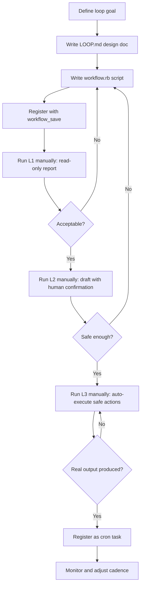
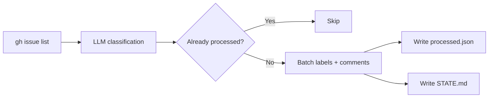
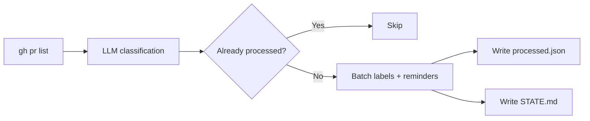
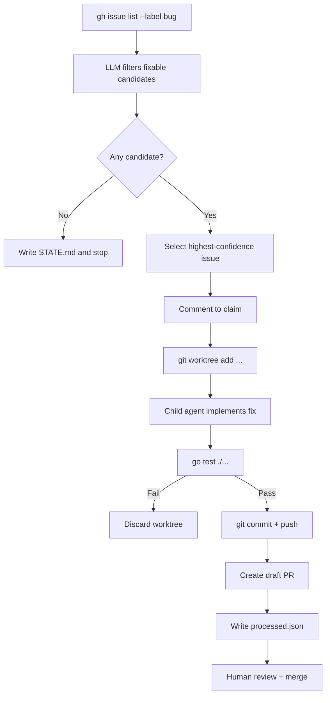
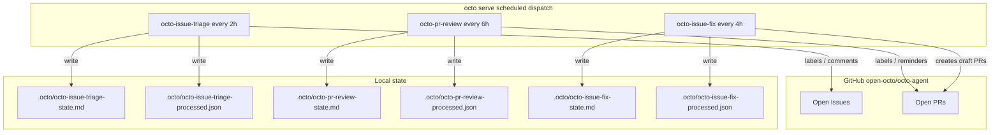

# Loop Engineering Series (2): In Practice — Using octo-agent to Automate an Open-Source Repository

> This post documents how the octo-agent team built three automated loops on the `open-octo/octo-agent` repository — issue triage, PR review, and auto issue-fix — and the underlying engineering capabilities that made them possible.

---

## Background

Loop Engineering is a core idea behind octo-agent: hand repetitive, rule-bound operational work to agent loops, let humans focus on decisions and exceptions, and roll out in three phases — L1 (read-only report), L2 (draft with human confirmation), and L3 (auto-execute safe actions).

Recently, the octo-agent team practiced this idea end-to-end on its own main repository, `open-octo/octo-agent`, by deploying three loops:

1. `octo-issue-triage`: automatically triages open issues (adds labels, posts comments).
2. `octo-pr-review`: automatically reviews open PRs (identifies stale / CI-failing / draft PRs).
3. `octo-issue-fix`: automatically claims bug issues, fixes them in isolated worktrees, runs tests, and submits draft PRs.

This post does not repeat the theory; it focuses on:

- How the loops were built and the flowcharts behind them.
- The octo primitives that support them.
- Real problems encountered and how they were solved.
- Directions for further improvement.

---

## Why octo-agent for Loop Engineering

Building your own cron scripts, state files, GitHub API calls, LLM scheduling, and code review pipeline is technically possible, but quickly turns into operational mud:

- Scripts are scattered, with no uniform format or version control.
- Timed tasks live in crontab or CI, making their running state hard to observe.
- LLM failures, GitHub rate limits, and corrupted state files lack a unified degradation mechanism.
- Once code changes are involved, safety isolation and human gates must be built from scratch.

octo-agent solves these problems in one place. It is not a fancy ChatGPT client; it is a **local platform for long-running agent workflows**:

- Use **workflow** to write versioned, reusable loop scripts.
- Use **cron-task-creator** to register workflows as persistent cron tasks.
- Use **worktree-isolate** and **sub_agent** for isolated code changes and independent review.
- Use **skill** to load沉淀 best practices.
- All loop state lives under `.octo/`, naturally separated from human work directories.

This turns Loop Engineering from “writing a pile of scripts” into “writing a few design documents and workflow files,” then continuously running, observing, and iterating.

---

## How octo primitives support the loops

### 1. `workflow`: loop scripting and sandbox safety

`workflow` is the skeleton of Loop Engineering. A loop is written as a Ruby script, saved as `.octo/workflows/*.rb`, and can be run manually or attached to a cron task.

Key design highlights:

- It runs in an **IO-free mruby sandbox**; the script itself cannot access the filesystem or network. All real IO must be delegated explicitly via `agent()`. This gives two benefits:
  - The script itself is safe — a typo will not delete your repository.
  - Each `agent()` call is an LLM reasoning step, with precise control over its permission scope.
- It supports **JSON Schema constraints** on LLM outputs, preventing malformed downstream results.
- Once registered with `workflow_save`, the local directory becomes a “loop repository” that can be backed up and migrated with the project.

Usage:

```bash
# Register a workflow
octo workflow_save octo-issue-triage --file .octo/workflows/octo-issue-triage.rb

# Run it manually in L1
octo workflow name:"octo-issue-triage" args:'{"mode":"L1","limit":30}'
```

### 2. `cron-task-creator`: from workflow to loop

Manually running a workflow is a test; only a cron task deserves the name “loop.” The `cron-task-creator` skill turns this into a single conversation:

```bash
octo /cron-task-creator
```

Tasks are stored in `~/.octo/tasks/*.json` and scheduled by `octo serve`. Compared to crontab or CI cron jobs, this has advantages:

- Tasks are not static commands; they are **prompts bound to the octo agent context**, able to call workflows, read files, and summarize state.
- They can be inspected, enabled, disabled, or edited via API at any time.
- Failures are recorded, instead of stderr being emailed everywhere.

For example, the `octo-pr-review` task prompt:

```text
Run the saved workflow octo-pr-review in L3 mode for open-octo/octo-agent.
workflow(name: "octo-pr-review", args: {"mode": "L3", "limit": 30})
After the workflow finishes, read .octo/octo-pr-review-state.md in the current directory, summarize how many PRs were triaged, how many labels were applied, how many comments were posted, and whether any labels were skipped. Then stop.
```

### 3. `worktree-isolate`: safe isolation for code changes

For the `octo-issue-fix` loop, which modifies code, changes must happen in an isolated environment. The `worktree-isolate` skill provides the full flow: fetch latest main → create git worktree → modify → commit → push → clean up.

Commands:

```bash
cd /Users/roy.lei/Projects/github/octo-agent
git fetch origin main
git worktree add ../octo-agent-fix-1111 origin/main
# modify, test, commit in the worktree
git push origin bot-fix/1111
git worktree remove octo-agent-fix-1111
```

The main checkout stays clean, and failed attempts can be deleted without pollution. This makes machine code changes controllable.

### 4. `sub_agent`: multi-agent collaborative review

After the auto-fix for PR #1134 was generated, the team used a `code-review` type `sub_agent` to review the diff independently. A child agent without context bias can spot issues the main agent missed, such as the `strict` permission mode being lossily mapped to `interactive`.

`sub_agent` is octo’s “multi-agent collaboration” capability: one agent does the work, another plays the skeptic. This is like embedding an automated QA role in the pipeline, covering correctness, conventions, performance, security, and tests.

### 5. `skill` system: encoding best practices

The entire build process followed skill guidance:

- `loop-engineering` skill provides the LOOP.md format, L1/L2/L3 definitions, and safety red lines.
- `cron-task-creator` skill explains how to register cron tasks.
- `code-review` skill provides review dimensions.
- `worktree-isolate` skill provides the code-change isolation flow.

octo’s skill system encodes community and project best practices into executable instructions. Users do not have to start from scratch; following the skill guide produces a workflow that meets the project’s conventions.

### 6. MCP extensibility: connecting third-party code-intelligence tools

octo supports MCP (Model Context Protocol) for connecting external tools. During the fix for #1111, code-structure understanding relied on browsing and grep. If the repository enables a code-indexing tool such as CodeGraph via MCP, the auto-fix loop can obtain structured call relationships and impact analysis before touching code, rather than blindly grepping. This reflects octo’s open architecture: core capabilities are provided by octo, while specialized tools extend it through MCP.

---

## Standard process for building a loop

Although the three loops have different goals, their build process is remarkably consistent:



### 1. Write LOOP.md

LOOP.md is the loop’s “design document.” It includes:

- Purpose: what the loop does.
- Repository: which repository it targets.
- Trigger: manual or scheduled.
- Triage categories: classification rules.
- Done condition: what success looks like.
- Safety: red lines.
- State files: where state is stored.
- Rollout: the L1 → L2 → L3 plan.

The `loop-engineering` skill tells users exactly what LOOP.md should contain, turning a vague idea into an executable spec.

### 2. Write workflow.rb

The workflow script orchestrates:

- Data discovery (`gh issue list` / `gh pr list`).
- LLM classification or decision.
- Safe actions (labels, comments, worktree creation).
- Writing state files.

All real IO is done through `agent()` calls to child agents. This is octo’s safety model: the script itself cannot touch files; only child agents execute concrete actions in controlled contexts.

### 3. Register and test

```bash
octo workflow_save octo-issue-triage --file .octo/workflows/octo-issue-triage.rb
octo workflow name:"octo-issue-triage" args:'{"mode":"L1","limit":10}'
```

Run L1 on a small batch first to confirm classification quality, output format, and state files before scaling up. This “read-only first, then incremental” approach is central to octo Loop Engineering and prevents mislabeling or spamming on day one.

### 4. Graduate to L3 and cron

L1 stable → L2 observe drafts → L3 execute safe actions → verify real output → `cron-task-creator` register as a cron task.

---

## The three loops in detail

### 1. octo-issue-triage: labels + reminders

**Goal**

Automatically classify open issues, add domain labels (`ui-ux`, `memory`, `im`, etc.), priority labels (`high-priority`, `low-priority`), and post reminder comments on issues that need more information.

**Safety boundaries**

- Never close an issue.
- Never merge a PR.
- Only add labels and post comments.

**Flow**



**Core snippet**

```ruby
# Incremental processing: exclude already-processed issues
processed_numbers = (processed_data["processed"] || []).map(&:to_s)
new_issues = issues.reject { |i| processed_numbers.include?(i["number"].to_s) }

# Batch labels: skip non-existent labels instead of failing
label_prompt = "Apply labels to multiple issues ... Do NOT create new labels. If a label does not exist, skip it."
```

**Results**

- Ran multiple rounds, processed 20+ issues, added labels, and posted requests for more information.
- Early versions stopped to ask the user when a label did not exist; later versions were changed to “apply if exists, skip and record if not.”

---

### 2. octo-pr-review: identify stale / draft / CI-failing PRs

**Goal**

Monitor open PRs and identify draft, stale, CI-failing, and trivial categories, saving maintainers from tedious status tracking.

**Safety boundaries**

- Never merge a PR.
- Never close a PR.
- L3 only adds labels and posts polite reminder comments.

**Flow**



**Cadence adjustment**

Initially all three loops ran every 2 hours. PRs change more slowly than issues, so PR review was adjusted to every 6 hours to save tokens.

**Results**

- The repository had no open PRs at the time; L1 only verified the workflow could run end-to-end.
- Cadence is now set to every 6 hours.

---

### 3. octo-issue-fix: auto-claim, fix, and submit draft PRs

**Goal**

Automatically fix low-risk, clearly reproducible bug issues and submit draft PRs for human review.

**Safety boundaries (strictest)**

- Never auto-merge.
- Never auto-close the original issue.
- Only modify files directly related to the issue.
- Must pass `go test ./...`.
- Process at most one issue per run.
- Submit only **draft PRs**; human review is required before marking ready.

**Flow**



**Real case: fixing #1111**

Issue #1111 reported that `SettingsView` Permission Mode did not persist, the Desktop/Failure notification toggles were dead, and the Save button appeared to succeed when no session was active.

Fix steps:

1. Create worktree: `git worktree add ../octo-agent-fix-1111 origin/main`.
2. Read the issue and `web/src/views/SettingsView.svelte`.
3. Fix:
   - Wire Permission Mode to `api.updateSessionPermissionMode` to save it to the backend.
   - Complete the UI label ↔ backend value mapping: `Ask`/`Auto`/`Strict` ↔ `interactive`/`auto`/`strict`.
   - Remove the Desktop/Failure notification toggles that were not connected to the backend.
   - Disable the Save button and show a hint when there is no active session.
4. Run `go test ./...`; all passed.
5. Commit and push to `bot-fix/1111`, create draft PR #1134.
6. Run `sub_agent` code review; review identified the `strict` mapping and global/session save logic issues.
7. Fix review comments, force-push, and mark ready for review.

**Results**

- L1 identified 6 fixable candidates.
- Selected #1111 for the L3 pipeline, producing PR #1134.
- `go test ./...` passed.

---

## Pitfalls encountered

### 1. Workflow syntax fails in the mruby sandbox

`octo-issue-fix` and `octo-pr-review` workflow files initially used `map(&to_s)`, which works in local Ruby but must be `map(&:to_s)` in octo’s mruby sandbox. L1 failed on the first run and had to be fixed.

**Lesson**: workflow scripts must be more conservative in Ruby syntax than ordinary scripts. Test `workflow_save` + `workflow name:` L1 multiple times. The mruby sandbox is a safety boundary, but it also introduces syntax constraints that local Ruby does not expose.

### 2. Non-existent labels stop the workflow

Early issue-triage versions stopped to ask the user when a label did not exist. A loop that waits is no longer “automatic.”

**Lesson**: automatic loops must degrade gracefully — skip resources that do not exist instead of waiting for input. Logging the missing item to STATE.md is better than pausing.

### 3. Incremental processing is essential, otherwise GitHub treats it as spam

Without a processed history, the same issue would be commented on every run. After one run and another, the issue would be flooded with machine comments.

**Lesson**: any loop that produces side effects on external systems must maintain a processed list. The processed file is part of the loop state.

### 4. PR review cadence is slower than issue cadence

All three loops started at every 2 hours. PRs do not change that often; every 6 hours is sufficient. Running too often just wastes tokens.

**Lesson**: different loops have different data-change frequencies; tune each cadence separately. `cron-task-creator` makes this easy.

### 5. Passing tests does not guarantee correct logic

`go test ./...` verifies the backend does not crash, but the frontend Svelte UI behavior and type-checking were not fully validated (because `web/node_modules` lacked local vite; an `npm install` is needed for a complete build).

**Lesson**: auto-fix loops need multiple gates — tests are only the first. The frontend also needs build/type-check, and complex changes need human review. The current compromise is “draft PR + human gate.”

---

## Key design decisions

### 1. Why git worktree instead of editing directly in the main checkout?

The octo team rule is: any code change must go through a worktree to avoid conflicts with synchronous development in the main checkout. In practice, worktrees make loop failures easy to clean up — just `git worktree remove` — without polluting the main environment.

The `worktree-isolate` skill turns this rule into an executable workflow rather than a human convention.

### 2. Why is auto-fix not fully automatic, but draft PR + human review?

Auto-merge is too risky. Even if tests pass, an LLM can produce semantically wrong code or change too much. The draft PR is the final safety net: machines execute, humans decide.

This is also how octo differs from general coding agents: octo does not aim to “fully replace humans,” but to let humans stay at key decision points while machines handle all repetitive execution.

### 3. Why start every loop at L1?

L1 is read-only. It validates:

- whether workflow syntax runs;
- whether LLM classification quality is acceptable;
- whether the data scope is reasonable;
- whether there are unexpected side effects.

Only after L1 stabilizes do we move to L2/L3. This is the progressive-deployment philosophy of octo Loop Engineering.

### 4. Why only one issue per 4 hours for auto-fix?

The limit prevents token explosion and PR spam. A single bug fix can involve reading the issue, reading code, editing code, running tests, pushing, and creating a PR — many steps and many tokens. One issue every 4 hours is a sustainable pace.

---

## Overall architecture: how the three loops collaborate



---

## Current running configuration

```bash
curl -s http://127.0.0.1:8088/api/tasks | jq '.[] | {name, cron, enabled}'
```

| Loop | Cadence | Mode |
|---|---|---|
| octo-issue-triage | every 2 hours | L3 |
| octo-pr-review | every 6 hours | L3 |
| octo-issue-fix | every 4 hours | L3 |

---

## What worked, and what still needs improvement

### What worked

- **L1/L2/L3 progressive rollout**: read-only first, then drafts, then auto-execution — no one-step accident.
- **Incremental processing**: processed history prevents repeated harassment of issues/PRs.
- **Graceful degradation**: labels are skipped if they do not exist, instead of asking.
- **Worktree isolation**: auto-fix code changes do not pollute the main checkout.
- **Safety red lines**: no auto-merge, no auto-close, draft PR human gate.
- **sub_agent code review**: independent perspective catches issues the main agent missed.

### What still needs improvement

- **LLM classification accuracy**: issue triage occasionally mislabels. A confidence threshold is needed; low-confidence cases should be recorded but not executed.
- **Feedback loop**: the loops currently do not learn from mistakes. Obvious misclassifications should be written back into prompts or used for few-shot correction.
- **Frontend build gate**: auto-fix cannot currently run the `web` build/type-check; dependency installation needs to be solved.
- **PR review depth**: currently only identifies stale/CI-failing; it does not pull CI logs for deeper diagnosis.
- **Issue-fix semi-automatic gate**: current L3 pushes and creates a draft PR directly. A safer pattern is “robot generates diff → human confirms → robot pushes.”

---

## Conclusion

Loop Engineering is not a slogan; it requires every step to land in a runnable, reversible, observable workflow. This practice proved three things:

1. Machines can reliably handle repetitive repository maintenance.
2. Humans only need to step in at key decision points.
3. Safety boundaries (worktree, draft PR, incremental processing) matter more than automation itself.

All of this could be built in a short time because octo already provides the necessary primitives:

- `workflow` makes loops scriptable and reusable.
- `cron-task-creator` turns scripts into real loops.
- `worktree-isolate` keeps code changes safe.
- `sub_agent` enables multi-agent review.
- `skill` encodes best practices into executable guidance.
- MCP extensibility lets specialized code-intelligence tools plug in as needed.

Next, the octo team will continue refining the auto-fix human gate and frontend build validation, so the loops truly reduce burden without creating new problems.

---

## Related links and files

- octo-agent repository: `open-octo/octo-agent`
- The fix PR from this post: #1134
- Design documents:
  - `.octo/LOOP.md`
  - `.octo/LOOP-pr-review.md`
  - `.octo/LOOP-issue-fix.md`
- Run guides:
  - `.octo/LOOP-README.md`
  - `.octo/LOOP-pr-review-README.md`
  - `.octo/LOOP-issue-fix-README.md`
- Workflow files:
  - `.octo/workflows/octo-issue-triage.rb`
  - `.octo/workflows/octo-pr-review.rb`
  - `.octo/workflows/octo-issue-fix.rb`
- Cron tasks:
  - `~/.octo/tasks/task_1783089292646.json` (octo-issue-triage)
  - `~/.octo/tasks/task_1783136656362.json` (octo-pr-review)
  - `~/.octo/tasks/task_1783142843997.json` (octo-issue-fix)
