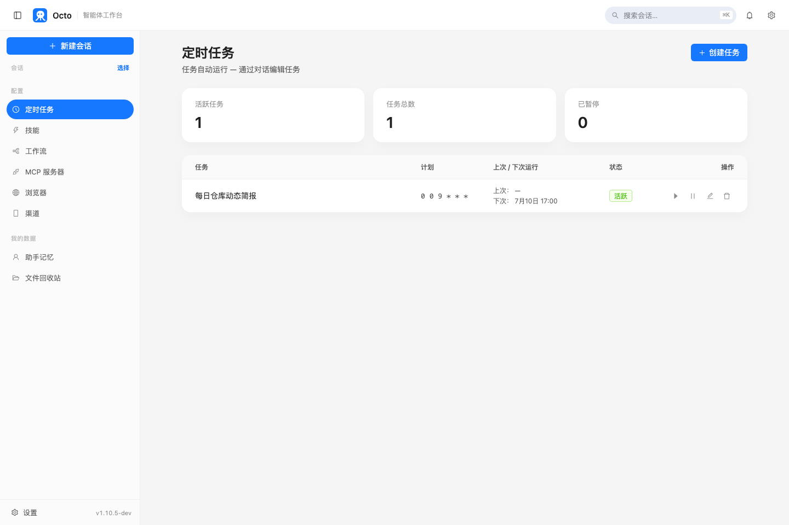
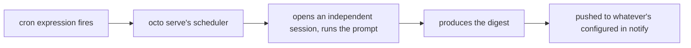

# Octo Onboarding Series (5): Cron in Practice — Scheduled Tasks That Run Whether You're There or Not

> `/loop` from the last post lives inside one conversation and disappears when it ends. This post covers the actually-persistent kind of scheduled task — one that survives a server restart and runs whether or not you're at your computer.

---

## The one precondition: cron tasks only fire while `octo serve` is running

```bash
octo serve
```

Cron is managed by a scheduler built into `octo serve` — if the process isn't running, tasks don't fire, and a schedule missed while it was down isn't replayed on restart. So if you're planning to rely on this for a daily digest, the server needs to be up long-term (on an always-on machine, for instance, or using the auto-start-on-login setup mentioned in the install post).

## Let octo build it instead of hand-writing JSON

`cron-task-creator` is a built-in skill — just describe what you want:

```text
Set up a daily task at 9am that summarizes the issues opened and PRs
merged in open-octo/octo-agent over the past 24 hours, lists the
highlights by priority, and sends it to my Feishu.
```

It walks through getting the cron expression, prompt, and notification target right. Once the task exists, the "Scheduled Tasks" panel in the web UI shows its status and next run time:



The same data is also reachable through the API directly (handy for bulk-creating tasks or scripting):

```bash
curl -s -X POST http://127.0.0.1:8088/api/tasks \
  -H 'Content-Type: application/json' \
  -d '{
    "name": "daily-repo-digest",
    "cron": "0 0 9 * * *",
    "prompt": "Summarize issues opened and PRs merged in open-octo/octo-agent over the past 24 hours, listing highlights by priority.",
    "notify": [{"platform": "feishu", "chat_id": "your Feishu chat id"}]
  }'
```

The panel and the API are the same data — a task created in the panel shows up via the API and vice versa.

---

## Cron expressions: 6 fields, seconds first

Unlike a standard 5-field crontab line, octo's scheduler adds a seconds field:

```
seconds minutes hours day-of-month month day-of-week
```

| Want | Expression |
|---|---|
| Every day at 9:00 | `0 0 9 * * *` |
| Every 30 minutes | `0 */30 * * * *` |
| Weekdays at 18:30 | `0 30 18 * * 1-5` |

Descriptors like `@daily`, `@hourly`, `@every 90m` also work. Times run on the server's local timezone.

## The easiest mistake: it can't see the conversation that created it

Every time a cron task fires, it runs in its **own independent session** — it has no access to whatever conversation you were having when you created it. The prompt has to be self-contained: what to summarize, where to look, who to send it to, all written into the prompt itself rather than assumed from context.

Just as important: give it an **explicit stop condition**. An open-ended prompt (something like "let me know if there's anything I should look at") keeps the model re-verifying and second-guessing until it hits the 30-minute hard timeout, instead of concluding "nothing to report" and finishing early. A scoped description like the one above — a specific time window and a specific output shape — doesn't have that problem.



## Testing it: use the panel's run button, not a chat message

Every task in the panel has a "Run now" button, meant exactly for testing a freshly created task. **Don't trigger its run endpoint from inside a chat with octo** — a run is a full agent turn (up to 30 minutes) and firing it from a conversation just blocks that conversation, while the actual output lands in the task's own session where you can't see it.

---

## Next: wire all five pieces into one real thing

Install, Skills, MCP, Loop, Cron — all five pieces of this series are now on the table. The last post wires them together: a cron-triggered task that pulls data over MCP, generates an actual Excel weekly report with `office-xlsx`, and pushes it to an IM channel — a real automation that runs every week, starting from nothing.

**Previous in the series**: [Octo Onboarding Series (4): Loop in Practice — Get octo to Watch Something for You](/blog/posts/en/onboarding-loop-watch-ci/)
**Next in the series**: [Octo Onboarding Series (6): Putting It All Together — A Real, Running Weekly Report](/blog/posts/en/onboarding-weekly-report-automation/)
