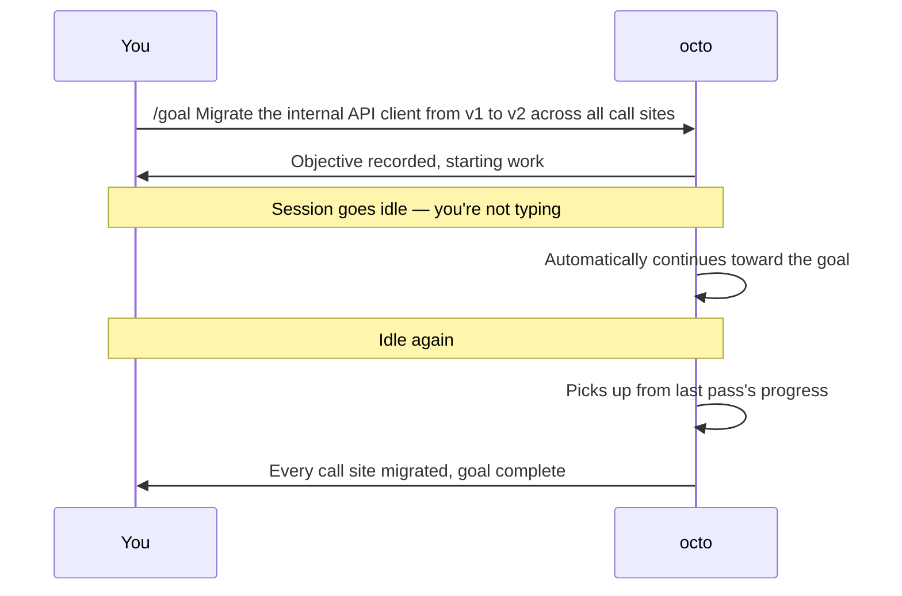

# Octo Onboarding Series (8): Goal in Practice — Set a Standing Objective and Let It Find Idle Time to Push On

> Post 4 covered `/loop` (a repeating task inside one conversation), post 5 covered cron (an independent task on a schedule, across sessions), post 7 covered workflow (splitting a task into parallel pieces). This post covers a fourth shape: a **standing objective** that you don't have to decompose yourself — it keeps advancing on its own every time the session goes idle.

---

## How goal differs from the others

`/loop` fits "keep checking the same thing." Cron fits "fire an independent task on a schedule." Workflow fits "this splits into pieces that can run in parallel." But something like "migrate the internal API client from v1 to v2 across every call site" doesn't fit any of the three — it can't be described in one message, it's not an independently-scheduled task, and it doesn't naturally split into parallel chunks. It needs **several passes across several idle periods**, each one picking up where the last left off.

That's what `goal` solves: set a standing objective, and once the session goes idle — you've stopped typing, no new message has come in — octo keeps making progress toward it on its own, using the **exact same** idle-wakeup machinery behind `/loop`, just applied differently: not "re-run this prompt," but "keep advancing this one objective until it's done."



---

## Setting a goal

```text
/goal Migrate the internal API client from v1 to v2 across all call sites
```

Once it's set, a "Goal" chip appears above the message box in the web UI — hover it to see the full objective text, and the chip itself shows how much time or how many tokens the goal has burned so far (depending on whether a budget was set). It sits in the same row as the "Reasoning" and "Context" chips seen in earlier posts, so you always know at a glance that something is running toward a goal.

You don't need to babysit it — that's the whole point. Go do something else, and check back on progress whenever.

## Adjusting, pausing, or replacing it mid-way — all one command

Scope tends to shift partway through a task:

```text
/goal edit          # adjust the current goal's objective
/goal pause         # stop idle continuation without losing the goal
/goal resume        # pick the continuation loop back up
/goal clear         # drop the current goal
/goal replace       # force-replace a goal that isn't finished yet (a finished one: just /goal <new objective>)
```

Discover halfway through the migration that a whole batch of call sites got missed? `/goal edit` tightens the scope. Going away for a few days and don't want it touching code unsupervised? `/goal pause`, then `/goal resume` when you're back.

## A real gotcha: `/goal edit` doesn't behave the same everywhere

In the **terminal TUI**, `/goal edit` **cannot** be followed by text directly — it only prefills the input box with the current objective for you to revise before the next Enter; `/goal edit some new text` in one shot is rejected outright.

In the **web UI and IM channels**, `/goal edit some new text` works in one step — it edits the objective inline immediately, no prefill-then-confirm dance.

`pause`, `resume`, `clear`, and `replace` behave identically everywhere, since goal state lives on the session itself, not the transport you're viewing it from — `edit` is the one command that's deliberately different, because the TUI's and the web/IM's input boxes just work differently.

---

## Don't want it? Turn it off

Goal currently carries a Beta label but is enabled by default — it stays entirely out of the way until you set an objective. If you don't want the capability at all:

```yaml
# ~/.octo/config.yml
goal:
  enabled: false
```

With it disabled, `/goal` explicitly reports itself as unavailable rather than silently doing nothing.

---

## Next: a whole different class of task

Eight posts in, and install, Skills, MCP, Loop, Cron, the weekly-report capstone, Workflow, and Goal cover the main shapes work can take on the "ask once, get an answer" to "keep pushing on its own" spectrum — but all of it is still text, code, and tool calls under the hood. There's a whole other class of work with no API at all: clicking through an internal admin panel, filling in a form on a site that's only a UI. That's not something a tool call covers — it takes an actual pair of hands driving a browser. The next two posts turn there.

**Previous in the series**: [Octo Onboarding Series (7): Workflow in Practice — Get Several Agents Working in Parallel](/blog/posts/en/onboarding-workflow-parallel-review/)
**Next in the series**: [Octo Onboarding Series (9): Browser in Practice — Hand octo Your Own Browser](/blog/posts/en/onboarding-browser-setup/)
