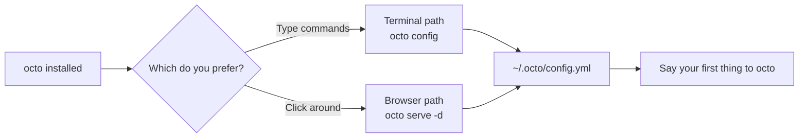
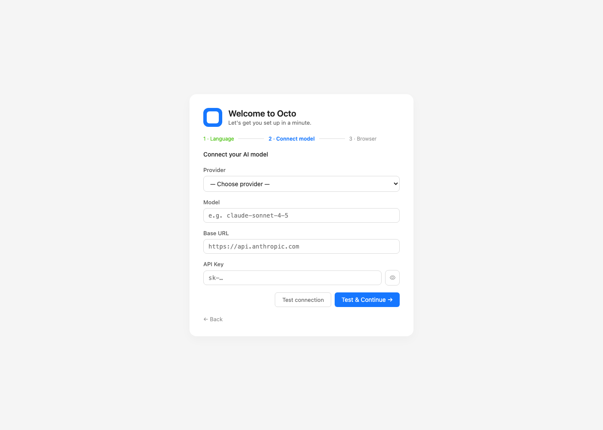
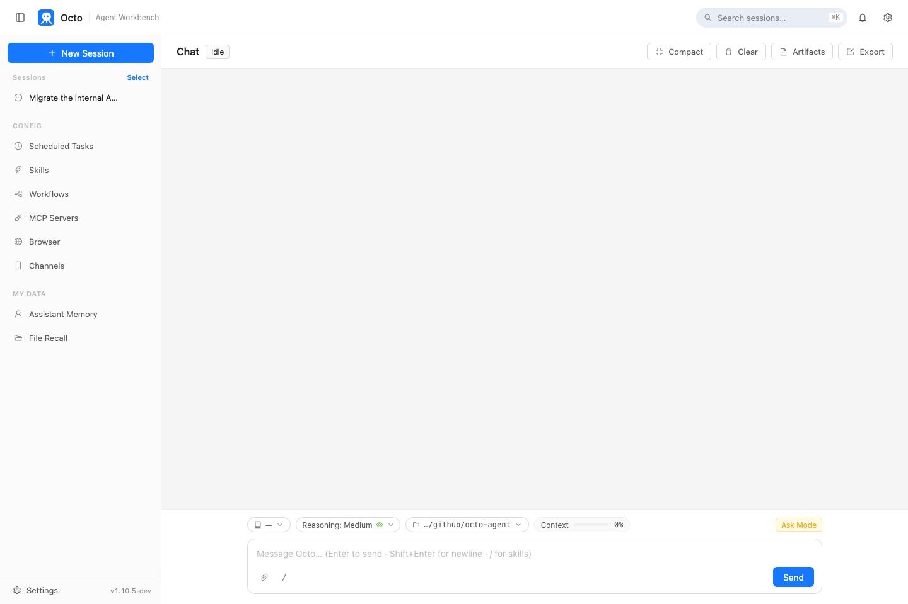

# Octo Onboarding Series (1): Install It, Say Your First Word to It

> This is the first post in the "Octo Onboarding Series." The next few posts each walk through one concrete task using Skills, MCP, Loop, and Cron — but today there's only one job: get octo installed, and get it to do one real thing for you.

---

## Which version to install

There's no fork in the install step — whether you end up living in the terminal or the browser, you install the exact same thing:

```bash
curl -fsSL https://octo-agent.dev/install.sh | sh
```

This detects your architecture, downloads the matching prebuilt release, verifies its SHA-256, and puts `octo` on your `PATH`. If you'd rather not touch a terminal at all, macOS and Windows both have a double-click installer on the [latest release](https://github.com/open-octo/octo-agent/releases/latest) (`octo-setup.pkg` / `octo-setup.exe`) — same underlying binary, same `PATH` setup, just a GUI wrapper around it.

After install, the road splits into two — and that split is what this post is really about. The **terminal path** talks to octo directly on the command line. The **browser path** opens a visual dashboard for configuration and chat. Both write to the same `~/.octo/config.yml`, so which one you pick is purely a matter of taste, and you can switch any time.



---

## The browser path: an onboarding wizard in your browser

Let's start with the browser path — it's the friendliest entry point if you have zero command-line habit. Once installed, run:

```bash
octo serve -d                   # start the local server in the background
open http://127.0.0.1:8088      # macOS; use xdg-open on Linux, or let the Windows installer open it for you
```

The browser opens a setup wizard. Step one is picking a UI language:


Continue, and step two connects an AI model — pick a provider (Anthropic, OpenAI, DeepSeek, Kimi, Bailian, and a handful more in the dropdown), fill in the model name and API key, and click "Test & continue":



`127.0.0.1` is the loopback address, so this page needs no separate access key — it drops you straight into onboarding right after install. Step three is an optional browser-automation connection (skip it if you don't need Chrome remote-debugging), and finishing the three steps lands you on the main dashboard — the exact same place the terminal path eventually ends up:



The sidebar entries — Scheduled Tasks, Skills, Workflows, MCP Servers — are exactly the things the rest of this series unpacks one by one.

---

## The terminal path: three lines to a working conversation

If you're more of a command-line person, skip the browser entirely:

```bash
export ANTHROPIC_API_KEY=sk-ant-...      # swap in your own key; OPENAI_API_KEY etc. also work
octo config                              # save your default provider/model once, no more export needed
```

Once that's saved, there are two basic ways to use it. The first is a **headless one-shot** — one message, a full tool-calling loop, then exit. Good for scripts and CI:

```bash
octo "List everything in the current directory grouped by file type, and tell me which file is the largest"
```

The second is the **interactive TUI** — just run `octo` with no arguments, and you get a terminal UI with session history, tool-call cards, and streaming output:

```bash
octo
octo sessions        # list saved sessions
octo -c               # pick a recent session from a list
```

Both modes are the same agent underneath, with the same built-in tools (file read/write, shell, search…) and the same skill system, all on by default — so even that one throwaway line above was genuinely reading your filesystem and running a command, not just chatting.

---

## The first real conversation asks you a few questions

Whichever path you took, the first time you actually talk to it, octo asks a handful of extra questions — what to call you, your role, any communication preferences. Not small talk: the answers get saved into `~/.octo/soul.md` and `~/.octo/user.md`, and every conversation after that remembers them without you repeating yourself.

If you answer badly the first time, or just want to redo it, say "re-ask me about my preferences" any time.

---

## Next: get it to do something more specific

Installing and having a first chat is just turning the key. The next post gets to actual work: no Python, no openpyxl — using the built-in Skills system, get octo to generate a real Excel report, formulas and charts included, from a single sentence.

**Next in the series**: [Octo Onboarding Series (2): Skills in Practice — Generate an Excel Report in One Sentence](/blog/posts/en/onboarding-skills-excel-report/)
