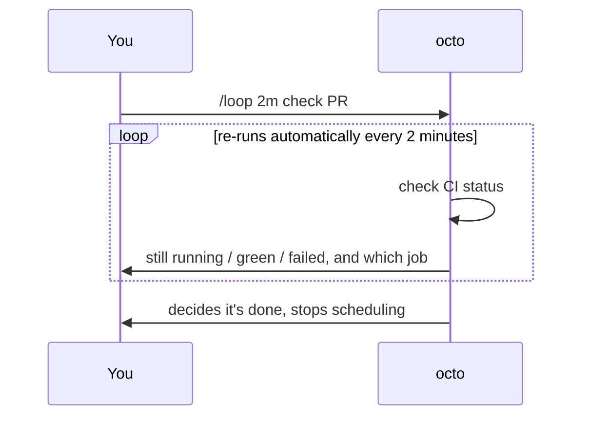

# Octo Onboarding Series (4): Loop in Practice — Get octo to Watch Something for You

> The first three posts covered installing it, getting it to generate a file, and connecting an external tool. This one solves a very specific kind of boredom: waiting for something to finish without checking on it yourself every few minutes.

---

## Manual repetition vs. `/loop`

Without `/loop`, the normal flow is: you ask "how's CI doing," it checks once and tells you, then you remember to ask again in two minutes, and repeat until it's done. The responsibility for "when to check again" sits entirely with you.

`/loop` hands that responsibility to octo. It uses a mechanism called `schedule_wakeup` to schedule its own next turn within the current conversation — when it wakes up, the task re-runs automatically as a fresh message, no re-typing required.



---

## Two modes: fixed cadence vs. self-paced

**Give it an interval** — fixed cadence, runs until you say stop:

```text
/loop 2m Check PR #123's CI status and tell me once it's green;
if it fails, find out which job broke and paste the error.
```

`2m` could just as easily be `30s` or `1h` — delays are clamped between 60 seconds and 1 hour.

**No interval** — the model decides both the pacing and when it's done:

```text
/loop Keep refining this slogan: "Octo, the AI agent that actually
finishes things." Stop once it reads clean with no ambiguity, and
send me the new version each time you revise it.
```

In this "dynamic mode," the model picks its own cadence and also decides on its own when to stop scheduling another wakeup — you don't have to say "stop."

---

## A loop doesn't lock you out of the conversation

While `/loop` is running, you can keep talking in the same session — ask something unrelated, give a side instruction — and a normal message won't interrupt it; it keeps waking up on its own schedule in the background.

## Stopping it

- **Dynamic mode** stops itself: once the model decides the task is done (or stuck), it simply doesn't schedule another wakeup, and tells you why.
- **Fixed-interval mode** re-arms every time, so you have to say "stop" or "no more checking" explicitly.
- **Ctrl+C** in the TUI hard-stops any loop immediately.
- Every loop has a safety cap of roughly **12 hours** of total runtime — a backstop for a forgotten loop, not something to rely on instead of stopping it yourself when you're done.

## When to reach for cron instead

`/loop` lives inside this one conversation — close the session and it's gone. It's cheap and temporary, and only runs while you're still around. If what you actually want is "run every morning at 9am whether or not anyone's watching" or "keep firing even after a server restart," that's a durable, cross-session schedule — which is exactly what **cron tasks** are for, covered next. That's a completely separate persistence mechanism, not something `/loop` is meant to be stretched into.

---

**Previous in the series**: [Octo Onboarding Series (3): MCP in Practice — Connect GitHub and Let octo Triage Your Issues](/blog/posts/en/onboarding-mcp-github-issues/)
**Next in the series**: [Octo Onboarding Series (5): Cron in Practice — Scheduled Tasks That Run Whether You're There or Not](/blog/posts/en/onboarding-cron-daily-digest/)
