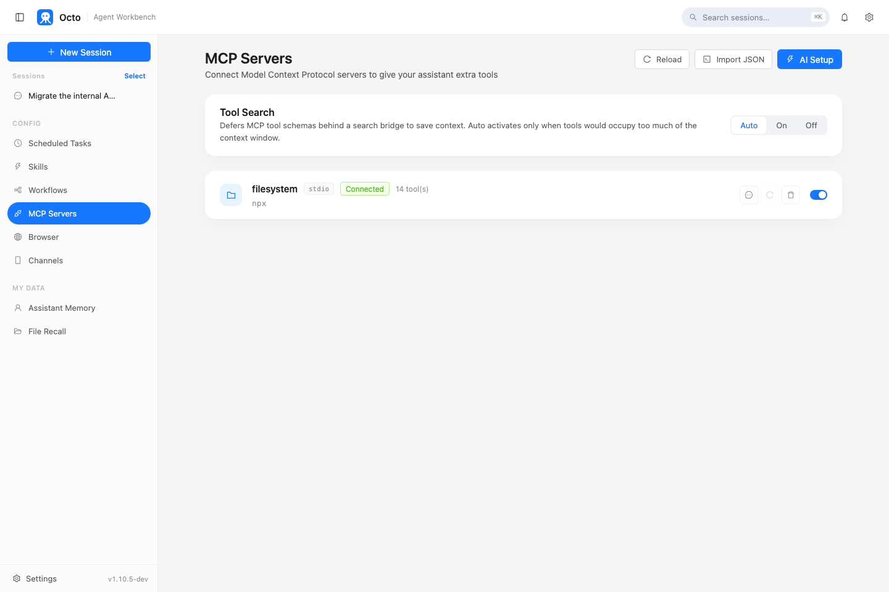
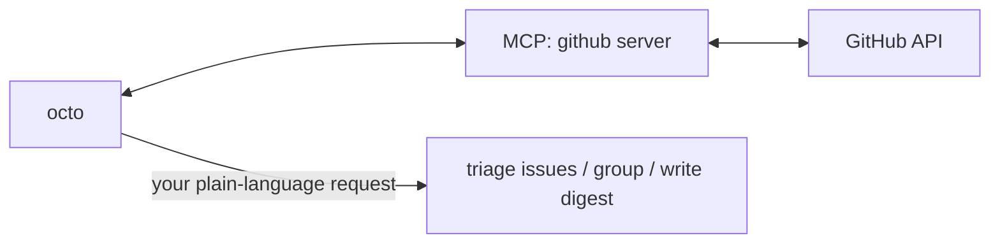

# Octo Onboarding Series (3): MCP in Practice — Connect GitHub and Let octo Triage Your Issues

> The first two posts covered install and Skills. This one covers a different gap: octo's built-in tools are general-purpose (files, shell, search) — it has no idea what's happening in your GitHub repo unless you connect one.

---

## What MCP is, and why you don't write a tool per integration

MCP (Model Context Protocol) is an open protocol that lets octo connect to tool servers other people have already built — GitHub, databases, internal APIs, issue trackers — without octo-agent needing a hand-written built-in tool for every single one. Declare an MCP server in config, and every tool it exposes shows up automatically in octo's tool list, named `mcp__<server>__<tool>`.

Open the "MCP Servers" panel in the web UI, and before you've configured anything it's empty:

```text
No MCP servers configured yet
[Add your first server]
```

Once something is connected, the same panel shows each server's live status and how many tools it brought along:



(The one pictured is a local filesystem server, used here just to show what "connected" looks like — GitHub or a database server looks identical in this panel, just with a different name and tool count.)

---

## Connecting a GitHub MCP server

Servers are declared in `~/.octo/mcp.json` (global, always loaded) or `.octo/mcp.json` in a project directory (project-local, overrides the global one by name). Using the official GitHub MCP server, the config looks like this:

```json
{
  "mcpServers": {
    "github": {
      "command": "npx",
      "args": ["-y", "@modelcontextprotocol/server-github"],
      "env": {
        "GITHUB_PERSONAL_ACCESS_TOKEN": "your GitHub token"
      }
    }
  }
}
```

Generate a token under GitHub's Settings → Developer settings → Personal access tokens, scoped to read the repos you care about. Save the file, and the next time `octo serve` starts (or you open a new session) it connects automatically — tools are on by default, and every configured server connects at session start.

`/mcp` in the TUI shows what's currently connected; the web UI has the panel above.

---

## Once it's connected, just describe the task

You don't need to memorize what the `mcp__github__*` tools are called — just describe what you want in plain language:

```text
Look at open-octo/octo-agent's issues opened this week that haven't
had a reply yet, group them by urgency, and write me a short digest
with a link on each line.
```

octo figures out which tool the GitHub server exposes to use (listing issues, filtering by date, reading comments…) and assembles the result into the digest format you asked for. Whether the server talks REST or GraphQL underneath is the MCP server's business, not yours.



## Connecting a lot of tools doesn't blow up the context window

If you connect several MCP servers, each with dozens of tools, octo doesn't dump every tool's full schema into context up front. **Tool Search** keeps every tool's name and a one-line description listed at all times, so the model always knows a tool exists — but only loads a tool's full parameter schema on demand, through a small `mcp_describe`/`mcp_call` bridge, right when it's about to use that specific one. This turns on automatically once deferred schemas would occupy a meaningful share of the context window — no configuration needed, and the more tools you connect, the more you'll notice the difference.

---

## Next: get it to keep watching something on its own

Reading issues is a one-shot ask-and-answer. If you want octo to keep an eye on something actively in progress in the same conversation — a PR you just pushed, with CI still running — that's what `/loop` is for, next post.

**Previous in the series**: [Octo Onboarding Series (2): Skills in Practice — Generate an Excel Report in One Sentence](/blog/posts/en/onboarding-skills-excel-report/)
**Next in the series**: [Octo Onboarding Series (4): Loop in Practice — Get octo to Watch Something for You](/blog/posts/en/onboarding-loop-watch-ci/)
