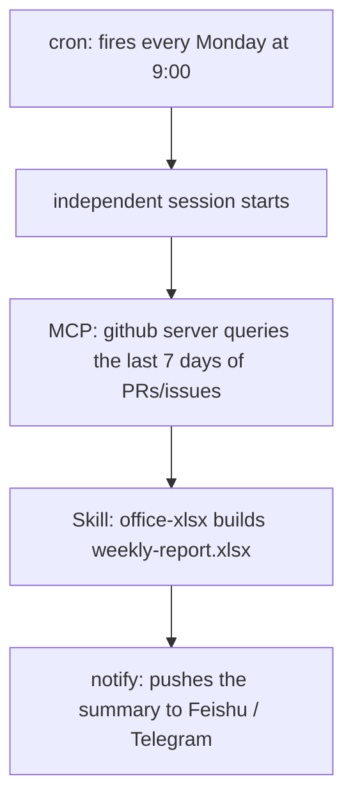
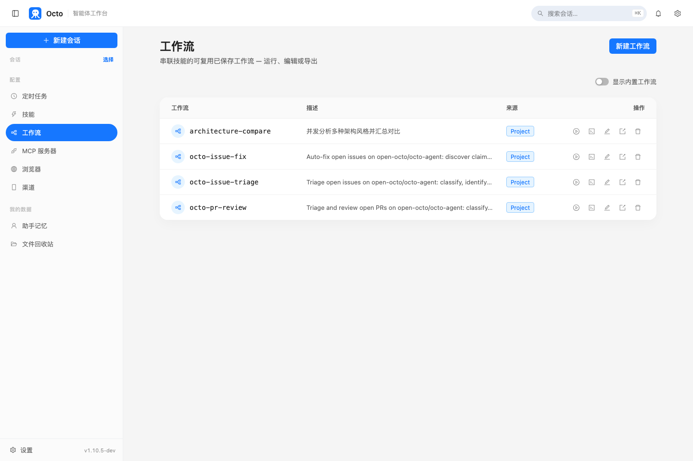

# Octo Onboarding Series (6): Putting It All Together — A Real, Running Weekly Report

> The last five posts covered install, Skills, MCP, Loop, and Cron one at a time. This one introduces nothing new — it just wires the pieces together into a weekly report you'll actually receive next Monday morning.

---

## What needs to come together

A "last week's repo activity" report needs four things cooperating:

- **Cron** — fires automatically every Monday at 9am, no one has to remember;
- **MCP** — connected to GitHub, so it can pull the last 7 days of PRs and issues;
- **A skill (`office-xlsx`)** — turns that data into an Excel file with a summary and a chart;
- **IM delivery** — pushes a summary to Feishu or Telegram once it's done, instead of leaving a file quietly sitting on disk until you remember to check.



## What's already in place

The first two pieces are already set up from earlier posts:

1. The GitHub MCP server from post 3 is still connected (the `github` entry in `~/.octo/mcp.json`);
2. `office-xlsx` is a built-in skill — nothing extra to install;
3. `octo serve` needs to be running long-term (as covered in post 5 — cron only fires while it's up).

## Creating the task

Same as post 5 — describe it to octo and let `cron-task-creator` fill in the fields, just with a fuller prompt this time:

```text
Set up a task that fires every Monday at 9am:

1. Query open-octo/octo-agent for issues opened and PRs opened/merged
   in the past 7 days;
2. Generate weekly-report.xlsx — a "Summary" sheet with counts by type,
   a "Detail" sheet with the full list, and a bar chart broken down
   by type;
3. Save it to ~/reports/;
4. Write a short summary of the numbers and the file path, and send
   it to my Feishu.

Set the working directory to ~/reports so it has somewhere to save
the file.
```

That one prompt actually uses three things at once — MCP (fetching data), a skill (building the Excel file), and notify (delivery) — but you never call any of them separately. Same as every earlier post, octo decides which tool to reach for and in what order. Cron's only job is to hand this prompt over as a fresh task once a week, on schedule.

---

## This is just one combination out of many

The same "scheduled trigger → fetch data → produce an output → deliver it" shape becomes a completely different automation if you swap out any one piece:

- Swap the GitHub MCP server for an email MCP server, and "weekly report" becomes "customer emails I need to follow up on this week";
- Swap `office-xlsx` for "generate a slide deck" or "write a Markdown summary";
- Swap weekly for daily — CI-failure triage, issue prioritization, same skeleton.

## If you need heavier orchestration

Everything in this post is "one prompt, start to finish," which is plenty for most recurring tasks. If a step needs to fan out into parallel sub-tasks with an independent verification pass in the middle — say, splitting "build the weekly report" into a data-fetching sub-agent and a report-writing sub-agent, with a third agent whose only job is to check the numbers — that's the **workflow** tool's territory. This very repository has a few real examples in daily use (issue triage, PR review, auto-fixing issues), visible in the "Workflows" panel in the web UI:



Workflows are a bigger mechanism worth their own deep dive — continue with the [Workflows guide in the docs](/docs/guides/workflows/).

---

## End of the series

Six posts later, from a fresh install to an automation that genuinely runs every week — and the parts that got you there weren't many: one install, one plain-language sentence, one JSON file, one slash command, one cron expression. That's roughly the shape octo is trying to be: keep the hard parts (writing the skill, speaking the protocol, managing the schedule) out of your way, and leave you with nothing to do but describe what you want.

**Previous in the series**: [Octo Onboarding Series (5): Cron in Practice — Scheduled Tasks That Run Whether You're There or Not](/blog/posts/en/onboarding-cron-daily-digest/)
**Back to the start**: [Octo Onboarding Series (1): Install It, Say Your First Word to It](/blog/posts/en/onboarding-install-and-first-run/)
