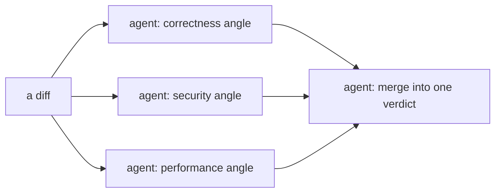
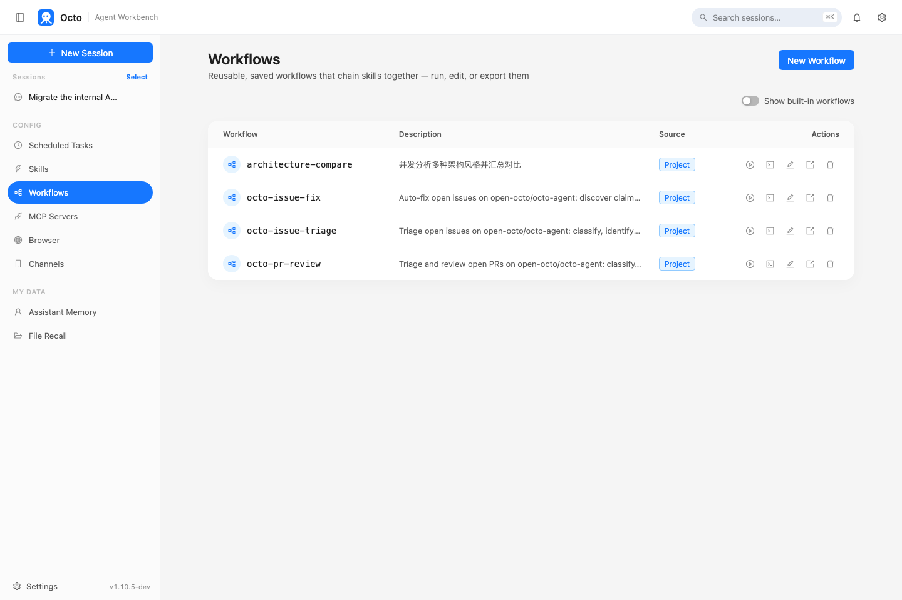

# Octo Onboarding Series (7): Workflow in Practice — Get Several Agents Working in Parallel

> The last post wired cron, MCP, and a skill into an automated weekly report, and closed by noting that when a step naturally splits into independent parallel pieces, that's the `workflow` tool's territory. This post actually writes one.

---

## When you need a workflow, and when you don't

In every earlier post, one sentence to octo was enough — even when the request needed MCP, a skill, and a notification chained together, the model decided the order itself, step by step. That's plenty for most tasks.

But some tasks split naturally into pieces that don't depend on each other at all. The classic case: reviewing a diff from three separate angles — correctness, security, performance — where you want each pass done independently and then merged into one verdict. Done sequentially, the model reviews correctness, then security, then performance, one after another. With a workflow, all three angles run **genuinely at the same time**, then get merged — the same efficiency you'd get from three people reviewing in parallel and comparing notes afterward.



That's the whole reason `workflow` exists: **the orchestration structure is fixed in the script, not re-decided by the model call by call**. This feature currently carries a Beta label — syntax details may shift — but the way you actually use it won't.

---

## Just describe it — octo writes the script

Same as every earlier post, you don't need to learn to write a script before using this:

```text
Review the current diff in parallel from three angles — correctness,
security, and performance — each independently with no cross-reference
to the others, then give me one merged verdict.
```

Once octo recognizes this as a naturally-parallel task, it writes an orchestration script to run it, instead of doing the three passes one after another itself. The script language is **Ruby** — running in an embedded mruby interpreter compiled to WASM, so your machine needs no Ruby install at all. It looks roughly like this:

```ruby
# @description Review the current diff across three dimensions in parallel, then merge
findings = parallel(["correctness", "security", "perf"]) do |dimension|
  agent("Review the current diff for #{dimension} issues only")
end

summary = agent(
  "Merge these three independent review passes into one verdict:\n" + findings.join("\n---\n")
)

summary
```

`parallel` takes a list and spins up an independent agent for each item, none of them aware of the others, and collects the results back in the original order; one final `agent(...)` call folds the three opinions into a verdict. The whole script is two steps: review in parallel, then merge.

## It doesn't block you

In chat contexts (TUI, web, IM), `workflow` runs **asynchronously** — the moment you ask for it, it starts in the background, and you can keep talking about something else; octo notifies you when it's done. Only in the headless one-shot mode (`octo "..."` in a script or CI) does it actually block until the script finishes, since the process exits the moment the turn ends and there'd be nowhere to deliver a background result.

Within a single run, the number of agents running concurrently is capped (currently 8 at a time) — anything beyond that queues for a slot to free up, so handing `parallel` a list of fifty items doesn't try to launch fifty at once.

---

## Want to reuse it? Save it with a name

If this three-angle review is something you'll want again, ask octo to save it:

```text
Save that review script as a reusable workflow called quick-review.
```

It lands in the project's `.octo/workflows/quick-review.rb` (or `~/.octo/workflows/` if you'd rather it apply to every project). Next time, you don't re-describe the logic — just say "run quick-review" — **still triggered in plain language, not via a slash command** — and the web UI's Workflows panel also lists it with a run button you can click directly.

## This repo already has a few

`octo-agent`'s own `.octo/workflows/` directory holds several workflows that actually run in production here — issue triage, PR review, auto-fixing issues, and one small script that compares architecture styles. That last one is short enough to show in full, and its shape is almost identical to the code-review example above:

```ruby
# @description Analyze several architecture styles in parallel and compare them
topics = args["topics"] || ["monorepo", "microservice", "serverless"]

phase("parallel research")
results = parallel(topics) do |topic|
  agent("Explain the core trade-offs of #{topic} architecture in under 80 words")
end

phase("synthesis")
summary = agent("Merge the following analyses into one comparison, ending with a trade-off note:\n" + results.join("\n---\n"))

"Completed analysis of #{results.size} topics\n\n" + summary
```

That `args["topics"]` line means it's parameterized for reuse — no argument falls back to the three defaults, or pass your own list. The Workflows panel in the web UI shows these actual scripts:



---

## Next: a shape that fits tasks you can't fully scope up front

Workflow fits tasks whose structure you can lay out ahead of time. But some things — a migration that spans an entire codebase and can't be described in one message — aren't parallel chunks and aren't triggered on a schedule either. The next post covers what fits that case.

**Previous in the series**: [Octo Onboarding Series (6): Putting It All Together — A Real, Running Weekly Report](/blog/posts/en/onboarding-weekly-report-automation/)
**Next in the series**: [Octo Onboarding Series (8): Goal in Practice — Set a Standing Objective and Let It Find Idle Time to Push On](/blog/posts/en/onboarding-goal-long-running-migration/)
