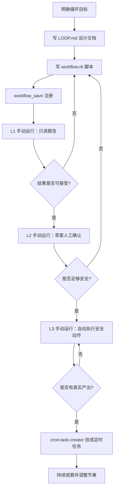
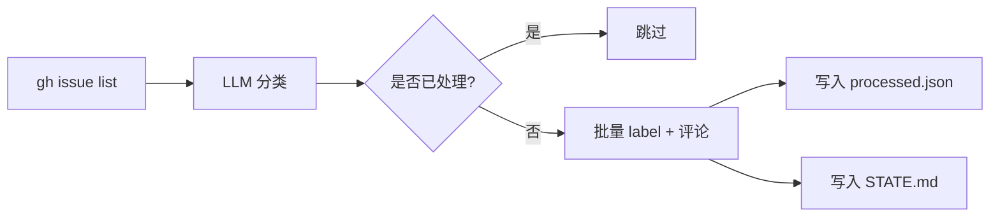
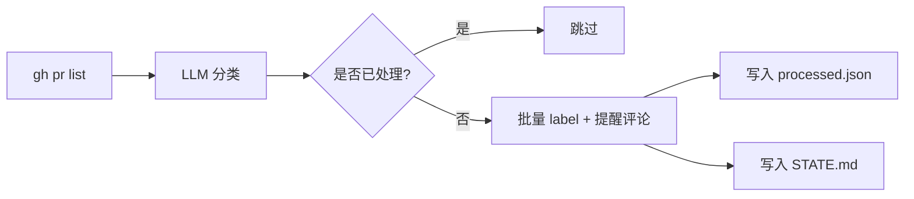
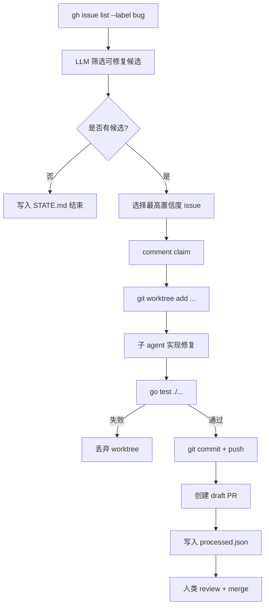
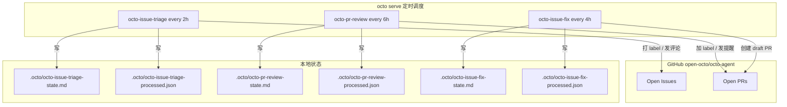

# Loop Engineering 实战：用 octo-agent 自动循环打理开源仓库

> 本文记录 octo-agent 团队在 `open-octo/octo-agent` 仓库上落地三个自动循环——issue triage、PR review、auto issue-fix——的全过程，并展示 octo 为此提供的底层工程能力。

## 背景

Loop Engineering 是 octo-agent 提出的核心工作理念：把重复性、可规则化的运维工作交给 agent loop，让人类专注于决策与例外处理，并通过 L1（只读报告）、L2（草案人工确认）、L3（自动执行安全动作）三个阶段渐进式上线。

近期，octo-agent 团队在自己的主仓库 `open-octo/octo-agent` 上完整实践了这一理念，落地了三个循环：

1. `octo-issue-triage`：自动 triage open issues（打 label、发评论）。
2. `octo-pr-review`：自动 review open PRs（识别 stale / CI-failing / draft）。
3. `octo-issue-fix`：自动认领 bug issue，在隔离 worktree 中修复，跑测试，提交 draft PR。

本文不重复理论，重点展示：

- 循环的构建过程与流程图；
- octo 底层能力如何支撑这些循环；
- 实践中遇到的典型问题与解决方案；
- 对 Loop Engineering 进一步优化的方向。

---

## octo-agent 是什么

octo-agent 是一个**面向工程实践的本地 AI 智能体平台**。它的目标不是做一个更聪明的聊天机器人，而是让 AI 能够稳定、可观测、可回滚地执行重复性工程任务。

与通用 ChatGPT 客户端或单次性的代码生成工具不同，octo-agent 强调：

- **本地优先**：运行在本机，代码和状态都在本地仓库；
- **工作流化**：复杂任务通过 `workflow` 脚本编排，而不是靠一次 prompt 的运气；
- **可重复**：同一个 workflow 可以反复运行，每次行为可控；
- **可观察**：`.octo/` 目录集中保存所有循环状态、日志和运行历史；
- **渐进式**：通过 L1 / L2 / L3 三个阶段，让自动化从「只读」逐步走向「执行」。

它同时提供了 `skill` 系统来沉淀最佳实践、通过 MCP 协议接入外部工具，并通过 `sub_agent` 支持多智能体协作。Loop Engineering 正是建立在这些能力之上的一种工作模式。

---

## 一、为什么是 octo-agent 做 Loop Engineering

自己写一套定时脚本、维护状态文件、调用 GitHub API、调度 LLM、做代码 review，从技术上可行，但很快就会遇到运维泥潭：

- 脚本散落各处，没有统一格式和版本管理；
- 定时任务写在 crontab 或 CI 里，运行状态难以观察；
- LLM 调用失败、GitHub 接口限流、状态文件损坏时，缺乏统一降级机制；
- 一旦涉及自动改代码，安全隔离和人工 gate 完全要自己实现。

octo-agent 把这些问题统一解决了。它不是一个简单的 ChatGPT 客户端，而是一个**面向长期运行的 agent 工作流**的本地平台：

- 用 **workflow** 把循环写成可版本化、可复用的脚本；
- 用 **cron-task-creator** 把 workflow 注册成持久化定时任务；
- 用 **worktree-isolate** 和 **sub_agent** 做代码改动隔离与独立 review；
- 用 **skill** 系统加载经过沉淀的最佳实践；
- 所有循环状态统一放在 `.octo/` 下，与人类工作目录天然分离。

这让 Loop Engineering 从「写一堆脚本」变成「写几个设计文档 + workflow 文件」，然后持续运行、观察与迭代。

---

## 二、octo 底层能力如何支撑循环

### 1. `workflow` 工具：循环脚本化与沙箱安全

`workflow` 是 Loop Engineering 的骨架。它把一个循环写成 Ruby 脚本，保存为 `.octo/workflows/*.rb`，然后可以反复手动运行或挂定时任务。

核心设计亮点：

- 运行在 **IO-free mruby 沙箱**中，脚本本身不能访问文件系统或网络，必须通过 `agent()` 显式委托给子 agent。这带来两个好处：
  - 脚本本身很安全，不会因为写错就删除仓库；
  - 每个 `agent()` 调用都是一个 LLM reasoning step，可以精确控制每次调用的权限范围。
- 支持 **JSON Schema 约束**：对 LLM 返回结果做结构化校验，避免格式错乱影响下游步骤。
- 通过 `workflow_save` 注册后，本地目录就是「循环仓库」，可以随项目一起备份与迁移。

实际用法：

```bash
# 保存 workflow
octo workflow_save octo-issue-triage --file .octo/workflows/octo-issue-triage.rb

# 手动运行 L1
octo workflow name:"octo-issue-triage" args:'{"mode":"L1","limit":30}'
```

### 2. `cron-task-creator`：从 workflow 到循环

手动运行 workflow 是测试，只有挂成定时任务才称得上「loop」。`cron-task-creator` skill 让这件事变成一次对话：

```bash
octo /cron-task-creator
```

最终任务会存在 `~/.octo/tasks/*.json` 里，由 `octo serve` 调度执行。相比 crontab 或 CI 定时任务，这种方式的优势在于：

- 任务不是静态命令，而是**和 octo agent 上下文绑定的 prompt**，可以调用 workflow、读取文件、汇总状态；
- 可以通过 API 随时查看、启用、禁用、修改任务；
- 任务运行失败会被记录，不会把 stderr 邮件发得到处都是。

例如 `octo-pr-review` 的任务 prompt：

```text
Run the saved workflow octo-pr-review in L3 mode for open-octo/octo-agent.
workflow(name: "octo-pr-review", args: {"mode": "L3", "limit": 30})
After the workflow finishes, read .octo/octo-pr-review-state.md in the current directory, summarize how many PRs were triaged, how many labels were applied, how many comments were posted, and whether any labels were skipped. Then stop.
```

### 3. `worktree-isolate`：代码改动的安全隔离

对于 `octo-issue-fix` 这种会改代码的循环，必须保证代码改动发生在隔离环境中。octo 的 `worktree-isolate` skill 提供了完整流程：fetch 最新 main → 创建 git worktree → 修改 → commit → push → 清理。

实际命令：

```bash
cd /Users/roy.lei/Projects/github/octo-agent
git fetch origin main
git worktree add ../octo-agent-fix-1111 origin/main
# 在 worktree 中修改、测试、提交
git push origin bot-fix/1111
git worktree remove octo-agent-fix-1111
```

主 checkout 保持干净，失败时可以直接删除 worktree，不会污染主环境。这让机器自动改代码变得可控。

### 4. `sub_agent`：多智能体协作 review

在完成 PR #1134 的自动修复后，团队使用 `sub_agent` 的 `code-review` 类型对 diff 做了独立评审。子 agent 没有上下文偏见，能指出主 agent 忽略的问题，例如 `strict` 模式被错误映射成 `interactive`。

`sub_agent` 是 octo 的「多智能体协作」能力：一个 agent 做正事，另一个 agent 专门挑刺。这相当于在自动流水线里内置了一个自动化 QA 角色，覆盖 correctness、conventions、performance、security、tests 等维度。

### 5. `skill` 系统：沉淀最佳实践

整个构建过程按 skill 指引完成：

- `loop-engineering` skill 提供 LOOP.md 格式、L1/L2/L3 定义、安全红线；
- `cron-task-creator` skill 提供定时任务注册方式；
- `code-review` skill 提供 review 维度；
- `worktree-isolate` skill 提供代码改动隔离流程。

octo 的 skill 系统把社区和项目沉淀下来的工作模式编码成了可执行指令。用户不需要从零摸索，只要跟着 skill 指引，就能做出符合规范的工作流。

### 6. MCP 扩展性：接入第三方代码理解工具

octo 支持 MCP（Model Context Protocol），可以接入外部工具。在本次修复 #1111 时，代码结构理解主要依赖代码浏览与 grep；如果仓库启用了 CodeGraph 这类通过 MCP 接入的代码索引工具，auto-fix loop 就能够在动手改代码之前，先获得结构化的调用关系与影响面分析，而不是盲目 grep。这体现了 octo 的开放架构：核心能力由 octo 提供，专业工具通过 MCP 扩展。

---

## 三、构建循环的标准流程

三个循环虽然目标不同，但构建过程高度一致：



### 1. 写 LOOP.md

LOOP.md 是循环的「设计文档」，包含：

- Purpose：循环目标；
- Repository：作用仓库；
- Trigger：手动 / 定时；
- Triage categories：分类规则；
- Done condition：完成标准；
- Safety：安全红线；
- State files：状态文件路径；
- Rollout：L1 → L2 → L3 的上线计划。

`loop-engineering` skill 会明确告诉用户 LOOP.md 应该包含哪些部分，把一个模糊的想法变成可执行的规格。

### 2. 写 workflow.rb

workflow 脚本负责编排：

- 发现数据（`gh issue list` / `gh pr list`）；
- LLM 分类或决策；
- 执行安全动作（加 label / 发评论 / 创建 worktree）；
- 写入状态文件。

所有真实 IO 都通过 `agent()` 调用子 agent 完成。这是 octo 的安全模型：脚本本身不能碰文件，只有子 agent 在受控上下文中执行具体操作。

### 3. 注册与测试

```bash
octo workflow_save octo-issue-triage --file .octo/workflows/octo-issue-triage.rb
octo workflow name:"octo-issue-triage" args:'{"mode":"L1","limit":10}'
```

L1 先跑小批量，确认分类质量、输出格式、状态文件都正确，再扩大。这种「先只读、再增量」是 octo Loop Engineering 的核心，避免一上线就把 label 贴错或发错评论。

### 4. 渐进到 L3 并挂 cron

L1 稳定 → L2 观察草案 → L3 执行安全动作 → 真实产出验证通过 → `cron-task-creator` 挂定时任务。

---

## 四、三个循环的详细设计与流程图

### 1. octo-issue-triage：标签 + 提醒

**目标**

把 open issues 自动分类，打上领域标签（`ui-ux`、`memory`、`im` 等）、优先级标签（`high-priority`、`low-priority`），并对需要补充信息的 issue 发提醒评论。

**安全边界**

- 永不关闭 issue；
- 永不合并 PR；
- 只加 label 和发评论。

**执行流程**



**核心代码片段**

```ruby
# 增量处理：排除已处理 issue
processed_numbers = (processed_data["processed"] || []).map(&:to_s)
new_issues = issues.reject { |i| processed_numbers.include?(i["number"].to_s) }

# 批量 label：label 不存在则跳过，不中断
label_prompt = "Apply labels to multiple issues ... Do NOT create new labels. If a label does not exist, skip it."
```

**运行结果**

- 跑了多轮，处理了 20+ issues，贴了新标签，发了补充信息评论；
- 早期遇到不存在的 label 会停下来问用户，后来改成「存在就加，不存在就跳过并记录」。

---

### 2. octo-pr-review：识别 stale / draft / CI-failing PR

**目标**

监控 open PRs，识别 draft、stale、CI-failing、trivial 等类别，帮助维护者省掉大量状态追踪时间。

**安全边界**

- 永不 merge PR；
- 永不关闭 PR；
- L3 只执行两类动作：加 label、发礼貌提醒评论。

**执行流程**



**节奏调整**

最初三个循环都设为每 2 小时。PR 变化比 issue 慢，后来把 PR review 调整到每 6 小时，避免浪费 token。

**运行结果**

- 仓库当前没有 open PR，L1 只验证了 workflow 能跑通；
- 节奏已调整为每 6 小时。

---

### 3. octo-issue-fix：自动认领、修复、提交 draft PR

**目标**

把低风险、复现清晰的 bug issue 自动修好，提交 draft PR 供人工 review。

**安全边界（最严格）**

- 永不自动 merge；
- 永不自动关闭原 issue；
- 只修改与 issue 直接相关的文件；
- 必须跑过 `go test ./...`；
- 每次最多处理一个 issue；
- 只提交 **draft PR**，必须人工 review 后才能转正式。

**执行流程**



**真实案例：修复 #1111**

issue #1111 指出 `SettingsView` 的 Permission Mode 不保存、Desktop/Failure 通知开关是 dead toggles，以及无 session 时 Save 按钮会假装成功。

修复步骤：

1. 创建 worktree：`git worktree add ../octo-agent-fix-1111 origin/main`；
2. 阅读 issue 和 `web/src/views/SettingsView.svelte`；
3. 修复：
   - 把 Permission Mode 通过 `api.updateSessionPermissionMode` 保存到 backend；
   - 补全 UI label ↔ backend value 映射：`Ask`/`Auto`/`Strict` ↔ `interactive`/`auto`/`strict`；
   - 移除未连接后端的 Desktop/Failure 通知开关；
   - 无活跃 session 时禁用 Save 按钮并显示提示。
4. 运行 `go test ./...`，全部通过；
5. 提交并 push 到 `bot-fix/1111`，创建 draft PR #1134；
6. 用 `sub_agent` 做 code review，review 指出 `strict` 映射和全局/session 保存逻辑问题；
7. 修复 review 意见，force-push，转 ready for review。

**运行结果**

- L1 识别出 6 个可修复候选；
- 选择 #1111 进入 L3 流程，产出 PR #1134；
- `go test ./...` 全绿通过。

---

## 五、实践中踩过的坑

### 1. workflow 脚本语法在 mruby 沙箱里不通过

`octo-issue-fix` 和 `octo-pr-review` 的 workflow 文件里写了 `map(&to_s)`，本地 Ruby 能跑，但 octo 的 mruby 沙箱必须用 `map(&:to_s)`，导致 L1 第一次运行时被中断修复。

**经验**：workflow 脚本里的 Ruby 语法要比普通 Ruby 更保守，多测几次 `workflow_save` + `workflow name:` 手动跑 L1。mruby 沙箱是安全边界，也会带来本地不会暴露的语法约束。

### 2. label 不存在会中断 workflow

issue triage 早期版本遇到不存在的 label 会停下来问用户。一个循环被卡住，就失去「自动」的意义。

**经验**：自动循环必须设计「降级」行为——资源不存在就跳过，不要等待用户输入。把缺失信息记到 STATE.md 比停下来更好。

### 3. 增量处理是必要的，否则会被 GitHub 视为 spam

如果没有 processed history，同一个 issue 每次运行都会被重新评论。跑一次、再跑一次，issue 下面就会堆满机器评论。

**经验**：任何会对外部系统产生副作用的循环，都必须维护一个已处理清单。processed file 是循环状态的一部分。

### 4. PR review 周期比 issue 慢，节奏要调

最初三个循环都设为每 2 小时。PR 变化没那么频繁，6 小时足够。跑太勤只是浪费 token。

**经验**：不同循环的数据变化频率不同，节奏要分别调。`cron-task-creator` 让这种调整变得很简单。

### 5. 自动修复的代码可能测试通过但逻辑错误

`go test ./...` 能验证后端不崩，但前端 Svelte 的 UI 行为、类型检查没跑通（因为 `web/node_modules` 里缺少本地 vite，npm install 后构建才能做完整验证）。

**经验**：自动修复 loop 必须有多重 gate——测试只是第一道。前端还需要 build/typecheck，复杂改动需要人工 review。目前接受「draft PR + 人工 gate」作为折中。

---

## 六、关键设计决策

### 1. 为什么用 git worktree 而不是在主 checkout 直接改？

octo 团队规定：任何代码改动必须走 worktree，避免和主 checkout 的同步开发冲突。实践下来，worktree 让 loop 失败时很容易清理——直接 `git worktree remove` 即可，不会污染主环境。

`worktree-isolate` skill 把这个规则变成可执行流程，而不是人为约定。

### 2. 为什么 auto-fix 不是全自动，而是 draft PR + 人工 review？

自动 merge 风险太高。LLM 即使测试通过，也可能写出语义错误的代码，或者改动范围过大。draft PR 是最后一道安全网：机器做执行，人类做最终决策。

这也是 octo 与一般 coding agent 的不同之处：octo 不是追求「完全替代人类」，而是追求「人类在关键决策点介入，机器处理所有重复执行」。

### 3. 为什么三个循环都先跑 L1？

L1 是只读模式，用来验证：

- workflow 语法能跑；
- LLM 分类质量是否可接受；
- 数据范围是否合理；
- 有没有意外副作用。

等 L1 稳定了再上 L2/L3，这是 octo Loop Engineering 的渐进式上线哲学。

### 4. 为什么 auto-fix 每 4 小时只处理一个 issue？

限制数量是为了避免 token 爆炸和 PR spam。一个 bug 修复可能涉及读 issue、读代码、改代码、跑测试、push、建 PR，多步骤很费 token。每 4 小时一个 issue 是可持续的节奏。

---

## 七、整体架构：三个循环如何协同



---

## 八、当前运行配置

```bash
curl -s http://127.0.0.1:8088/api/tasks | jq '.[] | {name, cron, enabled}'
```

| 循环 | 节奏 | 模式 |
|---|---|---|
| octo-issue-triage | 每 2 小时 | L3 |
| octo-pr-review | 每 6 小时 | L3 |
| octo-issue-fix | 每 4 小时 | L3 |

---

## 九、做对了什么，还需要改进什么

### 做对的

- **L1/L2/L3 渐进式上线**：先只读，再草案，再自动执行，没有一步到位造成事故。
- **增量处理**：processed history 避免重复骚扰 issue/PR。
- **降级行为**：label 不存在就跳过，而不是停下来问。
- **worktree 隔离**：自动修复代码时不会污染主 checkout。
- **安全红线**：不自动 merge、不自动关闭、draft PR 人工 gate。
- **sub_agent code review**：独立视角发现主 agent 忽略的问题。

### 还要改进的

- **LLM 分类准确率**：issue triage 偶尔会把标签贴错。需要加置信度阈值，低置信度只记录不执行。
- **反馈闭环**：目前 loop 不会从错误中学习。应该把明显错误的分类结果写回 prompt 或做 few-shot 修正。
- **前端 build gate**：auto-fix 目前没法跑 `web` 的 build/typecheck，需要解决依赖安装问题。
- **PR review 深度**：目前只识别 stale/CI-failing，没有拉 CI 日志做进一步诊断。
- **issue-fix 的半自动 gate**：现在的 L3 直接 push 并创建 draft PR。更安全的做法是「机器人生成 diff → 人工确认 → 机器推送」。

---

## 十、结论

Loop Engineering 不是一句口号，而是需要把每个环节都落到可运行、可回滚、可观察的 workflow 上。本次实践证明了：

1. 机器可以稳定地处理重复性仓库维护工作；
2. 人类只需要在关键决策点介入；
3. 安全边界（worktree、draft PR、增量处理）比自动化本身更重要。

这一切之所以能在短期内跑通，是因为 octo 已经提供了完整的底层能力：

- `workflow` 让循环脚本化、可复用；
- `cron-task-creator` 让脚本变成真正的循环；
- `worktree-isolate` 让代码改动安全隔离；
- `sub_agent` 让多智能体协作做 review；
- `skill` 系统把最佳实践沉淀成可执行指引；
- MCP 扩展能力让专业代码理解工具可以按需接入。

下一步，octo 团队会继续优化 auto-fix 的人工 gate 和前端构建验证，让这套循环既能真正减负，又不制造新麻烦。

---

## 十一、相关链接与文件

- octo-agent 仓库：`open-octo/octo-agent`
- 本次修复 PR：#1134
- 设计文档：
  - `.octo/LOOP.md`
  - `.octo/LOOP-pr-review.md`
  - `.octo/LOOP-issue-fix.md`
- 运行说明：
  - `.octo/LOOP-README.md`
  - `.octo/LOOP-pr-review-README.md`
  - `.octo/LOOP-issue-fix-README.md`
- Workflow 文件：
  - `.octo/workflows/octo-issue-triage.rb`
  - `.octo/workflows/octo-pr-review.rb`
  - `.octo/workflows/octo-issue-fix.rb`
- 定时任务：
  - `~/.octo/tasks/task_1783089292646.json`（octo-issue-triage）
  - `~/.octo/tasks/task_1783136656362.json`（octo-pr-review）
  - `~/.octo/tasks/task_1783142843997.json`（octo-issue-fix）
