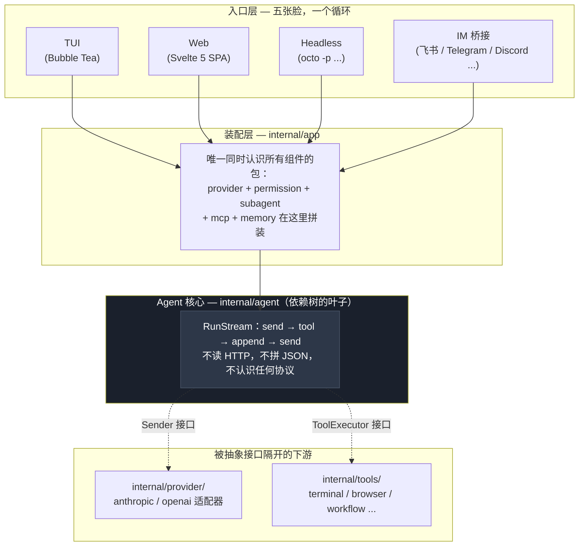
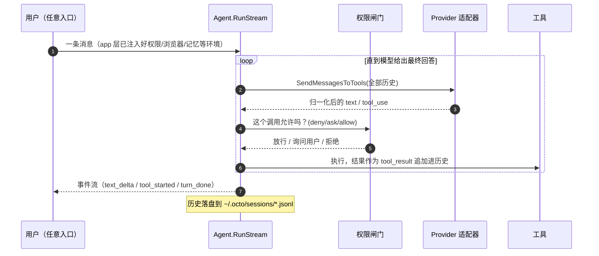
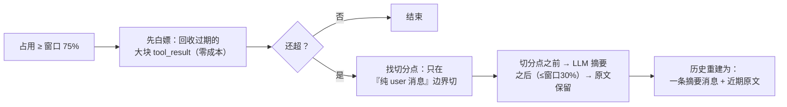
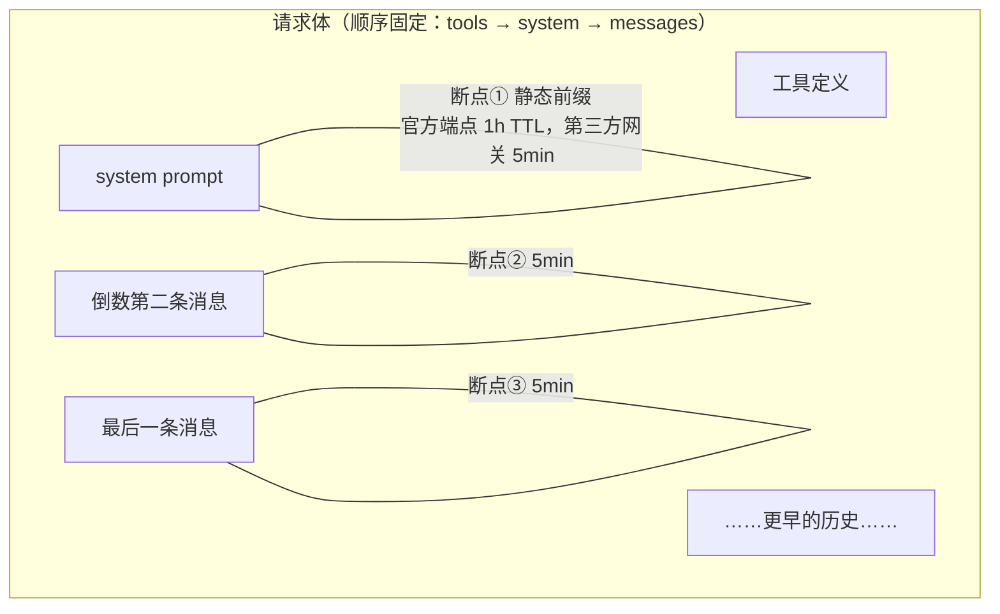
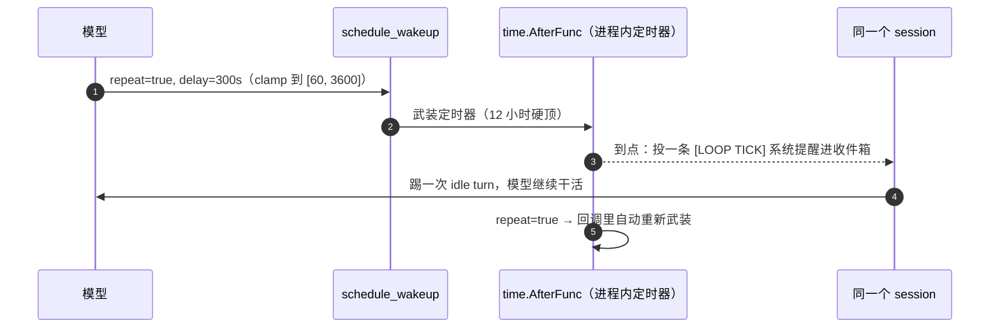
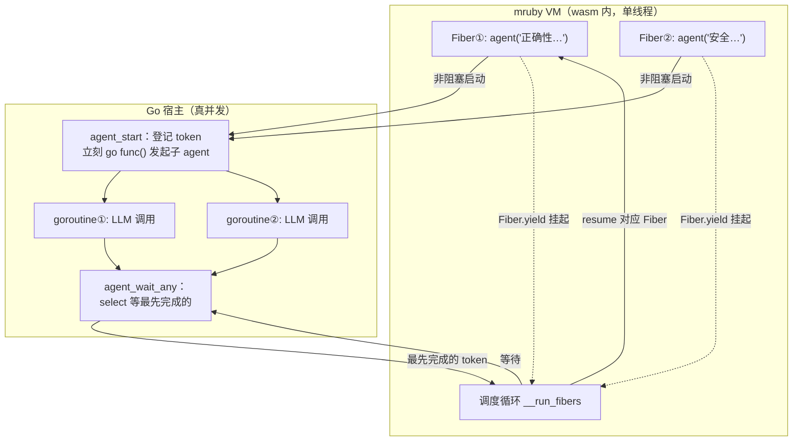
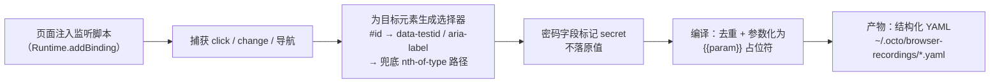
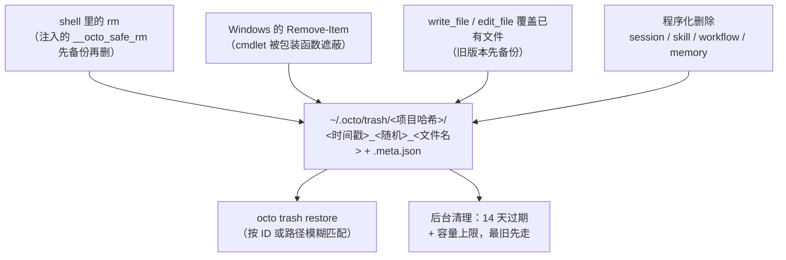

# octo-agent 深度解析：一个 Agent 系统里真正难的部分
## 一切的地基：agent 循环必须保持无知

先看整体。octo-agent 的核心其实就是一个 while 循环：把历史发给模型，模型要么给出回答（循环结束），要么要求调用工具；执行工具，把结果追加进历史，回到开头。



这个循环本身只有几百行，围绕它的一切复杂性都被一条纪律挡在外面：**`internal/agent` 是整棵依赖树的叶子包**，它不 import `provider`、不 import `tools`、不 import 任何 UI。它对外只认识两个接口——`Sender`（把消息发出去，拿回一个抽象回复）和 `ToolExecutor`（按名字执行一个工具，拿回一段文本）。

这条纪律的价值在细节里才看得出来。Anthropic 的 API 说"模型想调工具"时用的字段是 `stop_reason: "tool_use"`，OpenAI 用的是 `finish_reason: "tool_calls"`；OpenAI 流式响应里工具参数是拆成 JSON 碎片跨多个 chunk 传的，得按 index 拼好才能解析；有些第三方 OpenAI 兼容服务连 `[DONE]` 哨兵都不发。这些怪癖每一个都足以在核心循环里埋一个 `if provider == "openai"`——而一旦开了这个头，第三个 provider 接入时循环就没法看了。octo-agent 的做法是把它们全部锁死在 `internal/provider/anthropic` 和 `internal/provider/openai` 两个适配器包里，agent 循环永远只见到归一化之后的统一语义。

于是五种入口（TUI、Web、Headless、IM，外加子 agent）跑的是同一条 `RunStream`，接入一个新的 LLM 后端不用改一行 agent 代码，加一个新工具只需要实现接口再注册一行。一次 turn 的完整生命周期是这样的：



地基讲完了。接下来是重头戏：这个循环运转起来之后，那些真正难的问题。


## 内置工具设计：接口收拢，边缘锋利

每个内置 tool 实现的都是同一个两方法契约（`Definition() ToolDefinition` + `Execute(ctx, name, input) (ToolResult, error)`），由 `tools.DefaultRegistry` 发现和按名派发，穿过 agent 循环执行。共享表面本身就是目的：agent core 永远不按 tool 物种分支，meta-skill 自由重组它们，browser / workflow / MCP 都走同一根窄管道。结构是简单的，设计张力全在边缘。

### 跨协议边界的流式 fragment

一条更隐蔽的设计守则住在 provider adapter 里，不在 tool 里：**OpenAI 协议的 tool-call 参数会按 `tool_calls[i].index` 分散在多个 chunk 里流式下发**——把同一个 index 的所有 fragment 拼接后再解析。Anthropic 风格端点不会。代码库强制执行的准则是：agent 循环（`internal/agent/agent.go`）绝不按收到的是哪种断面来分支，归一化发生在 provider adapter。同一个"fragment 进、完整 tool call 出"契约，是 browser / workflow / MCP 层在 Anthropic 和 OpenAI 协议间可移植的唯一办法，不会让每一层都长出 `if provider == …` 分叉。

### 一个注册表，多种物种

`tools.DefaultRegistry`（`internal/tools/registry.go`）是一个单一派发器，按名把任意 tool call 路由到 `allTools` slice 的某一格 —— `Terminal`、`ReadFile`、`WriteFile`、`EditFile`、`Glob`、`Grep`、`WebFetch`、`WebSearch`、`Skill`、`Agent*`、`Workflow*`、`ScheduleWakeup`、`Browser`、`MemoryRecall` 等等。（这里没有把 `TerminalOutput`/`TerminalInput` 列进去，因为它们是 background 配套的子工具，不直接由用户发起。）"浏览器: internal/browser""workflow: Ruby/mruby""MCP: 一个 JSON-RPC 桥"——但 agent 循环只看到 `ToolExecutor`。`mcp_describe` / `mcp_call` 后来加入时也没动 agent core；它们和每个其它 tool 一样通过注册表那一条缝进来。

正是这个选择让上一节的 meta-skill 成为可能：一段引导你"配好 IM 通道"的流程不是一个定制 tool，是 `channel-manager` 把 `read_file` / `write_file` / `terminal` 按用户当下的情况串起来。tool 组合是那个可复用原语；新能力通常意味着新 skill，不是新 tool。

### 读取先行 + mTime 守卫

`internal/tools/ReadTracker` 管的是一个听起来像挑剔、却能拦住一类真问题的规矩：LLM 只能在*已经读取过的*文件上写入 / 编辑，且只在磁盘 mtime 仍与读取时一致时才放行。第 3 轮读的文件在第 7 轮被外部编辑器改过 -> 拒绝，并告知 agent 重读——这个错误语料照搬 Claude Code 的措辞，已经被那样训练过的 LLM 在重试时会做出正确反应。

最后那句"只在 mtime 一致时"引出了引导问题：会话*自己的*输出（通过 terminal 跑的 formatter、重定向）mtime 也会变，难道下次编辑就该被挡？答案是 `RefreshTarget`：terminal 工具写过的路径补盖一个新 mtime 戳，这之后编辑不再误发告警。`RefreshTarget` 只重新戳记 tracker 已经登记过的*精确*路径，绝不扩散到兄弟文件，也绝不把一个没读过的文件提拔成可写。从未读过的文件依旧不可写；真被外部编辑器改过的文件（永远不流经 terminal tool，永远不作为这次命令的精确写目标）保持其陈旧戳记，照发告警。守卫接住真正的错误，逃生口窄到没法滥用出沙箱。

### 抽掉 SSRF 的地板

`web_fetch` 不能直接 `http.Get(userURL)`——那是教科书级的 SSRF。它的回应（`internal/tools/web_fetch.go`）把请求拆成*两条加固路径*，共享同一个 `secureFetchTransport`：

- **Jina 代理路径**——把渲染交给 `r.jina.ai`，但拒绝*跨主机*重定向（离开 `r.jina.ai` 的重定向意味着被弹到意外的地方），在解析后 IP 是链路本地地址/云元数据时直接断连接。调用方传入自定义 header 时强制走直接请求（Jina 的出站 header 不可控，无法执行覆盖）。
- **直接请求路径**——处理任意 URL 所必须，因此*必须*跟随跨主机重定向（URL 短链、`www` 规范化跳转都正常）。共享链路本地封禁，并把重定向链上限设为 10 跳，避免环让 agent 挂起。

`net.Dialer.Control` 钩子在 DNS 解析*之后*拿到真实 IP 时触发，所以 DNS 重绑定（一个主机名此刻解析成公网 IP，下一刻就解析成 `169.254.x.x` / `127.0.0.1`）也被拦下。身体也有边界：`WebFetchInlineBytes`（64 KB）是内联阈值；`WebFetchMaxBytes`（5 MB）是硬上限；超出就截断落盘到临时文件。大页面 = 摘要 + 头尾预览 + 指一条 `read_file` 路径给剩余部分，绝不一墙文字糊进模型的 context。

### 五个搜索面，一份契约

`web_search` 在线上看起来简单（返回 title/url/snippet），背后是五条后端的瀑布回退（`internal/tools/web_search.go`）：**Brave → Tavily → Serper → DuckDuckGo HTML → Bing HTML**。前三个在对应 env key（`BRAVE_SEARCH_API_KEY` / `TAVILY_API_KEY` / `SERPER_API_KEY`）出现时启用；后两个不需要 key，是默认路径。每个失败都吞进响应的 `Error` 字段、继续试下一条——tool 从不 panic，真正产出结果的层级会回到 `Provider` 字段里，让模型知道它看的是查索引（Brave）还是抓 HTML（DDG/Bing）。

有两个细节真值钱：其一是 **DuckDuckGo 冷却**（`markDDGUnavailable`，10 分钟），挡住一串 token goroutine 在 DDG 刚返回空的时候继续锤——用 `sync.RWMutex` 守着，因为 Web 服务器让并发搜索成了日常。其二是 **Bing HTML 端点上的地雷**：如果你发 `Accept-Encoding: gzip`，Bing 会回一个 ~39 KB 的 JavaScript 骨架页，而不是 ~120 KB 的真正结果页。修复是这一条古怪规则"永远不要让 Go 对 `cn.bing.com` 自动协商编码"——`browserGet` 故意省略那个 header。

### terminal：时效、反轮询、反引号求生

`terminal` 工具在系统 shell 里跑你交给它的所有东西，所以它的 schema 描述是全库最长——多数规则每条都值一次调试教训：

- **三种启动模式**——同步（默认；阻塞到命令返回）、`run_in_background: "async"`（拆出去的一次性任务，比如 build / `npm install`）、`"interactive"`（会持续 feed 它的长跑服务 / REPL，通过 `terminal_input`）。`detached: true` 模式专为超出会话生存期的东西（`ngrok` / `cloudflared`）保留。
- **默认 120 秒超时**，硬顶在 `MaxTerminalTimeout`（600 秒）；超出必须走 background，不能霸占一个 turn。
- **反轮询窗口**：`BackgroundManager` 盯住并发读取——一个运行中的进程在 30 秒内 3 次空读会被挡住，LLM 被告知等推送通知而不是在 `terminal_output` 里转圈。
- **每个 background 进程 1 MiB 环型缓冲区**——更老的丢弃会如实上报；只保留最近的尾巴。
- **反引号问题**：shell 会篡改引号里的反引号（POSIX 把它变命令替换；PowerShell 把反引号当转义）。修复是专用 `stdin` 参数，把文字原样灌进子进程 stdin 后关闭——命令体带引号、反引号、`$` 时一律走它。

这些加在一起，把"shell 什么都干得出来"从一把火枪变成了一个模型能推理的有界表面，不会为轮询死去输出而烧 token。

### sub_agent：能 fork，不能递归

`sub_agent` 工具表面看就是派活 + 等结果，设计张力藏在它*不许*做的事里。最醒目的规则在 `AgentTool.Execute`（`internal/tools/agent.go`）：如果调用方已经是 sub-agent，直接失败——"a sub-agent cannot spawn another sub-agent"。绝对禁止递归。配合 `tools` allowlist 里故意不列入 `sub_agent` 自身，这是一道硬的天花板，不是 workflow 那种图灵完备的任意派生——设计意图就是"只有一层委派"，不搞 agent 树。

**fork vs. fresh**（`subagent_type`）：省略 `subagent_type` 时，用*父的完整对话*（system prompt + 截至目前的消息）作为子 agent 的种子——真正的 fork，共享上下文、走同样的 conclusion-shaped 回复契约。设定 subagent_type（`explore`、`plan`、`general`、`code-review`）则从零上下文起一个带专用 persona 的子 agent，走 read-only / lean-context 默认值、带自己的 `model` frontmatter。同一把 tool 覆盖两种；preset 填充调用方没覆盖的字段。

**同步 vs. 异步**：`run_in_background: true` 调 `SubAgentManager.Start`，立刻返回 `agent_N` ID 并在完成后推通知；`false`（默认）调 `RunSync`，阻塞这个 turn 等结果。信号量（`syncSem`）Concurrent 同步 sub-agent 的上限，避免一波 fan-out 把父 agent 饿死。按 transport 自适应：同步通道（server / IM）没有 follow-up-turn 路径，`mgr.Synchronous()` 静默强制走阻塞路径并告知模型——而不是悄悄失败。

子 agent 撞到 turn 上限时，结果会带上显式的 `[INCOMPLETE: … partial]` 标记返回，而不是把半成品当成品交差。父 agent 要么用更细的任务重启，要么把它当未完成处理。每种 `StopReason`（`end_turn`、`tool_use`、`max_turns`、`error`、`killed`）都会上送到 WS broadcast，前端状态面板无需轮询就能更新。


## 上下文压缩：不能删消息，只能折叠时间

第一个撞上的问题是物理限制：上下文窗口就那么大，而 agent 对话膨胀得飞快——一次编译报错的 tool_result 就可能有几千 token，一个下午的会话轻松堆到十几万。

直觉方案是"窗口快满了就删掉最早的消息"。这在 agent 场景下会直接把 API 请求搞挂：历史里的 `tool_use` 和 `tool_result` 是严格配对的，删消息一旦切断某一对，Anthropic 和 OpenAI 都会返回 400。而且"最早的消息"里往往有整个任务的原始需求，删了它，agent 后半程就不知道自己在干什么了。

octo-agent 的方案是**摘要折叠**：把早期历史压成一段摘要，近期历史原文保留。关键在三个细节。



**第一，切分点永远安全。** `safeSplitIndexByBudget`（`internal/agent/compaction.go`）只会在"不含任何 tool_result 的纯 user 消息"处下刀，从结构上保证 tool_use/tool_result 配对永远不会被劈开。这也让压缩可以发生在 turn 进行中——一个长 turn 每跑完一批工具调用就检查一次占用，超了立刻折叠更早的完整轮次，正在进行的调用毫发无伤。对于动辄几十次工具调用的 agent 长任务，"turn 中途能压缩"不是锦上添花，是必需品。

**第二，占用的算法反直觉。** 上下文占用不是 `input_tokens` 报多少算多少——命中 prompt 缓存时 Anthropic 的 `input_tokens` 只是未命中的差量，真实占用得把 `cache_read + cache_write` 加回来（`agent.go` 的 `accrueUsage`）。不这么算的话，缓存命中率越高，压缩越不触发，最后一次缓存 miss 直接把窗口打爆。

**第三，压缩有阻尼。** 触发阈值默认 75%（可配 `compact_auto_pct`），保留预算是窗口的 30%，另有一条反抖动规则：这次折叠能省下的比例不足 15% 就干脆不折——否则临界状态下每一轮都要付一次昂贵的摘要调用。

一个值得知道的坑：**落盘的 `session.jsonl` 存的是压缩后的历史**。compaction 走的是整体重建历史，会触发 session 文件全量重写，原文只有在配置了 `ArchiveDir` 时才会归档成 `chunk-*.md`（摘要末尾会附上文件路径，模型需要时可以自己用 read 工具翻回去），否则永久丢失。另外历史变短会导致 Web 前端持有的 `message_index`（编辑/分支功能依赖它）集体失效，服务端用水位线检测到长度回缩后会强制前端重拉整个 transcript——这类"压缩的涟漪效应"是这套机制里返工最多的部分。


## Prompt 缓存：agent 的账单是二次方的

第二个问题是钱。Agent 循环的每一轮都要重发全部历史，也就是说一个 N 轮的会话，第 1 条消息要被计费 N 次——不做缓存，成本随对话长度平方增长。

Prompt 缓存的原理一句话就能说完：如果这次请求和上次请求有相同的前缀，命中部分按一折左右计费。麻烦在于两点：不同协议对"命中了多少"的报法完全不同；以及 Anthropic 协议需要你**主动声明**缓存到哪里。

先看第一点。这是自建网关接入时最容易翻车的地方：

| 协议 | 缓存命中字段 | `input`/`prompt` tokens 的语义 |
|---|---|---|
| Anthropic | `cache_read_input_tokens` | **只是未命中的差量**，命中部分单独计 |
| OpenAI | `prompt_tokens_details.cached_tokens` | **全部输入**，命中部分是其子集 |
| DeepSeek | `prompt_cache_hit/miss_tokens` | 显式拆开两个桶 |

同一个语义，三种报法。octo-agent 在 openai 适配器里做一次减法（`nonCachedInput()`，`internal/provider/openai/types.go`），把 OpenAI 系的报数也转成"互不重叠的两个桶"，从此 agent 层的 `InputTokens` 和 `CacheReadTokens` 在所有协议下含义一致——上一节压缩机制依赖的占用计算，正是建立在这个统一之上。协议归一化不是洁癖，是让上层逻辑能写对的前提。

第二点更有意思：断点打在哪。octo-agent 在每个 Anthropic 请求里固定打三个 `cache_control` 断点：



静态前缀（工具定义 + system prompt）只需要一个断点——因为请求体顺序是 tools 在 system 之前，打在 system 上的断点会连带把工具定义一起缓存住。历史消息则在**最后两条**上各打一个。为什么是两个？因为下一轮请求会追加新消息，上一轮的"最后一条"就变成了"倒数第 N 条"；如果只打一个断点，遇到重试丢弃末条消息的情况，公共前缀上就没有任何断点可命中了。双断点保证滑动窗口无论怎么移动，总有一个断点落在两次请求的公共前缀内。三个断点，Anthropic 的限额是四个，留了余量。


## /loop：一个不存在的命令

用户经常提这样的需求："每五分钟看一眼 CI 过没过。" octo-agent 的答案是 `/loop 5m 看一眼CI`——但如果你去代码里 grep `/loop` 的实现，会发现服务端命令路由对它的处理是 `return false`：不拦截，当成普通消息发给模型。

**`/loop` 不是命令，是一个工具描述"教"出来的行为。** 真正存在的是一个叫 `schedule_wakeup` 的工具，它的 description 里写明了约定：用户消息以 `/loop + 时长` 开头，就解析时长、带 `repeat=true` 调用我；只有 `/loop` 没有时长，就进入动态模式，每次醒来自己决定下一次隔多久。剩下的交给模型的理解能力。



这个设计好在把三层职责切干净了：**解析归模型**（"5m"还是"每半小时"都不用写 parser），**触发归 Go**（`time.AfterFunc`，唤醒时把 prompt 包成一条系统提醒投进 session 收件箱，复用后台任务通知的现成通路），**节奏归约定**（动态模式下模型不续期，循环自然结束——终止条件是模型的一个"不作为"，而非一段状态机代码）。

代价是 loop 完全活在进程内存里：定时器就是 `Server` 结构体里的一个 map，进程重启即消失，也没有状态文件。这是刻意的分工——需要跨重启存活的定期任务归另一个子系统 `internal/scheduler`（真 cron，JSON 持久化在 `~/.octo/tasks/`）；`/loop` 只服务"接下来几个小时盯着点"这种会话级需求，所以它有 12 小时硬顶，到点就不再续。至于"长跑会不会把历史撑爆"——每个 tick 就是一次普通 turn，上文的压缩机制照常生效，loop 不需要也没有任何特殊处理。


## Workflow：让编排图灵完备，但别让它碰系统

子 agent 并发是另一类需求："对这个 diff 同时跑正确性、安全、性能三个视角的审查，最后汇总。"让主模型挨个调用子 agent 太慢也太贵，让用户写 Go 又太重。octo-agent 给的答案是一个 Ruby DSL：

```ruby
findings = parallel(["正确性", "安全", "性能"].map { |view|
  -> { agent("从#{view}视角审查这个 diff") }
})
agent("汇总以下发现：#{findings.join("\n")}")
```

这个脚本跑在哪？答案有点绕：**mruby 解释器，编译成 wasm32-wasi，跑在 wazero（纯 Go 的 wasm runtime）里**。绕出来的每一层都有理由。要图灵完备的编排（循环、条件、重试）就需要真语言；要嵌入解释器又不想引入 cgo——cgo 会毁掉 Go 交叉编译"一条命令出全平台二进制"的能力，对一个以单文件分发为卖点的项目是致命的；而 wasm 沙箱顺手解决了第三个问题：用户脚本天然碰不到文件系统和网络，能力只有宿主显式导出的那几个函数。连正则都是这个约束的产物——mruby 官方 C 正则引擎编译不了 wasi target，于是 Regexp 被桥接到 Go 侧的 RE2 实现，意外的红利是 RE2 保证线性时间，脚本作者写不出 ReDoS。

最精巧的是并发模型。wasm 里的 mruby 是单线程的，`parallel` 怎么真正并行？答案是**两种协程在函数边界上握手**：mruby 侧用 Fiber（协作式），Go 侧用 goroutine（真并发）。



`agent()` 调用宿主的 `agent_start` 是非阻塞的：Go 侧立刻起 goroutine 去跑真正的 LLM 调用并返回一个 token，mruby 侧则 `Fiber.yield` 把自己挂起。调度循环先把所有分支都推进到各自第一次 `agent()` 调用——即先把所有 goroutine 都发射出去——然后循环调 `agent_wait_any`（Go 侧一个 `select` 挡在完成 channel 上），谁先完成就 resume 谁的 Fiber。并发上限硬编码为 8，超出的调用在信号量上排队，防止一个 `parallel` 遍历大列表时扇出无界数量的并发 LLM 调用。

配套还有一套 journal 机制：每个 `agent()` 调用的结果都追加记录到 `~/.octo/workflow-journals/`，重跑时校验"脚本+参数"哈希一致后，已完成的调用直接回放缓存结果。对于"跑到第 8 步挂了"的长工作流，改一行重跑不用重付前 7 步的 LLM 账单。


## 浏览器：不启动，只连接

浏览器自动化领域的标准做法是启动一个 headless Chrome。octo-agent 反其道而行：**它永远不启动浏览器，只连接（attach）用户已经开着的那个 Chrome**。代码里留了 launch 能力，但生产路径一次都没调用过，注释写得很直白：自己启动的 headless 实例没有任何登录态，在 macOS 上还会触发"Chrome Safe Storage"的钥匙串弹窗——对一个日常工具来说，这个弹窗一出现，用户的信任就没了。找不到可连的 Chrome 时，工具返回的是一份开启远程调试端口的操作指引，而不是悄悄退回 headless。

底层是基于 `gorilla/websocket` 自研的 CDP（Chrome DevTools Protocol）客户端，没有引 chromedp——需要的 domain（Target/Page/DOM/Runtime/Input/Network 等）就那么几个，自己写反而薄。

真正值得展开的是**录制回放**。录下来的既不是录屏也不是坐标序列——坐标换个窗口尺寸就废——而是**语义化的事件流**：



每一步录制都被编译成 `action / selector / value / verify` 这样的结构化字段，可重复输入的部分（搜索词、日期）被抽成参数——一次录制，多次带参重放。

但选择器会腐烂：前端一改版，`.btn-submit` 变成 `.button-primary`，脚本就断了。回放引擎的应对分两层。第一层不花钱：最常见的失败原因其实是 cookie 弹窗挡住了目标元素，先自动关掉遮罩重试。第二层才是**自愈**：把这一步的意图描述、失效的旧选择器、当前页面全部可交互元素的摘要一起交给 LLM，让它只回答一个新选择器，换上重试，最多三轮。修复成功且整个技能跑通后，新选择器**写回磁盘上的 YAML**——自愈的成果是持久的，同一个改版不会让你每次重放都付一次 LLM 修复费。

一个被砍掉的特性也值得记一笔：早期版本尝试过"用户说到某个关键词就自动触发录制好的技能"，实践中误触发太多，已经移除。现在录制好的技能只有两种触发方式：Web UI 里显式点重放，或模型在对话中显式调用 `replay`。设计文档里保留了这次失败的记录——知道什么被试过并放弃，有时比知道什么存在更有价值。


## 权限系统：承认自己只是字符串匹配

一个能执行任意 shell 命令的 agent，安全模型必须想清楚。octo-agent 的权限系统有三个值得讲的设计，和一条值得尊敬的诚实。

**第一，优先级与声明顺序无关。** 判定不是"从上往下第一条命中的规则说了算"——那会让规则文件的行序变成安全语义的一部分，改个顺序就可能打开一个洞。实际实现是分桶：遍历所有规则，命中的按 deny/ask/allow 分别入桶，然后按固定优先级取结果——deny 桶非空即拒绝，无视 allow 写在它前面还是后面。硬编码的兜底规则（`^rm -rf /usr`、`^dd if=` 这类灾难命令）也走同一套机制，用户在配置里写 allow 也压不过。

**第二，`^` 锚定解决的是真实事故。** 匹配的基础是子串匹配，但纯子串会误伤：`deny: "format"` 本意是拦磁盘格式化，结果 `docker ps --format json` 也被拦了；`deny: "shutdown"` 会拦下 `git commit -m "fix shutdown handling"`——敏感词出现在 commit message 里而已。`^` 前缀把匹配锚定到**命令位置**：行首、`&&`/`;`/`|` 之后、`sudo`/环境变量前缀之后。`^format` 只匹配作为命令执行的 format，不碰参数和字符串内容。这个特性不是设计出来的，是被上面两个真实误伤逼出来的。

**第三，配置热加载 + 优雅降级。** 权限引擎每个 turn 重建一次，改完 `permissions.yml` 下一条命令就生效，不用重启。改到一半 YAML 语法错误怎么办？回退到上一次成功解析的规则（`lastGoodRules`）并打警告——既不能因为配置文件短暂坏掉就让 session 崩溃，更不能在这个窗口期"暂时不设防"。

然后是那条诚实。**默认情况下，octo-agent 没有任何 OS 级隔离**：不开 `--sandbox` 时，shell 工具就是裸的 `exec.Command("sh", "-c", ...)`，唯一防线是上面的字符串规则。真正的 OS 级隔离是可选纵深：macOS 用 Seatbelt，Linux 用 Landlock + seccomp（直接禁掉 inet socket），其他平台不支持——且请求了 `--sandbox` 但平台不支持时会拒绝启动（fail closed），而不是静默退化。`internal/sandbox` 的包注释把两层的关系定性得很清楚：sandbox 是"permission 引擎之下的纵深防御，而 permission 引擎只 gate 命令字符串"。字符串匹配当然绕得过——把边界说清楚，比宣传一个不存在的安全模型有价值得多。

配套的审计日志记录每一次 deny 和每一次用户裁决（一行一条 JSON，10MiB 轮转）。里面有个细节：每个字段截断到 1KiB。不是省磁盘——是防止一次被拒绝的 `write_file` 把整份文件内容、或一条含密钥的命令，原样抄进审计日志。审计日志本身不该成为新的泄露面。


## 回收站：为"模型会删错文件"这个前提设计

最后一个机制最朴素，也最能体现这个项目的世界观。前提很简单：模型**会**删错文件。不是可能，是迟早。那么正确的问题就不是"怎么防止删错"，而是"删错之后怎么办"。

octo-agent 的答案是把所有破坏性操作从"不可逆"改成"可逆"——而且覆盖面比你以为的宽：



`rm` 的拦截方式是往 shell 环境里注入一个同名函数，真删之前先 `cp -al`（硬链接，几乎零成本）把目标搬进回收站；Windows 上则遮蔽 `Remove-Item` cmdlet 走同样的流程。连模型改文件这种操作也在保护范围内——`write_file` 覆盖已有文件前旧版本先进回收站。

覆盖备份里有一个判断特别见功力：**如果目标文件被 git 跟踪且工作区是干净的，跳过备份**。因为这份内容 git 里已经有了，回收站再存一份是纯浪费。一个 `git ls-files` 加两次 `git diff --quiet`，把回收站噪音降了一大截——好的安全网不光要接得住，还要足够安静，不然很快会被用户整个关掉。

恢复走 `octo trash restore`，支持 ID 或路径模糊匹配；目标路径已被占用时可选三种策略：报错中止（默认）、把占用者也挪进回收站再恢复、或恢复为带时间戳的新名字。每个项目的回收站按项目路径哈希隔离，纯本地，14 天过期加容量上限的后台清理，不会无限膨胀。


## 自带电池：可发现性、元技能与更友好的默认

前面七个是"硬伤"——设计错的地方会持续漏 token 或者丢文件。但做一个 agent 真正的难题不是这些硬伤，是头五分钟。如果用户第一次搜索之前还得自己去装 ripgrep，第一次提问之前还得先去翻 MCP 仓库，他很可能就此离开。octo 用三层"开箱即用"来回应——恰好也是同一套原则（能推迟的就推迟、露出该露的、优雅降级）在入门路径上的应用。

### MCP 工具搜索：懒惰注册

标准 MCP 接法有个隐形成本：每个 tool 的完整 JSON schema 在每一轮都推进 system prompt。接三个 MCP 服务器、中间有四十个工具,用户在还没问任何问题之前就已经烧了一千个 token 来"知道有什么可用"。octo 的回应放在 `internal/tools/tool_search.go`——把重的部分推迟。

两个桥接工具 `mcp_describe` 和 `mcp_call` 替代了完整上传。每个 MCP 工具的**名字 + 一句话描述**走 `skills.RenderManifest` 那条路露在 system prompt 里（和 `# Available skills` 同一机制），于是模型在零往返里就能回答"有没有做 X 的工具"。`mcp_describe` 按需拉一个 schema（模型真想用那个工具时才拉），`mcp_call` 执行它——直接进入既有的 `executeMCP` 路径，所有 `mcp__` 前缀的派发、权限、hook 机制都照常在真实工具名上跑。

模式选择器（`auto` / `on` / `off`）和前面各处是同一个直觉：`auto` 模式只在推迟的 schema 预计占 **context window ≥ 10%** 时才启用桥接机制。在那之下，更简单的全量上传占优；超过它，搜索机制才上场，避免 prompt 被本季不会用的 schema 淹没。

### 两个不用你装的二进制

**ripgrep。**`internal/tools/rgembed` 在 octo 二进制里打包了一份平台匹配的 ripgrep：构建时 Makefile 下载对应平台的 BurntSushi/ripgrep release，`go:embed` 在 `embedrg` 构建标签下把它烤进去。运行时如果 `rg` 已经在 `PATH` 里就用系统的；否则释放嵌入那份到 `~/.octo/bin/rg-<version>`。`grep` 工具由此得到一个又快又稳的搜索后端，用户不需要做任何事。

**uv。**`office-xlsx` 依赖 Python 的 openpyxl，openpyxl 需要一个 Python 运行时。octo 选择不让用户操心这件事——macOS / Windows 安装包直接捆绑 uv。取舍很直接：macOS 包大约多出 100MB，换来用户在第一次做表格任务时永远看不到"请装 Python"。选捆绑 *uv* 而不是 *bun*——uv 是单一静态二进制，解析依赖就够了；bun 是完整的 JavaScript 运行时,给一个多数人用不到的 power-user skill 拖着太重。

### Windows 知道何时该提示升级

Windows 安装器（`packaging/windows/octo.iss`）末尾有段俏皮的工程：它跑一次 `EnsurePowerShell7` 检查。如果 `pwsh` 不在 PATH 但 `winget` 在,就问用户一次（双语）要不要装 PowerShell 7。原因：octo 跑 hook 脚本和 terminal tool 时，有 `pwsh` (7+) 就用它，没有就退回永远在那里的 Windows PowerShell 5.1。7 那条路径是更好的默认（更快、可预测的 `~/.bashrc` 式 profile、真正的 `&&` 语义）。所有跳过 / 失败路径都是静默 noop：随便哪条出错，octo 就照常用 5.1。用户被提示，从未被阻塞。

### 五个元技能：octo 学会扩展自己

skill 通常是一段模型能调用的流程——但有几个预装 skill 专门*处理 octo 自己的配置*。它们引导用户走过本需要手写 YAML 的流程,并依赖 agent 记忆让上下文跨 session 延续。

| Skill | 职责 |
|---|---|
| `skill-creator` | 从零起稿新 skill、改写既有 skill、把一段 workflow 固化成 skill。 |
| `mcp-creator` | 搜索合适的 MCP 服务器包、拼出 `~/.octo/mcp.json` 条目、验证连通——全程引导,不用手敲 JSON。 |
| `channel-manager` | 领用户走完每家 IM 管理后台的步骤、收凭据、写 `~/.octo/channels.yml`、排查连接问题。 |
| `cron-task-creator` | 创建 / 查看 / 启用 / 删除存在 `~/.octo/tasks/` 里的定时 agent 提示。 |
| `workflow-creator` | 把重复的多步任务捕获成可保存、可续跑的 Ruby (mruby) workflow。 |

有一点值得专门指出：`channel-manager`、`mcp-creator`、`cron-task-creator`、`workflow-creator` 都同时依赖文件工具（`write_file`、`edit_file`、`terminal`）和 octo 专属知识。这是刻意选择——一个元 skill 不需要为它写的每段 YAML 都造一个专用工具。"工具可组合"这个原则既用在用户的 workflow 里，也用在 octo 自己的入门引导上。


## 尾声：一以贯之的世界观

九个机制分开看各管一摊，合起来是同一个判断：**在 agent 系统里，凡是能用机制保证的，就不要指望模型的自觉。**

压缩靠 token 阈值和安全切分点，而不是祈祷摘要别丢东西；缓存断点是显式插的，不是等运气命中；loop 有 12 小时硬顶兜住模型忘记停止；workflow 的并发上限是常量，不指望脚本作者自律；权限系统的 deny 优先和命令锚定，每一条都对应一个真出过的事故；回收站则干脆假设删错必然发生，把功夫花在"删错之后"。

模型负责聪明，机制负责兜底。这大概就是读完这份代码库之后，最值得带走的一句话。

---

### 附：想读代码，从这里进

| 机制 | 入口文件 |
|---|---|
| Agent 循环 | `internal/agent/agent.go` |
| 内置 tool 契约 | `internal/tools/registry.go` (allTools)、`internal/agent/tool.go` |
| 上下文压缩 | `internal/agent/compaction.go` |
| Prompt 缓存断点 | `internal/provider/anthropic/client.go`（`markMessagesCacheable`） |
| 协议 token 归一化 | `internal/provider/openai/types.go`（`nonCachedInput`） |
| /loop | `internal/tools/schedule_wakeup.go`、`internal/server/loop.go` |
| Workflow 运行时 | `internal/workflow/runtime.go`、`internal/workflow/prelude.rb` |
| 浏览器录制/自愈 | `internal/browser/recorder.go`、`internal/app/browser_heal.go` |
| 权限判定 | `internal/permission/permission.go`（`classify` / `Check`） |
| OS 级沙箱 | `internal/sandbox/` |
| 回收站 | `internal/trash/trash.go` |
| MCP 工具搜索 | `internal/tools/tool_search.go` |
| 元技能 | `internal/skills/defaults/{skill-creator,mcp-creator,channel-manager,cron-task-creator,workflow-creator}/SKILL.md` |
| 读取先行守卫 | `internal/tools/read_tracker.go` |
| web_fetch SSRF 防线 | `internal/tools/web_fetch.go`（`secureFetchTransport` / `directFetchHTTPClient`） |
| web_search 多层后端 | `internal/tools/web_search.go` |
| terminal 后台管理器 | `internal/tools/background.go` |
| Sub-agent 生命周期 | `internal/tools/agent.go`、`internal/tools/subagent_manager.go` |
