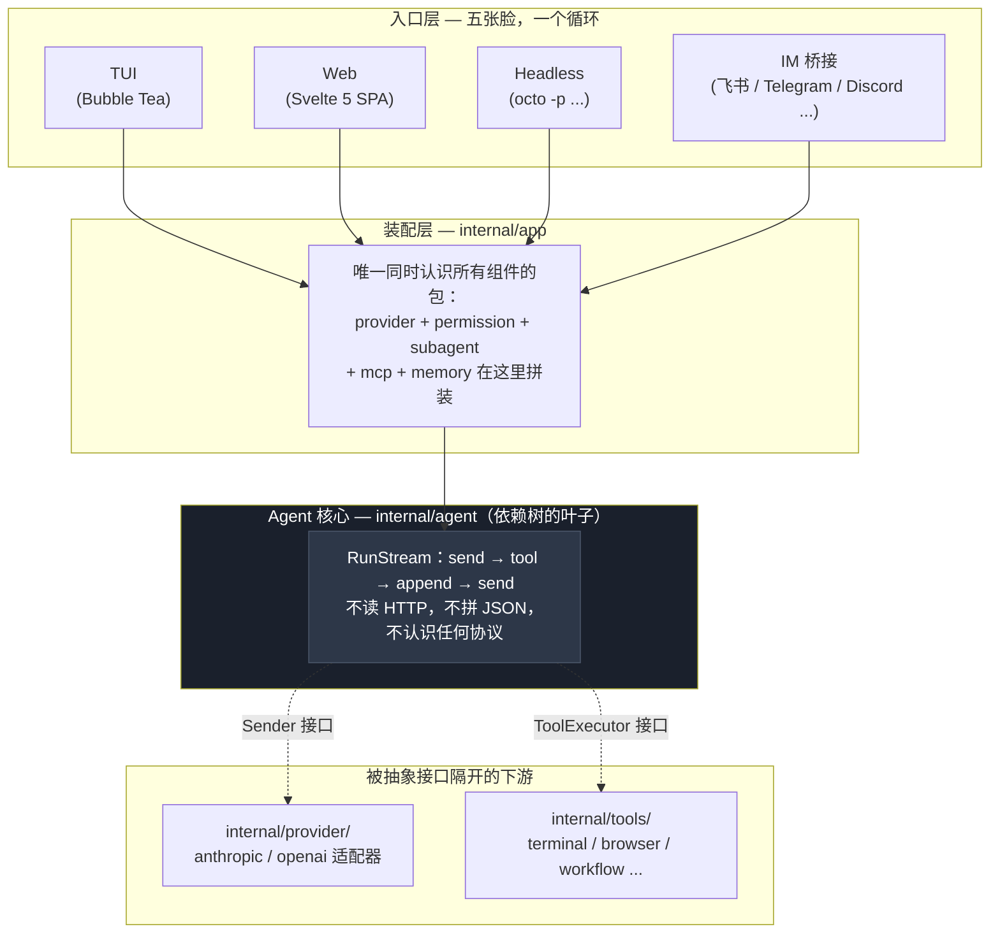
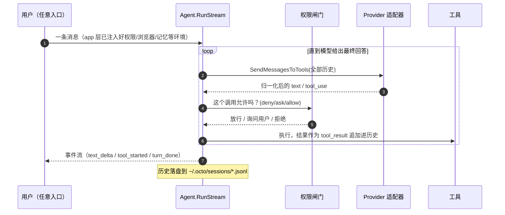
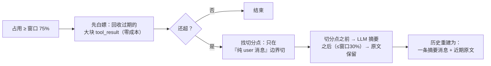
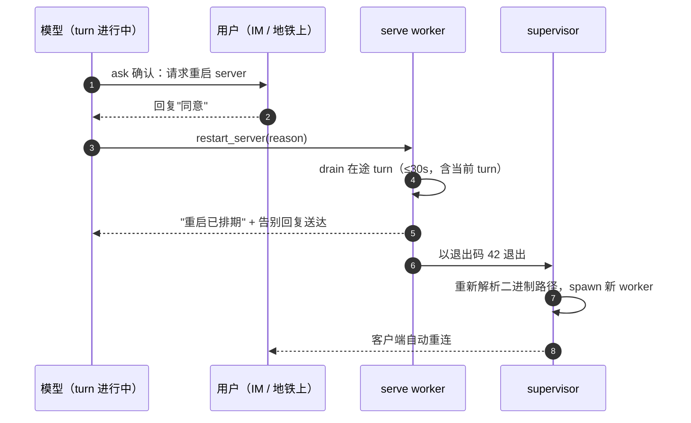
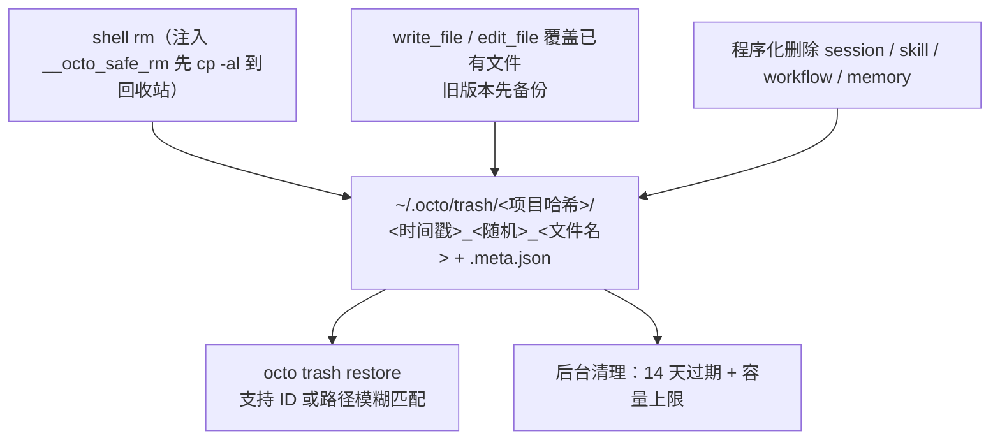

# octo-agent 深度解析：一个 AI Agent 系统里真正难的事情

## 开篇：一句"帮我查一下"背后发生了什么

当你在终端输入 `octo "查一下生产环境的错误率"`，到它返回答案之间，发生了什么？

消息穿过 TUI、Headless、IM 桥接或 Web 界面中的任意一个入口，被装进一个事件结构，路由到 Agent 循环。循环把全部历史发给 LLM，LLM 要么回答要么要求调工具。如果是调工具，执行结果追加到历史，循环继续。

这个循环本身只有几百行代码。但围绕它运转起来的十个机制，每一个都对应一个真实的设计难题——不解决它们，Agent 就跑不稳、跑不快、跑不省。

本文逐一过这十个机制：各自解决什么问题、怎么解决的、为什么那么做。读完你会发现它们指向同一句话：**在 Agent 系统里，凡是能用机制保证的，就不要指望模型的自觉。**

## 地基：Agent 循环为什么可以只有几百行

**Agent 循环只有几百行，不是因为它功能少，而是因为它只认识两个接口（`Sender` + `ToolExecutor`），是整棵依赖树的叶子包。** 它不拼 JSON、不懂 HTTP、不知道 Anthropic 和 OpenAI 的协议差异——这些全部隔离在 adapter 层。

先把全景画出来。octo-agent 的核心就是一个 while 循环：



核心纪律一条：**`internal/agent` 是整棵依赖树的叶子包**，它不 import `provider`、不 import `tools`、不 import 任何 UI。它对外只认识两个接口——`Sender`（把消息发出去，拿回一个抽象回复）和 `ToolExecutor`（按名字执行一个工具，拿回一段文本）。

这条纪律的价值在细节里才看得出来。Anthropic 的 API 说"模型想调工具"时用的字段是 `stop_reason: "tool_use"`，OpenAI 用的是 `finish_reason: "tool_calls"`；OpenAI 流式响应里工具参数是拆成 JSON 碎片跨多个 chunk 传的，得按 index 拼好才能解析；有些第三方 OpenAI 兼容服务连 `[DONE]` 哨兵都不发。这些怪癖每一个都足以在核心循环里埋一个 `if provider == "openai"`——而一旦开了这个头，第三个 provider 接入时循环就没法看了。octo-agent 的做法是把它们全部锁死在 `internal/provider/anthropic` 和 `internal/provider/openai` 两个适配器包里，agent 循环永远只见到归一化之后的统一语义。

于是五种入口（TUI、Web、Headless、IM，外加子 agent）跑的是同一条 `RunStream`，接入一个新的 LLM 后端不用改一行 agent 代码，加一个新工具只需要实现接口再注册一行。一次 turn 的完整生命周期是这样的：



地基讲完了。接下来是重头戏：这个循环运转起来之后，那些真正难的问题。

## 内置工具：接口收拢，边缘锋利

Terminal、browser、workflow、MCP——这些工具的调用方式、参数格式、生命周期完全不同。如果让 Agent 循环感知这些差异，每加一种工具就要改核心循环代码。这不是架构，是堆砌。

**octo 的解法：锁死一根管道。** 每个内置 tool 实现同一个两方法契约（`Definition() ToolDefinition` + `Execute(ctx, name, input) (ToolResult, error)`），由 `tools.DefaultRegistry` 发现和按名派发，穿过 agent 循环执行。共享表面本身就是目的：agent core 永远不按 tool 物种分支，meta-skill 自由重组它们，browser / workflow / MCP 都走同一根窄管道。结构是简单的，设计张力全在边缘。

### 跨协议边界的流式 fragment

OpenAI 协议的 tool-call 参数会按 `tool_calls[i].index` 分散在多个 chunk 里流式下发——把同一个 index 的所有 fragment 拼接后再解析。Anthropic 风格端点不会。代码库强制执行的准则是：agent 循环（`internal/agent/agent.go`）绝不按收到的是哪种断面来分支，归一化发生在 provider adapter。同一个"fragment 进、完整 tool call 出"契约，是 browser / workflow / MCP 层在 Anthropic 和 OpenAI 协议间可移植的唯一办法，不会让每一层都长出 `if provider == …` 分叉。

### 一个注册表，多种物种

`tools.DefaultRegistry`（`internal/tools/registry.go`）是一个单一派发器，按名把任意 tool call 路由到 `allTools` slice 的某一格——`Terminal`、`ReadFile`、`WriteFile`、`EditFile`、`Glob`、`Grep`、`WebFetch`、`WebSearch`、`Skill`、`Agent*`、`Workflow*`、`ScheduleWakeup`、`Browser`、`MemoryRecall` 等等。（这里没有把 `TerminalOutput`/`TerminalInput` 列进去，因为它们是 background 配套的子工具，不直接由用户发起。）浏览器背后是 `internal/browser` 的 CDP 长连接，workflow 背后是 Ruby/mruby 沙箱，MCP 背后是一个 JSON-RPC 桥——但 agent 循环只看到 `ToolExecutor`。正是这个选择让 meta-skill 成为可能：一段引导你"配好 IM 通道"的流程不是一个定制 tool，是 `channel-manager` 把 `read_file` / `write_file` / `terminal` 按用户当下的情况串起来。tool 组合是那个可复用原语；新能力通常意味着新 skill，不是新 tool。

### MCP 工具延迟加载

MCP 工具的 JSON schema 可能非常庞大——配置几十个 MCP 服务器的 session，全套 schema 足以撑爆上下文。解法是**延迟加载**：只暴露名字+一句话描述，模型真想用的时候才用 `mcp_describe` 拉完整 schema。`auto` 模式只在延迟加载比全量上传节省 ≥10% 上下文时才启用。

### 读取先行 + mTime 守卫

`internal/tools/ReadTracker` 管的是条听起来挑剔但拦得住真问题的规矩：LLM 只能在**已经读取过的**文件上写入 / 编辑，且只在磁盘 mtime（修改时间戳）仍与读取时一致才放行。第 3 轮读的文件在第 7 轮被外部编辑器改过 -> 拒绝，并告知 agent 重读——这个错误语料照搬 Claude Code 的措辞，已经被那样训练过的 LLM 在重试时会做出正确反应。

靠外部文件的 mtime 做守卫是很苛刻的——但如果是 agent 自己执行的命令改了这个文件怎么办？一轮编译输出、代码格式重写、等等都会改 mtime。答案是 `RefreshTarget`：terminal 工具写过的路径补盖一个新 mtime 戳，这之后编辑不再误发告警。`RefreshTarget` 只重新戳记 tracker 已经登记过的**精确**路径，绝不扩散到兄弟文件，也绝不把一个没读过的文件提拔成可写。从未读过的文件依旧不可写；真被外部编辑器改过的文件（永远不流经 terminal tool，永远不作为这次命令的精确写目标）保持其陈旧戳记，照发告警。守卫接住真正的错误，逃生口窄到没法滥用出沙箱。

### 抽掉 SSRF 的地板

`web_fetch` 不能直接 `http.Get(userURL)`——那是教科书级的 SSRF（Server-Side Request Forgery，服务端请求伪造）。它的回应（`internal/tools/web_fetch.go`）把请求拆成**两条加固路径**，共享同一个 `secureFetchTransport`：

- **Jina 代理路径**——把渲染交给 `r.jina.ai`（Jina AI 的网页内容解析服务），但拒绝**跨主机**重定向（离开 `r.jina.ai` 的重定向意味着被弹到意外的地方），在解析后 IP 是链路本地地址/云元数据时直接断连接。调用方传入自定义 header 时强制走直接请求（Jina 的出站 header 不可控，无法执行覆盖）。
- **直接请求路径**——处理任意 URL 所必须，因此**必须**跟随跨主机重定向（URL 短链、`www` 规范化跳转都正常）。共享链路本地封禁，并把重定向链上限设为 10 跳，避免环让 agent 挂起。

`net.Dialer.Control` 钩子在 DNS 解析**之后**拿到真实 IP 时触发，所以 DNS 重绑定（一个主机名此刻解析成公网 IP，下一刻就解析成 `169.254.x.x` / `127.0.0.1`）也被拦下。身体也有边界：`WebFetchInlineBytes`（64 KB）是内联阈值；`WebFetchMaxBytes`（5 MB）是硬上限；超出就截断落盘到临时文件。大页面 = 摘要 + 头尾预览 + 指一条 `read_file` 路径给剩余部分，绝不一墙文字糊进模型的 context。

### 五个搜索面，一份契约

`web_search` 在线上看起来简单（返回 title/url/snippet），背后是五条后端的瀑布回退（`internal/tools/web_search.go`）：**Brave → Tavily → Serper → DuckDuckGo HTML → Bing HTML**。前三个在对应 env key（`BRAVE_SEARCH_API_KEY` / `TAVILY_API_KEY` / `SERPER_API_KEY`）出现时启用；后两个不需要 key，是默认路径。每个失败都吞进响应的 `Error` 字段、继续试下一条——tool 从不 panic，真正产出结果的层级会回到 `Provider` 字段里，让模型知道它看的是查索引（Brave）还是抓 HTML（DDG/Bing）。

有两个细节真值钱：其一是 **DuckDuckGo 冷却**（`markDDGUnavailable`，10 分钟），挡住一串 goroutine 在 DDG 刚返回空的时候继续锤它——用 `sync.RWMutex` 守着，因为 Web 服务器让并发搜索成了日常。其二是 **Bing HTML 端点上的地雷**：如果你发 `Accept-Encoding: gzip`，Bing 会回一个 ~39 KB 的 JavaScript 骨架页，而不是 ~120 KB 的真正结果页。修复是这一条古怪规则"永远不要让 Go 对 `cn.bing.com` 自动协商编码"——`browserGet` 故意省略那个 header。

### terminal：时效、反轮询、反引号求生

`terminal` 工具在系统 shell 里跑你交给它的所有东西，所以它的 schema 描述是全库最长——多数规则每条都值一次调试教训：

- **三种启动模式**——同步（默认；阻塞到命令返回）、`run_in_background: "async"`（拆出去的一次性任务，比如 build / `npm install`）、`"interactive"`（会持续 feed 它的长跑服务 / REPL，通过 `terminal_input`）。`detached: true` 模式专为超出会话生存期的东西（`ngrok` / `cloudflared`）保留。
- **默认 120 秒超时**，硬顶在 `MaxTerminalTimeout`（600 秒）；超出必须走 background，不能霸占一个 turn。
- **反轮询窗口**：`BackgroundManager` 盯住并发读取——一个运行中的进程在 30 秒内 3 次空读会被挡住，LLM 被告知等推送通知而不是在 `terminal_output` 里转圈。
- **每个 background 进程 1 MiB 环型缓冲区**——更老的丢弃会如实上报；只保留最近的尾巴。
- **反引号问题**：shell 会篡改引号里的反引号（POSIX 把它变命令替换；PowerShell 把反引号当转义）。修复是专用 `stdin` 参数，把文字原样灌进子进程 stdin 后关闭——命令体带引号、反引号、`$` 时一律走它。

这些加在一起，把"shell 什么都干得出来"从一把火枪变成了一个模型能推理的有界表面，不会为轮询死去输出而烧 token。

### sub_agent：能 fork，不能递归

`sub_agent` 工具表面看就是派活 + 等结果，设计张力藏在它**不许**做的事里。最醒目的规则在 `AgentTool.Execute`（`internal/tools/agent.go`）：如果调用方已经是 sub-agent，直接失败——"a sub-agent cannot spawn another sub-agent"。绝对禁止递归。配合 `tools` allowlist 里故意不列入 `sub_agent` 自身，这是一道硬的天花板，不是 workflow 那种图灵完备的任意派生——设计意图就是"只有一层委派"，不搞 agent 树。

**fork vs. fresh**（`subagent_type`）：省略 `subagent_type` 时，用**父的完整对话**（system prompt + 截至目前的消息）作为子 agent 的种子——真正的 fork，共享上下文、走同样的 conclusion-shaped 回复契约。设定 subagent_type（`explore`、`plan`、`general`、`code-review`）则从零上下文起一个带专用 persona 的子 agent，走 read-only / lean-context 默认值、带自己的 `model` frontmatter。同一把 tool 覆盖两种；preset 填充调用方没覆盖的字段。

**同步 vs. 异步**：`run_in_background: true` 调 `SubAgentManager.Start`，立刻返回 `agent_N` ID 并在完成后推通知；`false`（默认）调 `RunSync`，阻塞这个 turn 等结果。信号量（`syncSem`）控制同步 sub-agent 的上限，避免一波 fan-out 把父 agent 饿死。按 transport 自适应：同步通道（server / IM）没有 follow-up-turn 路径，`mgr.Synchronous()` 静默强制走阻塞路径并告知模型——而不是悄悄失败。

子 agent 撞到 turn 上限时，结果会带上显式的 `[INCOMPLETE: … partial]` 标记返回，而不是把半成品当成品交差。父 agent 要么用更细的任务重启，要么把它当未完成处理。每种 `StopReason`（`end_turn`、`tool_use`、`max_turns`、`error`、`killed`）都会上送到 WS broadcast，前端状态面板无需轮询就能更新。

## 上下文压缩：不能删消息，只能折叠时间

第一个撞上的问题是物理限制：上下文窗口就那么大，而 agent 对话膨胀得飞快——一次编译报错的 tool_result 就可能有几千 token，一个下午的会话轻松堆到十几万。

直觉方案是"窗口快满了就删掉最早的消息"。这在 agent 场景下会直接把 API 请求搞挂：历史里的 `tool_use` 和 `tool_result` 是严格配对的，删消息一旦切断某一对，Anthropic 和 OpenAI 都会返回 400。而且"最早的消息"里往往有整个任务的原始需求，删了它，agent 后半程就不知道自己在干什么了。

octo-agent 的方案是**摘要折叠**：把早期历史压成一段摘要，近期历史原文保留。关键在三个细节。



**第一，切分点永远安全。** `safeSplitIndexByBudget`（`internal/agent/compaction.go`）只会在"不含任何 tool_result 的纯 user 消息"处下刀，从结构上保证 tool_use/tool_result 配对永远不会被劈开。这也让压缩可以发生在 turn 进行中——一个长 turn 每跑完一批工具调用就检查一次占用，超了立刻折叠更早的完整轮次，正在进行的调用毫发无伤。对于动辄几十次工具调用的 agent 长任务，"turn 中途能压缩"不是锦上添花，是必需品。

**第二，占用的算法反直觉。** 上下文占用不是 `input_tokens` 报多少算多少——命中 prompt 缓存时 Anthropic 的 `input_tokens` 只是未命中的差量，真实占用得把 `cache_read` 加回来（`agent.go` 的 `accrueUsage`）。举个例子：窗口 100K，会话前几轮都命中缓存，Anthropic 报 `input_tokens: 20K`（差量），真实占用是 20K + 80K cache_read = 100K。压缩器看到 20K → 只占 20% → 不触发压缩。下一轮缓存 miss 时 80K 原文 + 20K 新内容直接撞到 100K 阈值。**不加回 cache_read，压缩永远不会在命中率高的时候正确触发——而 miss 的那一轮恰恰最需要压缩。**

**第三，压缩有阻尼。** 触发阈值默认 75%（可配 `compact_auto_pct`），保留预算是窗口的 30%，另有一条反抖动规则：这次折叠能省下的比例不足 15% 就干脆不折——否则临界状态下每一轮都要付一次昂贵的摘要调用。

一个值得知道的坑：**落盘的 `session.jsonl` 存的是压缩后的历史**。compaction 走的是整体重建历史，会触发 session 文件全量重写，原文只有在配置了 `ArchiveDir` 时才会归档成 `chunk-*.md`（摘要末尾会附上文件路径，模型需要时可以自己用 read 工具翻回去），否则永久丢失。另外历史变短会导致 Web 前端持有的 `message_index`（编辑/分支功能依赖它）集体失效，服务端用水位线检测到长度回缩后会强制前端重拉整个 transcript——这类"压缩的涟漪效应"是这套机制里返工最多的部分。

## Prompt 缓存：Agent 的账单是二次方的

**问题**：Agent 循环每一轮都要重发全部历史。一个 N 轮的会话，第一条消息要被计费 N 次。不做缓存，成本随对话长度**平方增长**。

Prompt 缓存的原理很简单：如果这次请求和上次请求有相同的前缀，命中部分按一折计费。麻烦在于不同协议对命中的报法完全不同。

| 协议 | 缓存命中字段 | input_tokens 的语义 |
|------|-------------|---------------------|
| Anthropic | `cache_read_input_tokens` | 只报未命中差量，命中单独计 |
| OpenAI | `prompt_tokens_details.cached_tokens` | 报全部输入，命中是其子集 |
| DeepSeek | `prompt_cache_hit/miss_tokens` | 显式拆两个桶 |

octo 的解法：在 OpenAI 适配器里做一次减法（`nonCachedInput`），把 OpenAI 系的报数也转成"互不重叠的两个桶"。从此 agent 层的 `InputTokens` 和 `CacheReadTokens` 在所有协议下含义一致——上一节压缩机制依赖的占用计算，正是建立在这个统一之上。

**断点策略**：在请求里打 `cache_control` 断点来声明缓存范围。system prompt 末尾有一个断点——因为 HTTP 请求体顺序是 tools → system → messages，tools 数组在 system block 之前被隐式包含在缓存前缀中，不需要独立断点。消息部分则在最后两条消息上各打一个断点（两个连续标记确保缓存锚跨过"旧尾/新头"边界）。最晚的消息不缓存——它每次都在变。

## 记忆：三种不同寿命的"记住"

Agent 需要记住的信息横跨三个不同的生命周期尺度——会话内的聊天上下文、跨会话的用户偏好、可检索的知识片段。如果全放 system prompt，上下文窗口很快撑爆；如果全走语义搜索，高频的偏好每次拉取又太慢。三种寿命自然对应三种存储和检索策略：

| 记忆类型 | 寿命 | 存储方式 | 检索 |
|----------|------|----------|------|
| 会话历史 | 会话生命周期 | `~/.octo/sessions/*.jsonl` | 按 session 加载 |
| 用户偏好 | 跨会话 | `~/.octo/memories/` Markdown 文件 | system prompt 注入（`Reminder`） |
| 语义召回 | 跨会话 | 外部记忆后端（hindsight / mem0 / agentmemory，自托管可选） | `memory_recall` 工具 |

其中「用户偏好记忆」值得展开。它不作自动提取——用户或 agent 通过 `SaveNudge` 显式触发保存。`Reminder` 注入的内容分两条线：写在 `MEMORY.md` 里的条目作为"必须遵守"的规则直接写入 system prompt；写在话题文件里的内容只展示文件名和标签，agent 需要时自己用 `read_file` 去读。这是典型的渐进式披露——不让所有记忆都塞进上下文。

「语义召回」一层同样是克制的产物：octo 不内置向量数据库，而是把对话索引整体交给可插拔的外部记忆后端（hindsight、mem0、agentmemory 三选一，自己跑容器或用它们的托管云服务），提取和索引都是后端自己的事，octo 只负责发问和收答案。没配置后端时 `memory_recall` 干脆不注册进工具列表——不暴露一个必然失败的工具，比暴露之后再报错诚实。

## 杀不死的宿主：octo serve 的坚固性设计

先讲一个我自己的事故。早先通过 IM 用 OpenClaw 那类 gateway 架构的 agent：它在家里的机器上跑，我在公司。一次它执行命令时把 gateway 进程搞挂了——从那一刻起，聊天窗口那头就是一片死寂。我人后来在地铁上，手里只有一个再也收不到回复的对话，什么都做不了，直到回家摸到终端才把它拉起来。对一个"活在 IM 里"的 agent 来说，宿主进程死掉就是脑死亡，而杀死它的恰恰是它自己。

octo serve 没有指望模型吸取别人的教训，而是叠了五层机制。

**第一层：terminal 拒绝递刀。** serve 进程启动时打开守卫（`internal/tools/server_guard.go`），此后 terminal 工具拒绝执行一切指向宿主的 kill：`pkill / killall octo`（按名杀）、`kill <PID>`（逐个扫描参数，保护自身 PID 和 supervisor 的父 PID）、`kill $(pgrep octo)`（先解析再杀）都会被一个错误顶回来，错误信息里写着正确姿势——用 `restart_server`。两个细节值得记：父 PID 为 1 时不保护（被 init/launchd 收养意味着没有 supervisor，而裸数字 "1" 会误伤一切含 1 的命令）；RE2 没有后行断言，PID 提取用 `(?:^|[^-\w])(\d+)` 显式绕开，否则 `kill -9 -1` 这种常出现在 commit message 里的文本也会被误判。包注释同样诚实：这是 best-effort 的文本守卫，不是沙箱——防的是模型**反射性地**杀掉宿主，不是防蓄意越狱。

**第二层：重启只有一扇正门，而且永远先问过你。** 真正需要重启的只有两种事：换了二进制、改了只在启动时读的配置。`restart_server`（`internal/tools/restart.go`）就是那扇正门，它被钉死在 ask 档、不可加白名单（`internal/permission/defaults.yml`）——每次重启都要你亲口确认：Web 上弹一个模态框，IM 里就是回一条消息，地铁上点一下"同意"即可。工具只在 serve 进程里注册（CLI/TUI 根本看不见它），sub-agent 继承同一道闸门。更关键的是调用之后**不立即退**：server 先 drain 所有在途 turn（30 秒硬顶），包括发起调用的这个 turn 自己——"我要重启了"这句话一定先送到你手上，进程才退出。



**第三层：supervisor 契约，让重启等于满血复活。** `octo serve` 默认跑 supervisor/worker 双进程（`cmd/octo/serve_supervisor.go`）。worker 排水完毕以退出码 **42**（`ExitRestart`）退出，supervisor 看到 42 就重新 spawn——每次 spawn 重新解析一次二进制路径，所以先在磁盘上换新二进制再重启，顺手就完成了升级。契约对外开放：设 `OCTO_SERVE_WORKER=1` 就把 respawn 交给外部 supervisor（systemd 用 `RestartForceExitStatus=42` 接同一个协议）。两个诚实的边界：用户按 Ctrl-C 时信号被转发且**不再** respawn（要的是整体退出，不是打地鼠）；worker 真正崩溃时退出码原样上抛、同样不复活——内建 supervisor 只管优雅重启，崩溃恢复交给 systemd 那种真干这行的，不假装高可用。

**第四层：多数"要重启"的事，根本不用重启。** 配置变更的首选路径是热加载。channels.yml 改完，`POST /api/channels/{platform}/reload` 只重建那一个平台的 adapter，channel-manager skill 写完配置顺手就调它——你在 IM 里连抖动都感觉不到。桌面版没有 supervisor，热加载就是唯一路径。permissions.yml 的每-turn 重建在权限一章讲过——同一个哲学：能热换的绝不重启，非重启不可的绝不硬切。

**第五层：改配置有监考，考砸有保底。** 配置是 agent 最常自己动手改的东西，所以它有两道防线。**第一道在写入侧**：一个挂在 PostToolUse 上的进程内 hook（`internal/tools/config_guard.go`）盯住每次工具调用——`edit_file` / `write_file` 按精确路径判定（含 `~` 展开），`terminal` 放宽到命令里同时出现 `.octo` 和 `config.yml`（任意 shell 解析不了，偶发误判的代价只是一次无害的重复校验）——只要动了 `~/.octo/config.yml`，立刻用 `Load`（不走缓存的原始解析）加语义检查各验一遍，有问题当场把警告折叠进下一轮的上下文："你的修改没有生效（server 仍在用上一份有效配置），修好之前别指望它"。agent 不用事后从诡异行为里倒推，改的下一步就知道考砸了。**第二道在读取侧**：serve 每个 turn 都重读 config.yml（所以配置变更免重启），但 `LoadCached` 是"验证通过才替换"的缓存——文件坏了就继续发最后一份能解析的配置，直到修好为止；没有这个缓存，一个 YAML 笔误会让所有依赖配置的特性（会话级模型绑定、压缩轻量模型、coauthor 开关、浏览器视觉）在保存瞬间集体跌回硬编码默认值——一次手滑变成全会话的行为突变。channels.yml 同理：reload 时读不出配置直接 return，在跑的 adapter 分毫不动；新配置语义非法就不启动，原因记进 `issue` 字段，Web 面板和桌面托盘查得到。两道防线互为补丁：读取侧的兜底让失败静默，写入侧的监考负责让它重新响亮。

五层合起来还是那句老话：你教不会模型"永远别 kill 宿主"，但可以让它 kill 不动；你保证不了它次次记得走正门，但可以让正门成为唯一通路。

## Workflow：图灵完备的编排，但别让它碰系统

**问题**："对这个 diff 同时跑正确性、安全、性能三个视角的审查。"让主模型逐个调子 Agent 太慢，让用户写 Go 又太重。

**答案**：一个 Ruby DSL，跑在 mruby（轻量级嵌入式 Ruby 解释器）→ wasm32-wasi → wazero（纯 Go wasm runtime）的链路上：

```ruby
findings = parallel(["正确性", "安全", "性能"]) { |view|
  agent("从#{view}视角审查这个 diff")
}
agent("汇总以下发现：#{findings.join("\n")}")
```

每一层都有理由：
- **mruby**：要图灵完备就需要真语言
- **wasm32-wasi**：嵌入解释器但不引入 cgo（cgo 毁掉 Go 交叉编译能力）
- **wazero**：纯 Go wasm runtime，一条命令出全平台二进制

**并发模型**：wasm 里的 mruby 是单线程的。mruby 侧的 Fiber（协作式）和 Go 侧的 goroutine（真并发）在函数边界上握手——`agent()` 调用是非阻塞的，Go 侧起 goroutine 跑 LLM，mruby 侧挂起等待。`parallel` 的并发上限固定为 8（`defaultWorkflowConcurrency`），防止一个 `parallel` 遍历大列表时扇出无界数量的并发 LLM 调用。

**Journal 机制**：每个 `agent()` 调用的结果记录到 `~/.octo/workflow-journals/`。重跑时校验哈希一致后，已完成的调用直接回放缓存结果——跑到第 8 步挂了，改一行重跑不用重付前 7 步的 LLM 账单。

## 浏览器：不启动，只连接

**反常的设计**：octo 永远不启动浏览器，只连接用户已经开着的 Chrome。自己启动的 headless 实例没有登录态，在 macOS 上还会触发钥匙串弹窗——对一个日常工具来说，这个弹窗一出现用户的信任就没了。

**录制回放**：录下来的不是坐标序列（坐标换窗口尺寸就废），而是**语义化的事件流**——`action / selector / value / verify` 这样的结构化字段。录制流程：页面注入监听脚本捕获 click/change/导航事件 → 为目标元素生成选择器（优先 id → data-testid / aria-label → 兜底 nth-of-type）→ 编译去重 → 参数化可重复输入的部分 → 输出结构化 YAML。

选择器会腐烂：前端一改版，`.btn-submit` 变成 `.button-primary`，脚本就断了。回放引擎的应对分两层：

1. **免费层**：最常见的失败原因其实是 cookie 弹窗挡住了目标元素，先自动关掉遮罩重试
2. **LLM 层**：把意图、失效选择器、当前页面全部可交互元素的摘要一起喂给模型，让它只回答一个新选择器，换上重试，最多三轮。修复成功且整个技能跑通后，新选择器**写回磁盘上的 YAML**——同一个改版不会每次重放都付一次 LLM 修复费

## 权限系统：承认自己只是字符串匹配

Agent 能执行任意 shell 命令，安全模型必须想清楚。

**第一，优先级与声明顺序无关**——不是"从上往下第一条命中的规则说了算"，那会让文件行序变成安全语义的一部分。实际是分桶：命中规则按 deny/ask/allow 分别入桶，按固定优先级取结果。硬编码的兜底规则（`rm -rf /usr`、`dd if=` 等）用户写 allow 也压不过。

**第二，`^` 锚定解决的是真实事故**：`deny: "format"` 本意拦磁盘格式化，结果 `docker ps --format json` 也被拦了；`deny: "shutdown"` 拦下 `git commit -m "fix shutdown handling"`——敏感词出现在 commit message 里。`^` 把匹配锚定到命令位置（行首、管道符后、`sudo` 之后），不碰参数和字符串内容。

**第三，配置热加载 + 优雅降级**：权限引擎每个 turn 重建一次，改完 `permissions.yml` 下一条命令就生效。YAML 语法错误时回退到上次成功解析的规则——既不能让配置文件短暂损坏就让 session 崩溃，更不能在这个窗口期"暂时不设防"。

**诚实**：默认无 OS 级隔离，shell 工具就是裸的 `exec.Command`，唯一防线是字符串规则。真正的 OS 级隔离是可选纵深（macOS Seatbelt、Linux Landlock + seccomp）。包注释写得很清楚——字符串匹配当然绕得过，把边界说清楚比宣传一个不存在的安全模型有价值得多。

## 回收站：为"模型会删错文件"这个前提设计

**前提**：模型**会**删错文件。不是可能，是迟早。正确的问题不是"怎么防止删错"，而是"删错之后怎么办"。

覆盖范围比你以为的宽：



一个小判断：**如果目标文件被 git 跟踪且工作区是干净的，跳过备份**。因为内容 git 里已经有了，回收站再存一份是纯浪费。好的安全网不光要接得住，还要足够安静。

## 自带电池：让用户在头五分钟留下来

前面九个是"硬伤"，但做一个 Agent 真正的难题是**头五分钟**。如果用户第一次提问前还得自己去装 ripgrep、去翻 MCP 仓库，他很可能就此离开。

- **两个内置二进制**：ripgrep 编译进二进制（`go:embed`），用户不需要装；Python 的 openpyxl 依赖通过捆绑 uv 解决。
- **二十个内置技能，主厨精选**：不是"装完才用"的插件市场，而是打开就能端上桌的招牌套件。
  - **编码链**：`grill-me` → `tech-design` → `implement` → `code-review` 构成从方案拷问到代码落地的完整管线，`worktree-isolate` 提供隔离沙盒，`loop-engineering` 和 `workflow-creator` 把单个 skill 拼成自动流程，`artifact-design` 和 `dataviz` 负责架构图和可视化。
  - **内容线**：`ppt-master`（多角色协作做 PPT）、`image-gen`（AI 生图）、`office-xlsx`（编程操作 Excel）、`deep-research`（多来源深度调研）、`web-access`（反爬网页抓取）——日常写报告、做演示、搞调研一站式覆盖。
  - 触发零门槛：每个 skill 的 description 内嵌了中英文触发词——用户说"帮我审下代码"自动命中 `code-review`，"把调研结果做成 PPT"自动命中 `ppt-master`，不需要知道任何一个 skill 名字。
- **五个元技能**（`skill-creator`、`mcp-creator`、`channel-manager`、`cron-task-creator`、`workflow-creator`）专门处理 octo 自己的配置——引导用户走完本需要手写 YAML 的流程。它们依赖文件工具（`write_file`、`edit_file`、`terminal`）加上 octo 专属知识，而不是为每段 YAML 都造专用工具——"工具可组合"这个原则既用在用户的 workflow 里，也用在 octo 自己的入门引导上。

## 尾声

十个机制分开看各管一摊，合起来是同一个判断：**凡是能用机制保证的，就不要指望模型的自觉。**

压缩靠 token 阈值和安全切分点，而不是祈祷摘要别丢东西；缓存断点是显式插的，不是等运气命中；serve 让模型杀不死自己的宿主，连重启都要先问过你、先把答复送到；workflow 并发上限是常量，不指望脚本作者自律；权限系统的 deny 优先和命令锚定，每一条都对应一个真实出过的事故；回收站干脆假设删错必然发生，把功夫花在"删错之后"。

模型负责聪明，机制负责兜底。这就是读完这份代码库之后，最值得带走的一句话。

---

### 附：代码入口

| 机制 | 入口文件 |
|------|----------|
| Agent 循环 | `internal/agent/agent.go` |
| 上下文压缩 | `internal/agent/compaction.go` |
| Prompt 缓存断点 | `internal/provider/anthropic/client.go` |
| 协议 token 归一化 | `internal/provider/openai/types.go` |
| 记忆（Markdown） | `internal/memory/memory.go` |
| 记忆（语义） | `internal/memorybackend/backend.go` |
| serve 自杀拦截 | `internal/tools/server_guard.go` |
| 优雅重启 / supervisor | `internal/tools/restart.go`、`internal/server/restart.go`、`cmd/octo/serve_supervisor.go` |
| 配置写后校验 | `internal/tools/config_guard.go` |
| 配置 last-good 兜底 | `internal/config/config.go`（`LoadCached`） |
| Workflow 运行时 | `internal/workflow/runtime.go` |
| 浏览器录制/自愈 | `internal/browser/recorder.go` |
| 权限判定 | `internal/permission/permission.go` |
| OS 级沙箱 | `internal/sandbox/` |
| 回收站 | `internal/trash/trash.go` |
| MCP 工具搜索 | `internal/tools/tool_search.go` |
| 元技能 | `internal/skills/defaults/` |
| 读取先行守卫 | `internal/tools/read_tracker.go` |
| web_fetch SSRF 防线 | `internal/tools/web_fetch.go` |
| web_search 多层后端 | `internal/tools/web_search.go` |
| sub_agent 生命周期 | `internal/tools/agent.go` |
