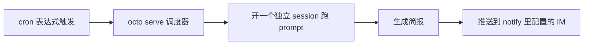

# Octo 上手系列（五）：Cron 实战——定时任务，人不在也在跑

> 上一篇的 `/loop` 活在一次对话里，关了就没了。这一篇讲真正"持久"的定时任务——服务器重启也不影响，人不在电脑前也照样跑。

---

## 前提：cron 任务只在 `octo serve` 跑着的时候生效

```bash
octo serve
```

cron 是 `octo serve` 内置的调度器管理的，进程不在，定时任务就不会触发——错过的排期不会在下次启动时补跑。所以如果你打算靠它做每天的自动简报，服务器得是长期挂着的（比如放在一台常开的机器上，或者用前面装机篇提到的"装完自动注册登录启动"）。

## 让 octo 帮你建，而不是自己拼 JSON

`cron-task-creator` 是内置 Skill，直接说需求就行：

```text
帮我建一个定时任务：每天早上 9 点，总结过去 24 小时
open-octo/octo-agent 仓库新增的 issue 和已合并的 PR，
按优先级列出重点，发到我的飞书。
```

它会引导你把 cron 表达式、prompt、通知目标这些字段填对。任务建好之后，网页界面的"定时任务"面板会显示这个任务的状态、下次运行时间：


同一份数据也能直接用 API 操作（比如批量建任务，或者写自动化脚本时更方便）：

```bash
curl -s -X POST http://127.0.0.1:8088/api/tasks \
  -H 'Content-Type: application/json' \
  -d '{
    "name": "每日仓库动态简报",
    "cron": "0 0 9 * * *",
    "prompt": "总结过去24小时 open-octo/octo-agent 仓库的新增 issue 和已合并 PR，按优先级列出重点，发给我。",
    "notify": [{"platform": "feishu", "chat_id": "你的飞书 chat id"}]
  }'
```

网页面板和 API 是同一套数据——面板上建的任务能用 API 查到，API 建的任务面板上也能看到、能点、能改。

---

## cron 表达式：6 位，秒在最前

跟 Linux 常见的 5 位 crontab 不一样，octo 的调度器多一个秒字段：

```
秒 分 时 日 月 星期
```

| 想要的效果 | 表达式 |
|---|---|
| 每天 9:00 | `0 0 9 * * *` |
| 每 30 分钟 | `0 */30 * * * *` |
| 工作日 18:30 | `0 30 18 * * 1-5` |

也支持 `@daily`、`@hourly`、`@every 90m` 这种简写。时间按服务器本地时区算。

## 写 prompt 时最容易踩的坑：它看不到你现在这次对话

每次触发，cron 任务都是在**自己独立的 session** 里跑的，看不到你创建这个任务时聊了什么。所以 prompt 必须自包含——把"总结什么范围""去哪里查""发给谁""怎么算完成"都写进 prompt 本身，而不是假设它记得你的上下文。

同样重要的是给一个**明确的完成条件**。一个开放式的 prompt（比如"帮我看看有没有需要关注的"）会让模型一直反复确认、找理由继续检查，直到 30 分钟的硬性超时——而不是判断出"没什么可报"就提前结束。像上面例子里"总结过去24小时的新增 issue 和已合并 PR"这种有明确范围和产出形式的描述，就不会有这个问题。



## 想主动测试一下，别在聊天里跑

面板上每个任务都有一个"运行一次"的按钮，专门用来提前测试一个新任务是否配置对了。**别在跟 octo 聊天的时候手动触发它的运行接口**——一次运行是一整轮 agent 对话（最长 30 分钟），放在当前会话里跑只会把你的对话卡住，而真正的输出是发到任务自己的 session 里，你在当前对话根本看不到。

---

## 下一篇：把这五样东西串成一件真事

装机、Skills、MCP、Loop、Cron，这个系列的五块拼图都摸过一遍了。最后一篇把它们串起来——用 cron 定时触发，接 MCP 拿数据，用 office-xlsx 生成一份真正的 Excel 周报，再推送到 IM，从零搭一个确实每周都在跑的自动化。

**系列上一篇**：[Octo 上手系列（四）：Loop 实战——让 octo 在会话里帮你盯一件事](/blog/posts/onboarding-loop-watch-ci/)
**系列下一篇**：[Octo 上手系列（六）：实战合体——一个真正跑起来的自动周报](/blog/posts/onboarding-weekly-report-automation/)
