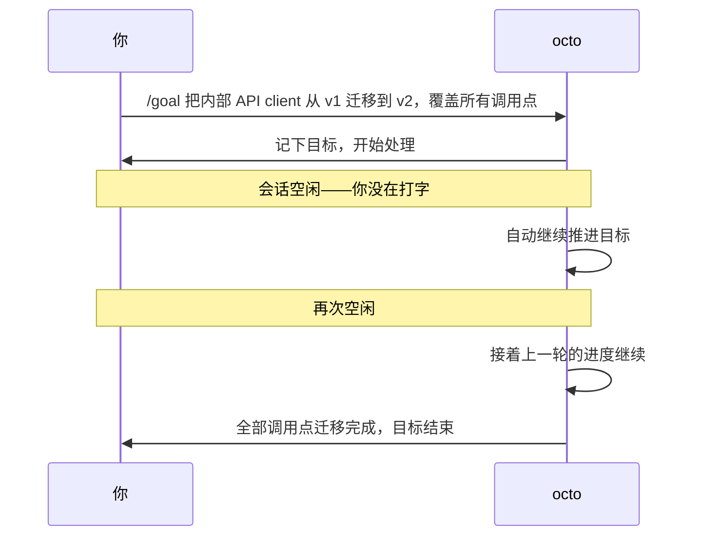

# Octo 上手系列（八）：Goal 实战——定一个长期目标，让它自己找空闲时间推进

> 第四篇讲了 `/loop`（活在一次对话里，反复跑一个任务），第五篇讲了 cron（跨 session、按时间表跑），第七篇讲了 workflow（把任务拆开并行跑）。这一篇讲第四种形状：一个**长期目标**，你不用管它具体怎么分解，会话一空下来它自己接着往前推。

---

## Goal 跟前面几种有什么不一样

`/loop` 适合"反复检查同一件事"；cron 适合"按时间表触发一件独立的事"；workflow 适合"任务能拆成几块并行跑"。但有一种任务不属于这三种——比如"把内部 API client 从 v1 迁移到 v2，覆盖所有调用点"。这事没法一句话说完，也不是按时间表触发的独立任务，也不天然拆成几个互不依赖的并行块——它需要**好几轮、跨越好几次会话空闲，逐步推进**，每一轮看看上一轮做到哪了，接着往下做。

这就是 `goal` 要解决的：定一个标准目标，会话一旦空闲下来（你没在打字，也没有新消息），octo 就自动继续朝这个目标推进——用的是跟 `/loop` 背后**同一套**空闲唤醒机制，只是不是"重复跑一个 prompt"，而是"持续推进一个目标，直到完成"。



---

## 定一个目标

```text
/goal 把内部 API client 从 v1 迁移到 v2，覆盖所有调用点
```

目标定下来之后，网页界面的输入框上方会出现一个"目标"标签，鼠标放上去能看到完整的目标描述，标签本身显示的是这个目标已经花掉的时间或 token（取决于有没有设预算）。这跟前面几篇看到的"推理强度""上下文"那些标签是同一排,一眼就能看到有个目标正在跑。

你不需要守着它——这正是 goal 存在的意义。去做别的事,回来看一眼进度就行。

## 中途要调整、暂停、换一个：都是一句命令

任务干着干着，范围可能要改：

```text
/goal edit          # 调整当前目标的描述
/goal pause         # 先停下自动推进，但不丢掉这个目标
/goal resume        # 接着推进
/goal clear         # 放弃当前目标
/goal replace        # 用一个新目标替换掉已经完成的旧目标
```

比如迁移到一半发现还漏了一批调用点，`/goal edit` 把范围说清楚；要出差几天不想让它在你不知情的情况下改代码，`/goal pause` 先按住；回来再 `/goal resume`。

## 一个真实的坑：`/goal edit` 在 TUI 和网页/IM 里不是一回事

在**终端 TUI** 里，`/goal edit` 后面**不能**直接跟文字——它只会把当前目标的描述预填进输入框，让你在下一次按 Enter 前自己改，`/goal edit 新的描述` 这种带文字的写法会被直接拒绝。

在**网页界面和 IM 渠道**里，`/goal edit 新的描述` 是一步到位的，直接就把目标改成你写的这段话，不需要先预填再确认。

`pause`、`resume`、`clear`、`replace` 这几个在所有界面里都是同一种行为，毕竟目标状态是存在 session 上的，跟你用哪个界面打开它没关系——只有 `edit` 这一个命令，因为终端和网页/IM 的输入框交互方式不同，行为特意做了区分。

---

## 不想用？可以直接关掉

Goal 目前还带着 Beta 标签,是按 session 自愿开启的功能。如果你完全不想要这个能力,可以在配置里直接关掉：

```yaml
# ~/.octo/config.yml
goal:
  enabled: false
```

关掉之后,`/goal` 会明确告诉你这个功能不可用,而不是装作什么都没发生。

---

## 下一篇：一整类完全不同的任务

八篇下来，装机、Skills、MCP、Loop、Cron、实战合体、Workflow、Goal，覆盖的都是"问一次答一次"到"持续自主推进"这条线上的几种主要形状——本质上还是文本、代码、工具调用能解决的任务。但还有一大类事完全没有接口：登录一个内部后台点几下、在只有网页表单的系统里填信息，不是"调用工具"能覆盖的，得真的有一双手去操作浏览器。接下来两篇转向这个方向。

**系列上一篇**：[Octo 上手系列（七）：Workflow 实战——写一个脚本，让几个 agent 一起并行干活](/blog/posts/onboarding-workflow-parallel-review/)
**系列下一篇**：[Octo 上手系列（九）：Browser 实战——把你自己的浏览器接给 octo](/blog/posts/onboarding-browser-setup/)
