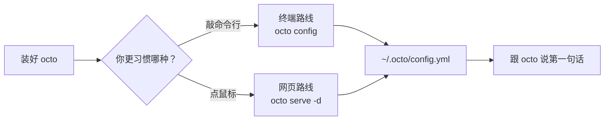
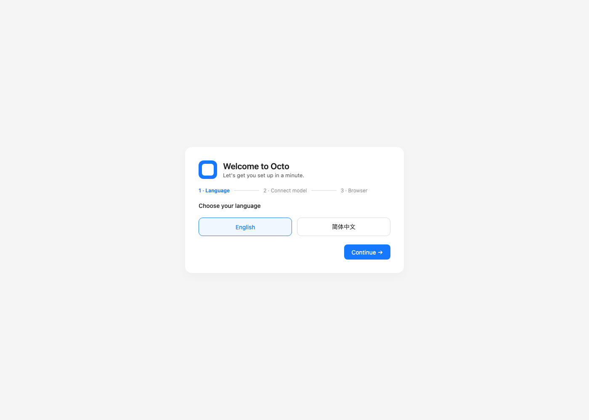
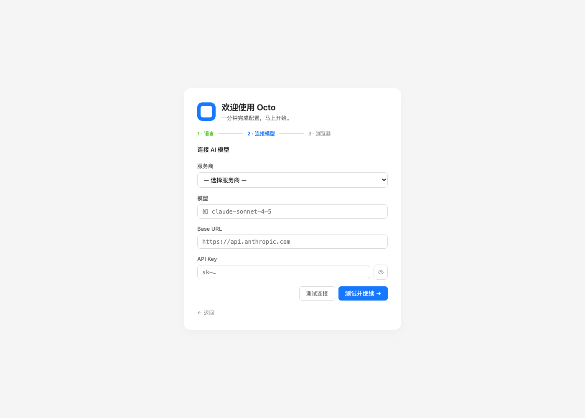
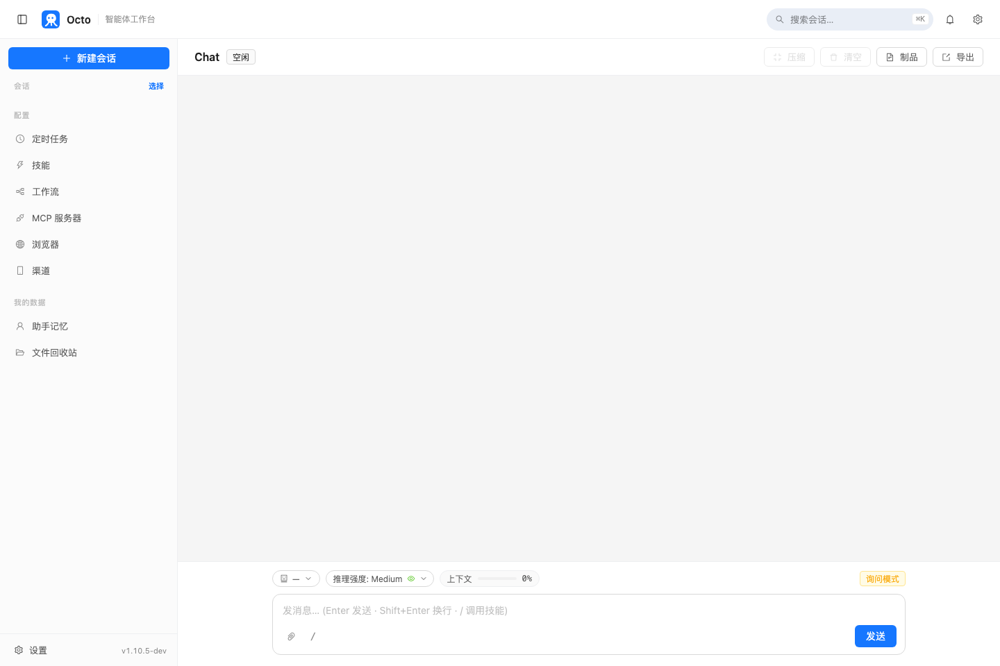

# Octo 上手系列（一）：装好它，跟它说上第一句话

> 这是"Octo 上手系列"的第一篇。接下来几篇会分别用一件具体的小事，带你摸一遍 Skills、MCP、Loop、Cron 这几样东西——但今天只干一件事：把 octo 装好，让它替你做成第一件事。

---

## 装哪个版本

装法本身没有分支——不管你最后想用终端还是网页，装的是同一个东西：

```bash
curl -fsSL https://octo-agent.dev/install.sh | sh
```

这条命令会自动认出你的系统架构，下载对应的预编译版本，校验 SHA-256，然后把 `octo` 放进你的 `PATH`。macOS 和 Windows 用户如果不想碰命令行，也可以在 [GitHub Releases](https://github.com/open-octo/octo-agent/releases/latest) 下载双击安装包（`octo-setup.pkg` / `octo-setup.exe`），流程是同一套，装完也会自动把 `octo` 加进 `PATH`。

装完之后，路分成两条——这也是这篇要讲的重点：**终端派**直接在命令行里跟它对话；**网页派**打开浏览器，用可视化界面配置和聊天。两条路配置的是同一份 `~/.octo/config.yml`，选哪条纯粹是习惯问题，随时可以换着用。



---

## 网页路线：浏览器里的引导向导

先说网页这条路，因为它是"零命令行经验"最友好的入口。装完之后跑：

```bash
octo serve -d                   # 后台启动本地服务
open http://127.0.0.1:8088      # macOS；Linux 用 xdg-open，Windows 装完会自动打开
```

浏览器会打开一个引导向导，第一步选界面语言：



选完继续，第二步是接入一个 AI 模型——选服务商（Anthropic、OpenAI、DeepSeek、Kimi、百炼……下拉框里列了一串），填模型名和 API Key，点"测试并继续"：



`127.0.0.1` 是本机回环地址，所以这个页面不需要额外的访问密钥，装完就能直接进向导。第三步是可选的浏览器自动化连接（没有 Chrome 远程调试需求的话可以直接跳过），走完三步就落地到主界面——这也是终端路线最终会抵达的同一个地方：



左侧栏的"定时任务""技能""工作流""MCP 服务器"几个入口，就是这个系列后面几篇要一个个拆开讲的东西。

---

## 终端路线：三行命令开始对话

如果你更习惯命令行，网页那一步可以跳过，直接：

```bash
export ANTHROPIC_API_KEY=sk-ant-...      # 换成你自己的 key；也支持 OPENAI_API_KEY 等
octo config                              # 一次性存好默认服务商和模型，以后不用再 export
```

配置存完之后，有两种基本用法。第一种是**headless 单发**——一句话，一整套工具调用，跑完退出，适合脚本和 CI：

```bash
octo "看看当前目录下有哪些文件，按类型分类列出来，顺便告诉我哪个文件最大"
```

第二种是**交互式 TUI**——直接敲 `octo`，不带任何参数，进入一个带会话历史、工具卡片、流式输出的终端界面：

```bash
octo
octo sessions        # 列出保存过的会话
octo -c               # 从列表里挑一个最近的会话继续
```

两种用法背后是同一个 agent，同一套内置工具（文件读写、终端、搜索……）和技能系统，默认全部开启，所以哪怕只是这一句话，它也是真的在读文件、跑命令、给你结果，不是聊两句就完事。

---

## 第一次运行时，它会顺手问你几句

不管走哪条路，第一次真正开始对话时，octo 会额外问你几个问题——你希望它怎么称呼你、你的角色是什么、有没有特别的沟通偏好。这不是废话，答案会存进 `~/.octo/soul.md` 和 `~/.octo/user.md`，以后每次对话都会记得，不用你重复交代。

如果第一次没答好，或者想换个说法，随时可以再触发一次——直接跟它说"重新问一遍我的偏好"就行。

---

## 下一篇：让它替你干一件更具体的事

装好、聊上了，只是把车发动起来。下一篇开始真正干活：不写一行 Python，用内置的 Skills 系统，一句话让 octo 生成一张带公式、带图表的 Excel 报表。

**系列下一篇**：[Octo 上手系列（二）：Skills 实战——一句话生成一张 Excel 报表](/blog/posts/onboarding-skills-excel-report/)
