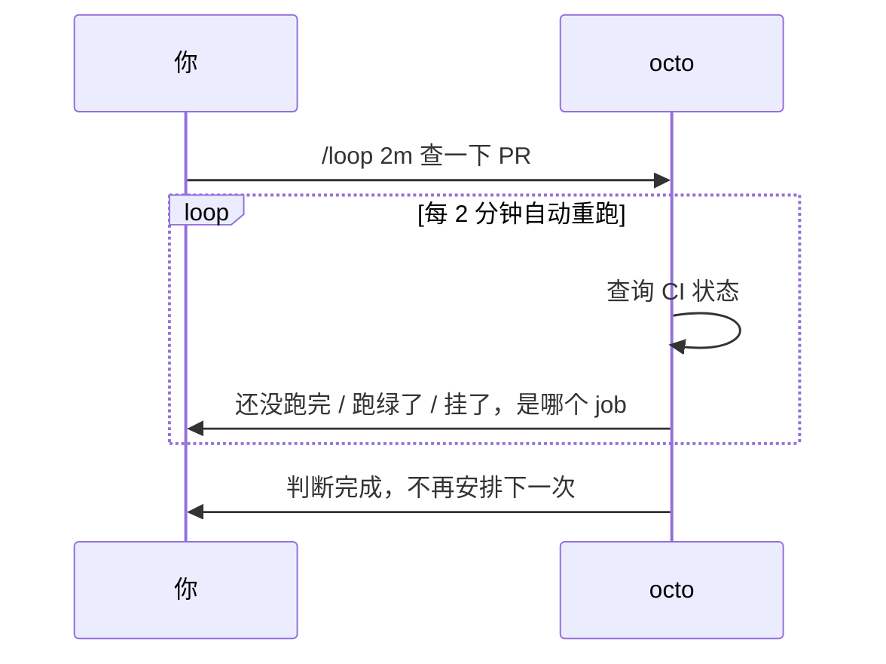

# Octo 上手系列（四）：Loop 实战——让 octo 在会话里帮你盯一件事

> 前三篇分别解决了"装好它""让它生成文件""让它接外部工具"。这一篇解决一种很具体的无聊：等一件事跑完，但你不想每隔几分钟自己去看一眼。

---

## 手动重复和 `/loop` 的区别

不用 `/loop` 的话，正常流程是：你问一句"CI 跑得怎么样了"，它查一次告诉你，然后你自己记着两分钟后再问一次，如此反复，直到跑完。整个"什么时候该再问一次"的责任在你身上。

`/loop` 把这个责任交给 octo 自己：它会用一个叫 `schedule_wakeup` 的机制，在当前这次对话里给自己安排下一次醒来的时间，醒来后自动把任务当成一条新消息重新跑一次——不需要你再敲一遍。



---

## 两种模式：固定节奏 vs 自己判断节奏

**给一个具体间隔**——固定节奏，跑到你叫停：

```text
/loop 2m 帮我查一下 PR #123 的 CI 状态，跑绿了告诉我；
如果失败了，看看是哪个 job 挂了，贴一下报错。
```

`2m` 也可以换成 `30s`、`1h`——延迟会被限制在 60 秒到 1 小时之间。

**不给间隔**——交给模型自己判断该多久看一次、该什么时候算完成：

```text
/loop 帮我反复润色这段 slogan：「Octo，让 AI 真正把事情干完」，
读起来顺了、没有歧义了就停，每次改完把新版本发我。
```

这种"动态模式"下，模型自己决定节奏，也自己决定什么时候不再安排下一轮——不需要你说"停"。

---

## Loop 不会把你锁在这个任务里

`/loop` 跑着的时候，你可以照常在同一个会话里问别的问题、给别的指令——一条普通消息不会打断 loop，它会在后台继续按自己的节奏醒来检查。

## 怎么停

- **动态模式**自己会停：模型判断任务完成（或者发现卡住了）之后，就不再安排下一次醒来，并告诉你原因。
- **固定间隔模式**每次都会重新安排下一轮，所以要显式说"停"或者"不用再查了"才会结束。
- TUI 里按 **Ctrl+C** 能立刻硬停任何 loop。
- 每个 loop 有大约 **12 小时**的运行上限兜底——这是防止忘记关掉的安全网，不是让你依赖的机制,该停的时候还是自己说停。

## 什么时候该用 cron，不该用 loop

`/loop` 活在这一次对话里——关掉这个 session，它就没了，本质上是"临时的、廉价的、只要你还在这儿"的重复。如果你要的是"每天早上 9 点自动跑一次，不管有没有人盯着""服务器重启也要接着跑"，那种跨 session、需要长期存活的定时任务，交给下一篇要讲的 **cron 任务**——那是完全独立的一套持久化机制,不是靠 `/loop` 硬撑出来的。

---

**系列上一篇**：[Octo 上手系列（三）：MCP 实战——接上 GitHub，让 octo 帮你理 issue](/blog/posts/onboarding-mcp-github-issues/)
**系列下一篇**：[Octo 上手系列（五）：Cron 实战——定时任务，人不在也在跑](/blog/posts/onboarding-cron-daily-digest/)
