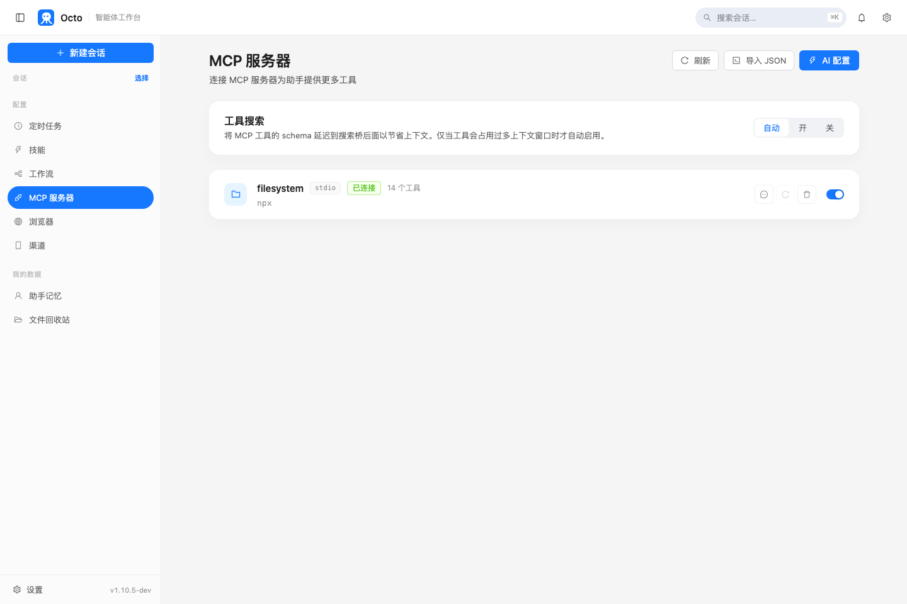
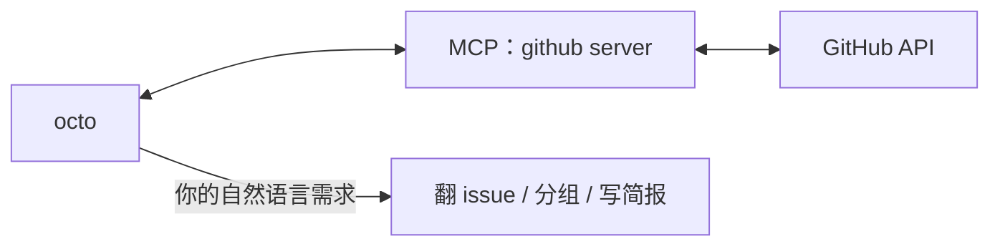

# Octo 上手系列（三）：MCP 实战——接上 GitHub，让 octo 帮你理 issue

> 前两篇讲了装机和 Skills。这一篇解决另一件事：octo 自带的工具只有文件、终端、搜索这些通用能力，它并不知道你的 GitHub 仓库里发生了什么——除非你给它接一个。

---

## MCP 是什么，为什么不用给每个工具单独写代码

MCP（Model Context Protocol）是一套开放协议，让 octo 能连上别人已经写好的"工具服务器"——GitHub、数据库、内部 API、issue 系统——而不需要 octo-agent 自己为每一个外部系统单独写一个内置工具。你在配置里声明一个 MCP server，它带来的所有工具就会自动出现在 octo 的工具列表里，命名规则是 `mcp__<服务器名>__<工具名>`。

打开网页界面左侧的"MCP 服务器"面板，没配置任何东西之前是空的：

```text
尚未配置 MCP 服务器
[添加第一个服务器]
```

配置好之后，这个面板会实时显示每个服务器的连接状态和它带来的工具数量：



（图里连的是一个本地文件系统 server，用来演示"连上之后长什么样"——GitHub、数据库等其他 server 连上之后，这一栏的样子是一样的，区别只是服务器名字和工具数量。）

---

## 接一个 GitHub MCP server

服务器声明在 `~/.octo/mcp.json`（全局，随时生效）或项目目录下的 `.octo/mcp.json`（只对当前项目生效，同名时优先于全局）。用官方的 GitHub MCP server，配置是这样：

```json
{
  "mcpServers": {
    "github": {
      "command": "npx",
      "args": ["-y", "@modelcontextprotocol/server-github"],
      "env": {
        "GITHUB_PERSONAL_ACCESS_TOKEN": "你的 GitHub token"
      }
    }
  }
}
```

Token 去 GitHub 的 Settings → Developer settings → Personal access tokens 里生成一个，权限给到能读你要操作的仓库就够了。存完这份文件，重启 `octo serve`（或者下次开新会话）它就会自动连上——工具默认全部开启，所有配置好的服务器都会在 session 开始时一起连接。

在 TUI 里可以用 `/mcp` 随时看当前连了什么；网页版就是上面那张图的面板。

---

## 接完之后，直接说需求

不需要记住 `mcp__github__*` 这些工具具体叫什么，直接用人话描述你要干的事：

```text
帮我看看 open-octo/octo-agent 这个仓库这周新开的、还没人回复的 issue，
按紧急程度分组，写一段简报给我，每条附上链接。
```

octo 会自己判断该调用 GitHub server 带来的哪个工具（列 issue、按时间过滤、读评论……），把结果拼成你要的简报格式。你不需要知道底层是在调 REST API 还是 GraphQL，那是 MCP server 自己的事。



## 工具一多，不会把上下文撑爆

如果你接的 MCP server 很多、每个又带几十个工具，octo 不会把所有工具的完整 schema 一次性塞进上下文。**Tool Search** 机制会先只列出每个工具的名字和一行说明，模型知道"有这个工具"，但只有真正要用到某个工具时，才通过一个小的 `mcp_describe`/`mcp_call` 桥去加载它的完整参数定义。这个机制默认是自动触发（工具多到占用一定比例的上下文窗口才会打开），不需要你手动配置什么，接的工具越多，越能感受到区别。

---

## 下一篇：让它自己盯着一件事

看 issue 只是"问一次答一次"。如果你想让 octo 在同一个对话里反复盯着一件正在进行的事——比如一个刚推上去的 PR，CI 还在跑——那是下一篇 `/loop` 要讲的东西。

**系列上一篇**：[Octo 上手系列（二）：Skills 实战——一句话生成一张 Excel 报表](/blog/posts/onboarding-skills-excel-report/)
**系列下一篇**：[Octo 上手系列（四）：Loop 实战——让 octo 在会话里帮你盯一件事](/blog/posts/onboarding-loop-watch-ci/)
