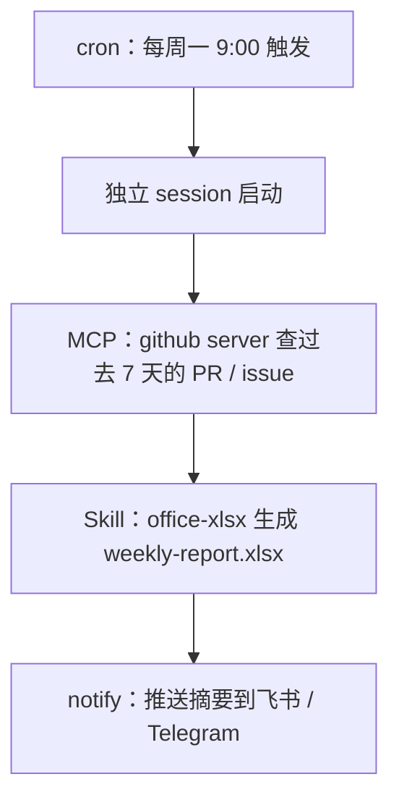

# Octo 上手系列（六）：实战合体——一个真正跑起来的自动周报

> 前五篇分别摸过了装机、Skills、MCP、Loop、Cron。这一篇不讲新东西，只做一件事：把能力拼起来，做一个你下周一早上真的会收到的自动周报。

---

## 要拼的东西

一份"上周仓库活动周报"，需要四样东西配合：

- **Cron**——每周一早上 9 点自动触发，人不用管；
- **MCP**——连着 GitHub，能查到过去 7 天的 PR 和 issue；
- **Skill（office-xlsx）**——把查到的数据整理成一份带汇总和图表的 Excel；
- **IM 通知**——生成完之后，把摘要推到飞书或 Telegram，而不是让文件安静地躺在硬盘里等你想起来看。



## 前置条件

前两块在前面几篇已经装好了：

1. 第三篇装好的 GitHub MCP server 还连着（`~/.octo/mcp.json` 里那个 `github` 条目）；
2. `office-xlsx` 是内置 Skill，不需要额外装；
3. `octo serve` 得是长期跑着的（第五篇提过，cron 只在它跑着的时候生效）。

## 建这个任务

跟第五篇一样，直接跟 octo 说需求，让 `cron-task-creator` 帮你把字段填对，只是这次的 prompt 更完整：

```text
帮我建一个每周一早上 9 点的定时任务：

1. 查询 open-octo/octo-agent 仓库过去 7 天新增的 issue、
   新增和已合并的 PR；
2. 生成一份 weekly-report.xlsx，第一个 sheet"汇总"放各类数量，
   第二个 sheet"明细"是完整列表，另外加一个按类型分类的柱状图；
3. 保存到 ~/reports/ 目录；
4. 把汇总数据和文件路径整理成一段摘要，推到我的飞书。

工作目录设为 ~/reports，这样它才有地方存文件。
```

这一条 prompt 里其实同时用到了三样东西：MCP（查数据）、Skill（生成 Excel）、notify（推送）——但你不需要分别去调用它们，跟前几篇一样，octo 会自己判断该用哪个工具、按什么顺序用。cron 那一层只负责"到点了，把这条 prompt 当一次新任务扔给它"。

---

## 这只是众多组合方式里的一种

同一套"定时触发 + 查数据 + 生成产出 + 推送"的模式，换一下每一块，就是完全不同的自动化：

- 把 GitHub MCP 换成邮箱 MCP，"周报"换成"这周需要跟进的客户邮件整理"；
- 把 `office-xlsx` 换成"生成 PPT"或者"写一段 Markdown 简报"；
- 把每周一次换成每天——CI 失败分类、issue 优先级排序,都是同样的骨架。

## 如果想要更复杂的编排

这一篇里的任务全程是"一个 prompt 走到底"，对大部分周期性任务已经够用。如果某一步本身要拆成多个子任务并行处理、中间要有独立的校验环节——比如"生成周报"本身拆成"抓数据"和"写报告"两个子 agent 分工，再让第三个 agent 专门检查数据对不对——那是 **workflow** 工具的地界了。这个仓库自己就有几个实际在用的例子（issue 分类、PR review、自动修 issue），可以在网页界面的"工作流"面板里看到：


workflow 是另一套更大的机制，值得单独展开——下一篇就来实际写一个。

---

## 下一篇：让几个 agent 并行干活

**系列上一篇**：[Octo 上手系列（五）：Cron 实战——定时任务，人不在也在跑](/blog/posts/onboarding-cron-daily-digest/)
**系列下一篇**：[Octo 上手系列（七）：Workflow 实战——写一个脚本，让几个 agent 一起并行干活](/blog/posts/onboarding-workflow-parallel-review/)
