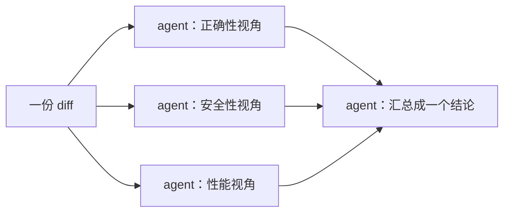

# Octo 上手系列（七）：Workflow 实战——写一个脚本，让几个 agent 一起并行干活

> 上一篇把 cron、MCP、Skill 串成了一个自动周报，结尾提到：如果某一步本身需要拆成几个互不依赖的部分并行处理，那是 workflow 工具的地界。这一篇就来实际写一个。

---

## 先说清楚：什么时候需要 workflow，什么时候不需要

前六篇里，每次给 octo 的都是"一句话需求，它自己判断该用哪个工具、按什么顺序用"——哪怕这句话背后要连 MCP、跑 Skill、发通知好几步，也是模型一步步串着决定的。这对大多数任务已经够了。

但有些任务天然可以拆成**互不依赖**的几块。典型例子：审一份代码 diff，你想同时从"正确性""安全性""性能"三个角度分别看一遍，再汇总成一个结论。串行做的话，模型审完正确性、再审安全、再审性能，一件事挨着一件事；用 workflow，三个视角可以**真正同时**跑，跑完再汇总，跟你手上真的有三个人分头看、最后开会对结论是一样的效率。



这就是 `workflow` 工具存在的理由：**编排结构是写死在脚本里的，不是模型每次临时决定的**。目前这个能力还带着 Beta 标签，语法和细节可能会调整，但用起来的方式不会变。

---

## 直接说需求，octo 会自己写这个脚本

跟前面几篇一样，你不需要先学会写脚本才能用它：

```text
帮我从正确性、安全性、性能三个角度并行审一遍当前的 diff，
每个角度独立看，不要互相参考，最后给我一个汇总结论。
```

octo 判断这是一个"天然可并行"的任务后，会自己写一段编排脚本去跑，而不是自己一项项串着做。脚本语言是 **Ruby**——跑在一个嵌入的 mruby 解释器（编译成 WASM）里，你的机器不需要装任何 Ruby 环境。写出来大概是这样：

```ruby
# @description 从三个维度并行审查当前 diff，汇总成一个结论
findings = parallel(["correctness", "security", "perf"]) do |dimension|
  agent("从 #{dimension} 角度审查当前 diff，只看这一个维度")
end

summary = agent(
  "把下面三段独立的审查意见汇总成一个结论：\n" + findings.join("\n---\n")
)

summary
```

`parallel` 接一个列表，对列表里的每一项开一个独立的 agent 去跑，彼此互不干扰，跑完的结果按原来的顺序收集起来；最后再用一个 `agent(...)` 把三份意见揉成一个结论。整个脚本只有两步：并行审查、汇总。

## 跑起来不会卡住你

在 TUI、网页、IM 里聊天时，`workflow` 是**异步**的——喊它跑的那一刻它就在后台开始了，不用等，你可以接着聊别的，跑完 octo 会主动通知你结果。只有在 headless 单发模式（脚本、CI 里直接 `octo "..."` 那种用法）里，因为进程跑完就退出了，它才会老实等脚本跑完再给你结果。

单次运行内，并行调用的 agent 数量有一个上限（目前是 8 个同时在跑），超出的部分排队等前面的让出位置——所以哪怕给 `parallel` 传了几十项，也不会一次性把机器点爆。

---

## 想复用？存成一个有名字的 workflow

如果这套"三维度审查"以后还要经常用，可以让 octo 把它存下来：

```text
把刚才这个审查脚本存成一个可复用的 workflow，叫 quick-review。
```

存完之后，脚本会落在项目目录下的 `.octo/workflows/quick-review.rb` 里（也可以选择存到 `~/.octo/workflows/`，对所有项目都生效）。下次要用，不需要重新描述一遍逻辑，直接说"跑一下 quick-review"就行——**同样是用自然语言触发，而不是打一个斜杠命令**；网页界面的"工作流"面板里也能直接看到它、点一下运行按钮。

## 这个仓库自己就在用

`octo-agent` 这个项目自己的 `.octo/workflows/` 目录下，就存着几个真实在跑的 workflow——issue 分类、PR review、自动修 issue，还有一个专门用来对比架构风格的小脚本。后者短到可以完整贴出来，结构跟上面的 code review 例子几乎一样：

```ruby
# @description 并发分析多种架构风格并汇总对比
topics = args["topics"] || ["monorepo", "microservice", "serverless"]

phase("并发调研")
results = parallel(topics) do |topic|
  agent("用 80 字以内解释 #{topic} 架构的核心优缺点")
end

phase("汇总输出")
summary = agent("把以下分析汇总成一段对比总结，最后加一句权衡：\n" + results.join("\n---\n"))

"完成 #{results.size} 个主题分析\n\n" + summary
```

`args["topics"]` 这一行说明它是可以传参数复用的——不传就用默认的三个话题,传了就按你给的跑。网页界面的"工作流"面板能看到这几个真实存在的脚本：


---

## 下一篇：一种更适合"说不清楚要几轮"的任务的形状

workflow 适合能事先拆清楚结构的任务。但有些事——比如一次跨越整个代码库、没法一句话说完的迁移——既不是并行几块，也不是按时间表触发。下一篇讲这种情况该用什么。

**系列上一篇**：[Octo 上手系列（六）：实战合体——一个真正跑起来的自动周报](/blog/posts/onboarding-weekly-report-automation/)
**系列下一篇**：[Octo 上手系列（八）：Goal 实战——定一个长期目标，让它自己找空闲时间推进](/blog/posts/onboarding-goal-long-running-migration/)
