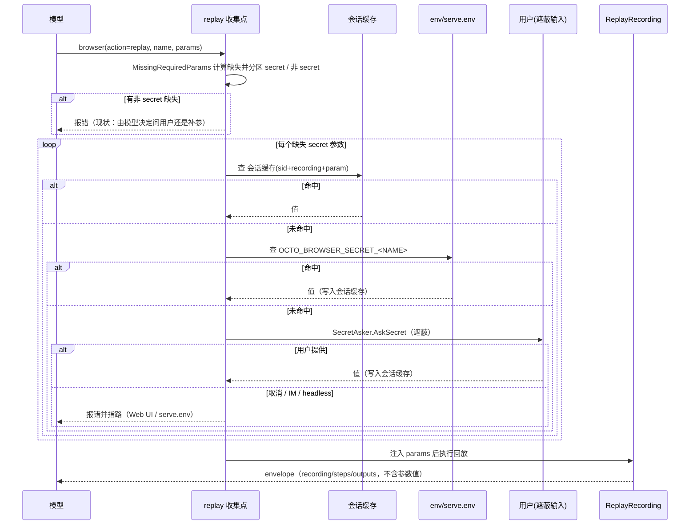

# 浏览器回放 secret 参数设计

## 背景与目标

浏览器录制（`~/.octo/browser-recordings/*.yaml`）在录制期对密码字段做了正确的最小化：capture script 对 `type=password` 的输入直接置空值（`internal/browser/recorder.go` 的 captureScript），参数只声明不落默认值，`renderTrace` 在送 LLM 蒸馏前再做一次脱敏。但回放期缺 secret 参数时，链路是：replay 报"missing required param(s)" → 模型用 `ask_user_question` 向用户索值 → 用户明文输入 → 值成为工具结果进入会话历史。结果是录制期的保证在下游全线失效：

- 会话 transcript 落盘；
- 记忆后端（memorybackend / MEMORY.md）自动存 turn；
- 值随上下文发往 provider——这一跳**不可收回**。

目标：secret 参数值**永远不进入会话语义**（对话历史、工具结果、记忆、provider 上下文），由运行时在对话外收集并直接注入回放。对应 issue open-octo/octo-agent#1566。

## 范围

**In**

- `Param` 增加显式 `secret: true` 标记及编译/蒸馏链路保留；
- replay 工具与 workflow `skill()` 两条回放路径共用的 secret 收集流程（会话缓存、env 兜底、遮蔽询问）；
- TUI（密码模式）与 Web（password 字段）两端的遮蔽输入；
- IM 端的明确报错与指路；
- 文档（guides/browser-automation en/zh）。

**Out**

- 通用 secret store（独立于浏览器回放的秘密托管设施）——第二个消费者不存在，但本设计的两个原语（`SecretAsker` 接口、`Param.secret` 字段）按通用形状实现，未来直接复用；
- IM 端收集 secret 的任何形态（含一次性 Web 表单链接）——IM 平台内消息不可控，见"安全设计"；
- 存量录制迁移——已确认当前不存在依赖 secret 的录制（2026-07-18 用户确认），不做加载期归一化；
- `serve.env` 加载器本身的改动（复用现状）。

## 术语

- **secret 参数**：YAML 中带 `secret: true` 的回放参数，值只允许存在于进程内存与 `serve.env`，禁止进入会话语义。
- **收集点**：回放执行前把缺失 secret 参数解析成值的共享函数（`resolveReplayParams`），两条回放路径都经过它。
- **遮蔽询问**：运行时通过 `SecretAsker` 向用户弹出的不回显输入；问题文本与"已提供/已取消"可进入对话，**值不进入**。

## 核心原则：值的生命周期

| 允许存在 | 禁止存在 |
|---|---|
| 收集点局部变量 / params map（回放期间） | 会话历史 / transcript |
| 会话级内存缓存（会话结束即清） | 记忆后端 / MEMORY.md |
| `~/.octo/serve.env`（0600） | 发给 provider 的上下文 |
| | 工具结果 envelope / 错误文本 / LLM prompt |
| | IM 平台消息历史 |

进程内内存不在威胁模型内（威胁模型 = 持久化与外发通道），这是会话缓存成立的前提。

## 业务流程



## 详细设计

### 数据模型：`Param.secret`

`internal/browser/recording.go:32` 的 `Param` 增加字段：

```go
type Param struct {
    Name        string `yaml:"name"`
    Description string `yaml:"description,omitempty"`
    Default     string `yaml:"default,omitempty"`
    Secret      bool   `yaml:"secret,omitempty"` // 新增
}
```

YAML 形态：

```yaml
params:
  - name: password
    description: secret value (not stored; provide at replay)
    secret: true
```

`CompileRecording` 的 `addParam`（`internal/browser/recording.go`）语义随之拆分——现在 `secret` 实参身兼两职（抑制默认值 + 标记密码），必须分开：

- `Default` 仅当 `def != ""` 时写入。行为无变化：`mergedParams`（`internal/browser/recording.go`）本来就忽略空默认值，空值参数今天实际上就是必填。
  - **实现修正（2026-07-18）**：实际落地为 `def != "" && !secret`——既有测试（`TestCompileAutoParamsSecretNoDefault`、`TestRenderTraceRedactsSecret`）把"secret 参数永远不带 Default"当成不变量守着（即使事件异常携带了值），保留这道防线比字面的"只看 def"更安全；对正常录制流（secret 事件值必为空）两者等价。
- `Secret` 按密码语义单独赋值。由此，upload 的文件参数调用点（`recording.go:142`，现在传 `true` 只为抑制默认值）改为传 `false`——它不是 secret，缺失时仍走普通"缺参数"错误，不该进遮蔽询问。密码输入的两处（`recording.go:171` change、`recording.go:194` enter 快照）传 `true`。

### 蒸馏保留

`GenerateRecording` 的 LLM 蒸馏只受 selector 子集约束（`selectorsSubset`），参数列表由模型重写，`secret: true` 可能丢失。蒸馏合并时按参数名把 baseline 的 `Secret` 标志回填到 refined 参数上（与 `refined.Name = name` 同级处理），保证密码参数经过蒸馏仍是 secret。

- **实现补充（2026-07-18）**：除按名回填外，蒸馏若把 secret 参数的**声明整个丢弃**（步骤里仍引用 `{{password}}`），合并时会把 baseline 声明重新挂上（`paramReferenced` 判定），否则该占位符会被分区成非 secret 缺失、退化为旧的明文询问路径——正是本设计要关的泄漏。蒸馏 system prompt 规则 (3) 同步要求保留参数名与 `secret: true` 标记。

### SecretAsker 能力接口

`internal/tools` 新增可选接口（不改动现有 `Asker`，`internal/tools/ask_user_question.go:15`）：

```go
// SecretAsker 是 Asker 的可选能力：以不回显方式收集一个秘密值。
// 实现它的 transport 支持遮蔽输入（TUI 密码模式、Web password 字段）；
// 不实现的（IM channelAsker、headless）在类型断言处自然降级为报错指路。
type SecretAsker interface {
    AskSecret(ctx context.Context, question string) (answer string, cancelled bool, err error)
}
```

各端实现矩阵：

| Transport | 现有 Asker | SecretAsker | 实现方式 |
|---|---|---|---|
| TUI/REPL | `replAsker`（cmd/octo/asker.go:22） | ✅ 实现 | 经 `userPrompter` seam（cmd/octo/prompt.go:57）的 UserPrompt 增加遮蔽形态；纯文本视图用 `term.ReadPassword`（golang.org/x/term 已在 go.mod:23）关回显读取 |
| Web | `wsAsker`（internal/server/server.go:1746） | ✅ 实现 | `wsEventRequestUserQuestion`（internal/server/ws_types.go:251）增加 `Secret bool \`json:"secret,omitempty"\``；Web 端提问模态框（web/src/views/ChatView.svelte:923 的 request_user_question 处理）对 secret 渲染 `<input type="password">`；类型侧 web/src/lib/types.ts:318 的 `WsEventRequestUserQuestion` 同步加字段 |
| IM | `channelAsker`（internal/server/channel_ask.go:147） | ❌ 不实现 | 类型断言失败 → 报错指路（文案见下） |
| headless | 无 asker | ❌ | 同上 |

### 收集点：`resolveReplayParams`

替代现有 `resolveMissingRecordingParams`（internal/tools/browser.go:792），成为 `internal/tools` 的共享函数，browser 工具的 replay case 与 workflow 的 `runBrowserRecording`（internal/tools/workflow_skill.go）都调用：

```go
func resolveReplayParams(ctx context.Context, rec *browser.Recording, name string, params map[string]string) error
```

逻辑（对每个 `browser.MissingRequiredParams`（recording.go:829）算出的缺失参数）：

1. **分区**：按 `Param.Secret` 分为非 secret 缺失与 secret 缺失。非 secret 缺失保持现状报错（模型决定问用户还是补值——这是当年去掉自动 prompt 的既定语义，不触及）。
2. **secret 缺失**逐个解析，顺序：**会话缓存 → env → 遮蔽询问**：
   - 会话缓存命中：直接用。
   - env 命中（见下节）：写入会话缓存后用。
   - 前两者未命中且 transport 实现了 `SecretAsker`：`AskSecret` 逐个询问（问题形如 `Enter secret for recording "X": password`），成功后写入会话缓存。用户取消 → 回放整体放弃，报错 `replay "X": secret param "password" not provided (cancelled)`。
   - 前两者未命中且无 `SecretAsker`（IM / headless）：报错——
     `browser: replay "X" requires secret param(s): password — secrets can't be collected in this chat (messages persist). Set OCTO_BROWSER_SECRET_PASSWORD in ~/.octo/serve.env, or replay from the Web UI / TUI.`
3. 全部解析后注入 params（原地修改，同现状），交给 `ReplayRecording`。
4. **泄漏护栏**：该函数与回放结果路径的任何错误文本只含参数名，不含值；envelope 结构不变（不含参数值）。
   - **实现补充（2026-07-18）**：`verify()`（`recording.go`）的两处错误文本原本内插 subst **之后**的值——手写 YAML 在 `verify: {text: "{{password}}"}` 引用 secret 时会把值带进工具错误。已改为报告未替换的 `step.Verify.Text` / `step.Verify.URL`（含参数名不含值）；`cur`（location.href，页面状态非参数值）保留。

### 会话缓存

`internal/tools` 新增进程内缓存：

```go
var replaySecrets = struct {
    sync.Mutex
    bySession map[string]map[string]string // sid → "recording:param" → value
}{bySession: map[string]map[string]string{}}
```

- **会话标识**：新增 `tools.WithSessionID(ctx, sid)` / `tools.SessionIDFrom(ctx)`，先例是 `tools.WithWaker`（internal/tools/schedule_wakeup.go:39）。打标点：server 的 turn 入口已贴内部 `ctxKeySessionID`（internal/server/server.go:1740，如 ws_handlers.go:649、tasks_handlers.go:261），同处加贴 `tools.WithSessionID`；CLI（cmd/octo）turn 循环贴当前会话 id（无会话概念时为空串，此时缓存等价于进程级——CLI 进程本身就是会话边界）。
- **清理**：`tools.CloseSessionReplaySecrets(sid)`，挂到现有会话清理点（internal/server/handlers.go:688-690，与 `CloseSessionSubAgentManager` / `CloseSessionReadTracker` 并列）。会话删除/结束即蒸发，永不落盘。

### env / serve.env

- 命名：`OCTO_BROWSER_SECRET_` + 参数名大写、非字母数字转 `_`。参数名由 `slugParam` 产出（小写字母数字下划线），映射后形态稳定：`password` → `OCTO_BROWSER_SECRET_PASSWORD`，`api_token` → `OCTO_BROWSER_SECRET_API_TOKEN`。同名参数跨录制共享一个 env 值（文档写明）。
- 文件来源：现有 `~/.octo/serve.env`（0600，KEY=VALUE），由 `serveenv.Load()` 在 CLI（cmd/octo/main.go:48）与桌面端（cmd/octo-desktop/main.go:132）启动时注入进程环境，cron 运行于 serve 进程内自然覆盖。**本设计不新增任何加载器或配置文件。**
- 进程环境也可由 systemd / CI 直接注入，env 显式值优先于 serve.env（serveenv 现状：不覆盖已存在变量）。

优先级总序：**调用方显式 params > 会话缓存 > env/serve.env > 遮蔽询问**。会话缓存不是独立来源，只是 env 与询问结果的当次会话记忆化；env 已配置就不该再烦用户，遮蔽询问是最后一道。

### 模型可见面

- 收集成功：模型只看见回放 envelope（`recording/steps/outputs`，结构不变）。
- 收集失败：错误文本只含录制名与参数名（见上文样例），不含值。
- 蒸馏链路：`renderTrace` 对 secret 值的脱敏（`[secret]`）保持现状。

## API / 协议变更

| 面 | 变更 | 位置 |
|---|---|---|
| 录制 YAML | `params[].secret: true`（可选字段） | internal/browser/recording.go `Param` |
| tools 接口 | 新增可选接口 `SecretAsker` | internal/tools/ask_user_question.go 旁 |
| tools ctx 原语 | `WithSessionID` / `SessionIDFrom` / `CloseSessionReplaySecrets` | internal/tools |
| WS 协议 | `request_user_question` 增加 `secret,omitempty` | internal/server/ws_types.go:251、web/src/lib/types.ts:318 |
| 环境变量 | `OCTO_BROWSER_SECRET_<NAME>` | 文档化，无加载器改动 |

## 兼容性

- **旧录制 YAML**：无 `secret` 字段的参数反序列化为 `false`，行为与今天完全一致（无默认值的非 secret 参数仍走普通缺失错误）。已确认无存量 secret 录制，不做加载期归一化。
- **旧版本读新 YAML**：带 `secret: true` 的录制在旧二进制上可加载——gopkg.in/yaml.v3 的 `Unmarshal` 默认忽略未知字段；参数退化为"无默认值的普通参数"，行为等于本设计之前。
- **回放 envelope**：结构不变，workflow 下游解析不受影响。
- **`skill()` 原语**：名字与 `browser:`/`md:` 前缀不变；workflow 路径经同一收集点，cron 无 asker 时由 env 兜底。
- **工具 schema**：`replay` action 无 schema 变更；`params` 描述补一句 secret 参数由运行时直接收集。

## 安全设计

- **IM 为何不支持**：IM 平台没有遮蔽输入，值只能作为普通聊天消息发出并留在平台历史（WeChat 不支持删除用户消息）——在 IM 收集 secret 等于制造泄漏再假装防护。报错指路两条安全出路。
- **值不进入 LLM prompt**：收集点在工具层，`ReplayRecording` 拿到的 params 不会被写进任何发给模型的内容（envelope、错误文本、heal prompt 均不含参数值；heal prompt 只有 step 元数据与页面 digest）。
- **文件权限**：`serve.env` 沿用 0600 约定（serveenv 文档与测试现状）。
- **内存生命周期**：值存在于收集点局部变量、params map（回放期间）、会话缓存（会话结束清理）。Go 无法可靠清零 string，接受进程内存驻留——进程内存不在威胁模型内。

## 测试计划

| 层 | 用例 |
|---|---|
| 编译 | 密码 change / enter 快照产出的参数带 `secret: true`；upload 文件参数**不带** |
| 蒸馏 | LLM 重写的参数列表按名回填 `Secret` 标志 |
| 收集点 | 非 secret 缺失 → 现状错误；secret 缺失 → 缓存/env/asker 三级顺序；asker 取消 → 干净报错；无 asker（模拟 IM）→ 指路文案 |
| 优先级 | 显式 params > asker > env |
| 缓存 | 同 sid 第二次回放不再询问；`CloseSessionReplaySecrets` 后重新询问；不同 sid 互不可见 |
| 端到端（browser-gated） | 录制含密码字段 → 回放时经 stub SecretAsker 供值 → 登录表单提交成功，且全过程值未出现在任何工具结果文本中 |
| 回归 | 现有 record→replay round-trip、workflow `skill()` 路径 |

## 监控

N/A——纯本地客户端能力，无服务端指标面；失败以工具错误文本呈现（不含值），现有日志纪律（不记参数值）已覆盖。

## 回滚

- 代码：单提交还原即可；新 YAML 字段在旧代码上被忽略（见兼容性），无数据迁移可回。
- 配置：`OCTO_BROWSER_SECRET_*` 与 serve.env 条目在回滚后成为无消费者的环境变量，无副作用。
