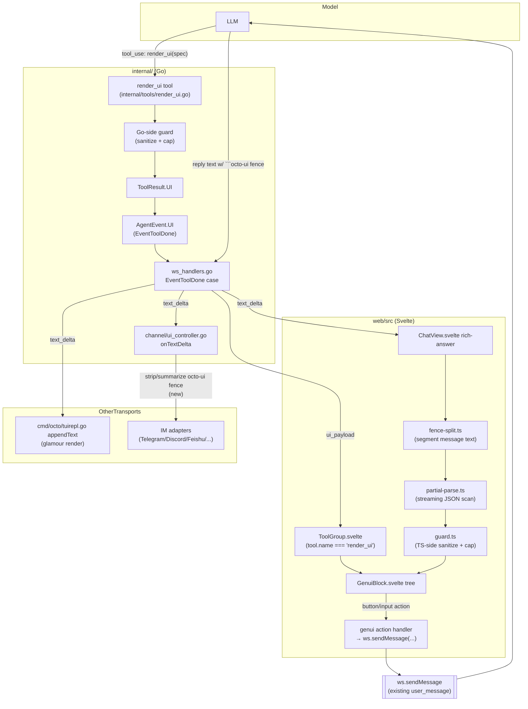

# GenUI: Model-Generated Interactive UI in Chat

## Version history

| Version | Date | Author | Description |
|---|---|---|---|
| 1.0 | 2026-08-19 | roy.lei (with Claude) | Initial design |

## Background

[dsh-genui](https://github.com/omdsh-dev/dsh-genui) is a plugin for a different agent host ("DeepSeek Harness") that lets the model emit a JSON UI spec inside a fenced code block, which the host renders as an interactive panel (cards, charts, forms, sliders) instead of plain text. This document adapts the idea to octo-agent, grounded in a direct read of dsh-genui's source and of octo-agent's own message-rendering, tool-result, and channel pipelines (not a PRD — there is none; the scope below was fixed by explicit decisions in the design conversation, referenced inline where relevant).

dsh-genui runs in two rendering modes because it does not control its host's frontend source: a "registry channel" when the host exposes a fence-renderer extension point, and a "DOM channel" (`MutationObserver` + a parasitic React tree) when it doesn't. octo-agent owns 100% of its own web frontend, so none of the DOM-channel machinery is needed — the equivalent of the "registry channel" can be built directly into the existing Svelte rendering pipeline.

## Goals

- Let the model render structured, glanceable UI (stat cards, tables, lists, badges) instead of a wall of text, first as a tool-result card, then inline in the middle of a streaming reply.
- Let the user act on that UI (click a button, pick an option) and have the action reach the model as a normal turn, so it can react and re-render.
- Reuse existing plumbing (`ToolResult.UI`, the WS `user_message` channel, the skills-default mechanism) wherever it already does the job, instead of adding new backend surface.
- Degrade safely on IM and the TUI, which have no component renderer.

## Non-goals (this document)

Decided explicitly in the design conversation, not inferred: this document designs the two pieces below only. Cross-turn UI-state persistence, the heavier component set, and any always-on docked panel are deliberately left for a later, separate design once the core loop is validated:

- Persisting interactive component state (form values, locked answers) across page reloads or turns. Slice A/B state lives only in the Svelte component's in-memory `$state` and is lost on reload.
- `mermaid` diagrams, 3D scenes, quizzes/local scoring, or any component requiring a math-expression evaluator.
- A persistent, session-level "dock" or panel that survives across many turns and de-duplicates/re-orders updates from multiple sources. dsh-genui's own project history (`docs/plans/2026-08-11-*` and `2026-08-12-*` in the upstream repo) shows this is the single most reworked, bug-prone part of their implementation — it deserves its own design, not a rider on this one.

## Terminology

- **GenUI spec**: the whitelisted JSON tree the model outputs, either as a tool argument (`render_ui`) or inline in reply text inside an ` ```octo-ui ` fence.
- **GenUI node**: one element of that tree (`card`, `stat`, `button`, …), discriminated by a `type` field.
- **Segment**: one contiguous run of a chat message's text that `fence-split.ts` (new) classifies as either `markdown` (rendered through the existing pipeline) or `octo-ui` (rendered as a live Svelte component tree).

## Current state

Verified by reading the code (file:line), not assumed:

- **Tool result → UI channel already exists.** `agent.ToolResult` (`internal/agent/tool.go:19-28`) carries a `UI any` field that "never reaches the model" and travels on the `tool_result` block and on `EventToolDone`. `agent.AgentEvent` (`internal/agent/event.go:145-184`) has the matching `UI any` field. `internal/server/ws_handlers.go:2188-2207` forwards `ev.UI` verbatim as `toolResult["ui_payload"]` on the WS `tool_result` event, with one existing special case: a `map[string]any` payload whose `"type"` is `"todo"` also triggers a dedicated `todo_update` broadcast. On the frontend, `stores.ts:481-497` (`updateToolResult`) stores it as `tools[idx].ui_payload`, and `web/src/components/chat/ToolGroup.svelte` dispatches on `tool.name` (e.g. `:else if tool.name === 'web_search' && searchResults(tool)` at line 517, `:else if tool.name === 'write_file' && tool.ui_payload?.preview != null` at line 538) to pick a rich rendering for that tool's card. **This is exactly the shape `render_ui`'s output should take** — no new backend field, no new WS event.
- **Tool registration is a one-line addition.** `internal/tools/registry.go:27-63` is a literal `[]tool{...}` slice (`allTools`); the comment at line 24-26 states adding a tool is "a single new entry here."
- **The chat WS "send a message" wire format is fixed and simple.** `web/src/lib/ws.ts:159-181` (`ChatSocket.sendMessage`) sends `{type: "user_message", session_id, content, files?, force?, queue?}`. This is the same call `Composer.svelte`'s `send()` (line 963) makes for a normal typed message; a synthetic action message uses the identical call with no server changes.
- **Assistant text rendering is a single chokepoint.** `web/src/lib/markdown.ts:104-139` (`renderMarkdown`) already does an "extract placeholder → render the rest → splice the placeholder's own rendered HTML back in" pass for `<think>` blocks (lines 107-135) before a final `DOMPurify.sanitize`. `ChatView.svelte:2620-2628` is the one call site for a normal assistant message's body:
  ```svelte
  {#if msg.content}
    <div class="rich-answer" use:setupAssistantEl>
      {@html throttledMarkdown(msg.id, msg.content, msg.streaming, showReasoning)}
    </div>
  {/if}
  ```
  `throttledMarkdown` (`ChatView.svelte:1531-1539`) caches/throttles `renderMarkdown`'s full-text re-parse to at most once per 80ms while streaming (added for #1114, an O(n²) re-parse bug) — any new segmentation step must not reintroduce that.
- **IM channels never look at tool UI or tool text at all.** `internal/channel/ui_controller.go`'s `onToolDone` (lines 160-166) is explicit: "Tool output is not surfaced as a separate chat message; only the model's text reply is shown." `onTextDelta` (lines 133-148) is the only path that reaches an IM adapter, buffering `EventTextDelta` text and flushing it as plain chat text. **This means the `render_ui`-tool-card path (Slice A below) needs zero IM-specific handling** — IM already ignores it. Only inline `octo-ui` fences in reply text (Slice B) reach IM, because they ride the same text stream as everything else.
- **The TUI renders assistant text through glamour, one committed block at a time.** `cmd/octo/tuirepl.go`'s `appendText` (lines 2064-2096) buffers streamed text and, once `splitCommittableMarkdown` (`cmd/octo/markdown.go:56-78`) finds a safe boundary (a blank line outside a fenced code block), renders that prefix through `markdownRenderer.render` (`cmd/octo/markdown.go:21-48`, a `glamour.TermRenderer`). Glamour has no concept of an `octo-ui` language tag — it would render the fence as an anonymous, unhighlighted code block full of raw JSON.
- **The system prompt has no per-transport branch, and can't cheaply gain one.** `internal/prompt.Compose` (`internal/prompt/prompt.go:120-164`) takes an `env` string but no transport flag. The composed prompt is frozen per session by `Session.SetComposedSystem` (`internal/agent/session.go:938-972`), keyed on `(model, cwd, notesHash)` only (`IsComposedFor`, lines 980-985) — adding a fourth freeze dimension for transport would touch the session persistence format and every freeze/invalidation call site. Worse, the env-context builder that feeds it (`internal/server/server.go:1917-1930`, mirroring `cmd/octo/envcontext.go:22-46`) is called **once at server startup** (`internal/server/server.go:446-447`) to build a template shared by every session the server ever serves, web and IM alike — there is no per-session, let alone per-turn, hook at that point. Making the GenUI teaching content transport-conditional at the prompt layer is therefore disproportionately invasive for what it buys. The design below instead teaches the model unconditionally and degrades at the **output** layer (where transport is already known, per adapter) instead of the **input/prompt** layer.
- **Skills already have a bundled, user-disableable default set.** `skills.MaterializeDefaults` (called from `internal/server/server.go:441` and mirrored in the CLI) materializes `internal/skills/defaults/*` to `~/.octo/skills-default` on every version bump; `internal/server/server.go:450-451` then calls `skillReg.SetDisabled(fileCfg.Tools.DisabledSkills)`. A new default skill needs no new config schema — it's opted out the same way `ppt-master` or `office-xlsx` already are.

## Relationship to the Artifacts panel

octo-agent already ships a file-backed rendering surface — the Artifacts panel (`dev-docs/web-artifacts-panel-design.md`, `web/src/lib/artifacts.ts`) — that looks superficially similar (the model produces something other than plain text, the web UI renders it specially) but is not a substitute for GenUI, and GenUI is not a substitute for it. The line between them is architectural, not a style preference:

- **Execution model.** An artifact previews inside `sandbox="allow-scripts"` `srcdoc` iframes (`ArtifactsPanel.svelte:222,316`, `ArtifactModal.svelte:103`) — no `allow-same-origin`, so the artifact's own arbitrary JS runs, isolated from the app's cookies/origin, but genuinely **runs arbitrary code**. GenUI has no code-execution surface at all — it is a closed set of ~20 whitelisted node types with no script, no arbitrary CSS/href, no `{@html}` anywhere in its render path (see "Security design"). This is the actual reason one can't cheaply become the other: giving GenUI artifact-level expressiveness means opening a code-execution hole in the chat DOM itself; giving artifacts GenUI-level feedback means wiring a message channel out of a sandbox that is deliberately isolated to contain arbitrary script.
- **Feedback loop.** Grepping `artifacts.ts` and every artifact-rendering component for `postMessage`/`onmessage` turns up nothing — there is no channel from inside an artifact's iframe back to the conversation today. An artifact is written, previewed, and only changes when the model rewrites the file in a later turn; nothing the user does *inside* the iframe reaches the model. GenUI's Slice B is built the other way around: the entire point of the `[octo-ui-action]` convention is that a click becomes the model's next input in the same turn flow.
- **Lifecycle and identity.** An artifact is a real file at a real path, tracked by `observeArtifact`'s `type` discriminant (`write`/`edit`/`artifact`, `artifacts.ts:438-449`) on the same `ToolResult.UI` → `ui_payload` field GenUI's `render_ui` tool reuses with `type: "genui"` — same plumbing, different payload shapes, dispatched differently downstream. It persists as a file, survives independently of the conversation, is listed across the whole session in a side panel, and can be exported. A GenUI spec has no independent existence outside the message/tool-result that carries it — it is part of one reply, not a deliverable.
- **Transport story.** The TUI already degrades artifacts sensibly: `show_artifact` on an absolute path renders as a clickable `file://` hyperlink (`cmd/octo/tuirepl.go:1800-1804`, `tui.RenderArtifactStatus`) — the file exists on disk, so there's something to link to. GenUI's inline fences have no such fallback available, because there is no file — hence the placeholder-text degrade in "IM/TUI degrade" above.

**When to use which**: an artifact is for *something the model produces that should outlive this reply* — a document, a standalone interactive page, an image, a code file. GenUI is for *structure inside this reply that the user might act on right now*, where the action is meant to continue the same conversation. They compose rather than compete: nothing here prevents a reply that both writes an artifact and renders a small GenUI summary card pointing at it. The `genui` skill's teaching text ("Skill: teaching the model" below) states this boundary explicitly, because a model without it could just as easily stuff a report that should have been a Markdown artifact into a GenUI `table` (silently truncated at the 100-row/2000-char guard caps) or vice versa — reach for `write`/`show_artifact` when the deliverable should survive and be exportable, `render_ui`/`octo-ui` when it's disposable structure for this one reply.

## Scope for this document

Per the explicit scope decision above, this document covers two dependency-ordered slices, both designed here:

- **Slice A — tool-card GenUI.** A new `render_ui` tool whose result rides the existing `ToolResult.UI` → `ui_payload` channel and renders as a rich card in the existing tool-group card list. Read-only components only (no buttons/inputs), no event feedback.
- **Slice B — inline GenUI with interaction.** A ` ```octo-ui ` fence recognized inside assistant reply text, rendered as a live component tree next to the surrounding markdown, streamed (partial rendering while the model is still writing the fence), with interactive components (button/input/select/…) whose actions round-trip back to the model as a synthetic chat turn.

Slice A has no dependency on Slice B and can ship alone; Slice B reuses Slice A's guard/component library. They are described together because the component vocabulary and the security guard are shared.

## Out of scope

Excluded by the scope decision above, not by author's invention:

- State persistence across reload/turns (localStorage-equivalent) for interactive components.
- `mermaid`, 3D scenes, and any math-expression (`plot`-style) component — none of these ship in Slice A/B.
- A persistent cross-turn panel/dock.
- Any change to the system-prompt composition/freeze mechanism to make it transport-aware (see "Current state" above for why — a real architectural cost, not a preference).

## Overall architecture



Component responsibilities:

- **`render_ui` tool** (new, Go): validates the model's spec argument against the same node whitelist as the frontend, then returns it unchanged as `ToolResult.UI`. Existing plumbing carries it from there to the tool card.
- **`fence-split.ts`** (new, TS): the one new insertion point in the markdown pipeline — splits a message's text into markdown/`octo-ui` segments before either is rendered.
- **`partial-parse.ts`** (new, TS): lets an unfinished trailing `octo-ui` fence (the model is still streaming it) render as soon as it has a syntactically valid prefix, instead of waiting for the closing ` ``` `.
- **`guard.ts`** (new, TS) and its Go-side counterpart in `render_ui.go` <!--lint:new-->: the security boundary — see "Security design."
- **`GenuiBlock.svelte` tree** (new): the component library that turns a validated spec into real DOM, one Svelte component per node type.
- **IM fence-stripping** (new, small addition to `ui_controller.go`): the one place inline fences need transport-specific handling, because `onTextDelta` is the only path IM adapters see (see "Current state").

## Detailed design

### GenUI spec shape

A spec is a JSON object: `{ title?: string, items: GenuiNode[] }`. Every node is a discriminated union on `type`. Slice A ships the read-only types; Slice B adds the interactive ones.

**Slice A — read-only nodes:**

| `type` | Fields | Notes |
|---|---|---|
| `text` | `text: string`, `tone?: "default"\|"muted"\|"danger"` | Plain paragraph |
| `row` / `col` | `gap?: number`, `children: GenuiNode[]` | Flex layout container |
| `card` | `title?: string`, `children: GenuiNode[]` | Bordered group |
| `list` | `items: (string \| {label: string, value?: string})[]` | Bulleted list |
| `table` | `columns: string[]`, `rows: (string\|number)[][]` | Reuses `.table-scroll` styling already defined for markdown tables (`markdown.ts:88-100`) |
| `keyvalue` | `items: {label: string, value: string}[]` | Two-column definition list |
| `stat` | `label: string`, `value: string`, `delta?: string`, `tone?: "up"\|"down"\|"neutral"` | Metric card |
| `badge` | `text: string`, `tone?: "default"\|"success"\|"warning"\|"danger"\|"info"` | Small pill |
| `progress` | `value: number` (0-100), `label?: string` | Progress bar |
| `callout` | `tone?: "info"\|"success"\|"warning"\|"danger"`, `title?: string`, `text?: string` | Alert box |

**Slice B — adds interactive nodes:**

| `type` | Fields | Notes |
|---|---|---|
| `button` | `label: string`, `action: string`, `payload?: object`, `variant?: "primary"\|"default"\|"danger"` | Fires the action-feedback flow below |
| `input` | `field: string`, `label?: string`, `placeholder?: string`, `value?: string` | Always `<input type="text">` — see "Security design" for why no `inputType` field exists |
| `select` | `field: string`, `label?: string`, `options: {label: string, value: string}[]`, `value?: string` | |
| `checkbox` / `switch` | `field: string`, `label?: string`, `checked?: boolean` | |
| `radio` | `field: string`, `label?: string`, `options: {label: string, value: string}[]`, `value?: string` | |
| `tabs` | `tabs: {label: string, children: GenuiNode[]}[]` | |

Deliberately absent from both slices: any color/CSS field, any `href`-bearing node other than what markdown already renders, and any `type` for math/plot/mermaid/3D — see "Security design" and "Out of scope."

Field naming and shape here are the contract the frontend guard, the Go guard, the skill's teaching text, and the tests below all key on — they must stay in lockstep; a future change to this table is a breaking change to all four.

### Slice A: `render_ui` tool

New file `internal/tools/render_ui.go` <!--lint:new-->.

It is registered as one new entry in `allTools` (`internal/tools/registry.go:27`, right after `ShowArtifactTool{}` to sit near the other UI-producing tools):

```go
type RenderUITool struct{}

func (RenderUITool) Definition() agent.ToolDefinition {
    return agent.ToolDefinition{
        Name: "render_ui",
        Description: "Render a structured UI panel (cards, stats, tables, lists) " +
            "in the chat instead of plain text. Only used when you have already " +
            "loaded the genui skill. See that skill for the full spec.",
        Parameters: map[string]any{
            "type": "object",
            "properties": map[string]any{
                "spec": map[string]any{
                    "type":        "object",
                    "description": "GenUI spec: {title?, items: GenuiNode[]}. See the genui skill.",
                },
            },
            "required": []string{"spec"},
        },
    }
}

func (RenderUITool) Execute(ctx context.Context, _ string, input map[string]any) (agent.ToolResult, error) {
    spec, ok := input["spec"].(map[string]any)
    if !ok {
        return agent.ToolResult{}, fmt.Errorf("render_ui: spec is required and must be an object")
    }
    sanitized, count, err := genui.Sanitize(spec, genui.ReadOnlyNodeTypes)
    if err != nil {
        return agent.ToolResult{}, fmt.Errorf("render_ui: %w", err)
    }
    return agent.ToolResult{
        Text: fmt.Sprintf("Rendered a UI panel with %d component(s).", count),
        UI:   map[string]any{"type": "genui", "spec": sanitized},
    }, nil
}
```

`genui.Sanitize` (new package `internal/tools/genui/`, shared by `render_ui.go`) is the Go port of the same whitelist/cap rules the frontend `guard.ts` enforces — see "Security design" for the rule set itself (specified once there, implemented twice: Go for the tool path, TS for both the tool path's second pass and the inline-fence path, which never touches Go at all).

An error return (bad spec) becomes a normal `tool_result` with `IsError=true`, which the model sees and can retry — same contract every other tool already follows; no new error-handling path.

**IM/TUI**: nothing to do here. Per "Current state," `ui_controller.onToolDone` already discards all tool output for IM; the TUI's tool-card path (`tuirepl.go`'s `renderToolOutcome`) falls through to its generic non-card branch for an unrecognized tool name and shows a one-line status — acceptable as-is for Slice A, since the model's plain-text reply carries the substance.

### Slice B: inline `octo-ui` fences

#### Message segmentation

New `web/src/lib/genui/fence-split.ts`:

```ts
type Segment =
  | { kind: "markdown"; text: string }
  | { kind: "octo-ui"; raw: string; complete: boolean; spec: GenuiSpec | null }

function splitOctoUiFences(text: string): Segment[]
```

Scans for ` ```octo-ui\n...\n``` ` blocks with a single left-to-right pass (mirroring the existing placeholder-extraction shape already used for `<think>` blocks in `markdown.ts:107-116`, generalized from a fixed tag to a fenced-code delimiter). A closed fence is parsed as complete JSON. An **unclosed trailing fence** (the model is still streaming it — only possible on the last segment of a still-`streaming` message) is handed to `partial-parse.ts` instead of being deferred until closed.

`ChatView.svelte:2620-2628`'s render site becomes:

```svelte
{#if msg.content}
  <div class="rich-answer" use:setupAssistantEl>
    {#each splitOctoUiFences(msg.content) as seg, segIdx (segIdx)}
      {#if seg.kind === "markdown"}
        {@html throttledMarkdown(`${msg.id}:${segIdx}`, seg.text, msg.streaming, showReasoning)}
      {:else if seg.spec}
        <GenuiBlock spec={seg.spec} interactive={seg.complete} onaction={(a) => sendGenuiAction(sid, a)} />
      {:else}
        <!-- guard rejected everything in this fence; nothing safe to show yet -->
      {/if}
    {/each}
  </div>
{/if}
```

`splitOctoUiFences` itself must follow the same throttling discipline `throttledMarkdown` already established for #1114 (an O(n²) full-text re-parse on every streamed delta): it is called on every re-render of a streaming message, so it is cache-keyed and throttled the same way — same `msg.id`-keyed cache, same ≤80ms cadence, forced to the true final value once `msg.streaming` is false. It is a single linear scan (see "Streaming partial parse" below), so the per-call cost is small, but the call-frequency discipline still applies because it is what #1114 was actually about.

Passing `interactive={seg.complete}` — not `interactive={!msg.streaming}` — means a *finished* `octo-ui` block earlier in a still-streaming message (the model already closed it and moved on to more text) is clickable immediately, rather than waiting for the whole reply to finish.

#### Streaming partial parse

New `web/src/lib/genui/partial-parse.ts`. The problem: while the model is mid-way through emitting the JSON inside an `octo-ui` fence, the text is not valid JSON yet, but a prefix of it usually already describes several complete, safe-to-render nodes.

Algorithm (a fresh TypeScript implementation of the same idea dsh-genui's `parse-partial.ts` uses, not a port — see "Code reuse decision" below): scan the buffered fence body once, left to right, tracking a bracket/brace depth counter and whether the scanner is inside a string (so a `{`/`}` inside a quoted value is never mistaken for structure) and honoring backslash escapes. Every time depth returns to a value that would close the top-level object, record that offset as a candidate along with the literal closing brackets/braces needed to make everything from the start of the buffer to that offset valid JSON. Keep only the most recent 32 candidates (a bounded ring, not an unbounded list) so a pathological input can't grow this scan's own bookkeeping without bound. After the single scan, try `JSON.parse` starting from the **longest** candidate (most content) down to the shortest, returning the first one that parses. This is a single O(n) pass with a bounded candidate set and no re-scanning of any prefix — the shape that avoids the O(n²) "rescan every candidate boundary from the start" trap a first-draft implementation falls into on this exact problem (documented as an actual incident dsh-genui hit and fixed, per its `docs/plans/2026-08-11-*` notes — cited here as a reason to get the algorithm shape right the first time, not as code being reused).

The result — a parsed-but-possibly-incomplete object, or `null` if nothing in the buffer parses yet — is then run through the same `guard.ts` sanitizer as a complete spec. A `null` result renders no `octo-ui` component for that segment yet (the surrounding markdown segments still render normally); the segment fills in on a later re-render once more of the fence has streamed in.

#### Action feedback

`GenuiBlock`'s interactive nodes (`button`, and `input`/`select`/`checkbox`/`radio` values collected into a local field map) call an `onaction` callback with `{action: string, payload?: object, fields: Record<string, string | boolean>}`. The callback (defined at the `ChatView.svelte` call site, per the decision above) builds a synthetic user message:

```
[octo-ui-action] {"action":"refresh","fields":{"range":"7d"},"payload":{}}
```

and sends it exactly the way `Composer.svelte`'s `send()` does — `ws.sendMessage(sessionId, text)` (`ws.ts:159-181`), no `force`/`queue` flags, so it behaves like a normal new user turn. No backend change: this is a plain `user_message` WS frame; the model sees the same message any typed reply would produce, with the `[octo-ui-action]` marker and JSON body as its literal content.

**Chat-history presentation** (the explicit decision above): the `msg.type === 'user'` bubble template (`ChatView.svelte:2480-2521` area) gets one added branch — before falling through to the plain-text body, check whether `msg.content` starts with the literal prefix `[octo-ui-action] `. If it does and the remainder parses as JSON, render a compact one-line chip (e.g. an icon + `"Triggered: refresh"`) with the raw JSON available behind a click-to-expand `<details>`, instead of the raw bubble text. This is purely a client-side rendering rule keyed on a text convention — no `Message`/`ContentBlock` schema change (`internal/agent/message.go:22-34` has no metadata/hidden field today, and adding one would ripple through the 198+ call sites of `NewUserMessage` for a cosmetic concern only the web client needs). If the JSON fails to parse (a hand-typed message that happens to start with the same string, or a future format change), the fallback is the existing plain-text rendering — never a broken chip.

The `genui` skill (below) documents this marker convention to the model on the receiving end: seeing `[octo-ui-action] {...}` as a user turn means the previous UI it rendered was acted on, and the JSON says which action and field values, so it can regenerate the relevant `octo-ui` block (or reply in plain text) accordingly.

#### IM/TUI degrade

Per "Current state," a `render_ui` tool card never reaches IM or needs special TUI handling. An inline ` ```octo-ui ` fence does, because it rides the same text stream as everything else. Both transports get the same fix, applied at their one existing text-rendering chokepoint, not by teaching the model to suppress fences (which the prompt-freeze constraint above rules out as disproportionate):

- **IM**: `internal/channel/ui_controller.go`'s `onTextDelta` (lines 133-148) buffers into `u.textBuf` before flushing. Before that flush, run a small new helper (`stripOctoUIFences`, alongside the existing `shouldFlush` helper in the same package) that replaces any ` ```octo-ui ... ``` ` block in the buffered text with a short platform-appropriate placeholder line (e.g. `[interactive panel — open in the Web UI to view]`) before it ever reaches an adapter's `SendMessage`.
- **TUI**: `cmd/octo/tuirepl.go`'s `appendText` (lines 2064-2096) commits a text block through `m.md.render` (glamour) once `splitCommittableMarkdown` finds a safe boundary. The same placeholder substitution runs on `commit` immediately before it's handed to `m.md.render`, so glamour never sees the fence at all.

Both call the same shared Go helper (new, small — a regex/scan for ` ```octo-ui\b.*?```” ` with the DOTALL equivalent, non-greedy) so the placeholder text and detection logic exist exactly once, imported by both `internal/channel` and `cmd/octo`. It does not need to parse or validate the JSON inside — it only needs to find the fence boundaries and replace the whole block.

### Skill: teaching the model

New default skill `internal/skills/defaults/genui/SKILL.md`, materialized like `ppt-master`/`office-xlsx` (`skills.MaterializeDefaults`, already called at `internal/server/server.go:441` and the CLI equivalent) and individually disableable via the existing `fileCfg.Tools.DisabledSkills` mechanism (`internal/server/server.go:450-451`) — no new config key.

Content, mirroring the two-tier split dsh-genui uses (a short always-visible pointer + a fuller on-demand reference), adapted to octo's skill-loading model where the whole `SKILL.md` loads on demand rather than needing a separate system-prompt-injected summary (octo's skills manifest already gives the model a one-line description per skill to decide whether to load it — no second injection point needed):

- One-line frontmatter description covering when to use it ("render structured, interactive UI in the chat instead of plain text — dashboards, forms, choice panels").
- The full node-type table above (kept in lockstep with the Go/TS guards — see the note under "GenUI spec shape").
- The two output surfaces: `render_ui` tool call (read-only, Slice A) vs. inline ` ```octo-ui ` fence (interactive, Slice B) — the skill states plainly that a fence is only useful in a chat the user can see in the Web UI, since IM/TUI show a placeholder instead (see "IM/TUI degrade"); the model decides which to use per turn based on ordinary conversational context, since (per "Current state") there is no reliable per-turn transport signal to hand it, and gating the teaching itself on transport is the disproportionate option already ruled out.
- The `[octo-ui-action]` feedback convention: what an incoming message with that prefix means, and how to respond.
- Explicit caps to respect (mirrors the guard, so the model self-limits instead of relying on the guard to silently trim): max 200 nodes total, max depth 8, table ≤100 rows, list/options ≤200/50 entries.
- **The boundary with `write`/`edit`/`show_artifact`** (see "Relationship to the Artifacts panel" above): use `render_ui`/`octo-ui` for disposable structure inside this one reply that the user might act on right now; use the artifact tools instead when the output is a deliverable that should survive the reply and be exportable/reopened later (a document, a standalone page, an image, a code file) — never route a report-sized document through a GenUI `table`/`list` just because a table was asked for, since it silently truncates at the guard caps instead of erroring.

### Component library (frontend)

New directory `web/src/components/genui/`: one Svelte component per node type (`GenuiText.svelte`, `GenuiCard.svelte`, `GenuiTable.svelte`, `GenuiButton.svelte`, …) plus a root `GenuiBlock.svelte` that recursively dispatches on `node.type` via a plain `{#if}/{:else if}` chain (a small, closed, whitelisted set — no need for the dynamic-registry indirection dsh-genui's `render-node.tsx` uses to support third-party-registered types, since octo-agent has no equivalent extensibility requirement in scope here). Every text-bearing field is rendered through ordinary Svelte text interpolation (`{value}`), never `{@html}` — GenUI segments never touch the markdown/DOMPurify path at all, unlike the `<think>`-block placeholder mechanism they otherwise resemble.

`Slice A` components (`text`/`row`/`col`/`card`/`list`/`table`/`keyvalue`/`stat`/`badge`/`progress`/`callout`) render both from `ToolGroup.svelte` (new branch: `:else if tool.name === 'render_ui' && tool.ui_payload?.spec`, alongside the existing `web_search`/`write_file` branches at lines 517/538) and from the inline-fence path — the same components, two call sites, no duplication.

`table` reuses the existing `.table-scroll` CSS class already defined for markdown tables (`markdown.ts:88-100`) so a GenUI table matches a markdown table visually with no new stylesheet.

## Security design

Referencing the OWASP Top 10 concerns actually reachable here (this is model-generated content rendered as UI — the closest analogue to a stored-XSS surface, except the "storage" is the chat transcript itself):

- **No `{@html}` anywhere in the GenUI render path.** Every field the model controls is bound through normal Svelte text interpolation, which HTML-escapes by construction. This is a stronger guarantee than dsh-genui needs to build by hand (its `guard.ts` field-level HTML/CSS escaping exists because its renderer accepts raw color/href strings into places that could otherwise carry markup); octo-agent's design has no such passthrough to begin with (see next point).
- **No free-form color or CSS from the model.** Only a closed `tone` enum (`"default" | "success" | "warning" | "danger" | "info" | "up" | "down" | "neutral"`, per node type) is accepted; each `Genui*.svelte` component maps its own `tone` to a fixed, hardcoded CSS class — never a value that flows from spec JSON into a `style=` attribute or CSS custom property. This removes the entire "arbitrary color/URL passthrough" whitelist-regex class of risk dsh-genui's guard has to maintain, by construction rather than by validation.
- **`href` — none in Slice A/B.** No node type in the table above carries a link. If a future node needs one, it must reuse the already-exported (`isSafeHref` needs an `export` added — currently module-private at `markdown.ts:34-38`) scheme whitelist (`http://`, `https://`, `mailto:`, `tel:`) rather than inventing a second one.
- **No `eval`/`Function`/expression evaluation anywhere in this design.** There is no math/plot component in scope (see "Out of scope"), so no safe-expression-parser subsystem (dsh-genui's `safe-math.ts`) is needed at all yet. If a `plot`-style node is added later, that design must specify its own hand-written recursive-descent evaluator at that time — never `eval`/`new Function`.
- **No password-style input.** The `input` node has no `inputType` field — it is always a plain `<input type="text">`. Combined with "no cross-turn persistence" (Out of scope), there is no localStorage-equivalent sink a secret value could leak into even if a user pasted one in.
- **Structural caps, enforced identically by the Go guard (`internal/tools/genui/`, used by `render_ui.go`) and the TS guard (`web/src/lib/genui/guard.ts`, used by both the tool-card path as a second, independent pass and the inline-fence path as its only pass):** max tree depth 8, max total node count 200, max string field length 500 (2000 for table cells), max array length 200 for `list`/`items`, 100 for `table.rows`, 50 for `select`/`radio` options, 8 for `tabs`. `progress.value` is clamped to `[0, 100]`. An out-of-whitelist `type` at any position causes that node (and its subtree) to be dropped, not the whole spec — logged as a `console.warn` client-side and as the tool's error text server-side (Slice A only; Slice B's guard runs silently since a dropped inline node has no channel back to the model mid－stream, only the eventual `[octo-ui-action]`/next-turn context if it matters).
- **Two independent guard passes on the tool-card path, one on the inline-fence path.** `render_ui.go` sanitizes before the spec ever leaves the Go process (bounding what a buggy or adversarial model can inflate the session transcript with — a `ToolResult.UI` payload persists with the session, per the doc comment at `internal/agent/tool.go:25-26`); `guard.ts` sanitizes again client-side regardless of source, since the frontend must not trust any JSON blob it renders, tool-sourced or inline-fence-sourced, as a matter of defense in depth.
- **No secrets in the `[octo-ui-action]` round-trip.** The synthetic message only ever carries what the model itself put into `button.payload`/field names and what the user typed into `input`/selected in `select`/`radio` — the same trust boundary an ordinary typed chat message already has with the model; nothing new is exposed that a normal turn didn't already expose.

### Code reuse decision

dsh-genui is MIT-licensed. The explicit decision for this design: **reference its algorithms (bounded-candidate streaming JSON scan, field-level whitelist guard, fence-repair tiers) for their ideas, and re-implement them fresh in TypeScript in octo-agent's own style** — not a line-for-line port. This sidesteps carrying over any DSH-host-specific assumptions embedded in the original code (e.g. its guard's color/href passthrough, which this design deliberately does not need) and keeps attribution questions moot since no source text crosses over. Anywhere this document says an algorithm "mirrors" or "is inspired by" a dsh-genui file, that file is cited by name for traceability, not as something copied.

## External dependencies

No new upstream HTTP/gRPC/MQ calls. This feature is entirely internal (Go tool ↔ existing WS transport ↔ Svelte frontend); no new third-party service integration.

## Database design

None. No new persisted schema — `Message`/`ContentBlock`/`Session` (`internal/agent/message.go`, `internal/agent/tool.go`, `internal/agent/session.go`) are unchanged. `ToolResult.UI` already persists as part of the existing `tool_result` `ContentBlock` (per its doc comment) with no shape requirement beyond "JSON-serializable `any`" — a `{"type":"genui","spec":{...}}` value fits that today with zero migration.

## Configuration design

None new. The `genui` skill is opted out via the existing `fileCfg.Tools.DisabledSkills` list (same mechanism as any other default skill); the `render_ui` tool is an unconditional entry in `allTools` like `grep`/`edit_file`, following the existing precedent that tool *availability* and skill *teaching* are independent (a user can disable the skill and the model simply won't know the tool's spec format well, without needing a separate tool-level flag).

## Testing plan

| # | Scenario | Input / trigger | Expected outcome |
|---|---|---|---|
| 1 | Happy path, Slice A | Model calls `render_ui` with a valid 5-node spec (mix of `card`/`stat`/`table`) | Tool result has `UI.type == "genui"`; `ToolGroup.svelte` renders the card tree; IM/TUI turn shows only the model's plain-text reply, no JSON leakage |
| 2 | Happy path, Slice B, non-streaming (history replay) | A persisted message contains a complete ` ```octo-ui ``` ` fence | `fence-split.ts` yields one markdown segment + one complete `octo-ui` segment; `GenuiBlock` renders; `interactive=true` |
| 3 | Happy path, Slice B, streaming | Live message accumulates text_delta chunks that build up an `octo-ui` fence over several deltas | Before the fence closes, `partial-parse.ts` renders a growing prefix of nodes as they become individually complete; no flash of raw JSON; final render matches the non-streaming case once the fence closes |
| 4 | Interactive round trip | User clicks a `button` node with `action:"refresh"` | `ws.sendMessage` fires with `[octo-ui-action] {"action":"refresh",...}`; the resulting user bubble renders as a compact chip, not raw JSON; the model's next reply is appended normally |
| 5 | Guard: over-cap spec | Model emits a spec with 500 nodes / depth 12 / a `table` with 1000 rows | Go guard trims/rejects at the tool boundary (Slice A) with a clear tool-error text; TS guard independently caps the same spec if it ever arrived unsanitized (defense-in-depth check) |
| 6 | Guard: unknown node type | Spec contains `{"type":"iframe", ...}` | That node (and only that node) is dropped; siblings still render; a `console.warn` is logged, no exception |
| 7 | Guard: malformed color/href injection attempt | A `text` node's `text` field contains `<script>` or a `javascript:` string in a hypothetical future `href`-bearing node | Rendered as literal escaped text (Svelte interpolation) / rejected by the scheme whitelist — never executes |
| 8 | Malformed/garbage inside a closed fence | ` ```octo-ui\nnot json\n``` ` | `JSON.parse` fails; segment renders as `null` → no GenUI component shown for that segment (design's documented fallback), surrounding markdown segments unaffected |
| 9 | IM degrade | A reply contains an inline `octo-ui` fence, delivered to a bound Telegram/Discord/Feishu chat | The fence is replaced by the placeholder line before `SendMessage`; the rest of the reply text is untouched |
| 10 | TUI degrade | Same reply rendered in the TUI | `appendText`'s committed block has the fence replaced by the placeholder before reaching glamour; no raw JSON in the terminal |
| 11 | Old sessions / compatibility | Resume a session created before this feature shipped, containing plain-text messages with no fences and tool results with no `UI` field | `fence-split.ts` returns a single markdown segment (no fence found) — byte-identical rendering to today; `tool.ui_payload` stays `undefined`, existing `ToolGroup.svelte` branches unaffected |
| 12 | Skill disabled | User adds `genui` to `Tools.DisabledSkills` | Model never sees the skill's teaching content; `render_ui` tool remains callable (unconditional registration) but the model, untaught, is unlikely to call it — acceptable, matches how any other disabled-skill tool behaves today |

**Automated coverage**: Go unit tests for `internal/tools/genui` (guard cap/whitelist table-driven cases) and `internal/tools/render_ui_test.go` <!--lint:new--> (tool contract); Vitest unit tests for `fence-split.ts`, `partial-parse.ts`, `guard.ts` (mirroring the existing `web/tests` patterns for the codebase's other streaming-parse code); a Svelte component test for `GenuiBlock` rendering each node type once. No new E2E/browser test is required beyond what `/code-review`-style manual click-through already covers for other chat-rendering features in this repo.

**Production verification**: none needed beyond normal review — this ships in a version bump like any other feature; there is no gradual-rollout mechanism in this project to speak of (no feature-flag service), and none is warranted for an additive, opt-out-via-skill-disable feature with no data migration.

## Compatibility design

- **Data compatibility**: no schema change to `Message`, `ContentBlock`, or `Session` (see "Database design"). Old sessions have no `octo-ui` fences and no `render_ui` tool calls in their history; replaying them produces identical output to today, verified by test #11 above.
- **Logic compatibility**: `fence-split.ts` returning a single `markdown` segment for any text with no fence is the explicit no-op path — every existing message in every existing session takes this path.
- **Old callers**: nothing outside the web frontend calls `fence-split.ts`/`guard.ts`; IM and TUI are unaffected except for the one new placeholder-substitution step, which is a no-op for any reply that contains no `octo-ui` fence (the entire corpus of replies today).
- **Rollout window / mixed versions**: not applicable in the sense the template anticipates (no multi-service rollout) — but worth stating: a server upgraded to this version rendering a reply generated by a not-yet-upgraded frontend tab (stale page, no reload) simply shows the fence as an ordinary unrecognized-language code block (today's `renderer.code` fallback in `markdown.ts:48-64` already handles an unknown `lang` by falling back to `plaintext` escaping) — safe, just unstyled, self-resolving on the next page reload.
- **API/protocol compatibility**: the WS wire format gains no new message types on the way in (`user_message` is reused verbatim for action feedback) and one new possible shape of an already-`any`-typed field on the way out (`ui_payload` / `AgentEvent.UI` was always untyped `any`, by design, per its doc comment).
- **Cross-region (Global/CN) considerations**: not applicable — octo-agent has no such split; this is a single-deployment OSS project.

## High availability design

### Circuit breaking / degradation

- A spec that fails guard validation degrades to "no GenUI component rendered for that segment" (Slice B) or a tool error the model can retry (Slice A) — never a client-side exception. Every `Genui*.svelte` component receives already-guarded data, so it does not need its own defensive `try/catch`; the guard is the single point where malformed input is contained.
- `partial-parse.ts` failing to find any valid candidate simply yields `null` for that segment on that render pass — the surrounding message keeps rendering; nothing blocks on it.
- IM/TUI fence-stripping degrades to the placeholder text on any detection failure mode short of a crash — worst case, an edge-case fence isn't detected and raw JSON leaks through once; this is a cosmetic regression, not a functional break, and is covered by tests #9/#10 for the intended cases.

### Load protection

- The structural caps (max 200 nodes / depth 8 / bounded array lengths, "Security design") exist primarily to bound client-side render cost and payload size, not just injection surface — a spec at the cap renders comparably to the tool-call cards this project already ships today (e.g. a large `grep` result card), not a new order of magnitude.
- `partial-parse.ts`'s bounded 32-candidate ring and single-scan design specifically avoids the O(n²) failure mode that motivated `throttledMarkdown` (#1114) and that dsh-genui itself hit and fixed upstream — called out explicitly here because it is the one place a naive implementation would silently regress performance on long streamed replies.

## Monitoring and alerting

No new server-side metrics — this feature has no new backend request path to instrument (no new HTTP endpoint, no new upstream call). Client-side, guard rejections and unknown-type drops log via `console.warn` (existing convention for this kind of soft-fail in the web frontend) rather than a new telemetry pipeline, consistent with how other frontend-only rendering fallbacks in this codebase are handled today.

## Data warehouse sync

Not applicable — octo-agent has no data warehouse.

## Rollout plan

No feature-flag system exists in this project; this ships as an ordinary version bump. Both slices are purely additive (new tool, new skill, new frontend components, one new frontend render branch) with the existing skill-disable mechanism as the only opt-out a user needs. No coordinated multi-repo rollout is required — this is a single-repository change (Go backend + TS/Svelte frontend in the same monorepo, built together).

## Rollback plan

### Release order

Single repository, single binary — the Go tool, the Go guard, the TS guard, and the Svelte components all ship in the same release. No cross-repo dependency ordering applies.

### Code rollback

A straight revert of the merged PR(s) is sufficient: no data was migrated, no other feature depends on `render_ui` or the `octo-ui` fence convention existing. A session that already has a persisted `render_ui` tool call or an `octo-ui` fence in its history, opened after a rollback to a pre-GenUI build, simply shows the tool result as an unrecognized-shape `ui_payload` (today's `ToolGroup.svelte` falls through to its plain-text branches for any `tool.name` it doesn't recognize) and the fence as an unstyled code block (`markdown.ts`'s existing unknown-language fallback) — degraded but not broken.

### Data rollback and repair

Not applicable — no new persisted schema, no MQ, no cache keys to reconcile.

### Configuration rollback

Not applicable — no new configuration was introduced (see "Configuration design").
