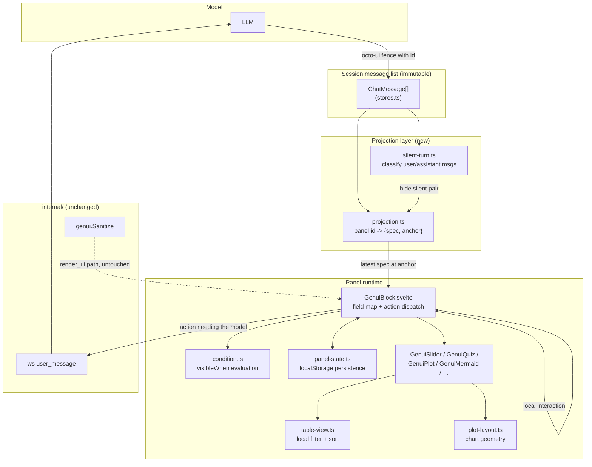

# GenUI Interactive Panels: Local Interaction, Silent Turns, Addressable Panels

## Version history

| Version | Date | Author | Description |
|---|---|---|---|
| 1.0 | 2026-08-20 | roy.lei (with Claude) | Initial design |

## Background

`dev-docs/genui-design.md` shipped GenUI as two slices (PR #2174, v1.16.0): a `render_ui` tool card and inline ` ```octo-ui ` fences whose interactive nodes round-trip a click back to the model as an ordinary user turn. That round-trip is the whole feedback loop today, and it has one shape: every interaction produces a new visible user message, a new model turn, and a new panel rendered below the old one.

That shape is wrong for the thing a panel actually is. Clicking a tab, filtering a table, or filling in a form is not a conversational act — it is manipulation of an object the model already handed over. Routing it through the conversation produces a transcript full of near-identical panels, leaves every earlier copy clickable and stale, costs a full model turn per click, and still loses every field value on page reload because the values live only in `GenuiBlock.svelte`'s in-memory `$state`.

This document makes a GenUI panel a self-contained, addressable, locally-interactive object: it has an identity that survives across turns, it responds to most interaction instantly with no model involvement, it can be updated in place when the model *is* needed, and its interaction state survives a reload. It also adds the node types that only become worth having once interaction is local: `slider`, `number`, and `textarea` as inputs, `collapsible`, `code`, `link` and `divider` for structure, and `plot`, `quiz`, and `mermaid` as content.

## Goals

- Interaction that the panel can answer by itself is answered by itself: no message, no model turn, no latency.
- Interaction that genuinely needs the model updates the existing panel in place, without adding a user bubble or an assistant bubble to the transcript.
- A panel's interaction state (selected tab, filter text, form values, quiz answers) survives a page reload.
- Add the nodes that local interaction makes worth having: `slider`, `number`, `textarea` as inputs, `collapsible`, `code`, `link`, `divider` for structure, and `plot`, `quiz`, `mermaid` as content.
- Every existing GenUI behaviour keeps working byte-identically when a spec omits the new fields.

## Non-goals

Deliberately excluded, each for a stated reason rather than by omission:

- **A persistent session-level dock. Not planned** — this replaces the "deferred pending a later design" status `genui-design.md` gave it. A dock existed on that list to solve panel accumulation: many near-identical panels piling up, needing de-duplication and re-ordering. Addressable panels solve that directly, at the cost of one optional field, and they keep a panel where the conversation put it. What a dock would still add is a panel surface *outside* the message flow — a product direction, not a fix for anything currently broken, and the single most reworked part of upstream dsh-genui's implementation. If it is ever revisited it should be argued from "users want a panel area detached from the conversation", not from panel accumulation, which no longer happens.
- **Cross-device state sync.** Interaction state is a property of a reader at a screen, not of the session on disk — the same judgement the client already applies to every other view-level preference it keeps in localStorage. A phone and a desktop viewing the same session keep independent panel state.
- **3D / WebGL nodes.** The dependency and the WebGL-context lifecycle cost are both large, and unlike `mermaid` there is no everyday use for them in this product.
- **The model automatically observing local interaction.** Local interaction is transparent to the model by construction (see "Model visibility" below). When the model needs to know, the user takes an explicit action that carries the field values — the mechanism `context.ts:26-27` already implements.
- **Expression evaluation of any kind.** No `eval`, no `new Function`, and no hand-written expression parser either — see "Local interaction" for how conditions are expressed instead.

## Terminology

- **Panel** — one GenUI spec rendered as one component tree. Today anonymous and one-shot; this document gives it an optional identity.
- **Panel id** — the `id` field a spec may carry. Scoped to one session. Two specs sharing an id in one session are two versions of the same panel.
- **Local interaction** — an interaction resolved entirely in the browser from data already present in the spec: switching a tab, filtering or sorting a table, toggling a conditional block, answering a quiz question.
- **Silent turn** — a model round-trip triggered by a panel action where neither the user message nor the assistant reply renders as a chat bubble; the reply's content replaces the panel's spec instead.
- **Anchor** — the position in the transcript where a panel renders. Defined precisely in "Projection" below.
- **Projection** — the derivation, from a session's message list, of which panel version renders at which anchor.

## Current state

Verified by reading the code, not assumed.

- **A spec has no identity.** `GenuiSpec` is `{title?: string, items: GenuiNode[]}` (`web/src/lib/genui/types.ts:163-166`); the Go guard's `Sanitize` (`internal/tools/genui/guard.go:62`) copies no id either. `web/src/lib/genui/types.ts:3-5` states the field shape is a contract locked in step across the Go guard, the TS guard, and the genui skill's teaching text — extending it means changing all three together.
- **Rendering is a pure function of message text.** `ChatView.svelte:2703` re-derives segments from `msg.content` on every render pass via `throttledSegments`, which caches per message id on an 80ms window and is forced fresh once `msg.streaming` goes false (`ChatView.svelte:1563-1572`). `splitOctoUiFences` parses and guards each closed fence on the spot (`fence-split.ts:78-86`). There is no state anywhere between the message text and the DOM, which is why "update the panel in place" cannot be done by rewriting history — the messages are immutable — and must be done as a projection over that text.
- **Field values are component-local and volatile.** `GenuiBlock.svelte:29` is the entire store: `const fields = $state<Record<string, string | boolean>>({})`. `GenuiTabs.svelte:7` keeps its active tab in a separate `let active = $state(0)` that nothing else can see or persist. Both die with the component.
- **The action message already has a parseable envelope.** `sendGenuiAction` emits `[octo-ui-action] ` followed by JSON (`ChatView.svelte:1579-1583`) through the same `send()` an ordinary typed message uses; `parseGenuiActionBubble` (`ChatView.svelte:1588-1599`) recognizes it on the way back in and renders a compact `<details>` chip (`ChatView.svelte:2591-2605`) instead of raw JSON. Adding a field to that JSON needs no wire change — it is a plain `user_message` frame.
- **Messages are a flat per-session array in the client.** `ChatMessage` is `{id, type, content, streaming, createdAt, tools, todos}` (`web/src/lib/types.ts:433-441`), held in a `Record<sessionId, ChatMessage[]>` (`stores.ts:391-393`). A projection over "every panel in this session" is a single pass over one array.
- **GenUI content never touches `{@html}`.** `GenuiNode.svelte:1-9` states the invariant explicitly: every text-bearing field renders through ordinary Svelte interpolation, and GenUI content never reaches the markdown/DOMPurify path at all. Node dispatch is a flat if/else-if chain over a closed set (`GenuiNode.svelte:36` onward) with no dynamic registry.
- **Heavy dependencies are already loaded dynamically.** `ChatView.svelte:1962` does `const { default: html2canvas } = await import('html2canvas')`, with the comment at line 1807 giving the reason: "dynamically imported so it never touches the main bundle." The build emits it as a separate chunk (`webdist/assets/html2canvas-*.js`, 194.8 KB). `vite.config.ts` sets `emptyOutDir: false` and notes that stale hashed assets left behind are inert.
- **The whole frontend is embedded in the binary.** `internal/server/static.go:11` is `//go:embed all:webdist` — every emitted chunk ships in the binary whether or not it is ever loaded.
- **Svelte components cannot currently be mount-tested.** `web/vitest.config.ts` sets `environment: 'jsdom'` and the svelte plugin but no `resolve.conditions`, so Vitest resolves Svelte's server build and `mount()` throws `lifecycle_function_unavailable` from `svelte/src/index-server.js:25`. Measured, not inherited from the prior document: adding `resolve.conditions: ['browser']` makes a leaf component mount and assert correctly, and the full existing suite still passes (25 files, 368 tests).
- **IM and TUI degrade at the fence boundary only.** `genui.StripOctoUIFences` (`internal/tools/genui/fence.go`) finds ` ```octo-ui ` / ` ``` ` line boundaries and substitutes `PlaceholderText` (`fence.go:11`) without parsing the JSON. New node types inside the fence are therefore invisible to it.
- **Artifacts can already render mermaid, at a cost.** Artifact previews are `sandbox="allow-scripts"` srcdoc iframes (`ArtifactsPanel.svelte:341`) with no CSP restricting external script sources (the `Content-Security-Policy: sandbox` header at `artifact_handler.go:87` applies to the standalone artifact endpoint). A model can write an HTML artifact that pulls mermaid from a CDN today — which works only online, renders in a separate panel rather than in the reply, and cannot participate in GenUI interaction.

## Overall architecture



The load-bearing property: **the projection is a pure function of the message list.** Nothing is stored server-side, no message is ever rewritten, and a page reload re-derives every panel's identity and content by replaying the same function over the same messages. Only the user's own interaction state (which tab, which filter text) lives outside that function, in localStorage.

## Detailed design

### Panel identity

`GenuiSpec` gains one optional field:

```ts
export interface GenuiSpec {
  id?: string
  title?: string
  items: GenuiNode[]
}
```

A spec **with** an id is an addressable panel: it participates in projection, its interaction state persists, and it can be the target of a silent turn. A spec **without** an id behaves exactly as it does today — rendered where it appears, state in memory only, actions producing a visible chip. Every pre-existing session takes the second path unchanged.

Guard rules for `id`, enforced identically in `guard.ts` and `guard.go`: a string of 1–64 characters matching `[A-Za-z0-9_-]+`. A spec whose `id` is present but fails validation has the field dropped and degrades to an anonymous panel — never an error, consistent with how every other guard violation degrades. The character class is not cosmetic: the id becomes part of a localStorage key and is compared against ids parsed out of model output, so restricting it to an unambiguous set removes any question of escaping.

### Projection: which fence renders where

New module `web/src/lib/genui/projection.ts`:

```ts
export interface PanelProjection {
  spec: GenuiSpec          // the newest version's spec
  anchorMsgId: string      // message whose fence renders the live panel
  anchorSegIdx: number     // segment index within that message
  versions: number         // how many versions have been seen
}

export function projectPanels(messages: ChatMessage[]): Map<string, PanelProjection>
```

One left-to-right pass over the session's messages. For each assistant message, its segments are taken from the same `splitOctoUiFences` the renderer uses; each `octo-ui` segment whose guarded spec carries an `id` updates that id's entry.

Two fields update on different rules, and the distinction is the whole design:

- **`spec` always takes the newest version.** Whatever the model most recently said this panel contains is what it contains.
- **`anchor` only moves when the fence appears in a message that renders as a bubble.** A silent-turn reply (defined below) updates content without moving the panel; a fence inside an ordinary reply — one where the model is also talking to the user — becomes the new anchor.

That rule reads naturally in both directions. Acting on a panel updates it where it sits. A model that brings a panel back up mid-conversation ("here's that dashboard again, now with last month's numbers") is making a new presentation of it, and it belongs at that point in the conversation, not scrolled off above.

At render time, `ChatView.svelte` renders a full `GenuiBlock` for an `octo-ui` segment when either the spec has no id (today's path), or the segment's `(msgId, segIdx)` equals that panel's anchor. A segment carrying an id that is *not* the anchor renders nothing — it belongs to a silent turn whose message is not rendered at all, so the case is unreachable in practice and the check is a guard against the model re-emitting a panel inside a message that also has prose.

**Cost control.** `projectPanels` is O(total message text) and the renderer calls it from a hot path, so it inherits the caching discipline `throttledSegments` established for #1114 (`ChatView.svelte:1554-1562`). The cache key is `(sessionId, messages.length, lastMessageContent.length, lastMessageStreaming)`; the same 80ms `RENDER_THROTTLE_MS` window applies while the last message streams, and a non-streaming last message always recomputes fresh. Because segment splitting is itself already cached per message, the incremental cost of a projection pass during streaming is bounded by the last message alone.

### Silent turns

A silent turn is entirely a client-side rendering decision. The message is sent normally, enters history normally, and the model sees it normally — the frontend simply does not draw it, and draws the reply into the panel instead of into a bubble. No new WS frame, no `Session` schema change, no backend awareness of the concept.

**Outbound.** `sendGenuiAction` gains a `panel` field when the acting panel has an id:

```
[octo-ui-action] {"panel":"sales","action":"refresh","fields":{"range":"30d"}}
```

The presence of `panel` is what marks the turn silent. An action from an anonymous panel omits it and keeps today's visible-chip behaviour, so nothing about existing specs changes.

**Inbound classification.** New module `web/src/lib/genui/silent-turn.ts`. A user message is hidden when `parseGenuiActionBubble` yields an object with a `panel` string. An assistant message is hidden and treated as a panel update only when **all** of the following hold:

1. The last thing *said* before it — skipping tool groups and progress rows, which are turn scaffolding rather than something said — is a hidden action message. Skipping matters because the archetypal silent turn is "the panel needs data the model doesn't have", which is exactly the case where the model calls a tool first.
2. Its content, trimmed, consists of exactly one ` ```octo-ui ` fence and nothing else — no prose before or after.
3. That fence's guarded spec carries an `id` equal to the preceding action's `panel`.

Failing any condition, the assistant message renders as an ordinary bubble. This is the single degradation path and it covers everything that can go wrong: the model wanted to explain something, the model addressed a different panel, the model produced no fence, the guard rejected the spec. Nothing is ever lost — worst case the reply appears as a normal message.

**Streaming.** The classification above needs the finished message, but the user must not stare at nothing while it streams. The reply is therefore treated as *provisionally silent* and re-evaluated on every delta by a cheap predicate that must be monotone: once false it stays false, or a bubble would appear and then vanish.

The subtlety is that the opening marker arrives one character at a time, and ` ```octo-ui ` is only recognized as a fence once complete — so the intermediate states (`` ` ``, ` `` `, ` ``` `, ` ```oct `) split as ordinary markdown. Rejecting those would make the predicate flicker false on the way in for *every* silent turn, which is the opposite of its purpose. A trailing run that is still a strict prefix of the opening marker therefore counts as "not prose yet". That tolerance is safe precisely because it is anchored to the end of the text: anything that later turns out to be something else — a fence in another language, prose beginning with a backtick — grows into a trailing segment that no longer prefixes the marker, and the answer goes false and stays false.

In the common case (the model does emit exactly one fence) the reply never appears as a bubble at all, and the panel swaps to the new spec when the turn ends.

**Panel pending state.** Sending a panel action marks that panel pending; `GenuiBlock` renders a subdued busy state and `dispatchAction` refuses further actions while pending. Local interaction stays live throughout — only actions are refused — so the panel must still look usable.

Pending is gated on the session actually running a turn, not on the shape of the transcript alone. That distinction is load-bearing: a turn that errors or is interrupted before producing any assistant message leaves the action as the last thing in history, and a purely history-derived answer would then hold the panel disabled forever, surviving reloads, because history is what it was derived from. The running flag comes from the server, so it clears on every ending a turn can have — completion, error, interrupt — and a reload reflects the server's view rather than a stale inference.

**Transcript honesty.** A hidden pair is hidden, not deleted — it is in history, in the session file, and in any export. Because a reader of an export would otherwise see a panel change with no visible cause, the transcript renders a single unobtrusive marker line in place of each hidden pair (`↻ panel updated`), expandable to the raw action JSON through the same `<details>` treatment the action chip already uses (`ChatView.svelte:2599-2605`). This keeps the conversation truthful without reintroducing the bubbles.

### Local interaction

Interaction that a panel can answer from data it already holds is expressed declaratively — structured objects the guard validates field by field, never a string to be parsed or evaluated. This keeps the "no expression evaluator anywhere" property `genui-design.md:321` set, and it means a malformed condition is a dropped field rather than a parse error.

**Conditional visibility.** Any node may carry:

```ts
visibleWhen?: {
  field: string
  // equality family — mutually exclusive
  equals?: string | number | boolean
  in?: (string | number)[]
  not?: string | number | boolean
  // range family — combinable with each other
  gt?: number
  gte?: number
  lt?: number
  lte?: number
}
```

The two families resolve by a single rule, chosen so that a slider's most common uses — a threshold and a range — are both expressible without any notion of boolean operators:

- If any of `equals` / `in` / `not` is present, that family decides, taking the first present in the order `equals`, `in`, `not` and dropping the others in the guard. Range predicates are ignored, so semantics never depend on JSON key ordering.
- Otherwise every present range predicate must hold, ANDed together. `{gte: 10, lt: 100}` is the half-open interval, which is what a range filter means in practice.

The node renders when the comparison holds. A `field` that has never been set compares as the empty string against the equality family — so `visibleWhen: {field: "mode", equals: "advanced"}` is hidden until the user picks `advanced`, the useful default — and fails every range predicate, so a range-gated node stays hidden until its slider is touched. Range predicates coerce the field value with `Number()` and fail closed on `NaN`, which means a range predicate pointed at a text field simply never shows the node rather than throwing.

**Table filtering and sorting.** The `table` node gains:

```ts
filterBy?: { field: string; column: string }   // case-insensitive substring match on that column
sortable?: boolean                             // clickable headers, local sort
```

`column` names one of the table's own `columns` entries; an unmatched name drops `filterBy` in the guard. Sorting is numeric when every cell in the column parses as a number, lexicographic otherwise, and is a stable three-state cycle (none → ascending → descending). Both operate on the rows already in the spec; neither ever asks the model for anything.

**Input nodes.** Three node types are added whose whole purpose is feeding the conditions above. None of them can reach the model on its own — a value only travels when a `button` fires — so all three are local-first by construction:

```ts
{ type: 'slider',   field: string, min: number, max: number, step?: number, label?: string, value?: number }
{ type: 'number',   field: string, min?: number, max?: number, step?: number, label?: string, value?: number }
{ type: 'textarea', field: string, label?: string, placeholder?: string, value?: string, rows?: number }
```

`slider` and `number` are two input affordances over the same kind of value; a spec may use either, and `visibleWhen`'s range family is what makes them useful without a round-trip. The guard requires `max > min` for a slider and drops the node otherwise (a zero-width slider has no meaningful rendering), defaults `step` to `(max - min) / 100`, and clamps `value` into range.

`number` is a **separate node type rather than an `inputType` on `input`**, and that is a security decision, not a taxonomy one: `types.ts:101-103` states that `input` has no `inputType` field by construction so that a password-style field cannot be expressed at all. Adding the field back — even restricted to `"number"` — reintroduces exactly the hole that comment closes, since the guard would then be the only thing standing between a model and `type="password"`. A distinct node keeps the property structural.

`textarea` is the one input here that does not serve local interaction: long free text is something the user writes *for the model*, so it exists to make a submit-style panel usable (a feedback box, a chunk of text to process) rather than to drive a condition. Its `rows` is clamped to 2–12.

**Quiz.** A new node type, scored entirely locally:

```ts
{
  type: 'quiz'
  field: string
  question: string
  options: { label: string; value: string }[]
  correct: string
  explanation?: string
}
```

Selecting an option writes to `field` (so `visibleWhen` can react to it) and immediately reveals whether it matches `correct`, with `explanation` shown once answered. The answer is part of persisted panel state, so a reload does not un-answer the question.

Scoring locally means `correct` is present in the page — a determined reader can see the answer before choosing. This is the accepted trade-off, and it is the right one here: these quizzes are a comprehension aid inside a conversation the user is already having with the model, not an assessment with an adversary. A server-scored quiz would need a model round-trip per question, which is exactly the interaction this design exists to remove.

### State persistence

New module `web/src/lib/genui/panel-state.ts`, following the shape `web/src/lib/notifications.ts:10-22` establishes — a module-level `KEY`, a `writable` seeded from storage at import, and a `subscribe` that writes back inside a try/catch so private-mode browsing degrades to in-memory rather than throwing. Reading additionally goes through its own try/catch here, since this value is JSON rather than the scalar that file stores.

```
localStorage key: "octo.genui-panel-state"
shape: { [sessionId]: { [panelId]: { [field]: string | number | boolean } } }
```

**The field-value type widens from `string | boolean` to `string | number | boolean`.** `slider` and `number` produce numbers, and storing them as strings would push a `Number()` coercion into every range comparison and hand the model `"30"` where it wrote `30`. The widening touches four declarations that must move together: `GenuiFieldContext.fields` and `setFieldValue` (`context.ts:13,23`), `GenuiBlock.svelte:29`'s `$state` map, and the `fields` object in the `[octo-ui-action]` payload. JSON round-trips numbers natively, so neither persistence nor the action envelope needs an encoding.

`GenuiBlock` seeds its `fields` map from this store on mount when the spec has an id, layering persisted values over the spec's declared defaults.

**A control's first report is a seed, not a change, and is not written.** Every control reports its value once on mount, before the user has done anything. Persisting that would fill storage with values nobody set, and — worse — pin the field to today's default, so a later version of the panel could never introduce a new one: the stale default would keep winning over the model's new one forever. Writes therefore begin from the second report onward. State that is not a model-declared field lives in the same map under reserved names keyed by the node's position in the tree: `__tab:<path>` for a tab index, `__open:<path>` for a fold state. That is what lets a selected tab and an unfolded section survive a reload. The guard rejects any model-supplied `field` beginning with `__`, so a spec can neither collide with nor address them.

**Writes are throttled, reads are not.** A slider drag changes its field on every pointer move, and each change re-evaluates conditions and re-renders — that is the point, and it is cheap. Persisting on every one of those is not: `panel-state.ts` debounces its localStorage write by 200ms, so a drag produces one write when the user settles rather than dozens mid-gesture. The in-memory field map updates synchronously regardless, so nothing about the UI waits on the debounce; only the durable copy lags, and it is flushed on `visibilitychange` so a tab closed mid-drag does not lose the value.

Two bounds keep this from growing without limit. Entries for sessions absent from the session list are dropped whenever the session list loads — the natural GC point, since that is when deletions become visible to the client. Independently, the store keeps at most 50 sessions, evicting least-recently-written first, so a client that never sees a session list still cannot grow unboundedly.

Persisted state is deliberately keyed by panel id only, not by panel version. When the model sends a new spec for the same panel, previously entered values survive if their fields still exist and are silently discarded if they do not — the behaviour a user expects when a dashboard refreshes under a filter they set.

### Model visibility

Local interaction is invisible to the model. Nothing is appended to any message, and no message is generated. When the model needs to know what the user did, the user takes an action — and `dispatchAction` already sends a snapshot of every field value in the panel alongside the action name (`context.ts:26-27`, implemented at `GenuiBlock.svelte:38-41`). The skill teaches the model to place a submit-style button on any panel whose field values it will need.

The cost of this choice is concrete and worth stating: a user who filters a table and then types "why is this one so low?" is asking about a view the model cannot see. The alternative — appending panel state to outgoing messages — inflates every message in every session for a case that an explicit button already covers, and would need its own format and its own rules about when to attach. The explicit path is kept.

### New nodes: layout and content

Three additions carry no new dependency and exist to keep a data-carrying panel readable:

```ts
{ type: 'collapsible', title: string, children: GenuiNode[], open?: boolean }
{ type: 'code',        code: string, lang?: string }
{ type: 'divider' }
```

`collapsible` is load-bearing for this design rather than cosmetic. Local interaction requires the model to ship the data the user might look at — `MAX_TABLE_ROWS` rises to 500 for exactly that reason — so panels get taller, and folding is the only lever that keeps them scannable. It is pure local interaction, like `tabs`: toggling writes to the persisted state map under a reserved `__open:<nodePath>` key, so a section the user folded stays folded across a reload. `open` sets the initial state only. Its `children` count against the same node budget as any container.

`code` renders monospaced and highlighted through the `highlight.js` core build the project already carries, with the same seven languages registered (javascript, typescript, go, python, bash, json, xml). A `lang` outside that set renders as plain monospaced text — the same degradation an unknown fence language already gets in markdown, and the reason this node adds no dependency. The `code` string is capped at `MAX_CODE_LEN`.

The registration (core build, language list, theme CSS) lives in `web/src/lib/highlight.ts`, which both `markdown.ts` and `GenuiCode.svelte` import. Keeping it in one module is what stops the code node from depending on markdown having been loaded first to have any language registered at all — a dependency that would hold in the running app by accident and fail anywhere markdown is not in play.

`link` is the only node in GenUI carrying a URL:

```ts
{ type: 'link', text: string, href: string }
```

`href` is checked against `markdown.ts`'s `isSafeHref` — exported for this purpose, per the requirement `genui-design.md`'s security design set down before any linking node existed: a second scheme whitelist would drift from the first. Only `http://`, `https://`, `mailto:` and `tel:` pass. The Go guard implements the same list independently, matching the rest of its relationship with the TS guard.

Two rejections drop the whole node rather than degrading it: an href outside the whitelist, and one longer than `MAX_HREF_LEN`. Rendering a rejected link as inert text would leave something that still looks clickable, and truncating a long URL would produce a link pointing somewhere other than where it claims — both worse than showing nothing. An empty `text` falls back to displaying the href. The rendered anchor carries `target="_blank"` with `rel="noopener noreferrer"`, so the opened page cannot reach back through `window.opener` and the chat session is never navigated away from.

Its existence also removes a workaround: sending the user to a URL previously required a `button`, spending a whole model turn to hand back a link.

`divider` has no fields and no state.

### New nodes: plot and mermaid

**`plot`** renders as hand-written SVG with no dependency at all:

```ts
{
  type: 'plot'
  plot: 'bar' | 'line' | 'area' | 'pie'
  series: { name?: string; points: { label: string; value: number }[] }[]
  stacked?: boolean    // bar and area only; ignored elsewhere
  legend?: boolean     // defaults to true when series.length > 1
  xLabel?: string
  yLabel?: string
  height?: number      // 80–400, default 160
}
```

Values are plain numbers, so there is nothing to evaluate — axis range, bar widths, and polyline points are arithmetic over the arrays. Colours come from a fixed eight-entry sequence of the CSS custom properties the other GenUI components already use, so plots follow the active theme and no spec ever names a colour. Non-finite values are dropped by the guard.

Multi-series introduces alignment questions that are settled here rather than left to the implementation:

- **The x axis is the union of every series' `label`, in first-appearance order.** Series need not agree on their labels or their length.
- **A label missing from a series is a gap, not a zero, for `line`** — the polyline breaks rather than diving to the axis, because a missing measurement and a measurement of zero are different claims. For `bar` and `area` it renders as zero height, which is what stacking requires to stay additive.
- **`pie` uses `series[0]` only** and ignores the rest; a pie of several series has no meaning, and silently rendering the first is friendlier than dropping the node.
- **`stacked` applies to `bar` and `area`.** Negative values in a stacked plot are clamped to zero, since a stacked chart mixing signs is unreadable and the alternative — diverging stacks — is more chart than this node should be.

Anything past this belongs in an artifact. That boundary is the same one the "Relationship to the Artifacts panel" section of `genui-design.md` draws, and it is why no charting library is introduced: a heatmap, a sankey, a map, or brush-and-zoom interaction is a deliverable that outlives the reply, and an artifact iframe already lets the model write a full charting page with arbitrary script.

**`mermaid`** renders a diagram from source:

```ts
{
  type: 'mermaid'
  code: string        // capped at 5000 characters
}
```

`GenuiMermaid.svelte` imports mermaid dynamically at first render — `const { default: mermaid } = await import('mermaid')` — mirroring the html2canvas precedent at `ChatView.svelte:1962` and its stated reason. It renders to an SVG string and shows a compact error line if mermaid rejects the source — a model writing invalid diagram syntax must never blank the panel. Three initialization settings carry weight:

- **`securityLevel: 'strict'`** — mermaid's own sanitizing of the labels it renders.
- **`htmlLabels: false`** — without it, flowchart labels render inside a `foreignObject`, which is in DOMPurify's SVG-disallowed list *and* its forbidden-contents list, so the sanitize step below removes the element together with its text. The diagram survives as boxes and arrows with no words in them: no error, no failure branch, just silently wordless. Off, mermaid emits native SVG text, which passes the sanitizer untouched and needs no exemption carved into the whitelist. `securityLevel` does not imply this — mermaid's `getEffectiveHtmlLabels()` defaults it to true independently.
- **An extended `secure` list** — `themeCSS` and `themeVariables` can be set from inside the diagram source through a `%%{init: …}%%` directive and are absent from mermaid's default `secure` list, so strict mode leaves them writable. They land in a style element that survives sanitizing, which would let a diagram pull an external `url()` — the only path in GenUI by which model output could make the page issue a network request. Adding them to `secure` closes it.

**This node breaks the `{@html}` invariant, and that has to be paid for.** `GenuiNode.svelte:1-9` states that GenUI content never uses `{@html}`; an SVG string cannot be inserted any other way. The exemption is contained as narrowly as possible:

- `GenuiMermaid.svelte` is the only component in the tree permitted to use `{@html}`, with a comment at the insertion point stating why and pointing here.
- The SVG passes through the project's existing DOMPurify with `USE_PROFILES: { svg: true, svgFilters: true }` before insertion, so the output is sanitized by our own policy rather than only by mermaid's internal one. Two independent sanitizers on this path is the same belt-and-braces posture the guard already takes by running in both Go and TypeScript.
- The `code` field itself is guard-capped like any other string field, and mermaid is configured with `startOnLoad: false` so nothing auto-executes against the surrounding document.

### Guard caps

Local interaction changes what a panel must carry: the model now ships the data the user will filter or switch between, rather than fetching it per interaction. That inflates **data volume**, not node count — a filterable table is one node with more rows, and a `visibleWhen` branch is a node that already had to exist. The caps move accordingly rather than uniformly:

| Cap | Now | After | Reason |
|---|---|---|---|
| `MAX_NODES` | 200 | 200 | Unchanged. Local interaction does not multiply nodes. |
| `MAX_DEPTH` | 8 | 8 | Unchanged. |
| `MAX_TABLE_ROWS` | 100 | 500 | The core local-filtering case is "here is the data set, narrow it down"; 100 rows is below the size where filtering is worth offering. |
| `MAX_TABLE_COLUMNS` | 50 | 50 | Unchanged. |
| `MAX_OPTIONS` | 50 | 50 | Also bounds `quiz` options. |
| `MAX_PANEL_ID_LEN` | — | 64 | New. |
| `MAX_MERMAID_LEN` | — | 5000 | New. Roughly a 150-line diagram; beyond that an artifact is the right vehicle. |
| `MAX_PLOT_POINTS` | — | 100 | New. Per series. Past this a plot is unreadable at chat width. |
| `MAX_PLOT_SERIES` | — | 8 | New. Matches the fixed colour sequence; a ninth series would have no distinct colour to take. |
| `MAX_TEXTAREA_LEN` | — | 5000 | New. Bounds a `textarea`'s model-supplied default, and is mirrored as the rendered element's `maxlength` so what the user types back is bounded by the same number. |
| `MAX_TEXTAREA_ROWS` | — | 12 | New. `rows` clamps to 2–12; taller than that belongs in an artifact, not a chat panel. |
| `MAX_CODE_LEN` | — | 5000 | New. A `code` node is an excerpt inside a reply; a whole file belongs in an artifact. |
| `MAX_HREF_LEN` | — | 2000 | New. Well past any real URL. Exceeding it drops the node — see above for why truncation is not an option here. |

`MAX_TABLE_ROWS` at 500 with `MAX_TABLE_CELL_LEN` at 2000 leaves a worst-case table well inside what the existing tool-result cards already render, and the guard trims rather than rejects, so an over-cap table still shows its first 500 rows.

**Which nodes each surface accepts.** `collapsible`, `code`, `divider`, `plot` and `mermaid` join the read-only whitelist, so a `render_ui` tool card can hold them: none carries a field or fires an action, and folding is presentation rather than input. `slider`, `number`, `textarea` and `quiz` join the interactive whitelist and stay off the tool-card path, which has no way to set a field.

Three spec fields are deliberately dropped by the Go guard while the TS guard keeps them, for one shared reason — they name a field, and the tool-card path accepts no field-bearing node: `visibleWhen`, `table.filterBy`, and a spec's `id` (identity exists so a later turn can re-address a panel; a tool card is a one-shot nothing addresses again). `table.sortable` survives on both, because sorting reads no field.

A node whose `field` is missing, empty, or reserved is dropped rather than rendered: an input nothing can read is a control that does nothing.

Numeric fields on `slider` and `number` (`min`, `max`, `step`, `value`) are clamped to finite values within ±1e9 and rejected as a node when non-finite, matching how `progress.value` is already clamped rather than trusted. `MAX_TEXTAREA_LEN` is the one cap that also bounds *user* input rather than only model output — every other cap governs what the model sends, but a textarea's whole purpose is to collect text that goes back out in an action payload, so the same bound applies in both directions.

### Skill teaching updates

`internal/skills/defaults/genui/SKILL.md` gains, in the same voice as its existing sections:

- When to give a panel an `id`: any panel the user is expected to act on more than once. Anonymous stays correct for a one-shot summary.
- The silent-turn contract, stated as a hard requirement because degradation is silent from the model's side: on receiving an action whose JSON carries `panel`, reply with **exactly one** ` ```octo-ui ` fence carrying that same `id` and no other text. Prose in that reply turns it into an ordinary visible message.
- The local-first principle: ship the data the user will switch between, and use `visibleWhen` / `filterBy` / `tabs` rather than a button, because a button costs a model turn and a condition costs nothing. Reserve actions for work the panel genuinely cannot do — fetching data it does not have, or taking a real-world action.
- Field-value visibility: local interaction is invisible until an action fires, so a panel whose values matter needs a submit button.
- The new node table entries for `slider`, `number`, `textarea`, `collapsible`, `code`, `divider`, `plot`, `quiz`, and `mermaid`, with their caps.
- How the input nodes pair with conditions: a `slider` or `number` is only useful next to a `visibleWhen` range predicate or a `filterBy`, and a `textarea` is only useful next to a submit button. A model that emits an input with nothing reading it has built a control that does nothing.
- The `mermaid` versus artifact boundary: a diagram that is part of this reply's structure is a `mermaid` node; a diagram that is a deliverable belongs in an artifact, per the existing artifact boundary section.

## Security design

- **No new code-execution surface.** Conditions are structured comparisons over a string/number/boolean map; there is no parser, no evaluator, and no place a model-supplied string is interpreted as anything but data. `plot` is arithmetic over numbers.
- **The `{@html}` exemption is confined to `GenuiMermaid.svelte`** and double-sanitized (mermaid `securityLevel: 'strict'` plus the project's DOMPurify under an SVG profile). No other component gains the capability, and the existing "never `{@html}`" comment in `GenuiNode.svelte` is amended to name the single exception rather than deleted.
- **Panel ids are constrained to `[A-Za-z0-9_-]{1,64}`** before being used in a localStorage key or compared against a model-supplied id, removing escaping questions by construction.
- **Reserved field names.** Model-supplied `field` values may not begin with `__`, keeping internal state (tab index, fold state) unaddressable from a spec. This is enforced on every path that names a field — input nodes, `table.filterBy`, and `visibleWhen`. The condition path matters even though a condition only ever reads: without it a spec could observe which tab is open or which section is unfolded.
- **Silent turns hide rendering, never history.** The messages are ordinary messages in the session file and in exports, and the transcript shows a marker where a hidden pair sits, so a panel can never change without a trace in the record.
- **No password-style input remains impossible.** `number` ships as its own node type precisely so `input` keeps having no `inputType` field at all (`types.ts:101-103`); the property stays structural rather than becoming something the guard has to enforce.
- **localStorage holds only what the user typed into a panel** — no credentials, no tokens. It is per-origin and per-device, consistent with how `notifications.ts` already treats client-side preference state.

## External dependencies

| Dependency | Version | How it is loaded | Size impact |
|---|---|---|---|
| `mermaid` | ^11.17.0 | Dynamic `import()` at first render of a `mermaid` node | Emitted entirely as lazy chunks; see the measurements below |

This is the only new dependency, and per `.octorules` it needs justification.

Measured from a real production build of this project rather than an isolated experiment:

| | Before | After |
|---|---|---|
| Main bundle (`index-*.js`) | 705.7 KB | 731.3 KB |
| Total `webdist` | ~1.1 MB | 4.5 MB |

**The main bundle grows by about 26 KB** — the new GenUI components, not mermaid. Every byte of mermaid lands in lazy chunks that a session touching no diagram never loads or parses, exactly as `html2canvas` already behaves (`ChatView.svelte:1962`).

What the growth costs in distribution: `go:embed all:webdist` ships every chunk in the binary, so the artefact grows by the full ~3.4 MB uncompressed. Against the release archives — `octo_1.16.0_darwin_arm64.tar.gz` is 14 MB — the compressed delta is roughly **+7%** of what a user downloads. The Go runtime, not the web bundle, dominates the artefact.

The largest chunks (`cytoscape` at 435 KB, `katex` at 259 KB) belong to architecture/mindmap diagrams and maths, which most diagrams never touch.

Trimming to a hand-registered subset via `mermaid.core` was evaluated and rejected: dropping cytoscape and katex saves roughly 215 KB gzipped — around 1.5% of the release archive — in exchange for pinning ourselves to mermaid's internal diagram-registration API, which would make every future mermaid upgrade an adaptation exercise. The full package with dynamic loading is the better trade.

## Configuration design

No new configuration. The `genui` skill remains individually disableable through the existing `Tools.DisabledSkills` mechanism, which is the only opt-out this feature needs; with the skill disabled the model is not taught the new fields, and specs omitting them behave exactly as they do today.

## Database design

No schema change. `Session` (`internal/agent/session.go:30-106`) is untouched: panel identity is derived from message text, and interaction state is client-side. This is the property that makes the whole feature revertible by reverting frontend code alone.

## Testing plan

`web/vitest.config.ts` gains `resolve.conditions: ['browser']`, which unblocks Svelte component mounting under Vitest. This was measured, not assumed: with the line added, a leaf GenUI component mounts and asserts correctly, and the existing suite still passes in full (25 files, 368 tests). It closes the component-test gap the previous design had to accept.

| # | Scenario | Setup | Expected |
|---|---|---|---|
| 1 | Anonymous spec unchanged | A spec with no `id` | Renders where it appears; actions produce a visible chip; no persistence — byte-identical to v1.16.0 |
| 2 | Projection picks newest spec | Three versions of panel `p` across three messages | `projectPanels` returns the third spec |
| 3 | Anchor holds through silent turns | Panel `p` seeded in an ordinary reply, then updated by two silent turns | Anchor stays at the seeding message |
| 4 | Anchor moves on a visible reply | Panel `p` re-emitted inside a reply that also has prose | Anchor moves to the new message |
| 5 | Silent classification, happy path | Action with `panel:"p"`, reply is exactly one fence with `id:"p"` | Both messages hidden; panel content swaps; marker line rendered |
| 6 | Degrade: prose in reply | Same action, reply has a sentence before the fence | Reply renders as an ordinary bubble; panel leaves pending |
| 7 | Degrade: id mismatch | Reply's fence carries `id:"q"` | Reply renders as an ordinary bubble |
| 8 | Degrade: no fence | Reply is plain text | Reply renders as an ordinary bubble |
| 9 | Streaming reclassification | Reply streams a fence, then trailing prose | Bubble appears at the first non-whitespace text after the fence closes and does not disappear again |
| 10 | Condition evaluation | `visibleWhen` with each of `equals` / `in` / `not`, plus an unset field | Unset compares as empty string; precedence `equals` > `in` > `not` when several are present |
| 11 | Table filter and sort | Filter field set; a numeric and a text column sorted | Substring match is case-insensitive; numeric column sorts numerically; sort cycles in three states |
| 11b | Range predicates | `visibleWhen` with `gt`/`gte`/`lt`/`lte`, singly and combined; equality family present alongside a range one; range pointed at a text field | Ranges AND together; equality family wins and ranges are ignored when both present; `NaN` coercion fails closed (node hidden) |
| 11c | Slider bounds | `max <= min`; `step` omitted; `value` outside range | Node dropped when `max <= min`; `step` defaults to `(max-min)/100`; `value` clamped into range |
| 11d | Slider drag persistence | A drag producing many rapid field changes | Field map and conditions update on every change; localStorage writes debounce to one after 200ms; a `visibilitychange` mid-drag flushes |
| 11e | Number vs input separation | A spec sending `input` with an `inputType` field | Field dropped by the guard; `input` still renders as plain text |
| 11f | Textarea bounds | `rows` outside 2–12; default `value` over 5000 chars | `rows` clamped; value trimmed; rendered element carries `maxlength=5000` |
| 11g | Collapsible fold state | Fold a section, reload | Stays folded; `open` only seeds the first render; `__open:` key unaddressable from a spec |
| 11h2 | Link scheme whitelist | `javascript:`, `data:`, `file:`, `vbscript:`, protocol-relative, empty, and the same with odd casing/whitespace | Node dropped in both guards; whitelisted schemes preserved verbatim |
| 11h3 | Link degenerate input | href over `MAX_HREF_LEN`; missing `text` | Node dropped; `text` falls back to the href |
| 11h4 | Streaming predicate, every prefix | Feed each prefix of a real silent reply, and of a reply that starts with prose | Never false for the silent one; once false for the other, false for every longer prefix |
| 11h5 | Silent turn across a tool call | Action, tool group, progress row, then a matching fence | Classified silent; a real assistant message in between is not skipped |
| 11h6 | Mermaid label survival | Sanitize a foreignObject label and a native text label under the SVG profile | foreignObject label is removed entirely; text label survives — the assumption `htmlLabels: false` rests on |
| 11h7 | Persistence seeding | Mount a panel, read storage before any interaction, then change a value | Nothing stored until the change; the change is stored |
| 11h8 | Storage of the wrong shape | Entries that are numbers, missing `panels`, null `panels`, arrays, bare strings | No throw; a malformed entry is dropped while well-formed siblings survive |
| 11h | Code highlighting | Registered lang, unregistered lang, no lang | Highlighted / plain monospace / plain monospace — never an error |
| 11i | Plot multi-series alignment | Series with differing labels and lengths | X axis is the union in first-appearance order; `line` breaks at gaps; `bar`/`area` treat gaps as zero |
| 11j | Plot degenerate inputs | `pie` with several series; negative values under `stacked`; a ninth series; non-finite values | First series only; negatives clamped to zero; trimmed at 8; non-finite dropped |
| 12 | Quiz scoring | Correct and incorrect selection | Immediate verdict, `explanation` shown, answer written to the field map |
| 13 | State survives reload | Set string, boolean and numeric fields, switch tab, remount from persisted store | Values and tab restored with types intact (a slider's `30` returns as a number, not `"30"`); fields absent from a newer spec dropped silently |
| 14 | State GC | Store holding a session absent from the session list; store exceeding 50 sessions | Absent session dropped on list load; least-recently-written evicted past 50 |
| 15 | Guard: panel id | Ids that are too long, wrongly charactered, non-string | Field dropped, spec still renders anonymously |
| 16 | Guard: reserved fields | Spec with `field: "__tab:0"` | Field dropped |
| 17 | Guard: new caps | Table over 500 rows, mermaid over 5000 chars, plot over 100 points | Trimmed, never rejected |
| 18 | Mermaid sanitization | Diagram source attempting script injection through a label | Rendered SVG contains no script; DOMPurify strips it |
| 19 | Mermaid failure | Invalid diagram syntax | Inline error line; the rest of the panel still renders |
| 20 | IM / TUI degrade | A reply with an id-bearing fence containing new node types | `StripOctoUIFences` substitutes the placeholder as before — new node types change nothing |
| 21 | Old sessions | Resume a pre-v1.16.0 session and a v1.16.0 session | No ids anywhere; projection returns an empty map; rendering identical to today |

Go-side coverage extends the existing `internal/tools/genui` table tests for the new fields and caps. Manual verification: a browser click-through against an isolated test server confirming the silent-turn loop end to end with a real model turn, including the degradation path — the logic tests cover classification, but "the panel visibly swaps and no bubble appears" is a rendering property worth seeing once.

## Compatibility design

- **Data compatibility.** No persisted schema changes. Old sessions contain no ids, so `projectPanels` returns an empty map and every fence renders through the existing anonymous path (test #21).
- **Logic compatibility.** Every new spec field is optional, and every new node type is additive to a whitelist that drops unknown types rather than failing. A v1.16.0 spec is a valid spec here with identical behaviour.
- **Old clients, new sessions.** A stale browser tab running v1.16.0 code against a session containing id-bearing fences renders every version as its own panel — that is, current behaviour — and the `panel` key in an action JSON is ignored by `parseGenuiActionBubble`, which only requires `action` to be a string (`ChatView.svelte:1593`). Degraded, not broken, and self-resolving on reload.
- **New clients, old model behaviour.** A model that never emits an `id` gets exactly today's feature set. Nothing forces adoption.
- **Protocol compatibility.** No new WS message types and no new fields on existing frames: the action envelope is JSON inside a message body that the backend treats as opaque text.
- **IM and TUI.** Unchanged. `StripOctoUIFences` works on fence boundaries and never parses the body, so ids and new node types are invisible to it (test #20). Silent turns cannot arise there because those transports have no panel to click.
- **Cross-region considerations.** Not applicable — single-deployment OSS project, no region split.

## High availability design

### Circuit breaking and degradation

Every failure mode in this design has a defined degradation, and none of them is an exception reaching the user:

- A malformed or unknown spec field is dropped by the guard; the panel renders without it.
- A silent turn that does not match its contract becomes an ordinary visible message — the model's output is never discarded.
- A turn that errors or is interrupted leaves the panel on its current spec with an inline error line, not blank and not stuck pending.
- A mermaid render failure produces an inline error line inside the panel; the surrounding nodes render.
- localStorage being unavailable (private mode, quota) degrades to in-memory state through the same try/catch pattern `notifications.ts:21` already uses.

### Load protection

- Projection is a single pass with the same cache and 80ms throttle as segment splitting, so it cannot reintroduce the O(n²) streaming hazard of #1114.
- `MAX_TABLE_ROWS` rising to 500 is the only cap increase; filtering and sorting operate on arrays bounded by it, and the DOM renders the filtered subset.
- Mermaid loads once per page and only when a diagram is actually rendered; the rendered SVG is cached per `code` string so re-renders from unrelated state changes do not re-invoke it.

## Monitoring and alerting

No new server-side metrics — the feature adds no backend path. Client-side, guard drops and silent-turn reclassifications log through `console.warn`, matching the existing convention for soft failures in this frontend.

## Data warehouse sync

Not applicable — octo-agent has no data warehouse.

## Rollout plan

Ships as an ordinary version bump; there is no feature-flag system in this project. The feature is additive and self-disabling in the absence of model adoption: with the `genui` skill disabled, or with a model that never emits an `id`, behaviour is identical to v1.16.0.

## Rollback plan

### Release order

Single repository, single binary — the guard change (Go), the frontend, the skill text, and the new dependency ship together. `webdist` must be rebuilt before tagging, since it is gitignored and embedded (`internal/server/static.go:11`).

### Code rollback

Reverting the PR is sufficient and lossless. No data was migrated and nothing else depends on panel identity existing. A session containing id-bearing fences, opened on a reverted build, renders every panel version inline as an ordinary panel and shows the `[octo-ui-action]` messages as chips again — visibly more cluttered, fully functional.

### Data rollback and repair

Not applicable server-side. Client-side, a stale `octo.genui-panel-state` key left behind by a reverted build is inert: no reverted code reads it, and it is bounded by its own eviction rules.

### Configuration rollback

Not applicable — no configuration was introduced.
