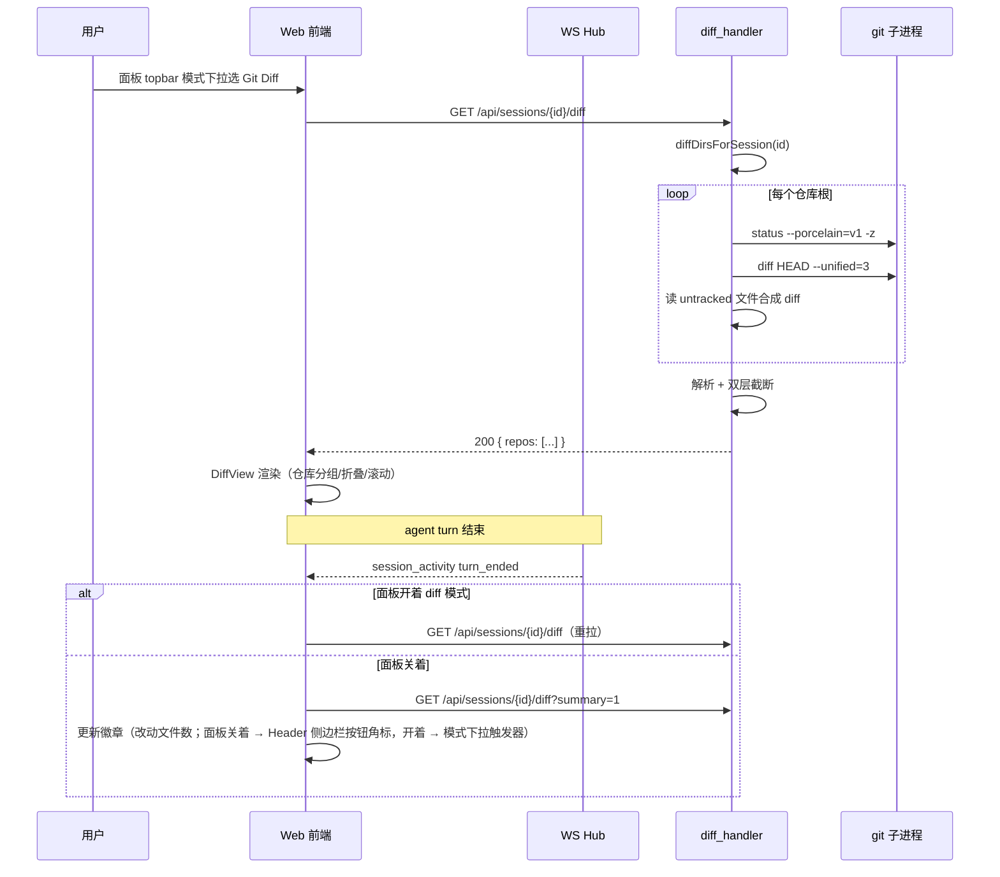

# 侧边栏 Git Diff Review 面板 — 技术设计

## 背景与目标

octo 的 Web UI 右侧栏（`web/src/components/ArtifactsPanel.svelte`）目前只有两种模式：会话制品（`'session'`）和 Light Apps（`'lightapps'`），由 `panelContent` store 控制（`web/src/lib/stores.ts:100`）。

coding agent 的高频场景是：agent 跑完一个 turn、改了一批文件，用户想立刻 review 这些改动。目前只能切到终端手动跑 `git diff`，打断了"看结果 — 反馈 — 继续"的回路。

**目标**：在右侧栏新增 `'diff'` 模式，展示当前会话关联工作区的未提交改动（含 untracked 新文件），让用户不离开 Web UI 就能完成代码 review。发现问题后的处理动作是回到聊天里告诉 agent 怎么改，面板本身纯只读。

**非目标**：

- 任意两个 git ref 之间的对比（branch vs main、commit range）——那是 git 客户端的活
- staged / unstaged 分组管理、revert、stage 等写操作
- 移动端和 TUI（API 设计成平台无关，移动端以后可接）
- diff 内的语法高亮（与现有 `code-view` 一致，只做行级 `+`/`-`/`@@` 着色）

## 术语

| 术语 | 含义 |
|---|---|
| 会话关联目录 | 一个会话可触及的目录集合：会话自身工作目录 + 所属 project 的 `WorkingDir`（workspace）和 `SourceDirs`（外部挂载仓库，见 `internal/server/session_groups.go:74-78`） |
| untracked 合成 diff | 对 git 未跟踪的新文件，服务端读文件内容包装成标准 unified diff 的 new-file 格式（`--- /dev/null` / `+++ b/<path>`），与 tracked 改动走同一渲染管线 |

## 核心行为决策

以下决策逐条列出理由：

1. **review 对象 = 会话工作区的未提交改动**（`git status` + `git diff`，含 untracked）。回答"agent 在这个会话里改了什么"，不做任意 ref 对比。
2. **目录解析 = 聚合所有关联目录**。扫描会话工作目录 + project 的 `SourceDirs`，逐个探测是否为 git 仓库，把有改动的仓库按组返回。单仓库场景 UI 不显示分组头，多仓库才显示。workspace 目录（`~/Octo/...`）通常不是 git 仓库，探测后直接跳过。
3. **diff 基准 = HEAD 合并视图**（`git diff HEAD`，staged + unstaged 合并为一份），文件列表上另带 staged 徽章。理由：review 的核心问题是"最终会变成什么样"；staged 状态只是附属信息。同一个文件两边都有改动时也不需要用户脑内合并。
4. **untracked 文件合成 diff**。不用 `git add -N`（intent-to-add）——它会修改用户的 git index，agent 的会话绝不该碰用户的 git 状态。改为服务端读文件内容合成 new-file diff，单文件内容上限 1 MB，二进制文件（按 git 惯例，前 8 KB 内含 NUL 字节）标记为 binary 跳过。
5. **刷新 = 打开时加载 + 手动刷新按钮 + turn 结束自动刷**。前端已通过 `session_activity` WS 事件拿到 `turn_ended`（`web/src/lib/types.ts:402-405`），收到当前会话的 `turn_ended` 时：面板开着 diff 模式则重新拉取；面板关着则拉取轻量摘要更新徽章。不轮询。
6. **入口与模式切换 = Header 保持侧边栏纯开关，模式下拉收进面板 topbar**。Header 的 panel 按钮语义不变（开/关侧边栏，`Header.svelte:108-112`），不新增 Header 按钮、不自动打开面板（抢占用户当前阅读状态）。面板 topbar 最左的图标位（制品模式下显示文件类型图标处）改为**模式下拉触发器**：图标即当前模式（📄 制品 / 🔀 Git Diff），点击展开菜单切换 `panelContent`。默认模式记忆上次选择（localStorage，与面板宽度持久化同一先例，`ArtifactsPanel.svelte:181-189`），新用户首次默认制品模式。**改动数徽章借位**：面板关着时挂在 Header 的侧边栏开关按钮角标（按钮行为不变，只加角标，负责把用户叫回来）；面板开着时挂在模式下拉触发器图标和下拉的 Git Diff 菜单项上。
7. **纯只读**。不提供 revert / stage 按钮：发现问题回聊天让 agent 改，这是 coding agent 相对 git 客户端的独特交互回路，也避免不可逆误操作。
8. **大小防护 = 双层上限**：单文件 diff 最多 2000 行（超出截断并标注），整个响应最多 20000 行（超出的文件只返回元信息不带内容）；被截断的文件可通过单文件端点按需取完整 diff。
9. **渲染 = 服务端解析成 JSON，前端 GitHub unified 风格**。文件分组、可折叠、单栏顺序滚动 + 顶部锚点跳转。解析放服务端（Go 解析 unified diff 比前端 TS 解析稳妥，且截断逻辑必须在数据源头做）。320-420 px 窄面板可读，不做 side-by-side。
10. **平台 = 仅桌面 Web**。API 平台无关，移动端后续可接。

## 架构

```mermaid
flowchart TB
    subgraph Web 前端
        H[Header.svelte<br/>侧边栏开关（语义不变）<br/>+ 面板关闭时的借位徽章]
        P[ArtifactsPanel.svelte<br/>topbar 模式下拉 + 'diff' 分支]
        DV[diff/DiffView.svelte<br/>仓库分组 / 文件折叠 / hunk 渲染]
        DS[lib/diff.ts<br/>API 调用 + stores]
    end
    subgraph Server
        GH[diff_handler.go<br/>GET /api/sessions/{id}/diff<br/>GET /api/sessions/{id}/diff/file]
        GS[diff_git.go<br/>git 子进程 + porcelain 解析]
        GP[diff_parse.go<br/>unified diff → JSON + 截断]
    end
    H -->|开关侧边栏| P
    P --> DV --> DS -->|HTTP| GH
    GH --> GS --> GP
```

职责边界：

- `diff_handler.go`：HTTP 层，会话目录解析、参数校验、错误映射。**调用方只传 session id，绝不接受路径参数**——沿用 `handleNativeOpenFolder` 的安全模型（`internal/server/native_handlers.go:415-421`：目录只能由服务端解析，caller-controlled 路径是攻击面）。
- `diff_git.go`：所有 `git` 子进程调用集中于此，统一 15 s `context.WithTimeout`、`executil.SetNoWindow`（先例：`internal/tools/overwrite_backup.go:83-87`）。仓库探测沿用 `project_envcontext.go:241-247` 的模式（`git -C <dir> rev-parse` 失败即非仓库）。
- `diff_parse.go`：unified diff 文本 → 结构化 JSON，同时执行截断。纯函数，无 IO，便于表驱动测试。

不引入任何第三方依赖（无 git 库、无 diff 解析库），符合 `.octorules` 的依赖纪律。

## 详细设计

### 会话关联目录解析

新增 `diffDirsForSession(sessionID string) []string`，组合两个现有解析器，去重后返回：

1. 会话工作目录：`sessionCwdByID(sessionID)`（`internal/server/server.go:1989`）
2. 会话所属 project 的目录：`projectForSession(sessionID)`（`internal/server/session_groups.go:334`）返回的 `*sessionGroup`，取其 `WorkingDir` 与 `SourceDirs`（`internal/server/session_groups.go:74-78`）

对每个目录跑 `git -C <dir> rev-parse --show-toplevel`（2 s 超时，同 `project_envcontext.go:242-244` 的先例）：失败 → 非仓库，跳过；成功 → 以 toplevel 去重（worktree 的 `.git` 是文件而非目录，`rev-parse` 天然兼容；source dir 指向仓库子目录时归一到仓库根）。

### 每仓库数据收集

对每个仓库根依次执行（均 15 s 超时）：

| 步骤 | 命令 | 用途 |
|---|---|---|
| 1 | `git status --porcelain=v1 -z` | 文件列表 + XY 状态码（X=index/staged，Y=worktree/unstaged），`-z` 避免文件名转义问题 |
| 2 | `git diff HEAD --unified=3` | staged+unstaged 合并 diff（基准决策 #3）。仓库无任何提交（`HEAD` 不存在）时退化为 `git diff --cached` + 全部文件按 untracked 处理 |
| 3 | 读 untracked 文件内容 | 对 porcelain 中 `??` 条目，服务端 `os.ReadFile` 合成 new-file diff（决策 #4）。路径必须落在该仓库根之内（`filepath.Clean` + 前缀校验，先例：`resolveArtifactPath`，`internal/server/artifact_handler.go:242-253`），符号链接逃逸用 `filepath.EvalSymlinks` 后再校验 |

staged 徽章的数据来源：porcelain 条目的 X 列非空格且非 `?` 即为 staged。

### unified diff 解析与截断

`diff_parse.go` 把 `git diff` 输出解析为下述 JSON 结构。截断在解析阶段完成：

- 单文件：hunk 行数（context + add + del）累计超 **2000** 行 → 截断，`truncated: true`，记录 `total_lines`
- 全响应：所有文件的行数累计超 **20000** 行 → 后续文件只保留元信息（`patch: null`），`omitted: true`
- 合成 untracked diff 同样过这两层上限（单文件内容读取本身先卡 1 MB）

### API 设计

路由注册沿用 `s.api("METHOD /api/...", handler)` 模式（`internal/server/server.go:849-861` 区域）。

#### `GET /api/sessions/{id}/diff`

返回会话所有关联仓库的改动。查询参数：

| 参数 | 说明 |
|---|---|
| `summary=1` | 轻量模式：只跑每个仓库的 `git status --porcelain`，返回文件计数，供徽章用。不跑 diff、不读文件内容 |

响应（200）：

```json
{
  "repos": [
    {
      "root": "/Users/roy/Projects/github/octo-agent",
      "name": "octo-agent",
      "branch": "feature/diff-panel",
      "files": [
        {
          "path": "web/src/lib/stores.ts",
          "status": "M",
          "staged": true,
          "adds": 12,
          "dels": 3,
          "binary": false,
          "truncated": false,
          "omitted": false,
          "total_lines": 15,
          "patch": {
            "old_path": "web/src/lib/stores.ts",
            "new_path": "web/src/lib/stores.ts",
            "hunks": [
              {
                "header": "@@ -88,6 +88,9 @@",
                "lines": [
                  { "kind": "context", "content": "export const artifactSel = writable(0)" },
                  { "kind": "add", "content": "export const diffOpen = writable(false)" }
                ]
              }
            ]
          }
        }
      ]
    }
  ],
  "truncated_files": 0,
  "omitted_files": 0
}
```

字段约定（全部 verbatim，实现时逐字对齐）：

- `repos[].root`：仓库根绝对路径；`name` 取 `filepath.Base(root)`；`branch` 取 `git rev-parse --abbrev-ref HEAD`（detached HEAD 时为 `"HEAD"`，前端显示为 short commit 由 `git rev-parse --short HEAD` 补充）
- `files[].status`：`"M" | "A" | "D" | "R" | "C" | "T" | "?"`（`?` = untracked，`R`/`C` 时 `old_path` ≠ `new_path`）
- `files[].staged`：porcelain X 列判定
- `files[].patch`：`null` 当 `binary` 或 `omitted` 为 true
- `hunks[].lines[].kind`：`"context" | "add" | "del"`（hunk 头 `\ No newline at end of file` 行归为 context 附注，前端不特殊渲染）
- `summary=1` 时 `files[]` 每项只有 `path` / `status` / `staged`，`patch`/`adds`/`dels` 不出现

错误映射：

| 场景 | HTTP | body `error` |
|---|---|---|
| 会话不存在 | 404 | `"session not found"` |
| 没有任何关联目录是 git 仓库 | 200 | `{"repos": [], ...}`，前端空态区分处理 |
| 机器上没有 git 二进制 | 500 | `"git not available"`（`exec.ErrNotFound` 判定） |
| 单仓库 git 命令失败/超时 | 该仓库降级：`repos[]` 中保留条目，加 `"error": "<message>"` 字段，不影响其他仓库 |

#### `GET /api/sessions/{id}/diff/file?repo=<abs path>&path=<rel path>`

单文件完整 diff，供被截断/被省略文件"展开"用。校验链：

1. `repo` 必须在 `diffDirsForSession` 解析出的仓库根集合内（服务端重新解析，不信任客户端）
2. `path` 必须出现在该仓库当前 `git status --porcelain` 结果中
3. untracked 文件内容读取的 confinement 校验同聚合端点

响应：`{"file": { ...同 files[] 元素结构, patch 为完整内容 }}`。单文件端点不适用 2000 行截断（用户显式请求完整内容），但 untracked 合成仍卡 1 MB 读取上限，二进制仍跳过。

**不做缓存**：diff 数据生命周期按秒计，缓存只会引入失效 bug；每次请求现算。

### 时序



### 前端设计

#### Store 变更（`web/src/lib/stores.ts`）

- `panelContent` 类型扩展为 `'session' | 'lightapps' | 'diff' | null`（`web/src/lib/stores.ts:100`）
- 新增 `diffData = writable<DiffResponse | null>(null)`、`diffLoading = writable(false)`、`diffBadge = writable<Record<string, number>>({})`（徽章按会话记，切换会话不串）
- 面板模式持久化：localStorage 键 `octo.panelMode`，取值 `'session' | 'diff'`，打开侧边栏时恢复上次模式，缺省 `'session'`（宽度持久化先例：`ArtifactsPanel.svelte:181-189` 的 `octo.panelWidth`）

#### 组件

| 文件 | 职责 |
|---|---|
| `web/src/components/diff/DiffView.svelte` | diff 模式主体：仓库分组头（单仓库时省略）、文件卡片（可折叠）、hunk 行渲染（`+` 绿 / `-` 红 / `@@` 蓝紫，复用现有 CSS 变量）、截断标注 + "查看完整文件"按钮、staged 徽章、顶部锚点跳转条 |
| `ArtifactsPanel.svelte` | 新增 `{:else if $panelContent === 'diff'}` 分支：topbar（左侧模式下拉触发器 + 仓库名 + 分支 + 手动刷新按钮 + 复用现有 expand/close 控件）、body 挂 `DiffView`、无 footer 操作按钮（纯只读）。**模式下拉触发器在制品 / diff 两种模式间共用**：制品模式下占用现有文件类型图标位（`ArtifactsPanel.svelte:303`），diff 模式下在 topbar 同一位置；菜单项「制品 / Git Diff」，选中即 `panelContent.set(...)`；触发器图标带 `diffBadge` 角标。Light Apps 模式维持现状不加下拉（其入口独立） |
| `web/src/lib/diff.ts` | `api.getSessionDiff(id)` / `api.getSessionDiffSummary(id)` / `api.getSessionFileDiff(id, repo, path)`，类型定义放 `lib/types.ts` |
| `Header.svelte` | panel toggle 按钮语义不变（纯侧边栏开关）；仅在其右上角加徽章角标，面板关闭且 `diffBadge[activeSessionId] > 0` 时显示（先例 `Header.svelte:108-112` 的显隐逻辑） |

#### WS 接线

`session_activity` 的 `turn_ended` 现有消费点在 `lib/unread.ts`（`unread.ts:14-18` 注释描述了该事件的语义）。diff 模块新增独立订阅：事件 `session_id` 等于当前激活会话时触发刷新/徽章更新。

#### i18n

新增 `diff.*` 与 `panel.*` 键，en / zh 双语（`web/src/lib/i18n.ts`，两个词典对象）：`panel.mode_artifacts`（"制品"）、`panel.mode_diff`（"Git Diff"）、`diff.title`、`diff.refresh`、`diff.no_repo`（"该会话没有关联的 git 仓库"）、`diff.clean`（"工作区干净，没有未提交改动"）、`diff.truncated`（"已截断，共 N 行"）、`diff.show_full`（"查看完整文件"）、`diff.binary`、`diff.staged`、`diff.repo_error` 等。

## 测试计划

### Server（`go test -race ./internal/server/`）

测试基建沿用 `overwrite_backup_test.go:40-59` 的模式：`t.TempDir()` + 真实 `git init` / commit 构造仓库。

| 用例 | 断言 |
|---|---|
| 单仓库 mixed 改动 | staged+unstaged+untracked 同时存在，响应文件数、状态码、staged 标志正确 |
| 多仓库聚合 | session 挂 2 个 source dir 仓库，两组都返回，按 root 去重 |
| 非仓库目录 | workspace（非 git）+ 1 个仓库 → 只返回仓库；全非仓库 → `repos: []` |
| worktree | 在 worktree 目录上探测与 diff 正常（`.git` 文件形式） |
| 无提交的仓库 | `git diff HEAD` 失败时退化路径，新仓库全部文件按 untracked 合成 |
| 截断 | 构造 >2000 行单文件 diff → `truncated: true`；构造总量 >20000 行 → 后续文件 `omitted: true, patch: null` |
| untracked confinement | `diff/file` 端点：仓库根集合外的 `repo` 参数 → 403；不在 status 结果中的 `path` → 404；符号链接指向仓库外 → 拒绝 |
| 二进制 | untracked 二进制文件（写入含 NUL 的内容）→ `binary: true, patch: null` |
| 会话不存在 | 404 |
| summary 模式 | 不执行 diff（可通过注入计时/计数断言只跑了 status），返回计数正确 |
| 并发 | 同会话两个并发请求不串数据（无共享可变状态，靠 `-race` 兜底） |

### Web（vitest）

- `lib/diff.ts`：API 响应 → store 的映射、徽章计数聚合（多仓库求和）
- `DiffView.svelte`：截断文件渲染"查看完整文件"并触发单文件请求；`patch: null` 的文件不渲染 hunk 区；单仓库不显示分组头
- WS 模拟：`turn_ended`（当前会话）触发重拉；非当前会话不触发

### 手工验证

真实跑一个 agent 会话改文件 → 打开面板看 diff；`git add` 部分文件看 staged 徽章；turn 进行中手动刷新。

## 兼容性

逐项说明为何不受影响：

- **现有 API**：纯新增两个端点，不改任何现有端点的路径、参数、响应字段。
- **现有前端模式**：`'session'` / `'lightapps'` 分支不动；`panelContent` 加联合类型成员，现有赋值与比较（`=== 'session'` 等）语义不变。
- **数据/存储**：无持久化、无 schema 变更、无迁移。
- **CLI / TUI**：不涉及（`internal/server` 之外零改动）。
- **IM 渠道**：diff 端点不会被 IM 桥调用；即使被调到，行为与 Web 一致（只读、session 解析）。
- **WS 协议**：不新增事件类型，只新增对现有 `session_activity` 事件的消费者。

## 安全

- **路径攻击面**：与 `handleNativeOpenFolder` 同一模型（`native_handlers.go:415-421`）——请求只带 session id，目录服务端解析。唯一的显式路径参数（`diff/file` 的 `repo`/`path`）必须命中服务端现场解析出的仓库根集合和 git status 结果，双重白名单。
- **untracked 内容读取**：`filepath.Clean` + 仓库根前缀校验 + `EvalSymlinks` 防符号链接逃逸；1 MB 上限防读巨型文件；二进制跳过防渲染控制字符。
- **git 子进程**：所有仓库路径来自服务端解析，无 shell 拼接（`exec.Command` 数组参数）；15 s 超时防挂死。
- **不碰用户 git 状态**：全程只读命令（status/diff/rev-parse/log），明确排除 `git add -N` 这类写 index 的操作。
- **loopback 门**：不施加。diff 端点的敏感度与 artifact 端点同级（都读会话相关文件内容），artifact 端点（`artifact_handler.go`）无 loopback 限制，保持一致；远端 IM 用户 review 自己会话的改动是合理诉求。

## 高可用

- **超时**：仓库探测 2 s，数据收集 15 s/仓库，整体请求受单仓库失败降级保护（一个仓库挂掉不影响其他仓库返回）。
- **资源**：无缓存、无后台 goroutine；每次请求的内存占用由双层行数上限封顶（20000 行 × 平均行长，MB 级以内）。
- **并发**：handler 无共享可变状态；对同一仓库的并发 git 只读命令安全。

## 监控与告警

沿用现有 `slog` 惯例：仓库探测失败、git 命令超时/失败记 `slog.Warn`（含 session id、dir、err），与 `adopt_task_dirs.go:101` 等处一致。不新增指标——功能失败的用户可见面就是面板错误态。

## 发布顺序

单仓库（`open-octo/octo-agent`），一个概念，按依赖链分两个 PR：

1. **Server PR**：`diff_git.go` / `diff_parse.go` / `diff_handler.go` + 路由注册 + 测试。可独立合入（端点无前端调用方，零风险）。
2. **Web PR**：stores / `diff.ts` / `DiffView.svelte` / `ArtifactsPanel` 分支与模式下拉 / Header 借位徽章 / i18n + vitest。依赖 1 的 API 契约。

## 回滚

- 代码：纯新增，revert 对应 PR 即可；无数据迁移，无需数据回滚。
- 无配置项、无 feature flag——功能本身即增量，不需要开关。
