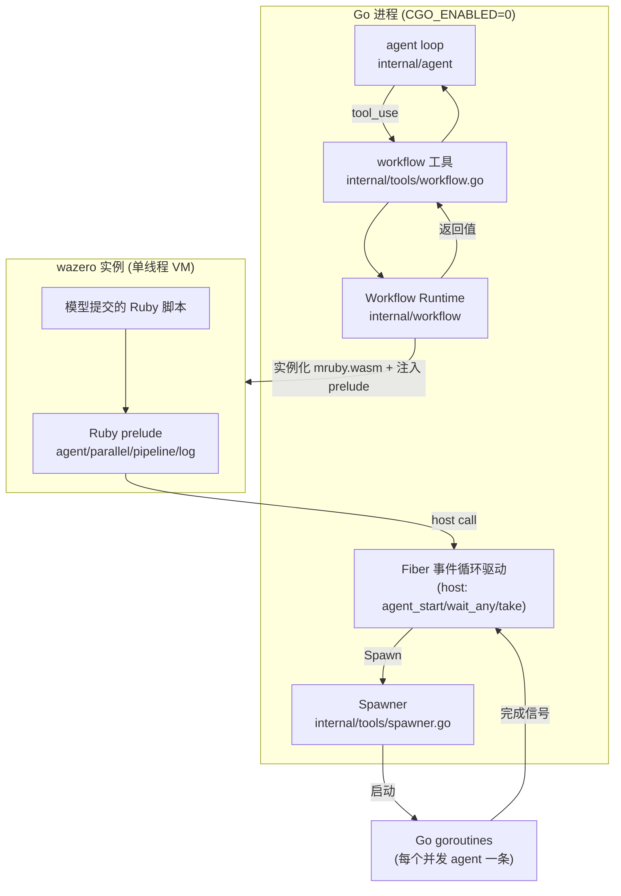
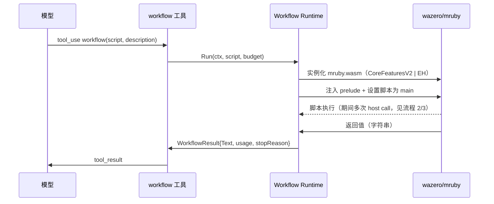
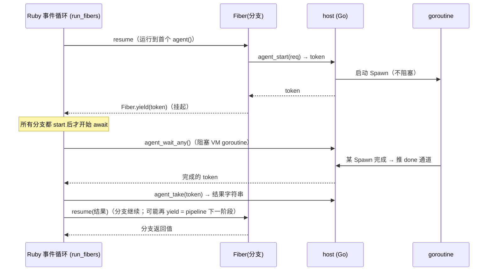

# Ruby DSL Dynamic Workflow 技术方案

## 版本历史

| 版本号 | 日期 | 修订人 | 描述 |
|---|---|---|---|
| 1.0 | 2026-06-12 | roy.lei | 初稿。基于 mruby→WASM→wazero 可行性验证（已落地为下列实现）。 |
| 1.1 | 2026-06-13 | roy.lei | resume/journal 落地（`internal/workflow/journal.go`）。 |

## 相关文档

- 实现：`internal/workflow/`（runtime.go / prelude.rb / mruby.wasm）、`internal/tools/workflow.go`
- mruby.wasm 重生脚本与构建输入：`scripts/build-mruby-wasm.sh`、`internal/workflow/mruby/`
- 现有 sub-agent 编排能力：`internal/tools/spawner.go`、`internal/tools/subagent_manager.go`、`cmd/octo/sub_agent.go`

## 项目概述 & 设计目标

### 要解决的问题

octo-agent 目前只有**模型驱动**的编排面：`sub_agent`（异步 spawn）、`sub_agent_send/status/kill`、`task_create/update/list`。fan-out 的控制流全靠模型在多轮里自己决定——不可重复、不可确定、无法表达"先全部启动再等全部完成"这类并发结构。缺一个**确定性编排原语**：把"跑哪些 agent、怎么并行、结果怎么汇聚"写成一段可执行的脚本，由 runtime 保证执行。

参考 MiMo Code 的 Dynamic Workflow（`agent()`/`parallel()`/`pipeline()` JS 原语）。本方案用 **Ruby DSL** 实现等价能力，载体是嵌入式 mruby 编译成 WebAssembly、跑在纯 Go 的 wazero 运行时里。

### 为什么是 mruby→WASM→wazero（而非 cgo）

octo-agent 是 `CGO_ENABLED=0` 的纯 Go 单二进制，由**一台 Linux runner 交叉编译全部 6 个发布目标**（`.goreleaser.yaml:4` 注释明文记载此属性）。能嵌入"真 Ruby"的 `mitchellh/go-mruby` 走 cgo，会打破这条链路——尤其 darwin 交叉编译需要 osxcross 或拆多 OS runner。

WASM 路线把 Ruby 解释器编成一个平台无关的 `.wasm` 工件，用纯 Go 的 wazero 执行：`CGO_ENABLED=0`、单 runner 交叉编译、darwin 零特殊处理全部保留。spike 已实测验证（见相关文档）。

### 设计目标

1. 模型可调用一个 `workflow` 工具，传入一段 Ruby 脚本，runtime 确定性地执行并返回结果。
2. DSL 原语：`agent` / `parallel` / `pipeline` / `log` / 结构化输出（`schema`）。
3. 运行控制：token 预算、取消、worktree 隔离、断点重跑（resume/journal）。
4. 不引入 cgo，不改动现有交叉编译与发布链路。
5. 复用现有 `Spawner`：`agent()` 即一次 sub-agent spawn，不另起一套 agent 执行机制。

### 本期实现范围

文档描述完整目标设计；首期落地的是主干，其余为紧随其后的增量。

| 能力 | 状态 |
|---|---|
| `workflow` 工具 + wazero/mruby runtime + host 桥接 | ✅ 已实现（`internal/workflow/`、`internal/tools/workflow.go`） |
| `agent` / `parallel` / `pipeline` / `log` | ✅ 已实现（`internal/workflow/prelude.rb`） |
| token 预算 + 取消 | ✅ 已实现（`Options.Budget` / ctx 取消哨兵） |
| 并发上限 | ✅ 已实现（`Options.MaxConcurrent`，工具默认 8） |
| 运行中进度透出（log() + agent 生命周期 → `EventToolProgress`） | ✅ 已实现（`WorkflowTool` 实现 `StreamingToolExecutor`，复用现有工具卡片增量渲染，无专门面板） |
| 专门的 workflow 进度树面板（TUI/web） | ⬜ 不做（投机性 UI；待真实使用频率证明需要再议） |
| `agent` 富 opts（tools/model/schema/read_only） | ✅ 已实现（host 桥接接收第二个 opts 参数；`schema` 强制结构化 JSON 输出） |
| worktree 隔离 | ✅ 已实现（`agent` 的 `isolation: "worktree"`，每个 agent 跑在独立 git worktree） |
| resume / journal | ✅ 已实现（`internal/workflow/journal.go`：JSONL 落盘 + sha256 脚本 hash 校验；工具入参 `resume_from`；结果带 `[workflow run: wf-...]`） |

## Out of Scope

- **人写 Ruby 脚本的 CLI 入口**（`octo workflow run script.rb`）：本期只做模型调用的 `workflow` 工具。Runtime 设计预留复用，但不实现 CLI 子命令。
- **完整 Ruby / gem 生态**：mruby 是 Ruby 子集，不含 gem、stdlib 不全。DSL 脚本只用核心语言特性 + 本方案定义的原语，不暴露文件/网络/socket 能力（WASI 沙箱天然隔离，见兼容性章节）。
- **wasm 内直接发起 LLM/网络调用**：所有副作用经 host 原语回到 Go 侧执行。

## 方案

### 方案概述

```
模型 ──tool_use: workflow(script: "<ruby>")──▶ workflow 工具 (internal/tools)
                                                    │
                                                    ▼
                                        Workflow Runtime (internal/workflow)
                                          ├─ wazero 实例化 mruby.wasm（开 EH）
                                          ├─ 注入 Ruby prelude（定义 agent/parallel/...）
                                          ├─ 注册 host 原语（env 模块）
                                          └─ 执行脚本，收集返回值
                                                    │
                              host 原语 agent_start ▼ 等
                                        ActiveSpawner().Spawn(...)  ← 现有 sub-agent 机制
```

DSL 表面（`agent`/`parallel`/`pipeline`/`log`）是一段 **Ruby prelude**，编进 `mruby.wasm` 或运行时注入；Go 侧只需暴露少数 **host 原语**（见"WASM ABI"章节）。`parallel`/`pipeline` 的真并发由 **mruby Fiber 协作挂起 + Go goroutine** 实现（spike4 已实测，6 个 300ms 调用墙钟 1096ms vs 顺序 1800ms）。

### 整体架构



## 详细设计 & 时序图

### 流程 1：workflow 工具的一次调用

`workflow` 是一个 `agent.ToolDefinition`（`internal/agent/tool.go:8`，字段 `Name`/`Description`/`Parameters`），注册进 `internal/tools/registry.go` 的 `allTools`，并按 `spawnerEnabled()`（`internal/tools/spawner.go:85`）gating——没有 Spawner 时不向模型广告这个工具（与现有 `sub_agent` 同款 gating 逻辑）。

工具入参（`Parameters` JSON Schema）：

| 字段 | 类型 | 说明 |
|---|---|---|
| `script` | string | 要执行的 Ruby 脚本正文 |
| `description` | string | 简短标签，用于进度 UI |

`ToolExecutor.Execute` 把 `script` 交给 Workflow Runtime，runtime 返回脚本最后一个表达式的值（转成字符串），包进 `ToolResult.Text`（`internal/agent/tool.go`）。



### 流程 2：`agent()` 原语 → Spawner

`agent(prompt, opts)` 在 Ruby 里调用，经 host 原语 `agent_start` 进入 Go。Go 侧**不新建** agent 执行逻辑，直接复用现有 `Spawner`（`internal/tools/spawner.go:13`）：

```go
// internal/tools/spawner.go:13 —— 现有接口，原样复用
type Spawner interface {
    Spawn(ctx context.Context, req SpawnRequest) (SpawnResult, error)
    Continue(ctx context.Context, agentID, message string) (SpawnResult, error)
}
```

`agent()` 的 opts 映射到 `SpawnRequest`（`internal/tools/spawner.go:26`，字段 verbatim）：

| Ruby opts 键 | → SpawnRequest 字段 | 说明 |
|---|---|---|
| `prompt`（位置参数） | `Prompt` | 子 agent 的 user message |
| `label:` | `Description` | 进度 UI 标签 |
| `tools:` | `Tools []string` | 限制子 agent 工具子集 |
| `model:` | `Model` | 覆盖模型 |
| `system_suffix:` | `SystemSuffix` | 追加 system persona |
| `read_only:` | `ReadOnly` | 去掉 write_file/edit_file |
| `isolation: :worktree` | （见流程 6） | worktree 隔离 |

返回值来自 `SpawnResult`（`internal/tools/spawner.go:58`）：`Reply` 作为 `agent()` 的返回字符串；`InputTokens`/`OutputTokens` 计入 workflow 预算；`StopReason`（如 `"max_turns"`）随结果回传。

关键事实：`Spawner` 注释（`internal/tools/spawner.go:11`）明确"多个 Spawn 调用可从一个父 tool_use 批次并发、实现必须对不同请求并发安全"——`parallel()` 正是依赖这一点。

### 流程 3：`parallel` / `pipeline` 的 Fiber 事件循环（已实测）

单线程 wasm VM 拿到真并发的方式与 JS（promise + event loop）同构：mruby Fiber 协作挂起 + Go goroutine 真并行。机制（spike4.c 验证）：



DSL 表面（Ruby prelude，节选自 spike4，将定稿进 runtime）：

```ruby
def agent(prompt, **opts)
  token = __agent_start(prompt, opts)
  Fiber.yield(token)              # 挂起；事件循环用结果 resume
end

def parallel(items, &blk)
  fibers  = items.map { |it| Fiber.new { blk.call(it) } }
  results = Array.new(fibers.size)
  pending = {}
  fibers.each_with_index { |f, i| r = f.resume; f.alive? ? pending[r] = i : results[i] = r }
  until pending.empty?
    tok = __agent_wait_any                       # 阻塞直到任一完成
    i   = pending.delete(tok)
    r   = fibers[i].resume(__agent_take(tok))    # 用结果续跑分支
    fibers[i].alive? ? pending[r] = i : results[i] = r
  end
  results
end
```

`pipeline(items, *stages)` 在此之上实现：每个 item 起一个 Fiber，Fiber 体内顺序 `await` 各 stage（同一 Fiber 内多次 yield，事件循环已支持 re-register），item 之间并发、无 stage 间 barrier。

### 流程 4：结构化输出（schema）

`agent(prompt, schema: {...})` 时，runtime 把 schema 透传到子 agent，子 agent 被强制走结构化输出（复用 octo 现有 tool/structured-output 能力），`agent()` 返回已解析的对象（Ruby Hash）。host 边界传 JSON 字符串，Ruby 侧 prelude 用核心 JSON 解析（mruby 需含 JSON 能力的 gem 或 prelude 内置最小解析）。

### 流程 5：token 预算与取消

- **预算**：Workflow Runtime 持有本次 turn 的 token 目标（来自调用方）。host 原语 `budget_remaining() -> i64` 暴露给 Ruby（`budget.remaining()`）。每次 `Spawn` 返回的 `InputTokens`/`OutputTokens` 累加；超限后 `agent_start` 返回错误 token，Ruby 侧 `agent()` 抛异常。
- **取消**：整个脚本在 `ctx` 下执行。父 turn 取消时 runtime 取消 ctx → 在途 `Spawn` 收到 ctx cancel；`agent_wait_any` 返回哨兵 token（约定 `0`），Ruby 事件循环检测到后 `raise` 解栈，wazero 模块退出。

### 流程 6：worktree 隔离

octo 当前**无** worktree 隔离能力（仅 `internal/memory/memory.go` 用 git common-dir 做记忆作用域；`git worktree add` 仅见于测试 `internal/memory/robustness_test.go:38`）。本方案新增：`agent(prompt, isolation: :worktree)` 时，Spawn 前由 runtime shell out `git worktree add` 创建隔离工作树，子 agent 的文件工具在其中运行，完成后若无改动自动移除。<!--lint:new-->

实现落在 Spawner 包装层或 runtime，不改 `SpawnRequest` 现有字段语义——通过 ctx 或新增可选字段传隔离意图（具体落点在 implement 阶段定，需新增字段时在 `spawner.go` 加并标注）。

### 流程 7：resume / journal

每个 `agent()` 调用的 `(prompt, opts)` 与返回 `SpawnResult` 落盘成 journal（JSONL，复用 `SpawnRequest.SessionDir` 机制，`internal/tools/spawner.go:50`，每个子 agent 转写 `<SessionDir>/<agent-id>.jsonl`）。重跑时，runtime 以脚本 + 入参 hash 为键，对未变化的 `agent()` 调用直接返回缓存结果，第一个变化/新增的调用起实跑。哨兵：`Date.now`/随机数不可用于 wasm 内（破坏 resume 确定性），时间戳由 host 注入。<!--lint:new-->

## WASM ABI & host 原语接口表

wasm 模块从宿主 `env` 模块导入以下函数（wazero `NewHostModuleBuilder("env")`）。所有字符串经线性内存按 `ptr+len` 编组；结果回写由调用方预分配 out 缓冲（guest malloc），host `Memory().Write`，避免 host→guest malloc 回调。

| import name | 签名 (wasm) | 阻塞 | Go 侧行为 | spike 验证 |
|---|---|---|---|---|
| `agent_start` | `(req_ptr i32, req_len i32) -> token i32` | 否 | 解析 req JSON → goroutine 跑 `ActiveSpawner().Spawn`，立即返回 token | ✅ spike4 |
| `agent_wait_any` | `() -> token i32` | 是 | 阻塞 VM goroutine，直到任一 Spawn 完成；返回其 token（`0` = 取消哨兵） | ✅ spike4 |
| `agent_take` | `(token i32, out_ptr i32, out_cap i32) -> len i32` | 否 | 把该 token 的结果 JSON 写入 out 缓冲，返回长度 | ✅ spike4 |
| `log` | `(ptr i32, len i32)` | 否 | 发一条进度事件（`AgentEvent`，复用 `internal/agent/event.go` 事件面） | 待实现 <!--lint:new--> |
| `budget_remaining` | `() -> i64` | 否 | 返回剩余 token 预算 | 待实现 <!--lint:new--> |

wasm 模块需导出：`malloc` / `free`（`-Wl,--export=malloc,--export=free`），供 `agent_take` 等回写时分配缓冲。运行时 `RuntimeConfig` 必须 `WithCoreFeatures(api.CoreFeaturesV2 | experimental.CoreFeaturesExceptionHandling)`——否则 wazero 拒绝加载（实测报 `tag section not supported as feature "exception-handling" is disabled`）。

## mruby.wasm 构建与嵌入

- **工件**：单个平台无关的 `mruby.wasm`（spike 实测 ~760K–870K），提交进仓库（如 `internal/workflow/mruby.wasm`），`go:embed` 进二进制。<!--lint:new--> 因为它平台无关，比 `rgembed` 的按平台下载 ripgrep（`internal/tools/rgembed`）更简单——**只此一个工件，不分架构**。
- **重生脚本**：`scripts/build-mruby-wasm.sh`<!--lint:new-->，用 wasi-sdk 编译。固定参数（spike 验证）：
  - 编 libmruby：`MRUBY_CONFIG` 指向 IO-free 的 build config（gembox `stdlib` + `mruby-compiler`/`mruby-error`/`mruby-metaprog`/`mruby-sprintf`/`mruby-numeric-ext`），cc/link 带 `-mllvm -wasm-enable-sjlj -mllvm -wasm-use-legacy-eh=false`、`-lsetjmp`、`-lwasi-emulated-signal -lwasi-emulated-process-clocks`。
  - 链接：`spike.c` 等价的 runtime C 桩 + `libmruby.a` → `mruby.wasm`。
  - 脚本不进 `make build`/CI 常规链路（贡献者无需装 wasi-sdk 173MB）；仅在升级 mruby/改 ABI 时手动重生并提交。
- **依赖**：新增 `github.com/tetratelabs/wazero`（纯 Go，spike 用 v1.12.0）。

## 配置设计

| 配置 key | 类型 | 默认值 | 生效方式 | 用途 |
|---|---|---|---|---|
| workflow 工具开关 | 随 `--tools` + `spawnerEnabled()` gating | 有 Spawner 即开 | 启动时 | 是否向模型广告 `workflow` 工具 |
| 默认 token 预算 | int | 沿用 turn 预算 | 启动时 | workflow 内 `agent()` 累计上限 |
| 并发上限 | int | 复用 `maxConcurrentSubAgents`（`internal/tools/subagent_manager.go`） | 启动时 | `parallel` 同时在途的 Spawn 数 |

octo 用 config.yml（无 goconf/动态下发）；上述项随既有 CLI flag / config 体系，不引入新的配置中心。

## 兼容性设计

逐条说明（兼容性是漏检高发区，不写"无"）：

- **现有 sub-agent / task 工具**：不改动。`workflow` 与 `sub_agent`/`task_*` 并存，模型按需选择。`workflow` 复用 `Spawner`，不改 `Spawner`/`SpawnRequest`/`SpawnResult` 既有字段语义（worktree 若需新字段，新增可选字段，老调用方零感知）。
- **纯 Go / 交叉编译**：`CGO_ENABLED=0` 不变；新增依赖 wazero 是纯 Go；`mruby.wasm` 是 `go:embed` 静态工件。`.goreleaser.yaml` 单 Linux runner 6 目标链路**不动**。
- **二进制体积**：+`mruby.wasm`(~0.8M) + wazero 代码（数 MB），相对当前 ~30M 可忽略；无 cgo 体积/链接变化。
- **会话持久化**：workflow 的 tool_use/tool_result 是普通 ContentBlock，随 session JSON 正常持久化（`internal/agent/content.go`）；journal 是额外 sidecar，不影响 session 格式。
- **WASI 沙箱**：wasm 内 Ruby 无文件/网络/socket 能力（build config 不含 io/socket/dir gem），脚本副作用只能经 host 原语——比进程内跑 Ruby 更安全，不引入新攻击面。
- **不涉及**：MQ、缓存（Redis）、MySQL/数仓——本功能不读写任何持久化存储或消息队列，故无对应章节。

## 回滚方案

- **代码回滚**：`workflow` 工具由 gating 控制；移除注册（或 `--tools` 关闭）即彻底下线，不影响其余工具。无 schema/数据变更，纯代码回滚。
- **数据**：无 DB/schema 变更可回滚。journal 是只增 sidecar 文件，删除即可。
- **工件**：`mruby.wasm` 回滚 = git revert 该二进制文件。

## 测试方案

- **runtime 单测**（`internal/workflow`，纯 Go + 嵌入的 wasm）：
  - `agent()` 经 fake Spawner（`internal/tools/registry_sync_test.go:44` 已有 `fakeSpawner` 范式）返回固定值，断言脚本返回值。
  - `parallel` 真并发：fake Spawner 注入延迟，断言墙钟 ≈ max 而非 sum（spike4 范式）。
  - `pipeline` 数据依赖：stage2 入参来自 stage1 结果。
  - 取消：ctx cancel → `agent_wait_any` 哨兵 → 脚本解栈、runtime 返回 cancelled。
  - 预算：超限 → `agent()` 抛异常。
- **EH 烟测**：加载嵌入的 `mruby.wasm`、跑 `begin/rescue`，守护 wazero EH 行为不回归（spike3 范式）。
- **无 live network**（遵循 `.octorules`）：所有 Spawn 走 fake。

## 风险与未决

| 风险 | 说明 | 缓解 |
|---|---|---|
| **wazero EH 仍是实验特性** | `experimental.CoreFeaturesExceptionHandling`，API 可能变；EH proposal 已 phase 5（标准化中） | 钉死 wazero 版本；EH 烟测兜底；跟踪 EH 进 stable `CoreFeaturesV3` 后切换 |
| **mruby ≠ 全 Ruby** | 无 gem、stdlib 不全 | DSL 只用核心特性 + 原语；gembox 选 IO-free `stdlib`；文档明确可用子集 |
| **JSON 编解码** | schema 模式需 Ruby 侧解析 JSON | prelude 内置最小 JSON 解析，或加 IO-free 的 JSON gem（待 implement 阶段定） |
| **worktree 隔离从零做** | octo 无现成能力 | 先例 `git worktree add`（`robustness_test.go:38`）；隔离与自动清理逻辑需新写 + 测 |
| **resume 确定性** | `Date.now`/随机数破坏重跑 | wasm 内禁用，时间戳由 host 注入 |
