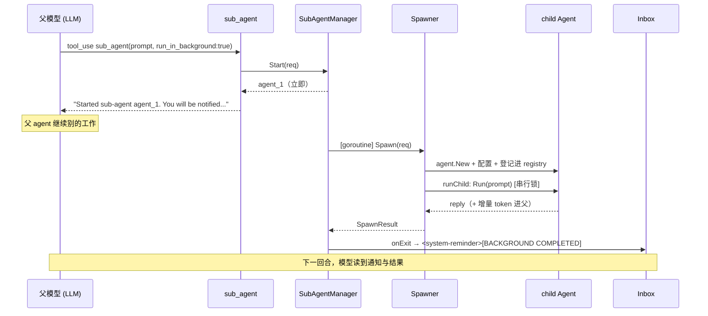

# Sub-Agent 设计

父 agent 可以派生隔离的子 agent 来处理聚焦的子任务,通过一个统一的 `sub_agent` 工具。子 agent
跑在自己的 context window 与 loop 预算里;父 agent 可以同步等它的结果,或让它在后台异步跑、完成时
经通知拿回结果。对标 Claude Code 的 `Agent` 续话模型。

## 三层架构

```
工具面            sub_agent（唯一的模型可见工具）
  │               参数选择 fork/fresh、sync/async、preset、model、tools
  ▼
SubAgentManager   异步层：每个 async 调用在独立 goroutine 跑，立即返回 agent_N 句柄；
  │               完成时触发 onExit 通知。busy/pending 队列、并发上限、Kill、ListRunning。
  ▼
Spawner           执行层：构造隔离 child，登记进 childRegistry 保活，
+ childRegistry   同步跑 Spawn / Continue，串行化 + 增量计费 + 防递归。
```

- **`internal/agent/` 零改动**。`Agent.Run` 本身续话友好——每次 `Run` 把输入追加进**同一个**
  `a.History`,并重发一份 `MaxTurns` 预算,所以"子 agent 完成后续话"只要再 `Run` 一次即可。
- 执行层(`internal/app/spawner.go`)只懂同步的 `Spawn` / `Continue`;异步层
  (`internal/tools/subagent_manager.go`)用 goroutine 把它们包成 fire-and-forget + 通知。两层解耦,
  `internal/tools` 与 `internal/app` 之间只经 `Spawner` 接口耦合。

## `sub_agent` 工具

spawn 入口(`internal/tools/agent.go`),经 spawner 注册门控——未配置 `SubAgentManager`
时不出现在 `DefaultToolsFor` 里。同一门控下还有三个 follow-up 工具
(`agent_followup.go`):`sub_agent_send`(向已有子 agent 续话)、`sub_agent_status`
(单个状态/最新结果,或列出在跑集合)、`sub_agent_kill`(终止 async 子 agent)。

| 参数 | 作用 |
|------|------|
| `description` | UI/日志用的短标签,不影响行为 |
| `prompt` | 任务,**自包含**:子 agent 看不到本对话,所有上下文都得写在这里 |
| `subagent_type` | 可选 preset(见下);省略则 **fork** |
| `run_in_background` | true=异步(完成后通知);false/省略=同步阻塞返回结果 |
| `model` | 可选,覆盖父模型(如指定更便宜的) |
| `tools` | 可选工具名白名单,与父 toolbelt 取交集 |

### Fork vs Fresh

- **Fork**(省略 `subagent_type`):child 继承父的 **system prompt**——共享的 harness 身份(base
  规则、env、skills、memory),并共享其 prompt cache,所以便宜。**它不复制本对话的消息历史**(fresh
  History),所以 `prompt` 仍要带全任务所需上下文。用于把噪声大的中间工具输出隔离出去、只把结论收回。
- **Fresh**(给 `subagent_type`):child 零上下文 + 一个 preset persona。用于独立视角(如 code
  review)或专门角色。

### Sync vs Async

- 默认 **async**(CLI/TUI):`run_in_background:true` 起后台、立即返回句柄,完成经通知注入对话。
- **同步 transport**(HTTP server / IM 桥)没有后续回合通道,`SetSynchronous(true)` 让 `sub_agent`
  走 `RunSync` 阻塞、把结果直接作为 tool_result 返回。此时即使模型传了 `run_in_background:true`
  也被强制为同步,且**结果里明说**降级了(不静默吞掉模型的选择)。

### 防递归

子 agent 不能再起子 agent:`filterChildTools` 从 child 的 toolbelt 里丢掉 `sub_agent`(结构性保证),
`IsSubAgent(ctx)` / `WithSubAgentMarker(ctx)` 是第二层兜底(防模型幻觉出不在 schema 里的工具)。递归
一层封顶。

## Preset(subagent_type)

内置四个(`internal/tools/agent_presets.go`),`readOnly` 的会从 child toolbelt 过滤掉
`write_file` / `edit_file`:

| 名称 | 只读 | 用途 |
|------|------|------|
| `explore` | 是 | 只读调研:定位、理解代码 |
| `plan` | 是 | 只读调研后产出计划 |
| `general` | 否 | 全工具,端到端处理委派任务 |
| `code-review` | 是 | 用 `git diff` 等审查改动 |

用户可在 `~/.octo/agents/*.md` 用 frontmatter(name / description / tools / read_only / model + persona
正文)自定义 preset,`discoverAgents` 在查找前刷新,覆盖/补充内置集。

## 子 agent 的隔离与构造

`Spawner.Spawn` 每次构造一个新 child:

```go
child := agent.New(parent.Sender, model)   // 复用父的 Sender = 一条 provider 连接
child.System = parent.System               // 共享 harness 身份（base + soul + env + skills + memory）
child.MaxTokens = parent.MaxTokens
child.Gate = parent.Gate                    // 续用同一权限门控
child.MaxTurns = childMaxTurns              // child 专属 loop 预算
```

- **隔离点**:fresh History(子 agent 看不到父对话)、自己的 loop 预算。
- **共享点**:Sender(一条连接)、System(同一身份,fork 时连 cache 一起共享)、Gate(同一权限——
  子 agent 不绕过权限)、计费(子 agent token 累加进父 session 总数,`/cost` 报合并数字)。
- `req.Tools` 非空时与父 toolbelt 取交集;`req.Model` 非空时覆盖父模型。
- **max-turns 不是失败**:child 跑到 `childMaxTurns` 上限时,`runChild` 返回**部分 reply** +
  `StopReason="max_turns"`(而非报错)。`sub_agent` 的同步结果和异步完成通知都会把它标成
  `[INCOMPLETE]`,这样父 agent 不会把半成品当完整答案——而不是静默丢掉这个信号。

## 可寻话与生命周期(childRegistry)

子 agent `Spawn` 跑完**不丢弃**,留在 `childRegistry` 里保活,后续续话(经 `Spawner.Continue`)能带
完整 history 再唤醒它。

- **id**:8 位 hex,与 `agent.Session` 短 id 同风格。
- **保活范围**:纯 in-memory,生命周期 = 一个会话。不写盘、不进 session JSON、不跨进程。
- **驱逐**:LRU 上限 8 + 30 分钟空闲 TTL。`put` / `get` 前先 `evict`:先删 TTL 过期项,再按最久未用
  (单调 `seq`,与时钟无关)trim 到 8。被驱逐的 child 无需清理(无文件、无连接,GC 即回收)。
- **未知 / 已驱逐 id**:`Continue` 返回 `agent <id> is no longer alive (idle-expired or evicted);
  launch a fresh sub-agent instead`,引导模型重起。

`runChild` 是 `Spawn` / `Continue` 共用的核心,处理三个并发/计费要点:

| 要点 | 处理 |
|------|------|
| 同一 child 不能并发 `Run`(history 不能交替) | `liveChild.mu` 串行化对同一 child 的调用 |
| `SessionTokens` 是累计值,多轮 accrue 会双计 | `liveChild.accruedIn/Out` 记上次累计,每轮只把增量 `AccrueChildUsage` 进父 |
| 续话漏打递归 marker | `runChild` 统一 `WithSubAgentMarker(ctx)` |

## 异步执行与通知(SubAgentManager)

`SubAgentManager` 把执行层包成异步,对外句柄是顺序编号 `agent_1` / `agent_2` / …

- **`Start(req)`**:登记一个 `asyncSubAgent`,起 goroutine 跑 `Spawn`,立即返回 `agent_N`。
- **`Send(agentID, msg)`**:起 goroutine 跑 `Continue`,立即返回。
- **busy / pending 队列**:一个子 agent 同时只处理一个请求。`Send` 时它 busy 则存进 `pending`(深度
  1);已有 pending 则报 `already has a pending message`;当前请求结束后自动发 pending。
- **并发上限**:`maxConcurrentSubAgents`(8)限制同时在跑的 async spawn——模型一次发一大批
  `run_in_background:true` 也不会起无界个并发 agent loop。超限的新 spawn 被明确拒绝(让模型等),
  续话(`Send`/`Continue`)轮不计入此上限(受 live-child 上限约束)。`activeAsync` 在 manager 锁下
  计数,每个 spawn goroutine 结束时递减。
- **`Kill(id)` / `KillAll()`**:取消子 agent 的 ctx;`KillAll` 在会话关闭时清掉所有在途子 agent。
  模型经 `sub_agent_kill` 调用 `Kill`。
- **`Read(id)` / `ListRunning()`**:供 UI(TUI 面板)、关停查询与 `sub_agent_status` 工具。完成但
  未 kill 的 async 子 agent 仍留在列表里(idle)——它是活的、可被 `sub_agent_send` 续话的句柄。

### `sub_agent_send` 的双 ID 命名空间

模型实际见到两种句柄:async spawn 返回 manager 侧的 `agent_N`;sync spawn 的回复带 spawner 侧的
`[agent <id>]` 标签。`sub_agent_send` 先试 `Send(agent_N)`(异步投递,回复走通知);manager 不识别
的 id 退到 `ContinueSync`(同步续跑,回复随 tool_result 返回)。killed/pending 错误原样返回,不误判
为路由失败。子 agent 自身不能调用 send/kill(与防递归同级的 `IsSubAgent` 守卫)。

### 通知投递

子 agent 完成(`Spawn` 或 `Continue`)时,manager 触发 `onExit(SubAgentNotification)`。REPL 把这个 hook
接到 **inbox/steer 路径**:格式化成 `<system-reminder>` 注入对话,模型下一轮当**环境事件**读。

```
<system-reminder>
[BACKGROUND COMPLETED]
Sub-agent agent_1 (Find Banner TUI code) has completed.
Result:
<子 agent 的 final reply>
[INCOMPLETE: this sub-agent hit its turn limit — the result above is partial, not a finished answer.]
[usage] in 1234 / out 567
</system-reminder>
```

- `Kind` 区分 `spawn_done`(首个任务完成)与 `message_reply`(回复了续话)。
- `StopReason="max_turns"` 时附 `[INCOMPLETE]` 行。
- 通知经 inbox 队列,**不自动起新回合**——下一个自然回合处理掉,不引入"无人触发就自己开口"的行为。

## 时序图



同步路径省去 MGR↔IB 的通知环节:`sub_agent` 直接 `RunSync` → `Spawn`,把结果作为 tool_result 返回。

## 隔离边界与非目标

- **session JSON 持久化**:不涉及——registry 与 manager 都是纯 in-memory,进程退出即清空。
- **provider / wire 格式**:不涉及——child 复用父的 `Sender`,与单 agent 多轮对话走同一路径。
- **权限门控**:子 agent 的 `Gate` 继承自父,续话续用同一 Gate。
- 不做跨进程 / 跨会话持久化续话;不做父子之间的双向流式(通知是一次性的,不是流);递归一层封顶。

## 运行时实时显示(TUI)

TUI 底部一个 sub-agent 面板,实时呈现每个**活跃**子 agent 的 tool 调用链(类比 background-processes
面板)。复用现有事件体系,不改 `agent.AgentEvent`:

- **执行层**:`runChild` 用 `RunStream` 跑子 agent;ctx 里带事件 sink 时,把子 agent 的
  `tool_started` / `tool_error` 映射成 `tools.SubAgentEvent` 喂 sink。**只转 tool 级事件**——多个并发
  子 agent 的 token 流会淹没事件循环。
- **异步层**:`SubAgentManager.onEvent`(与 `onExit` 并列)。`Start` / `runContinue` 调
  `Spawn` / `Continue` 前用 `WithSubAgentEventSink(ctx, sink)` 注入带 `agent_N` 标记的 sink,并先发
  `started`。没有 `onEvent` 时不注入 sink、执行层不流式——headless 零开销、零行为变化。
- **传递**:sink 走 context,`Spawner` 接口签名不变,`internal/tools` 与 `cmd/octo` 解耦。
- **TUI**:`subAgentUI` 状态按 `agent_N` 聚合,渲染成 `tui.Panel`;子 agent 完成时移除,续话再
  `started` 重新加入。Web UI 有镜像同一事件流的 sub-agent 面板。
- 约束:不持久化运行时事件、不在面板里支持 kill/续话(仍通过工具调用)。
