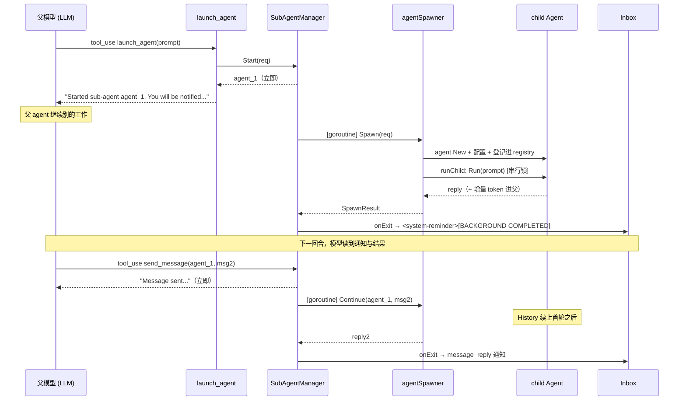

# Sub-Agent 设计

父 agent 可以派生隔离的子 agent 来处理聚焦的子任务。子 agent 异步运行——`launch_agent`
立即返回一个句柄,子 agent 在后台跑,完成后结果经通知注入对话;`send_message` 给一个仍存活
的子 agent 追加指令,同样异步。父 agent 在子 agent 工作期间可以继续回应用户、起更多子 agent
或调别的工具。

对标 Claude Code 的 `Agent` + `SendMessage` 续话模型,而非 Codex 式 fire-and-forget。

## 三层架构

```
工具面            launch_agent / send_message / agent_status / kill_agent
  │               （LLM 可见,异步语义）
  ▼
SubAgentManager   异步层：每个调用在独立 goroutine 跑，立即返回 agent_N 句柄；
  │               完成时触发 onExit 通知。busy/pending 队列、Kill、ListRunning。
  ▼
agentSpawner      执行层：构造隔离 child，登记进 childRegistry 保活，
+ childRegistry   同步跑 Spawn / Continue，串行化 + 增量计费 + 防递归。
```

- **`internal/agent/` 零改动**。`Agent.Run` 本身续话友好——每次 `Run` 把输入追加进**同一个**
  `a.History` 而非重置,并重发一份 `MaxTurns` 预算。"子 agent 完成后续话"在 agent 层天然支持,
  只要还持有那个 `child *agent.Agent` 再 `Run` 一次即可。
- 执行层(`cmd/octo/sub_agent.go`)与异步层(`internal/tools/subagent_manager.go`)解耦:执行层只懂
  同步的 `Spawn` / `Continue`;异步层用 goroutine 把它们包成 fire-and-forget + 通知。

## 工具面

四个工具,全部经 `spawnerEnabled()` 门控——spawner 未配置时不出现在 `DefaultTools` 里。

| 工具 | 作用 | 返回 |
|------|------|------|
| `launch_agent` | 起一个自主子 agent 处理聚焦子任务,立即在后台运行 | `Started sub-agent <id>. You will be notified when it completes.` |
| `send_message` | 给之前 `launch_agent` 起的、仍存活的子 agent 发新消息(它记得之前做的事) | `Message sent to <id>. You will be notified when it replies.` |
| `agent_status` | 读子 agent 当前状态与最新结果 | 状态(`running`/`idle`/`exited`)+ 结果 |
| `kill_agent` | 终止一个子 agent | 终止确认 |

`launch_agent` / `send_message` 的结果**不在工具返回里**——它们立即返回一句"已通知",真正的结果稍后
经通知到达(见下文)。`agent_status` 是逃生舱:模型**不应轮询**它,只在用户显式询问或需要中途
查进度时用。

`launch_agent` 在 `readOnlyTools` 里为 `true`,所以模型一个 tool_use batch 可并行起多个子 agent。

### 子 agent 拿不到 `launch_agent` / `send_message`

`filterChildTools` 给子 agent 过滤工具时丢弃 `launch_agent` 和 `send_message`——子 agent **既不能
spawn 也不能唤醒**别的子 agent,这两个工具是顶层专属。结构上(toolbelt 里没有)保证,
`WithSubAgentMarker(ctx)` / `IsSubAgent(ctx)` 是第二层兜底(防模型幻觉出不在 schema 里的工具)。

## 子 agent 的隔离与构造

`agentSpawner.Spawn` 每次构造一个新 child:

```go
child := agent.New(parent.Sender, model)   // 复用父的 Sender = 一条 provider 连接
child.System = parent.System               // 共享 harness 身份（base + soul + env + skills + memory）
child.MaxTokens = parent.MaxTokens
child.Gate = parent.Gate                    // 续用同一权限门控
child.MaxTurns = childMaxTurns              // 100，与父默认相同；每次 Continue 重新发这份预算
```

隔离点:**fresh History**(子 agent 看不到父对话)、自己的 loop 预算。共享点:Sender(一条连接)、
System(同一身份)、Gate(同一权限)、计费(子 agent token 累加进父 session 总数,`/cost` 报一个
合并数字)。

- `req.Model` 为空时继承父模型;非空可覆盖(如给子 agent 指定更便宜的模型)。
- `req.Tools` 非空时与父 toolbelt 取交集,父可以给子 agent 一个受限工具集(如只读调研)。
- 子 agent 跑到 `MaxTurns` 上限视为**失败**:`runChild` 返回 `sub-agent reached max-turns limit
  — task incomplete`,而非把半成品当成功结果返回。

## 可寻话与生命周期(childRegistry)

子 agent `Spawn` 跑完**不丢弃**,而是留在 `childRegistry` 里保活,这样后续 `send_message`(经
`Spawner.Continue`)能带着完整 history 再唤醒它。

- **id**:8 位 hex,与 `agent.Session` / `taskgraph` 短 id 同风格。
- **保活范围**:纯 in-memory,生命周期 = 一个 REPL 会话。不写盘、不进 session JSON、不跨进程。
  进程退出即清空。
- **驱逐**:LRU 上限 8 个 + 30 分钟空闲 TTL。`put` / `get` 前都先 `evict`:先删 TTL 过期项,
  再按最久未用(单调 `seq` 计数,与时钟无关)trim 到 8 个。被驱逐的 child 无需清理(无文件、无连接,
  GC 即回收)。
- **未知 / 已驱逐 id**:`Continue` 返回 `agent <id> is no longer alive (idle-expired or evicted);
  launch a fresh sub-agent instead`,错误文案引导模型重新 `launch_agent`。
- **无显式 close**:只靠 LRU/TTL 自动回收。

`runChild` 是 `Spawn` / `Continue` 共用的核心,处理三个并发/计费要点:

| 要点 | 处理 |
|------|------|
| 同一 child 不能并发 `Run`(history 不能交替) | `liveChild.mu` 串行化对同一 child 的调用 |
| `SessionTokens` 是累计值,多轮 accrue 会双计 | `liveChild.accruedIn/Out` 记上次累计,每轮只把增量 `AccrueChildUsage` 进父 |
| 续话漏打递归 marker | `runChild` 统一 `WithSubAgentMarker(ctx)`,`Spawn` / `Continue` 共用 |

## 异步执行与通知(SubAgentManager)

`SubAgentManager` 把执行层包成异步,对外句柄是顺序编号 `agent_1` / `agent_2` / …

- **`Start(req)`**:登记一个 `asyncSubAgent`,起 goroutine 跑 `spawner.Spawn`,立即返回 `agent_N`。
- **`Send(agentID, msg)`**:起 goroutine 跑 `spawner.Continue`,立即返回。
- **busy / pending 队列**:一个子 agent 同时只处理一个请求。`Send` 时若它 busy,把消息存进
  `pending`(深度 1);已有 pending 则报 `already has a pending message`。当前请求结束后自动发
  pending。
- **`Kill(id)`** / **`KillAll()`**:取消子 agent 的 ctx;`KillAll` 在会话关闭时调,清掉所有在途子
  agent。
- **`Read(id)`** / **`ListRunning()`**:供 `agent_status` 和 UI 查询;结果文本截断到 1 MiB。

### 通知投递

子 agent 完成(`Spawn` 或 `Continue`)时,manager 触发 `onExit(SubAgentNotification)`。REPL 把这个
hook 接到 **inbox/steer 路径**:通知格式化成一个 `<system-reminder>` 块注入对话,模型在下一轮把它
当**环境事件**读(而非用户发言)。

```
<system-reminder>
[BACKGROUND COMPLETED]
Sub-agent agent_1 (Find Banner TUI code) has completed.
Result:
<子 agent 的 final reply>
[usage] in 1234 / out 567
</system-reminder>
```

`Kind` 区分 `spawn_done`(首个任务完成)与 `message_reply`(回复了 send_message)。通知经 inbox 队列
而非自动起新回合——不引入"agent 无人触发就自己开口"的意外行为,下一个自然回合自然把它处理掉。

## 时序图



## 隔离边界与兼容性

- **taskgraph(`octo goal`)**:只调 `Spawn`,不涉及续话/异步通知。其 spawner 的 registry 没人调
  `Continue`,留存的 child 随该次前台进程退出释放。
- **session JSON 持久化**:不涉及。registry 与 manager 都是纯 in-memory。
- **provider / wire 格式**:不涉及。child 复用父的 `Sender`,与单 agent 多轮对话走同一路径。
- **权限门控**:子 agent 的 `Gate` 继承自父,续话续用同一 Gate。

## 非目标

- 不做跨进程 / 跨会话持久化续话(需要时另设计:序列化 child History,复用
  `internal/agent/session.go`)。
- 不让 taskgraph 的 subtask 之间续话(DAG 仍靠 `Subtask.Result` 文本传递)。
- 不给子 agent `launch_agent` / `send_message`(递归防护)。
- 不做父子之间的双向流式(通知是一次性的,不是流)。

## 计划中:运行时实时显示

> 状态:设计已定,尚未实现。当前父 agent 只在子 agent **完成**时收到一条通知,看不到子 agent
> **运行中**的内部过程。

目标是让子 agent 运行体验接近 Claude Code:启动即显示、实时显示内部 tool 调用链、底部面板展示所有
活跃子 agent、可展开/折叠看详情。

落地思路是复用现有事件体系:

- `agentSpawner.runChild` 把子 agent 的执行从 `Run` 换成 `RunStream`,传入一个 `EventHandler`,把子
  agent 的 `agent.AgentEvent`(text_delta / tool_started / tool_done / tool_error / turn_done)映射成
  一个新的 `tools.SubAgentEvent` 类型。
- `SubAgentManager` 新增 `onEvent func(SubAgentEvent)` 运行时事件回调(与现有 `onExit` 完成回调并列)。
- TUI(`cmd/octo/tuirepl*.go`)新增 `subAgentEventMsg` 消息类型与 `subAgentState` 状态映射,在底部新增
  sub-agent 面板(复用现有 `tui.Panel`,类比 background processes 面板),展开时显示完整 tool 调用历史。
- Plain REPL 只打印极简的启动/完成行,不显示内部 tool 链。

约束:不持久化运行时事件(内存-only)、不改 `agent.AgentEvent` 定义、不在面板里支持 kill/send_message
操作(仍通过工具调用)。
