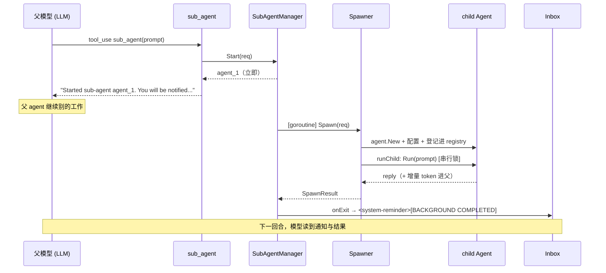

# Sub-Agent 设计

父 agent 可以派生隔离的子 agent 来处理聚焦的子任务,通过一个统一的 `sub_agent` 工具。子 agent
跑在自己的 context window 与 loop 预算里;父 agent 可以同步等它的结果,或让它在后台异步跑、完成时
经通知拿回结果。对标 Claude Code 的 `Agent` 续话模型。

## 三层架构

```
工具面            sub_agent（唯一的模型可见工具）
  │               参数选择 preset、sync/async、model、tools
  ▼
SubAgentManager   异步层：每个 async 调用在独立 goroutine 跑，立即返回 agent_N 句柄；
  │               完成时触发 onExit 通知。busy/pending 队列、并发上限、Kill、ListRunning。
  ▼
Spawner           执行层：构造隔离 child，登记进 childRegistry 保活，
+ childRegistry   同步跑 Spawn / Continue，串行化 + 增量计费 + 防递归。
```

- **`internal/agent/` 零改动**。`Agent.Run` 本身续话友好——每次 `Run` 把输入追加进**同一个**
  `a.History`,并重发一份 `MaxTurns` 预算,所以"子 agent 完成后续话"只要再 `Run` 一次即可。
- 执行层(`internal/app/spawner.go`)只懂同步的 `Spawn` / `Continue`;异步层
  (`internal/tools/subagent_manager.go`)用 goroutine 把它们包成 fire-and-forget + 通知。两层解耦,
  `internal/tools` 与 `internal/app` 之间只经 `Spawner` 接口耦合。

## `sub_agent` 工具

spawn 入口(`internal/tools/agent.go`),经 spawner 注册门控——未配置 `SubAgentManager`
时不出现在 `DefaultToolsFor` 里。同一门控下还有三个 follow-up 工具
(`agent_followup.go`):`sub_agent_send`(向已有子 agent 续话)、`sub_agent_status`
(单个状态/最新结果,或列出在跑集合)、`sub_agent_kill`(终止 async 子 agent)。

| 参数 | 作用 |
|------|------|
| `description` | UI/日志用的短标签,不影响行为 |
| `prompt` | 任务,**自包含**:子 agent 看不到本对话,所有上下文都得写在这里 |
| `subagent_type` | preset(见下),**必填**;省略直接报错并列出可用 preset |
| `model` | 可选,覆盖父模型(如指定更便宜的) |
| `tools` | 可选工具名白名单,与父 toolbelt 取交集 |

### 只有 Fresh:fork 模式已删除

早期版本里省略 `subagent_type` 会 **fork**:child 继承父的 system prompt 和本对话此刻的消息历史。
后来删掉了这个模式,`subagent_type` 变成必填,理由:

- **分叉应该是会话级原语,不是 agent 工具的一个隐式模式。** web 端已有真正的会话 branch
  (`POST /api/sessions/{id}/branch`,从任意消息切出一个可以直接对话的新会话);fork 模式复制了
  上下文却把对话困在一个用户摸不着的 sub_agent 里,是它的劣化版。
- **失败模式多**:种子对话读起来像"我在 orchestrate 子 agent",child 会接着扮演编排者而不是干活
  (曾需要 `forkTaskFraming` 角色钉缓解);异步 spawn 的快照时机还有竞态(曾需要在工具执行路径上
  预捕获 `ForkHistory`)。补丁随病根一起拔除。
- **成本与引导都难圆**:每个 fork 重发整段父对话,工具 description 只能反复教模型"能自包含就别
  fork"——一个需要处处警告的模式本身就是设计气味。

现在每个 child 一律零对话上下文 + preset persona,`prompt` 必须自包含。

### Sync vs Async:由 transport 决定,模型不参与

派发方式不是工具参数。`SubAgentManager.Synchronous()` 是唯一判据,`sub_agent` 直接取
`runInBackground := !mgr.Synchronous()`。

- 默认 **async**(CLI TUI / Web 会话 / IM):`Start` 起后台、立即返回句柄,父回合当场收尾,用户可以
  马上继续说话;完成经通知注入对话——TUI 走 agent Inbox,Web/IM 走 `deliverModelNote` /
  `runChannelIdleTurn`,回合空闲时自动开一个 follow-up turn。
- **同步的是 CLI one-shot**:单回合进程没有后续回合通道,`SetSynchronous(true)` 让 `sub_agent`
  走 `RunSync` 阻塞、把结果直接作为 tool_result 返回。server 的进程级兜底 manager 也设了同步,
  但每条生产路径都会把会话级 manager 钉进 ctx(`resolveSubAgentManager` 优先取它),所以那是兜底
  不是活路径。

模型只看到结果的两种形态:直接拿到回复,或者拿到 `Started sub-agent agent_N` 加一句"完成时会通知
你"。工具 description 明说这两种都正常、不需要它选。

**为什么不把这个选择交给模型**:那要求它预判任务耗时,而它几乎总是猜"短"。结果是一个跑几分钟的
child 把父回合钉住,用户在它结束前插不上话——恰恰是异步本该解决的问题。耗时预判不可靠,由
transport 判定后这个决策就不存在了。

### 防递归

子 agent 不能再起子 agent:`filterChildTools` 从 child 的 toolbelt 里丢掉 `sub_agent`(结构性保证),
`IsSubAgent(ctx)` / `WithSubAgentMarker(ctx)` 是第二层兜底(防模型幻觉出不在 schema 里的工具)。递归
一层封顶。

### 子 agent 内 terminal 不放后台

同样由 `IsSubAgent(ctx)` 门控:子 agent 的 `terminal` 调用一律同步执行——`run_in_background` /
`detached` 被忽略、命令走同步路径,同步命令超时则 kill + 报错而非转后台,且不注册可提升的 `SyncSession`
(Ctrl+B / Web 按钮够不着)。子 agent 与父共用同一个 `BackgroundManager`,而它在启动它的那个回合之后
没有后续回合来收割后台进程;若放任其起后台,`[BACKGROUND COMPLETED]` 完成通知会打进父会话、且无从
归属。真正的长命令交给父 agent 跑。细节见 `terminal-tools.md` / `terminal-manual-promote.md`。

## Preset(subagent_type)

内置三个(`internal/tools/agent_presets.go`),`readOnly` 的会从 child toolbelt 过滤掉
`write_file` / `edit_file`:

| 名称 | 只读 | leanSystem | 用途 |
|------|------|-----------|------|
| `explore` | 是 | 是 | 只读调研:定位、理解代码 |
| `general` | 否 | 否 | 全工具,端到端处理委派任务 |
| `code-review` | 是 | 否 | 用 `git diff` 等审查改动 |

**leanSystem**(`explore`)用**精简 system**(`parent.LeanSystem`,丢掉 skills manifest +
memory 注入)作为起点。**没有任何 preset 会降级模型**:子代理的结论直接决定父代理的下一步,
侦察兵降级,情报也跟着降级——省成本只精简上下文,不动模型。所有 preset 跑父模型,显式传 `model`
时优先用显式的;父的 lite 模型(`LiteSender`/`LiteModel`)只继承给 child 用于 compaction。
octo 做不到 CC 那种逐项跳过 CLAUDE.md/项目约定——精简只到"丢 skills + memory"为止。

用户可用 `*.md` 文件自定义 preset:frontmatter 支持 `description`(必填)、`tools`(白名单)、
`disallowed_tools`(从继承集里减)、`read_only`、`model`(默认 `inherit` = 空),markdown 正文是
persona。文件名(去掉 `.md`)是权威触发名,frontmatter 的 `name` 被忽略。发现路径有两级:用户级
`~/.octo/agents/` 和项目级 `<repo>/.octo/agents/`,同名时**项目级覆盖用户级**。`discoverAgents` 在
查找前刷新,覆盖/补充内置集。

## 子 agent 的隔离与构造

`Spawner.Spawn` 每次构造一个新 child:

```go
child := agent.New(sender, model)          // 复用父 Sender;显式 model 参数可覆盖模型名
child.System = baseSystem                  // 一般 = parent.System;leanSystem preset = parent.LeanSystem
child.MaxTokens = parent.MaxTokens
child.Gate = parent.Gate                    // 续用同一权限门控
child.MaxTurns = childMaxTurns              // child 专属 loop 预算
```

- **隔离点**:自己的 loop 预算 + **fresh History**——child 一律看不到父对话(fork 模式已删除,见上)。
- **共享点**:Sender(一条连接)、System(同一身份;leanSystem preset 用精简 system)、Gate(同一权限——子 agent 不绕过权限)、计费(子 agent token 累加进父 session 总数,`/cost` 报合并数字)、lite 模型(`LiteSender`/`LiteModel` 继承给 child,仅用于 compaction)。
- `req.Tools` 非空时与父 toolbelt 取交集;`req.DisallowedTools` 从继承集里减;`req.Model` 非空时覆盖父模型。调用层传的 tools/model 优先于 preset frontmatter,preset 只补调用没指定的部分。
- **max-turns 不是失败**:child 跑到 `childMaxTurns` 上限时,`runChild` 返回**部分 reply** +
  `StopReason="max_turns"`(而非报错)。`sub_agent` 的同步结果和异步完成通知都会把它标成
  `[INCOMPLETE]`,这样父 agent 不会把半成品当完整答案——而不是静默丢掉这个信号。

## 可寻话与生命周期(childRegistry)

子 agent `Spawn` 跑完**不丢弃**,留在 `childRegistry` 里保活,后续续话(经 `Spawner.Continue`)能带
完整 history 再唤醒它。

- **id**:8 位 hex,与 `agent.Session` 短 id 同风格。
- **保活范围**:纯 in-memory,生命周期 = 一个会话。不写盘、不进 session JSON、不跨进程。
- **驱逐**:LRU 上限 8 + 30 分钟空闲 TTL。`put` / `get` 前先 `evict`:先删 TTL 过期项,再按最久未用
  (单调 `seq`,与时钟无关)trim 到 8。被驱逐的 child 无需清理(无文件、无连接,GC 即回收)。
- **未知 / 已驱逐 id**:`Continue` 返回 `agent <id> is no longer alive (idle-expired or evicted);
  launch a fresh sub-agent instead`,引导模型重起。

`runChild` 是 `Spawn` / `Continue` 共用的核心,处理三个并发/计费要点:

| 要点 | 处理 |
|------|------|
| 同一 child 不能并发 `Run`(history 不能交替) | `liveChild.mu` 串行化对同一 child 的调用 |
| `SessionTokens` 是累计值,多轮 accrue 会双计 | `liveChild.accruedIn/Out` 记上次累计,每轮只把增量 `AccrueChildUsage` 进父 |
| 续话漏打递归 marker | `runChild` 统一 `WithSubAgentMarker(ctx)` |

### 预算停机的收尾

`max_turns`、`max_tokens`、stuck(重复 tool call)三种停机由 agent loop 的 `budgetStop` 收场,它
**用一句合成提示替换掉模型文本**——直接透给父 agent 就只剩一个停机原因,子 agent 那一路干的活全丢。
`runChild` 因此在这三种 stop reason 上回溯 child history,把最后一段有内容的 assistant 文本接在提示
前面(`carryPartialWork`);child 全程只调工具、没出过文本时保持原样。被中断(`interrupted`)走不到这里
——那条路径连带返回 ctx 错误,`runChild` 提前 return。

回溯**钉在本轮起点**:向上遇到第一条不含 tool_result block 的 RoleUser 消息就停(`roundStart`)。
不钉的话,一个上轮干净收尾、本轮只调工具就 stuck 的 child 会把**上一轮已经交付过的答案**当成本轮
半成品捞回来。loop 自己插的中途 user 消息(截断续跑、compaction 摘要)也算边界,只会让回溯更保守。

捞回来的文本带标签(`carriedWorkLabel`)说明它是"被切断前的最后一条消息"——它可能是完整总结,也可能
是几十轮前的一句"我看一下",不打标签等于让停机提示替它背书。

`sub_agent` / `sub_agent_send` / 异步完成通知(`FormatSubAgentNote`)共用 `incompleteNote` 给结果加
一条 `[INCOMPLETE: …]`,说明它是半成品、还能用 `sub_agent_send` 带 id 续,并针对 stuck 明确要求换路子
而不是重下同一条指令。TUI 和 Web 的状态词同样把 stuck 归到"incomplete / warning",不报 completed。

### 状态查询(`ChildInspector`)

同步 spawn 的 child 在 manager 里**不留痕**(`RunSync` 返回即刈掉那条 entry),但它在
`childRegistry` 里仍然活着可续。`Spawner` 因此实现 `tools.ChildInspector`
(`InspectChild` / `ListChildren`),把 registry 里的最后一轮状态(stop reason 或失败原因、回复、轮数、
空闲时长、是否在跑)暴露给 `sub_agent_status`。

- **在跑的 child 不算可续**:registry 从第一轮之前就持有 child(`Spawn` 先 `put` 再跑),所以
  `runChild` 进出时翻 `busy`。busy 的 child 不进"可续"列表(manager 自己的列表已经在报它),单独查它
  时明确说"working right now"——说成可续会招来一条续话,而那条续话只会阻塞在 `liveChild.mu` 上直到
  本轮跑完。
- **失败轮覆盖快照**:`setSnapErr` 清掉上一轮的 reply 并记下错误。不覆盖的话,查状态会把一轮已经被
  失败取代的结果当成"最新一轮"报出去。
- **锁与拷贝**:registry 读取走 `snapshot` 而非 `get`——查询是读,不刷新 LRU 站位;last-round 字段另用
  `snapMu` 守,不跟着 `liveChild.mu` 一起被整轮占住,否则查状态会阻塞在跑着的 child 后面;列表路径不带
  `Reply`(渲染用不到,拷贝还发生在 registry 锁里),保留的 reply 按 manager 同样的上限截断。


## 异步执行与通知(SubAgentManager)

`SubAgentManager` 把执行层包成异步,对外句柄是顺序编号 `agent_1` / `agent_2` / …

- **`Start(req)`**:登记一个 `asyncSubAgent`,起 goroutine 跑 `Spawn`,立即返回 `agent_N`。
- **`Send(agentID, msg)`**:起 goroutine 跑 `Continue`,立即返回。
- **busy / pending 队列**:一个子 agent 同时只处理一个请求。`Send` 时它 busy 则存进 `pending`(深度
  1);已有 pending 则报 `already has a pending message`;当前请求结束后自动发 pending。
- **并发上限**:`maxConcurrentSubAgents`(16)限制同时在跑的 async spawn——模型一次 fan-out 一大批
  也不会起无界个并发 agent loop。超限的新 spawn 被明确**拒绝**(让模型等):异步下父回合没有被占住,
  模型收到这条错误可以先做别的、等通知回来再补派。对照同步路径的 `syncSem` 是阻塞排队,
  续话(`Send`/`Continue`)轮不计入此上限(受 live-child 上限约束)。`activeAsync` 在 manager 锁下
  计数,每个 spawn goroutine 结束时递减。
- **`Kill(id)` / `KillAll()`**:取消子 agent 的 ctx;`KillAll` 在会话关闭时清掉所有在途子 agent。
  模型经 `sub_agent_kill` 调用 `Kill`。
- **`Read(id)` / `ListRunning()`**:供 UI(TUI 面板)、关停查询与 `sub_agent_status` 工具。完成但
  未 kill 的 async 子 agent 仍留在列表里(idle)——它是活的、可被 `sub_agent_send` 续话的句柄。

### 双 ID 命名空间

模型实际见到两种句柄:async spawn 返回 manager 侧的 `agent_N`;sync spawn 的回复带 spawner 侧的
`[agent <id>]` 标签。两个 followup 工具都要吃下这两种:

- `sub_agent_send` 先试 `Send(agent_N)`(异步投递,回复走通知);manager 不识别的 id 退到
  `ContinueSync`(同步续跑,回复随 tool_result 返回)。killed/pending 错误原样返回,不误判为路由失败。
- `sub_agent_status` 先试 `Read(agent_N)`;manager 不识别的 id 退到 `ChildInspector`,查到就报状态,
  查不到才判未知。
- 模型常把 `[agent dbb7aa4b]` 回抄成 `agent_dbb7aa4b`(两种句柄形似),所以两条回退路径都会剥掉
  `agent_` 前缀再试一次(`bareChildID`),status 的回话里只给 `sub_agent_send` 真正认的那个裸 id。
  spawner 侧 id 是 8 位 hex,`agent_1` 剥成 `"1"` 永远匹配不到,不会误伤真的 `agent_N` 句柄。

不传 id 的 `sub_agent_status` 列表把两边并起来:manager 的 `ListRunning()`,加上 registry 里
manager 未跟踪的那些(按 `TrackedBackingIDs()` 去重,避免异步 child 在两处各列一遍)。

子 agent 自身不能调用 send/kill(与防递归同级的 `IsSubAgent` 守卫)。

### 通知投递

子 agent 完成(`Spawn` 或 `Continue`)时,manager 触发 `onExit(SubAgentNotification)`。REPL 把这个 hook
接到 **inbox/steer 路径**:格式化成 `<system-reminder>` 注入对话,模型下一轮当**环境事件**读。

```
<system-reminder>
[BACKGROUND COMPLETED]
Sub-agent agent_1 (Find Banner TUI code) has completed.
Result:
<子 agent 的 final reply>
[INCOMPLETE: this sub-agent hit its turn limit — the result above is partial, not a finished answer.]
[usage] in 1234 / out 567
</system-reminder>
```

- `Kind` 区分 `spawn_done`(首个任务完成)与 `message_reply`(回复了续话)。
- `StopReason="max_turns"` 时附 `[INCOMPLETE]` 行。
- 通知经 inbox 队列,**不自动起新回合**——下一个自然回合处理掉,不引入"无人触发就自己开口"的行为。

## 时序图


```mermaid
sequenceDiagram
    participant M as 父模型 (LLM)
    participant T as sub_agent
    participant MGR as SubAgentManager
    participant SP as Spawner
    participant C as child Agent
    participant IB as Inbox

    M->>T: tool_use sub_agent(prompt)
    T->>MGR: Start(req)
    MGR-->>T: agent_1（立即）
    T-->>M: "Started sub-agent agent_1. You will be notified..."
    Note over M: 父 agent 继续别的工作

    MGR->>SP: [goroutine] Spawn(req)
    SP->>C: agent.New + 配置 + 登记进 registry
    SP->>C: runChild: Run(prompt) [串行锁]
    C-->>SP: reply（+ 增量 token 进父）
    SP-->>MGR: SpawnResult
    MGR->>IB: onExit → <system-reminder>[BACKGROUND COMPLETED]
    Note over M,IB: 下一回合，模型读到通知与结果
```

同步路径省去 MGR↔IB 的通知环节:`sub_agent` 直接 `RunSync` → `Spawn`,把结果作为 tool_result 返回。

## 隔离边界与非目标

- **session JSON 持久化**:不涉及——registry 与 manager 都是纯 in-memory,进程退出即清空。
- **provider / wire 格式**:不涉及——child 复用父的 `Sender`,与单 agent 多轮对话走同一路径。
- **权限门控**:子 agent 的 `Gate` 继承自父,续话续用同一 Gate。
- 不做跨进程 / 跨会话持久化续话;不做父子之间的双向流式(通知是一次性的,不是流);递归一层封顶。

## 运行时实时显示(TUI)

TUI 底部一个 sub-agent 面板,实时呈现每个**活跃**子 agent 的 tool 调用链(类比 background-processes
面板)。复用现有事件体系,不改 `agent.AgentEvent`:

- **执行层**:`runChild` 用 `RunStream` 跑子 agent;ctx 里带事件 sink 时,把子 agent 的
  `tool_started` / `tool_error` 映射成 `tools.SubAgentEvent` 喂 sink。**只转 tool 级事件**——多个并发
  子 agent 的 token 流会淹没事件循环。
- **异步层**:`SubAgentManager.onEvent`(与 `onExit` 并列)。`Start` / `runContinue` 调
  `Spawn` / `Continue` 前用 `WithSubAgentEventSink(ctx, sink)` 注入带 `agent_N` 标记的 sink,并先发
  `started`。即使未设置 `onEvent`,这个 sink 仍然存在并记录事件,供 Web UI 等 late-joining 订阅者重放。
  没有 `onEvent` 时只是不向 live hook 转发,headless 行为不变。
- **传递**:sink 走 context,`Spawner` 接口签名不变,`internal/tools` 与 `cmd/octo` 解耦。
- **TUI**:`subAgentUI` 状态按 `agent_N` 聚合,渲染成 `tui.Panel`;子 agent 完成时移除,续话再
  `started` 重新加入。Web UI 有镜像同一事件流的 sub-agent 面板。
- 约束:不持久化运行时事件、不在面板里支持 kill/续话(仍通过工具调用)。
