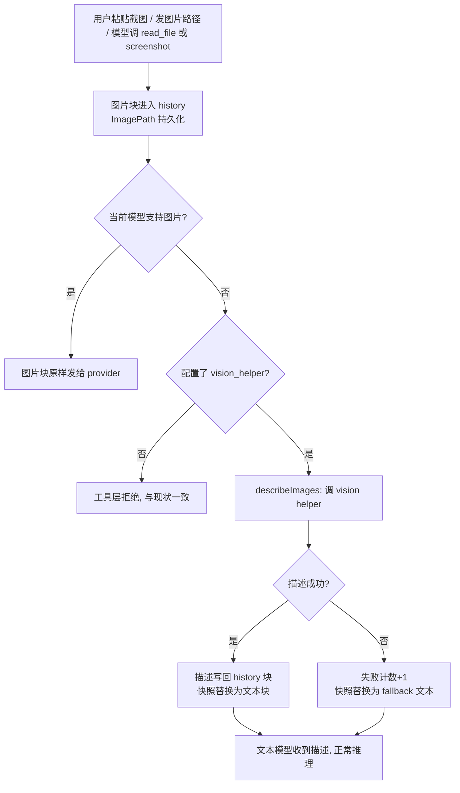

# 非多模态模型的图片描述（vision helper）技术设计

## 背景与目标

octo 支持多端点、多模型，其中一部分模型没有视觉能力（config 中 `Vision: false`，见 `internal/config/config.go:53` 的 `EndpointModel.Vision`）。当前对这类模型的图片处理是"拒绝"：

- `read_file` 读图片时直接返回拒绝文案（`internal/tools/read_file.go:111-116`），理由是"模型以为自己看到了实际上看不到的图，会自信地编造内容"；
- `browser screenshot` 同样拒绝返回图片块（`internal/tools/browser.go:610-613`）；
- 用户直接粘贴的图片（web composer / TUI 剪贴板 / IM 附件）**没有任何闸门**，图片块会原样发给 provider，被静默丢弃或整轮请求失败。

目标：用户显式配置一个 `vision_helper`（复用已配置端点里的 vision 模型）后，文本模型也能"看懂"图片——图片块在发送前被替换为 vision 助手生成的结构化描述文本。语义描述而非纯 OCR：模型不仅能拿到图里的文字，还能知道布局、元素和整体含义。

## 术语

- **vision helper（看图助手）**：用户显式配置的、具备视觉能力的模型，替当前文本模型"看"图。只存在配置引用，不引入新依赖、不下载模型。
- **描述（description）**：vision helper 一次调用返回的结构化 JSON 文本（type / text_content / elements / summary）。
- **发送前转换（describeImages）**：agent 在每次 `send` 前对历史快照做的处理：把需要描述的图片块替换为描述文本。
- **text-only 模型**：config 判定 `Vision: false` 的模型，provider 不接收图片块。

## 范围外

- 纯 OCR 方案（tesseract、macOS Vision framework 等本地识别）——目标定为语义描述，OCR 是描述的子集。
- 捆绑/懒下载本地小 VL 模型（Ollama、llama.cpp 等）——GB 级下载违背开箱即用体量承诺。
- 自动发现 vision 模型（同端点优先、顺序首匹配等启发式）——看图模型必须显式配置，图片发给谁由用户白纸黑字决定。
- 手动 `describe_image` 工具——模型按需调用与自动替换不冲突，可在本方案之上叠加，v1 不做。
- 多图并行描述——v1 顺序描述（事件携带 index/total），并行留待以后。
- 音频、视频、SVG 动画等非栅格内容——不在 `modelImageTypes`（`internal/agent/content.go:163-168`）内的格式继续走现有拒绝/文本摘要路径。

## 业务流



## 架构总览

- **拦截点唯一**：`internal/agent` 的 `runLoop` 在 `send(ctx, a.History.Snapshot(), a.MaxTokens)`（`internal/agent/agent.go:984`）之前执行 `describeImages`。所有图片入口（工具返回、粘贴、IM 附件、MCP 资源）都汇聚在 history 的 image block 上，单点覆盖全部。
- **agent 层不感知 vision 语义**：agent 只持有可选的 `DescribeImage` 回调；"当前模型是不是 text-only""调哪个端点""用什么 prompt"全部封装在 app 构造的闭包里（与 `send` 注入同构，见 `internal/agent/agent.go:901` 的 `send` 参数）。
- **工具层闸门保留**：`read_file` / `browser` 的拒绝分支从"只看模型 vision 标志"改为"模型无 vision **且** 未配置 vision_helper 才拒绝"。这样未配置的用户和 `pkg/octoagent` 外部用户行为逐字节不变。
- **配置即开关**：`vision_helper` 配置存在 → 注入闭包、闸门放宽；不存在 → 全部维持现状。无 feature flag。

## 详细设计

### 6.1 配置：`vision_helper`

`internal/config/config.go:144` 的 `Config` 增加顶层字段：

```yaml
# config.yml
vision_helper: qwen3.7-vl-max   # 裸模型名（与 lite 同风格，见 config.go:159）
```

- **语义**：裸模型名，必须命中某个 endpoint 的 `Models[]` 中 `Vision: true` 的模型。解析复用 `ModelVision` 的查找路径（`internal/config/config.go:426-448` 遍历 endpoints 的 `Models`）。
- **校验**：`Config.Validate()`（`internal/config/config.go:543`）增加规则——`vision_helper` 非空时必须能解析到 `Vision: true` 的 `EndpointModel`，否则配置加载报错，错误信息列出配置的模型名和当前可用的 vision 模型清单。静态校验，配置错误在加载期暴露，而不是等到某次截图。
- **未配置**：功能整体关闭，行为与现状完全一致。

### 6.2 ContentBlock 扩展

`internal/agent/content.go:13-79` 的 `ContentBlock` 增加两个字段：

```go
// ImageDescription 是 vision helper 对该图生成的结构化描述文本
// (type=="image")。由发送前转换惰性填充并随会话持久化；非空时
// 不再调用 vision helper（块即缓存）。fallback 文本以固定前缀
// "[image description unavailable" 开头，会话加载时据此重置重试预算
// （见 6.8）。
ImageDescription string `json:"image_description,omitempty"`

// ImageDescFailures 是该图连续描述失败的次数 (type=="image")，
// 随会话持久化。>= visionHelperMaxFailures 后本会话不再重试。
ImageDescFailures int `json:"image_desc_failures,omitempty"`
```

两个字段走现有 JSON 持久化（session 记录用 `json.Encoder` 逐条写入，`internal/agent/session.go:371` 等；与 `ImagePath` 的 `json:"image_path,omitempty"` 同机制，`content.go:78`）。旧会话文件加载时字段缺省为零值，行为等于"未描述"，无需迁移。

### 6.3 描述回调 `DescribeImage` 与注入

**agent 侧**（`internal/agent`）：

```go
// DescribeImage 为一张图片生成描述文本。返回 agent.ErrSkipImage 表示
// 当前模型支持图片输入，图片块应原样保留（不替换）。
// 返回其他 error 表示描述失败，调用方按失败预算处理。
DescribeImage func(ctx context.Context, img ImageData) (string, error)
```

`Agent` 增加设置器 `SetDescribeImage`（模式同 `SetSender`，`internal/agent/agent.go:589`），nil 表示未启用。`describeImages` 只在 `DescribeImage != nil` 时执行。

**app 侧**（`internal/app`）：新增 `NewVisionDescriber(a *agent.Agent, cfg config.Config) (func(context.Context, agent.ImageData) (string, error), error)`，返回的闭包每次调用时：

1. 在 `a.mu` 下读取 agent 当前 `Model`（模式同 `GetSender`，`internal/agent/agent.go:580`），按 `cfg.ModelVision(model)`（`internal/config/config.go:426`）判定：
   - 当前模型是 vision 模型 → 返回 `agent.ErrSkipImage`。**每次调用都重新判定**，所以 `/model` 切换（`SetSender`）后行为自动跟随，无需额外接线；
   - text-only 模型 → 继续。
2. 解析 `cfg.VisionHelper` 对应的 endpoint（provider / base_url / api_key / protocol），用 `app.buildClient(name, apiKey, baseURL, protocol)`（`internal/app/sender.go:117`）构造 provider client。
3. 构造单条消息（system prompt + image block，见 6.7），以 `context.WithTimeout(ctx, visionDescribeTimeout)` 发起一次非流式 completion，解析返回的 JSON 描述文本。

**注入点**（三处，覆盖全部 agent 构造路径）：

| 路径 | 位置 |
|---|---|
| CLI | `cmd/octo/init.go:83`（`agent.New(llmSender, resolvedModel)` 之后） |
| server | `internal/server/server.go:1227` 的 `buildAgent`（主路径；另有 `server.go:580`、`server.go:2237` 两处直接构造点） |
| 子 agent | `internal/app/spawner.go:84`（子 agent 继承同一闭包，sub_agent 内的文本模型同样能看图） |

`cfg.VisionHelper` 为空时不注入（闭包为 nil），transform 空转，工具层闸门保持拒绝——见 6.5。

### 6.4 发送前转换 `describeImages`

`runLoop` 循环体内（`internal/agent/agent.go:984` 之前）插入：

```go
msgs := a.History.Snapshot()
if a.DescribeImage != nil {
    a.describeImages(ctx, handler, msgs) // 见下
}
reply, err := send(ctx, msgs, a.MaxTokens)
```

`describeImages` 对快照中每个 image block：

| 块状态 | 行为 |
|---|---|
| `ImageDescription != ""` | 缓存命中：快照中替换为文本块，不调 helper |
| `ImageDescFailures >= visionHelperMaxFailures` | 失败预算耗尽：快照中替换为 fallback 文本，不调 helper |
| 其他 | 发 `EventImageDescribing{status:"started"}` → 调 helper → 成功：把描述写回 **history 原块**（`ImageDescription` 赋值、`ImageDescFailures` 清零），快照中替换为文本块，发 `{status:"done"}`；失败：history 原块 `ImageDescFailures++`，快照中替换为 fallback 文本（含原因），发 `{status:"failed"}` |
| helper 返回 `agent.ErrSkipImage` | 快照中的图片块**原样保留**（当前模型是 vision 模型） |

**写回 history 的机制**：`History.Snapshot()` 返回副本（`internal/agent/history.go:40-46`），直接改副本不会落到 history。`History` 增加最小内部方法：

```go
// UpdateMessage 在持有锁的情况下对第 i 条消息做原地修改，并标记
// rewritten（与 replaceLast 一致，internal/agent/history.go:102-110），
// 使 Session 下一次 Save 重写文件、把新字段持久化。
func (h *History) UpdateMessage(i int, mutate func(*Message))
```

transform 持有快照索引 `mi`，写回时调 `a.History.UpdateMessage(mi, ...)`。history 里图片块始终保留（UI 渲染、`rehydrateImageBlocks` 恢复、切回 vision 模型后直接发送都用它），替换只发生在发送用的快照副本上。

**多图**：顺序处理，事件带 `index/total`。**失败语义**：描述失败不打断 turn——fallback 文本进入发送快照，模型照常收到可读内容。

**fallback 文案**（固定前缀，6.8 依赖）：

```
[image description unavailable — <name>; the active model cannot view images
and the vision helper failed (<reason>). Do not guess what the image shows.]
```

`<reason>` 透传三类可区分原因：`not configured` / `timeout` / `<endpoint error>`（如 401 认证失败），模型可向用户转述修法。

### 6.5 工具层闸门调整

`internal/tools/vision.go` 增加与 `ModelVisionEnabled` 同构的全局 + ctx 覆盖标志：

```go
// ImageDescriberActive 报告 config 是否配置了 vision_helper。
// 与 ModelVisionEnabled 并列：read_file/browser 在"模型无 vision 且
// 未配置 vision_helper"时才拒绝——配置了 helper 时返回图片块，
// 由 agent 层发送前转换负责描述。
func ImageDescriberActive(ctx context.Context) bool
```

| 位置 | 改动 |
|---|---|
| `internal/tools/read_file.go:112` | 拒绝条件 `!ModelVisionEnabled(ctx)` → `!ModelVisionEnabled(ctx) && !ImageDescriberActive(ctx)` |
| `internal/tools/browser.go:610` | 同上；tool description 文案同步更新 |
| `internal/server/handlers_prepare_toolturn.go:75` | 与 `tools.WithModelVision(ctx, cfg.ModelVision(a.Model))` 并列 stamp 新 ctx 值（每 turn 新鲜） |
| `internal/app/bootstrap.go:87` 附近 | 与 `SetModelVision` 并列设置全局值（CLI） |
| `internal/tools/mcp.go:303` `formatToolResult` | **无改动**（MCP 图片本无闸门，图片块直接进 history，由发送前转换统一兜住） |

`pkg/octoagent` 外部用户不设置该标志：text-only 模型下工具拒绝行为与现状逐字节一致。

### 6.6 事件

`internal/agent/event.go:6` 增加事件类型与字段：

```go
// EventImageDescribing 在发送前转换处理图片块时发出。
// Text 为图片名（ImagePath 的 basename）；ImageIndex/ImageTotal 为
// 本轮需描述图片的序号；ImageStatus 为 "started" | "done" | "failed"。
EventImageDescribing EventKind = "image_describing"
```

`AgentEvent`（`internal/agent/event.go:136-166`）增加：

```go
ImageName   string `json:"image_name,omitempty"`
ImageIndex  int    `json:"image_index,omitempty"`
ImageTotal  int    `json:"image_total,omitempty"`
ImageStatus string `json:"image_status,omitempty"`
```

Web 端（`ChatView.svelte`）渲染为一条状态行（"🔍 正在用 vision 助手描述图片 (1/2)…"），TUI 按 `EventToolStarted` 同款处理；done/failed 事件在工具结果旁显示"已通过 vision 助手描述"或失败原因。

### 6.7 描述 prompt 与输出 schema

**Prompt**（system，单次调用）：

- 角色："你是 octo 的看图助手。把这张图转写为结构化 JSON，必须完整、忠实，不得概括或省略图中文字。"
- 语言：`text_content` 始终逐字转写（语言无关）；`summary` 和 `elements[].label` 的措辞用会话语言（`cfg.Language`，`internal/config/config.go:202` 的 `yaml:"language"`）。
- 输出约束：只输出 JSON 对象。

**Schema**：

```json
{
  "type": "screenshot | photo | chart | document | other",
  "text_content": "图中所有文字逐字转写；无文字则为空字符串",
  "elements": [
    {
      "label": "元素文字或简述（用会话语言）",
      "position": "top-left | top-center | top-right | middle-left | center | middle-right | bottom-left | bottom-center | bottom-right",
      "kind": "button | input | dialog | table | icon | image | link | text"
    }
  ],
  "summary": "一句话概括（用会话语言）"
}
```

解析用 `internal/agent/jsonparse.go` 现有的鲁棒 JSON 提取（与工具参数解析同款），字段缺失按零值容错：`text_content` 空字符串、`elements` 空数组、`summary` 空字符串。

### 6.8 会话加载时的重试预算重置

`rehydrateImageBlocks`（`internal/agent/session.go:1410-1430`）追加逻辑：若块的 `ImageDescription` 以 fallback 前缀 `"[image description unavailable"` 开头，则清空 `ImageDescription` 与 `ImageDescFailures`。

效果：连续失败 2 次（`visionHelperMaxFailures = 2`）后本会话不再调 helper（避免死端点每轮白付超时）；新会话（重启）获得全新预算，端点修好后自动恢复。fallback 前缀是重试预算的持久化边界，不依赖进程内存。

## 数据模型与持久化

- 无新表/新文件。`ContentBlock` 两个新字段随会话记录 JSON 持久化（6.2）。
- 图片字节仍只存磁盘（`ImagePath`），描述是文本，直接进记录。
- 数据量：描述约 200-800 token/图，写入即永久（与工具输出同等级），compaction 摘要对 image block 的既有处理不变（`internal/agent/compaction.go` 现不提取 image block 文本，本次不改动）。

## API 设计（新增接口汇总）

| 接口 | 位置 | 说明 |
|---|---|---|
| `Config.VisionHelper string` | `internal/config/config.go` | 配置项，裸模型名 |
| `ContentBlock.ImageDescription string` | `internal/agent/content.go` | 描述文本（含 fallback），持久化 |
| `ContentBlock.ImageDescFailures int` | `internal/agent/content.go` | 连续失败计数，持久化 |
| `Agent.SetDescribeImage(func(ctx, ImageData) (string, error))` | `internal/agent/agent.go` | 注入回调；nil = 关闭 |
| `agent.ErrSkipImage` | `internal/agent` | 哨兵错误：当前模型支持图片，保留原块 |
| `History.UpdateMessage(i, mutate)` | `internal/agent/history.go` | 原地修改第 i 条消息并标记 rewritten |
| `tools.ImageDescriberActive(ctx)` / `SetImageDescriberActive` / `WithImageDescriberActive` | `internal/tools/vision.go` | 与 ModelVisionEnabled 同构 |
| `app.NewVisionDescriber(a, cfg)` | `internal/app` | 构造闭包 |
| `EventImageDescribing` + `AgentEvent.ImageName/ImageIndex/ImageTotal/ImageStatus` | `internal/agent/event.go` | 状态事件 |

## 配置设计

| 键 | 默认 | 生效方式 | 说明 |
|---|---|---|---|
| `vision_helper` | 空（关闭） | 启动加载 | 裸模型名；校验必须命中 `Vision: true` 的 endpoint model，否则加载报错 |

无 feature flag：配置存在即启用，删除配置即回退。不涉及热更新（octo 配置均为启动加载，与现有键一致）。

## 外部依赖接口

| 调用 | 位置 | 字段（verbatim） |
|---|---|---|
| vision helper completion | `internal/app` 闭包内，复用 `buildClient`（`internal/app/sender.go:117`）→ `provider.Provider` | 输入：单条 user 消息 + `ImageData{MIMEType, Data}`（`internal/agent/content.go:82-85`）；输出：completion 文本，按 6.7 schema 解析 |
| 端点解析 | `cfg.ModelVision(model)`（`internal/config/config.go:426-448`） | `Endpoint{ID, Provider, BaseURL, APIKey, Protocol}`（`config.go:96-121`）、`EndpointModel{Model, Vision}`（`config.go:126-131`） |
| 超时基准 | 对齐 `internal/mcp/client.go:22` `defaultCallTimeout = 60 * time.Second` | `visionDescribeTimeout = 60 * time.Second`，闭包内 `context.WithTimeout` |

## 测试计划

| 包 | 用例 |
|---|---|
| `internal/agent` | describeImages：缓存命中不调 helper；失败计数递增/清零；达到 `visionHelperMaxFailures` 后不再调用；fallback 前缀文本写回；`ErrSkipImage` 时快照原块保留；事件序列（started→done / started→failed）；多图顺序与 index/total；UpdateMessage 标记 rewritten |
| `internal/agent` | 会话加载：fallback 前缀块的重试预算重置；旧会话文件（无新字段）加载正常 |
| `internal/tools` | read_file / browser 拒绝矩阵：{vision 模型, text-only+未配置, text-only+已配置} × {读图, 截图} 四象限（配置态用 `SetImageDescriberActive` 模拟） |
| `internal/config` | vision_helper 校验：命中 Vision:true / 模型不存在 / 模型存在但 Vision:false / 空值 |
| `internal/app` | NewVisionDescriber：text-only 模型触发描述、vision 模型返回 `ErrSkipImage`、`SetSender` 换模型后行为跟随、未配置返回 nil |
| 端到端（本地手测） | fake provider 返回 6.7 JSON → 文本模型正确引用 text_content；provider 返回 500 → fallback 文案含原因 |

## 兼容性

逐项核对：

- **未配置 vision_helper 的用户**：`read_file`/`browser` 拒绝分支条件不变（`!Vision && !DescriberActive` 在未配置时等价于 `!Vision`），transform 空转，事件不产生，块无新字段——行为与现状逐字节一致。
- **`pkg/octoagent` 外部使用者**：不设置 `ImageDescriberActive`，拒绝路径不变；`DescribeImage` 缺省 nil，agent 公共行为无变化。
- **vision 模型用户**：闭包返回 `ErrSkipImage`，图片块原样发送，与现状一致；描述逻辑完全不参与。
- **已有会话文件**：新字段 `omitempty`，旧记录加载缺省零值，语义=未描述，无需迁移；`rehydrateImageBlocks` 的追加逻辑只作用于新字段。
- **provider wire 格式**：图片块对 provider 的序列化不变（Anthropic base64 source / OpenAI data URL，见 `content.go:126-158` 注释）；描述替换只发生在 agent → provider 的文本组装层。
- **MCP 图片**：`formatToolResult` 无改动；text-only 模型 + 已配置 helper 时 MCP 图片从"进 provider 被拒"变为"被描述"，属预期改进。
- **compaction / overflow / 子 agent**：描述是 history 上普通字段，不改变现有消息结构；子 agent 通过 `spawner.go:84` 继承闭包。

## 安全

- 图片只发往用户显式配置的端点（`vision_helper`），与现有"多端点图片直发 provider"的信任模型一致；无新密钥、无第三方依赖。
- 描述文本进入会话历史与工具输出同等级，无额外权限面。
- fallback 文案只透传错误类别（timeout / 401 等），不透传完整异常栈。
- 配置校验保证 `vision_helper` 必须是已配置 endpoint 的模型，杜绝"指向未配置 provider"的注入面。

## 高可用与失败语义

- 单次描述调用 60s 超时（对齐 MCP `defaultCallTimeout`）；超时/端点错误 → 失败计数 +1 → fallback。
- 失败预算：每块每会话 2 次（`visionHelperMaxFailures`）；耗尽后该块本会话不再调用 helper，零额外延迟；会话加载重置预算（6.8）。
- 描述失败不影响 turn：fallback 文本进入发送快照，模型照常收到可读内容并被告知"不要猜测"。
- 多图顺序描述，单图失败不阻断后续图。
- 并发：闭包捕获 `cfg`（只读）与 agent 指针（`a.mu` 保护），无共享可变状态；每会话独立实例。
- 描述调用受 turn 的 ctx 控制，用户 Ctrl-C 可中断（走 `finishInterrupted`，`internal/agent/agent.go:946-948`）。

## 监控

octo 无遥测体系；本功能的可观测性靠：

- `EventImageDescribing`（started/done/failed）——Web/TUI 可见，hook 系统可订阅（`EventToolStarted` 同级）。
- 描述失败打日志（现有 logging），含端点名与错误类别。
- 无新增指标面。

## 发布顺序与回滚

单仓库单 PR（`dev-docs` 之外的代码改动集中在 `internal/agent`、`internal/tools`、`internal/config`、`internal/app`、`cmd/octo`、`internal/server`、`web`）。

- 回滚 = 删除 `vision_helper` 配置项或回滚代码，二者均可独立进行；无数据迁移，会话文件向后兼容。
- 灰度：配置项天然灰度——只有配置了 `vision_helper` 的实例启用新路径。
