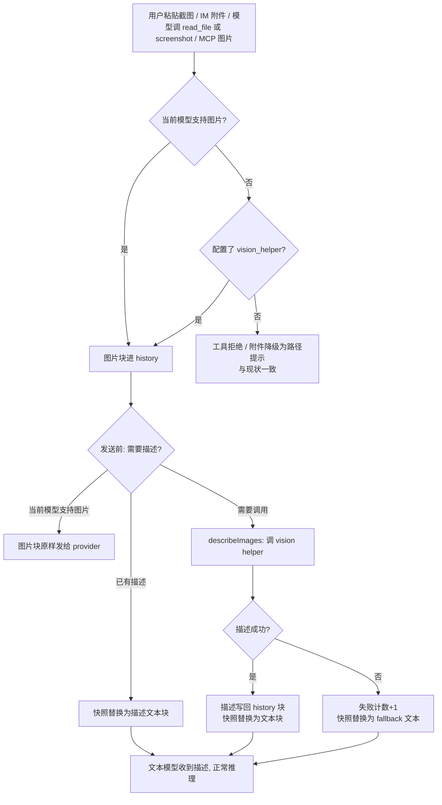

# 非多模态模型的图片描述（vision helper）技术设计

## 背景与目标

octo 支持多端点、多模型，其中一部分模型没有视觉能力（config 中 `Vision: false`，见 `internal/config/config.go:131` 的 `EndpointModel.Vision`）。当前对这类模型的图片，各入口一律降级，谁都拿不到图里的内容：

- `read_file` 读图片时直接返回拒绝文案（`internal/tools/read_file.go:112-116`），理由是"模型以为自己看到了实际上看不到的图，会自信地编造内容"；
- `browser screenshot` 同样拒绝返回图片块，只给一个磁盘路径（`internal/tools/browser.go:610-613`）；
- 用户直接粘贴的图片不产生图片块，而是降级为路径提示：web composer 走 `parseUserFiles` 的 `else` 分支（`internal/server/attachments.go:138-149`），IM 附件走 `attachInboundFiles`（`internal/server/server.go:3067-3081`），两者都把图片存盘后塞一条 `AttachmentNote(path)`，指望模型自己去 `read_file` ——而 `read_file` 正好也拒绝。

目标：用户显式配置一个 `vision_helper`（复用已配置端点里的 vision 模型）后，文本模型也能"看懂"图片——图片块在发送前被替换为 vision 助手生成的结构化描述文本。语义描述而非纯 OCR：模型不仅能拿到图里的文字，还能知道布局、元素和整体含义。

## 术语

- **vision helper（看图助手）**：用户显式配置的、具备视觉能力的模型，替当前文本模型"看"图。只存在配置引用，不引入新依赖、不下载模型。
- **描述（description）**：vision helper 一次调用返回的结构化 JSON 文本（type / text_content / elements / summary）。
- **发送前转换（describeImages）**：agent 在每次 `send` 前对历史快照做的处理：把需要描述的图片块替换为描述文本。
- **text-only 模型**：config 判定 `Vision: false` 的模型，provider 不接收图片块。

## 范围外

- 纯 OCR 方案（tesseract、macOS Vision framework 等本地识别）——目标定为语义描述，OCR 是描述的子集。
- 捆绑/懒下载本地小 VL 模型（Ollama、llama.cpp 等）——GB 级下载违背开箱即用体量承诺。
- 自动发现 vision 模型（同端点优先、顺序首匹配等启发式）——看图模型必须显式配置，图片发给谁由用户白纸黑字决定。
- 手动 `describe_image` 工具——模型按需调用与自动替换不冲突，可在本方案之上叠加，v1 不做。
- 多图并行描述——v1 顺序描述（事件携带 index/total），并行留待以后。
- 描述缓存失效——描述是历史事实（当时那张图就是这些内容），换了更强的 helper 也不重算旧图：重算既要重新付费，又会让同一条历史消息在不同时间呈现不同内容。
- 音频、视频、SVG 动画等非栅格内容——不在 `modelImageTypes`（`internal/agent/content.go:163-168`）内的格式继续走现有拒绝/文本摘要路径。

## 业务流



## 架构总览

- **拦截点唯一**：`internal/agent` 的 `runLoop` 在 `send(ctx, a.History.Snapshot(), a.MaxTokens)`（`internal/agent/agent.go:984`）之前执行 `describeImages`。所有图片入口（工具返回、粘贴、IM 附件、MCP 资源）都汇聚在 history 的 image block 上——工具结果的图片块被平铺进同一条 message 的顶层（`internal/agent/agent.go:1825-1829`），不嵌在 tool_result 里——遍历顶层块即覆盖全部。
- **入口闸门只负责"让图片进得来"**：`read_file` / `browser` / 附件处理三处的降级分支从"只看模型 vision 标志"改为"模型无 vision **且** 未配置 vision_helper 才降级"。配了 helper 就照常产出图片块，描述交给唯一的拦截点。不这么改，粘贴和 IM 的图片永远变不成 image block，发送前转换就看不到它们。
- **agent 层不感知 vision 语义**：agent 只持有可选的 `DescribeImage` 回调；"当前模型是不是 text-only""调哪个端点""用什么 prompt"全部封装在 app 构造的闭包里（与 `send` 注入同构，见 `internal/agent/agent.go:901` 的 `send` 参数）。
- **配置即开关**：`vision_helper` 配置存在 → 注入闭包、闸门放宽；不存在 → 全部维持现状。无 feature flag。

## 详细设计

### 6.1 配置：`vision_helper`

`internal/config/config.go:144` 的 `Config` 增加顶层字段，与 `Default` / `Lite` 并列：

```yaml
# config.yml
vision_helper: my-dashscope::qwen3.7-vl-max   # composite id，或裸模型名
```

**解析**：复用 `Config.EntryByModel`（`internal/config/config.go:691`）——它既吃 composite id `"<endpoint>::<model>"` 也吃裸模型名，返回 `ModelEntry{Provider, Model, BaseURL, APIKey, Protocol, Vision}` 和一个 `ok`。`Lite` 走的就是这条路（`cmd/octo/chat.go:786`）。

不能改用 `Config.ModelVision`：它只返回 bool，且模型不在任何 endpoint 时会回落到 `ModelSupportsVision` 启发式（`config.go:446`，注释明说 "errs toward true"），拼错的模型名会被判定为可用。

包一层语义方法，同时服务校验、闸门和闭包三处：

```go
// ResolveVisionHelper 解析 vision_helper 指向的端点+模型。ok 为 false
// 表示未配置、解析不到，或解析到的模型 Vision==false —— 三种情况下
// 看图助手一律视为未启用。
func (c Config) ResolveVisionHelper() (ModelEntry, bool)
```

**校验**：`Config.Validate()`（`internal/config/config.go:543`）增加规则——`vision_helper` 非空但 `ResolveVisionHelper` 失败时，追加一条 problem，列出配置值和当前可用的 vision 模型清单。

注意 `Validate` 返回 `[]string` 而**不会让 `config.Load()` 失败**：它由 `octo doctor`（`cmd/octo/doctor.go:56`）和配置写入后的 guard（`internal/tools/config_guard.go:97`）消费。所以校验是"报告"不是"拦截"，运行期必须自己兜底：`ResolveVisionHelper` 失败 → 闭包不注入、闸门不放宽 → 行为等同未配置，且 fallback 文案给出 `not configured` 原因。

**未配置**：功能整体关闭，行为与现状完全一致。

### 6.2 ContentBlock 扩展

`internal/agent/content.go:13-79` 的 `ContentBlock` 增加两个字段，职责正交：

```go
// ImageDescription 是 vision helper 对该图生成的结构化描述文本
// (type=="image")。只在描述成功时写入，由发送前转换惰性填充并随会话
// 持久化；非空即缓存命中，不再调用 vision helper。描述失败的 fallback
// 文案只进发送快照，不写这里 —— 这个字段永远只装真描述。
ImageDescription string `json:"image_description,omitempty"`

// ImageDescFailures 是该图在本会话内连续描述失败的次数 (type=="image")。
// >= visionHelperMaxFailures 后本会话不再重试。随会话持久化只是为了
// 让同进程内的 Save/Load 往返保持一致；LoadSession 会无条件清零，
// 新会话总是拿到全新预算（见 6.8）。
ImageDescFailures int `json:"image_desc_failures,omitempty"`
```

两个字段与 `ImagePath`（`content.go:78`）同机制走会话记录的 JSON 持久化。旧会话文件加载时字段缺省为零值，行为等于"未描述"，无需迁移。

### 6.3 描述回调 `DescribeImage` 与注入

**agent 侧**（`internal/agent`）：

```go
// ImageDescriber 把图片渲染成文本，供不能接收图片输入的模型使用。
type ImageDescriber interface {
    // Active 报告当前是否需要描述 —— false 表示主模型自己能看图，
    // 图片块原样发给 provider。每轮重新询问，/model 切换立即生效。
    Active() bool
    // Describe 返回单张图片的文本渲染。
    Describe(ctx context.Context, img ImageData) (string, error)
}
```

「要不要描述」与具体是哪张图无关，所以它是接口上的独立方法，而不是 `Describe` 返回的哨兵错误。哨兵会漏掉一个场景：文本模型看过的图已缓存描述，之后 `/model` 切到 vision 模型，遍历时全部命中缓存，一次 `Describe` 都不会发生，也就无从得知该跳过——vision 模型于是收到描述文本而不是原图。`Active()` 在遍历前问一次，这个降级不存在。

`Agent` 增加设置器 `SetImageDescriber`（模式同 `SetSender`，`internal/agent/agent.go:589`），nil 表示未启用。`describeImages` 只在描述器非 nil 且 `Active()` 为真时执行。

**app 侧**（`internal/app`）：新增 `NewVisionDescriber(a *agent.Agent, cfg config.Config) agent.ImageDescriber`，返回 nil 当且仅当 `ResolveVisionHelper` 失败（未配置 / 解析不到 / 指向的模型无视觉能力）——**与工具闸门的判定完全一致**。闸门放行图片块的前提是描述器会翻译它们；若"解析得到但调不通"（没有 API key、sender 构造失败）也返回 nil，闸门照常放行而描述器缺席，原始图片就会直发 text-only 端点每轮 400。所以这类情况返回一个 `Describe` 恒报明确错误的描述器：错误进入单图 fallback 文案（指名修法），重试预算挡住重复尝试。

1. `Active()` = `!cfg.ModelVision(a.GetModel())`（`internal/config/config.go:426`）。`GetModel` 走读锁（与 `GetSender` 同款，`internal/agent/agent.go:580`），因为 `/model` 切换在另一个 goroutine 里写 `Model`。**每轮重新判定**，所以切换后行为自动跟随，无需额外接线。
2. 用 `ResolveVisionHelper()` 拿到的 `ModelEntry` 构造 sender：`app.NewSender(app.SenderOptions{Provider, APIKey, BaseURL, Protocol})`（`internal/app/sender.go:79`）。API key 沿用现有优先级——`os.Getenv(app.VendorAPIKeyEnvVar(entry.Provider))` 优先，空则回落 `entry.APIKey`（同 `internal/server/server.go:1644-1647`）。sender 在闭包构造时建一次并复用，描述调用共享同一个 prompt cache key。
3. 构造单条消息（system prompt + image block，见 6.7），以 `context.WithTimeout(ctx, visionDescribeTimeout)` 发起一次非流式 completion，解析返回的 JSON 描述文本。

**注入点**：

| 路径 | 位置 | 说明 |
|---|---|---|
| CLI / TUI | `cmd/octo/chat.go:769` | `agent.New(llmSender, resolvedModel)` 之后，与 `LiteSender` 装配同段 |
| server 会话 | `internal/server/server.go:1229` 的 `buildAgent` | Web/API 每个会话的主路径 |
| IM channel | `internal/server/server.go:2237` | channel agent 单独构造；IM 附件是本功能的目标场景之一，必须注入 |
| 子 agent | `internal/app/spawner.go:84` | 子 agent 继承同一闭包，sub_agent 内的文本模型同样能看图 |

不注入的两处，避免误配：`cmd/octo/init.go:83` 是 `octo init` 写 `.octorules` 的一次性 agent，不处理图片；`internal/server/server.go:580` 的 `template` 只用来生成 sub_agent 工具描述，从不真跑 turn。

`ResolveVisionHelper` 失败时全部跳过注入（闭包为 nil），transform 空转，闸门保持降级——见 6.5。

### 6.4 发送前转换 `describeImages`

`runLoop` 循环体内（`internal/agent/agent.go:984`）改为：

```go
msgs := a.History.Snapshot()
if a.DescribeImage != nil {
    a.describeImages(ctx, handler, msgs) // 见下
}
reply, err := send(ctx, msgs, a.MaxTokens)
```

`describeImages` 对快照中每个 image block：

| 块状态 | 行为 |
|---|---|
| `ImageDescription != ""` | 缓存命中：快照中替换为文本块，不调 helper |
| `ImageDescFailures >= visionHelperMaxFailures` | 失败预算耗尽：快照中替换为 fallback 文本，不调 helper |
| 其他 | 发 `EventImageDescribing{status:"started"}` → 调 helper → 成功：把描述写回 **history 原块**（`ImageDescription` 赋值、`ImageDescFailures` 清零），快照中替换为文本块，发 `{status:"done"}`；失败：history 原块 `ImageDescFailures++`，快照中替换为 fallback 文本（含原因），发 `{status:"failed"}` |
| `Active()` 为 false | 整个转换不执行，所有图片块**原样保留**（当前模型自己能看图） |
| `Image == nil` | 没有字节可描述（磁盘副本已丢失），留给 provider 层，不调 helper |

**写回 history 的机制**：`History.Snapshot()` 返回副本（`internal/agent/history.go:40-46`），直接改副本不会落到 history。`History` 增加一个窄接口：

```go
// UpdateMessage 在持有写锁的情况下对第 i 条消息做原地修改，并标记
// rewritten（与 replaceLast 一致，internal/agent/history.go:102-110），
// 使 Session 下一次 Save 重写文件、把新字段持久化。越界索引为 no-op。
func (h *History) UpdateMessage(i int, mutate func(*Message))
```

transform 持有快照索引 `mi`，写回时调 `a.History.UpdateMessage(mi, ...)`。索引对 append 稳定（drain/append 只在尾部），而会移位历史的操作（compaction 在 turn 开始前、overflow recovery 在 send 失败后 `continue` 重取快照）都不与本转换重叠。history 里图片块始终保留（UI 渲染、`rehydrateImageBlocks` 恢复、切回 vision 模型后直接发送都用它），替换只发生在发送用的快照副本上。

**快照的 Blocks 与 history 共享底层数组**：`Snapshot` 只 `copy` 了 `[]Message`，每条 `Message.Blocks` 仍是同一个 slice header，指向同一份数据。直接写 `msgs[mi].Blocks[bi]` 会把 history 里的图片块一起改掉——UI 里图片消失，会话重放没有图，切回 vision 模型也无图可发。所以替换前先给该消息复制一份私有的 Blocks 数组（每条消息只复制一次）。这是本方案唯一一处必须显式防护的别名问题。

**多图**：顺序处理，事件带 `index/total`。**失败语义**：描述失败不打断 turn——fallback 文本进入发送快照，模型照常收到可读内容。用户打断（ctx 取消）造成的失败**不计入重试预算**：取消后剩余每张图的 Describe 都会立即失败，计数会一键写死整批图。

**还有两条发送路径要过同一转换**：截断升档重试（`runLoop` 内 `send(ctx, …, a.MaxTokensEscalate)`）重新取快照，必须同样先跑 `describeImages`（缓存全命中，零成本）；compaction 的 `summarize` 把折叠段发给 lite 模型、失败回落主模型——主模型正是 text-only，所以摘要输入里**已有描述的**图片块替换为描述文本（`textifyDescribedImages`），未描述的块保持原行为。

**fallback 文案**：

```
[image description unavailable — <name>; the active model cannot view images
and the vision helper failed (<reason>). Do not guess what the image shows.]
```

`<name>` 取 `ImagePath` 的 basename，为空时用 `"image"`（工具产出的图片块不带 `ImagePath`，见 6.8）。`<reason>` 透传三类可区分原因：`not configured` / `timeout` / `<endpoint error>`（如 401 认证失败），模型可向用户转述修法。

### 6.5 入口闸门调整

四处降级分支要认得 helper，否则图片根本进不了 history。**tools 包**用与 `ModelVisionEnabled` 同构的全局 + ctx 覆盖标志（`internal/tools/vision.go`）：

```go
// ImageDescriberActive 报告 config 是否配置了可用的 vision_helper。
// 与 ModelVisionEnabled 并列：read_file/browser 在"模型无 vision 且
// 无 vision_helper"时才降级 —— 配了 helper 就返回图片块，
// 由 agent 层发送前转换负责描述。
func ImageDescriberActive(ctx context.Context) bool
```

**server 包**三处已经手里就有 `cfg`，直接算，不必再过 ctx 标志。

| 位置 | 改动 |
|---|---|
| `internal/tools/read_file.go:112` | 降级条件 `!ModelVisionEnabled(ctx)` → `!ModelVisionEnabled(ctx) && !ImageDescriberActive(ctx)` |
| `internal/tools/browser.go:610` | 同上；tool description 文案同步更新 |
| `internal/server/handlers_prepare_toolturn.go:75` | 与 `tools.WithModelVision(ctx, cfg.ModelVision(a.Model))` 并列 stamp 新 ctx 值（每 turn 新鲜） |
| `internal/app/bootstrap.go:87` 附近 | 与 `SetModelVision` 并列设置全局值（CLI） |
| `internal/server/ws_handlers.go:506` | `vision := cfg.ModelVision(sess.Model)` → 同时接受 helper；参数随之改名 `parseUserFiles(files, allowLocalPath, sendImageBlocks bool)`（`attachments.go:114`），因为它已不再等于"模型有 vision" |
| `internal/server/server.go:3067` | `attachInboundFiles` 的 `vision` 同上——IM 图片改走图片块而非路径提示 |
| `internal/tools/mcp.go:303` `formatToolResult` | **无改动**（MCP 图片本无闸门，图片块直接进 history，由发送前转换统一兜住） |

放宽后 web composer 走的是 `attachments.go:138-142` 的图片块分支，它同时填 `att.images`，UI 缩略图照常显示。

不调用 `SetImageDescriberActive` 的路径：text-only 模型下工具降级行为与现状逐字节一致。

### 6.6 事件

`internal/agent/event.go:6` 增加事件类型与字段：

```go
// EventImageDescribing 在发送前转换处理图片块时发出。
// ImageName 为图片名（ImagePath 的 basename，缺省 "image"）；
// ImageIndex/ImageTotal 为本轮需描述图片的序号；
// ImageStatus 为 "started" | "done" | "failed"。
// 失败时 Err 带原因。
EventImageDescribing EventKind = "image_describing"
```

`AgentEvent`（`internal/agent/event.go:136-166`）增加：

```go
ImageName   string `json:"image_name,omitempty"`
ImageIndex  int    `json:"image_index,omitempty"`
ImageTotal  int    `json:"image_total,omitempty"`
ImageStatus string `json:"image_status,omitempty"`
```

Web 端（`ChatView.svelte`）渲染为一条状态行（"🔍 正在用看图助手描述图片 (1/2)…"），TUI 按 `EventToolStarted` 同款处理；done/failed 事件在工具结果旁显示"已通过看图助手描述"或失败原因。

### 6.7 描述 prompt 与输出 schema

**Prompt**（system，单次调用）：

- 角色："你是 octo 的看图助手。把这张图转写为结构化 JSON，必须完整、忠实，不得概括或省略图中文字。"
- 语言：`text_content` 始终逐字转写（语言无关）；`summary` 和 `elements[].label` 的措辞用会话语言（`cfg.Language`，`internal/config/config.go:202`）。
- 输出约束：只输出 JSON 对象。

**Schema**：

```json
{
  "type": "screenshot | photo | chart | document | other",
  "text_content": "图中所有文字逐字转写；无文字则为空字符串",
  "elements": [
    {
      "label": "元素文字或简述（用会话语言）",
      "position": "top-left | top-center | top-right | middle-left | center | middle-right | bottom-left | bottom-center | bottom-right",
      "kind": "button | input | dialog | table | icon | image | link | text"
    }
  ],
  "summary": "一句话概括（用会话语言）"
}
```

解析用 `internal/agent/jsonparse.go` 现有的鲁棒 JSON 提取（与工具参数解析同款），字段缺失按零值容错：`text_content` 空字符串、`elements` 空数组、`summary` 空字符串。整体解析不出 JSON 才算失败，走失败预算。

### 6.8 会话加载

`rehydrateImageBlocks`（`internal/agent/session.go:1410-1430`）两处改动。

**其一，重试预算无条件清零**：每个 image block 的 `ImageDescFailures` 置 0。效果是连续失败 2 次（`visionHelperMaxFailures = 2`）后本会话不再调 helper（避免死端点每轮白付超时），而重启或恢复会话拿到全新预算，端点修好后自动恢复。

**其二，保住已有描述**：现有逻辑对"字节恢复不了"的块整块替换成 `[image attachment no longer available: <name>]`，会连持久化的描述一起丢。而 `ImagePath` 全库唯一的赋值点是 `internal/server/attachments.go:210`（web/IM 上传），`read_file` / `browser screenshot` / MCP 产出的图片块**没有 `ImagePath`**——正是本功能重点改造的入口。不改这里，恢复会话时截图和读图的描述缓存全部作废。

顺序：先试 `ImagePath` 恢复字节（成功则块保持 image，描述留在字段上，下次发送直接缓存命中）；恢复不了时，`ImageDescription` 非空就降级成描述文本块，仍为空才落到"不可用"占位。

## 配置入口

后端配置项之外，需要一个人能点的地方——否则只能手改 `config.yml`。整体照搬 lite 模型现成的三层做法：

| 层 | 做法 |
|---|---|
| Web 设置 | `web/src/components/settings/EndpointsSection.svelte` 的模型 chip 增加"设为看图助手 / 取消"菜单项，与 `set_lite`/`unset_lite`（同文件 `:459-467`）并列；只对 `Vision: true` 的模型显示 |
| HTTP API | `POST /api/config/endpoints/{id}/vision_helper[?model=<model>]` + `DELETE` 同路径，与 `handleSetEndpointLite` / `handleUnsetEndpointLite`（`internal/server/onboard_config_handlers.go:1129,1166`）同构，复用 `resolveEndpointModel`（`:1064`） |
| CLI | `octo config show` 增加一行 `vision_helper = …`（同 `cmd/octo/config.go:240-243` 的 lite）；`octo doctor` 通过 `Validate` 报错。不进 setup 向导——lite 也不在向导里，向导只管跑通第一个模型 |

## 数据模型与持久化

- 无新表/新文件。`ContentBlock` 两个新字段随会话记录 JSON 持久化（6.2）。
- 图片字节仍只存磁盘（`ImagePath`）或不落盘，描述是文本，直接进记录。
- 数据量：描述约 200-800 token/图，写入即永久（与工具输出同等级）。
- compaction：`internal/agent/compaction.go` 现不提取 image block 的任何文本，本次不改。历史被折叠时描述随图片块一起进摘要之外——与图片本身同命运，不产生新的一致性问题。

## API 设计（新增接口汇总）

| 接口 | 位置 | 说明 |
|---|---|---|
| `Config.VisionHelper string` | `internal/config/config.go` | 配置项，composite id 或裸模型名 |
| `Config.ResolveVisionHelper() (ModelEntry, bool)` | `internal/config/config.go` | 解析 + 可用性判定，校验/闸门/闭包共用 |
| `ContentBlock.ImageDescription string` | `internal/agent/content.go` | 成功的描述文本，持久化 |
| `ContentBlock.ImageDescFailures int` | `internal/agent/content.go` | 本会话连续失败计数，加载时清零 |
| `agent.ImageDescriber`（`Active` / `Describe`） | `internal/agent/vision.go` | 描述器接口 |
| `Agent.SetImageDescriber(ImageDescriber)` | `internal/agent/agent.go` | 注入描述器；nil = 关闭 |
| `Agent.GetModel()` / `SetModel(string)` | `internal/agent/agent.go` | 带锁读写 Model，与 `GetSender`/`SetSender` 配对 |
| `History.UpdateMessage(i, mutate)` | `internal/agent/history.go` | 原地修改第 i 条消息并标记 rewritten |
| `tools.ImageDescriberActive(ctx)` / `SetImageDescriberActive` / `WithImageDescriberActive` | `internal/tools/vision.go` | 与 ModelVisionEnabled 同构 |
| `app.NewVisionDescriber(a, cfg)` | `internal/app` | 构造描述器；nil 判定与闸门一致（仅解析失败），无 key 时 Describe 报错走 fallback |
| `tools.ImagesAllowed(ctx)` | `internal/tools/vision.go` | `ModelVisionEnabled \|\| ImageDescriberActive`，工具统一查这一个 |
| `EventImageDescribing` + `AgentEvent.ImageName/ImageIndex/ImageTotal/ImageStatus` | `internal/agent/event.go` | 状态事件 |
| `POST`/`DELETE /api/config/endpoints/{id}/vision_helper` | `internal/server/onboard_config_handlers.go` | 设置入口，同构 lite |

## 配置设计

| 键 | 默认 | 生效方式 | 说明 |
|---|---|---|---|
| `vision_helper` | 空（关闭） | 启动加载 | composite id 或裸模型名；必须解析到 `Vision: true` 的 endpoint model，否则 `octo doctor` 报告问题且功能保持关闭 |

无 feature flag：配置存在且可解析即启用，删除配置即回退。不涉及热更新（octo 配置均为启动加载，与现有键一致）。

`vision_helper` 与 `default` / `lite` 一样是端点的复合 id 引用，所以必须跟着端点变动走：重命名端点时重写前缀（`RenameEndpoint`），删除端点或删除它名下的模型时清空（`handleDeleteEndpoint` / `handleDeleteEndpointModel`）。漏掉任何一处都会留下悬空引用，功能静默失效，且只有 `octo doctor` 才看得出来。

## 外部依赖接口

| 调用 | 位置 | 字段（verbatim） |
|---|---|---|
| vision helper completion | `internal/app` 闭包内，`app.NewSender`（`internal/app/sender.go:79`）→ `agent.Sender` | 输入：单条 user 消息 + `ImageData{MIMEType, Data}`（`internal/agent/content.go:82-85`）；输出：completion 文本，按 6.7 schema 解析 |
| 端点解析 | `cfg.ResolveVisionHelper()` → `cfg.EntryByModel`（`internal/config/config.go:691`） | `ModelEntry{Provider, Model, Protocol, BaseURL, APIKey, Vision}`（`config.go:41-60`） |
| API key | `app.VendorAPIKeyEnvVar(provider)` 环境变量优先，回落 `ModelEntry.APIKey` | 同 `internal/server/server.go:1644-1647` |
| 超时基准 | 对齐 `internal/mcp/client.go:22` `defaultCallTimeout = 60 * time.Second` | `visionDescribeTimeout = 60 * time.Second`，闭包内 `context.WithTimeout` |

## 测试计划

| 包 | 用例 |
|---|---|
| `internal/agent` | describeImages：缓存命中不调 helper；失败计数递增/成功后清零；达到 `visionHelperMaxFailures` 后不再调用；`Active()` 为 false 时快照原块保留（含已缓存描述的块）；history 原块始终是 image 块（只有快照被替换）；事件序列（started→done / started→failed）；多图顺序与 index/total；UpdateMessage 标记 rewritten 且越界 no-op |
| `internal/agent` | 会话加载：`ImageDescFailures` 清零；有描述但字节丢失的块降级成描述文本块而非"不可用"占位；无描述且字节丢失仍走占位；旧会话文件（无新字段）加载正常 |
| `internal/tools` | read_file / browser 降级矩阵：{vision 模型, text-only+未配置, text-only+已配置} × {读图, 截图} 六格（配置态用 `SetImageDescriberActive` 模拟） |
| `internal/server` | `parseUserFiles` 与 `attachInboundFiles`：text-only+已配置时产出 image block 而非 path note，且 `att.images` 缩略图仍在；text-only+未配置时行为不变 |
| `internal/config` | `ResolveVisionHelper`：composite id 命中 / 裸名命中 / 模型不存在（**不得**被 `ModelSupportsVision` 启发式救活）/ 模型存在但 `Vision:false` / 空值。`Validate` 对应报 problem |
| `internal/app` | NewVisionDescriber：解析失败的三种情形返回 nil、无 key 时返回 Describe 报明确错误的描述器；`Active()` 跟随 `SetModel`；JSON / fenced JSON / 纯文本回复的渲染；端点 401 与空回复报错 |
| 端到端（本地手测） | fake provider 返回 6.7 JSON → 文本模型正确引用 text_content；provider 返回 500 → fallback 文案含原因；粘贴截图 → 文本模型能复述截图内容 |

## 兼容性

逐项核对：

- **未配置 vision_helper 的用户**：四处降级分支的条件在未配置时等价于原条件（`!Vision && !DescriberActive` ≡ `!Vision`），transform 空转，事件不产生，块无新字段——行为与现状逐字节一致。
- **不调用 `SetImageDescriberActive` 的路径**：默认 false，降级路径不变；`Describer` 缺省 nil，agent 公共行为无变化。
- **vision 模型用户**：`Active()` 为 false，转换整体跳过，图片块原样发送，与现状一致。
- **已有会话文件**：新字段 `omitempty`，旧记录加载缺省零值，语义=未描述，无需迁移。`rehydrateImageBlocks` 的新逻辑对旧块是 no-op（描述为空 → 走原占位路径）。
- **provider wire 格式**：图片块对 provider 的序列化不变（Anthropic base64 source / OpenAI data URL，见 `content.go:126-158` 注释）；描述替换只发生在 agent → provider 的文本组装层。
- **粘贴 / IM 附件**：未配置时仍是路径提示；配置后改为图片块，UI 缩略图来源从 note 派生改为 `att.images` 直供，两条路径的最终渲染一致。
- **MCP 图片**：`formatToolResult` 无改动；text-only 模型 + 已配置 helper 时 MCP 图片从"进 provider 被拒"变为"被描述"，属预期改进。
- **compaction / overflow / 子 agent**：描述是 history 上普通字段，不改变现有消息结构；子 agent 通过 `spawner.go:84` 继承闭包。

## 安全

- 图片只发往用户显式配置的端点（`vision_helper`），与现有"多端点图片直发 provider"的信任模型一致；无新密钥、无第三方依赖。
- 描述文本进入会话历史与工具输出同等级，无额外权限面。
- fallback 文案只透传错误类别（timeout / 401 等），不透传完整异常栈。
- `ResolveVisionHelper` 保证 helper 必须是已配置 endpoint 里的模型，杜绝"指向未配置 provider"的注入面；解析失败一律按关闭处理，不会静默降级到任意端点。

## 高可用与失败语义

- 单次描述调用 60s 超时（对齐 MCP `defaultCallTimeout`）；超时/端点错误 → 失败计数 +1 → fallback。
- 失败预算：每块每会话 2 次（`visionHelperMaxFailures`）；耗尽后该块本会话不再调用 helper，零额外延迟；会话加载重置预算（6.8）。
- 描述失败不影响 turn：fallback 文本进入发送快照，模型照常收到可读内容并被告知"不要猜测"。
- 多图顺序描述，单图失败不阻断后续图；首轮多图会串行累加延迟，之后走缓存不再付费。
- 并发：闭包捕获 `cfg`（只读）与 agent 指针（读锁访问 Model），sender 只读复用，无共享可变状态；每会话独立实例。
- 描述调用受 turn 的 ctx 控制，用户 Ctrl-C 可中断（走 `finishInterrupted`，`internal/agent/agent.go:947`）。

## 监控

octo 无遥测体系；本功能的可观测性靠：

- `EventImageDescribing`（started/done/failed）——Web/TUI 可见，hook 系统可订阅（`EventToolStarted` 同级）。
- 描述失败打日志（现有 logging），含端点名与错误类别。
- 无新增指标面。

## 发布顺序与回滚

单仓库单 PR（`dev-docs` 之外的代码改动集中在 `internal/agent`、`internal/tools`、`internal/config`、`internal/app`、`cmd/octo`、`internal/server`、`web`）。

- 回滚 = 删除 `vision_helper` 配置项或回滚代码，二者均可独立进行；无数据迁移，会话文件向后兼容。
- 灰度：配置项天然灰度——只有配置了 `vision_helper` 的实例启用新路径。
