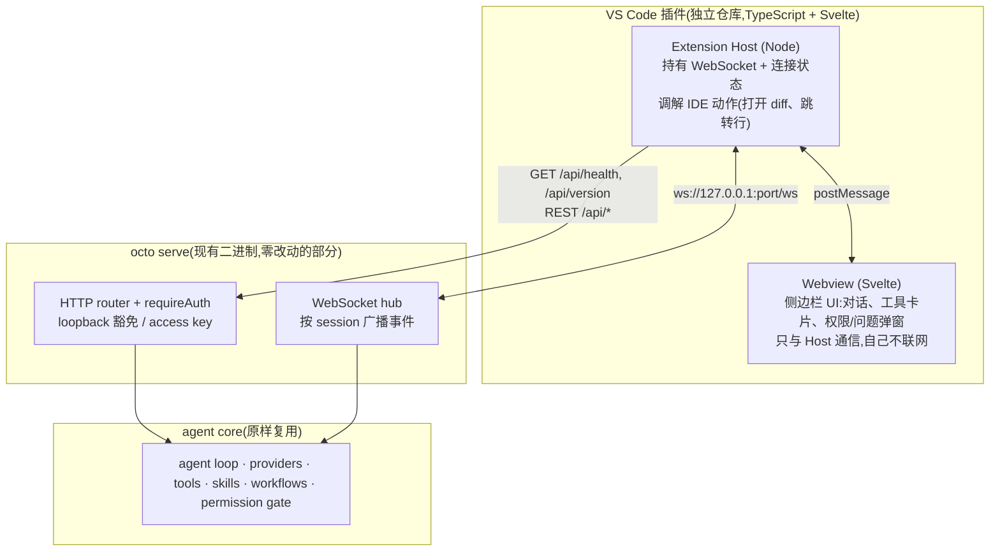
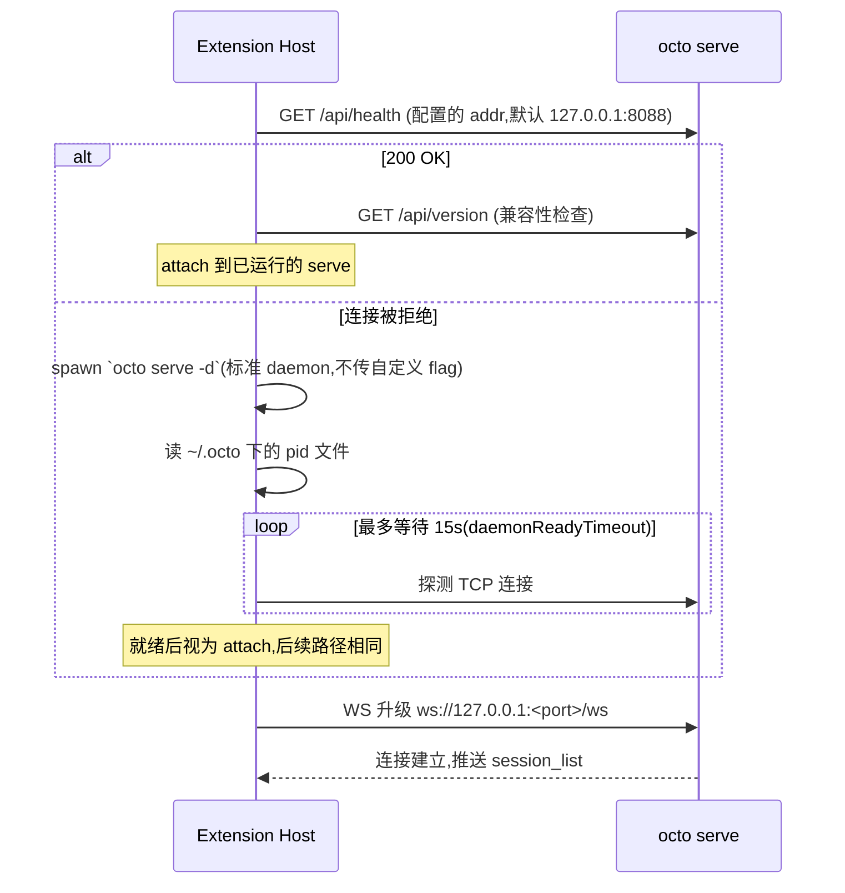

# VS Code 插件设计

octo 的 VS Code 插件是一个薄客户端:它连接(或拉起)`octo serve`,把编辑器上下文喂给 agent,把协议事件渲染成原生 IDE 界面。agent loop、provider、tools、skills、workflows、permission gate 全部复用现有的 `octo serve`,插件不实现、也不重复这些能力——协议是唯一的契约。

## 目标

- 在 VS Code 侧边栏里提供与 Web UI 对等的对话体验(流式输出、工具调用卡片、权限确认、AskUserQuestion)。
- 相比浏览器 Web UI 提供真正的增量价值:编辑器上下文(选区/打开文件/诊断)自动进入对话,agent 的文件改动以原生 diff editor 呈现。
- 本地零配置:插件能探测到用户已经在跑的 `octo serve` 就直接连;探测不到就自动拉起一个 daemon。

## 非目标

- **不做远程/多用户场景。** 插件默认路径只处理本机 loopback 的 `octo serve`;连接远程 serve(非 loopback bind)是可选的高级配置,鉴权走已有的 access key 机制,不是本设计的重点。
- **不重新实现协议。** WS message 的字段、语义完全照抄 `internal/server/ws_types.go`;新增能力(如果需要)先在 serve 侧加字段,插件跟进,不允许插件自造一套私有协议叠加在上面。
- **不做 serve 的进程管理 UI。** 插件只负责"探活 → attach 或 auto-spawn",不提供管理已运行 daemon(重启、切换配置等)的界面——那是 `octo serve stop/status` CLI 的职责。

## 整体架构

### 进程与 UI 拆分:host 持有连接,webview 只渲染

Extension Host 是唯一持有 WebSocket 连接和连接状态机的地方,webview 通过 `postMessage` 收发,自己不建立任何网络连接。这不是鉴权需要(本地场景本来就不需要 key,见下文),而是 VS Code webview 的生命周期决定的:侧边栏隐藏/切换时 webview 会被销毁重建,如果连接状态挂在 webview 里,每次切换标签都要重连、丢失未完成的流式渲染状态。连接状态放在长期存活的 Host 进程里,webview 只是可丢弃的渲染层,这是 VS Code 扩展处理"持久连接 + 易失 UI"的标准写法。

## 连接层

### 本地场景不需要 access key

`requireAuth`(`internal/server/auth.go`)的豁免判定是:

1. `validateAccessKey` 通过 → 直接放行(远程场景走这条)。
2. 否则要求三条同时满足:`isLoopbackRemote(RemoteAddr)`(本机发起)、`hostAllowed(Host)`(Host 是 localhost/127.0.0.1)、`Origin` 为空或 `originAllowed(Origin)` 通过。

`/ws` 走同一个 `requireAuth`(`s.api("GET /ws", s.handleWS)`),WS 升级额外过一遍 `wsCheckOrigin`,逻辑等价。插件从 127.0.0.1 连 127.0.0.1,前两条天然满足,唯一卡住的是第三条——`vscode-webview://<guid>` 目前不在 `originAllowed` 的白名单里。放行之后,插件的本地默认路径**完全不需要分发或存储 access key**。

Access key 只在插件将来支持"连接到绑定了非 loopback 地址的 serve"时才需要,那是可选的高级配置项,走标准的 `X-Access-Key` header,不影响默认路径。

### auto-spawn 的边界

探测失败时插件执行的是**标准 daemon 启动**——`octo serve -d`,不传任何自定义 flag(不指定 model、不指定 access-key)。这保证插件拉起的 daemon 和用户自己手动执行 `octo serve -d` 完全等价,读同一份 `~/.octo/config.yml`,不会有插件专属的隐式配置分支。如果用户想用不同的 model/config 跑 serve,预期路径是用户自己手动起一个(带自定义 flag),插件探活会直接 attach 上去,不会覆盖它。

插件自己拉起的 daemon 不在插件退出时杀掉——它是独立进程,PID 文件在 `~/.octo`,VS Code 关闭后 daemon 继续跑,方便下次快速 attach,行为与用户手动跑 `octo serve -d` 完全一致。

## 协议复用

插件不新增协议,直接消费 `internal/server/ws_types.go` 定义的现有消息:

**入站(插件 → serve)**:`user_message`(挂 `session_id`/`content`/`files`)、`interrupt`、`confirmation`、`user_question_answer`、`retry`、`rollback`。

**出站(serve → 插件)**:`text_delta`/`thinking_delta`/`assistant_message`、`tool_call`/`tool_result`/`tool_error`/`tool_stdout`、`progress`、`complete`、`request_confirmation`、`confirmation_complete`(另一个客户端已经回答了同一个确认,本端据此关掉自己的弹窗,不重复应答)、`request_user_question`、`session_update`、`todo_update`。

**流式文本走的不是 `output`**——`ws_types.go` 声明的 `wsEventOutput`(`type:"output"`)和前面那三个死事件一样,serve 从未构造过。真实的文字生命周期:`text_delta` 逐 token 流式推送正文,`thinking_delta` 流式推送推理过程(仅当 session 开了 `show_reasoning` 才发,默认关闭);turn 结束时 `assistant_message{content, thinking}` 带着完整聚合内容到达,**替换**而不是追加到 `text_delta` 流式拼出来的文本上——这是 serve 侧的既定设计(`ws_handlers.go` 原话:"Frontend expects a complete assistant_message event rather than streaming text_delta fragments"),Web UI 的 `ChatView.svelte` 就是这么处理的:`text_delta` 追加到当前流式气泡,`assistant_message` 到达后直接整段替换并标记流式结束。`history_user_message`(回显用户自己发的消息)和 `turn_done`(内容和 `assistant_message` 重复)也是真实事件,但插件不需要处理——用户消息已经在发送时本地乐观渲染,`turn_done` 纯冗余。

`tool_call`/`tool_result`/`tool_error`/`tool_stdout` 都带 `tool_id`——这是 `ws_handlers.go` 的 `handleEvent` 往 `map[string]any` 里额外加的字段,`ws_types.go` 里对应的具名 struct 并没有声明它,但它是把 `tool_result` 正确配对回它所属的 `tool_call` 的唯一可靠依据(事件之间没有顺序保证,一旦两个工具调用交叠,按"最近一个还没结果的调用"配对就会配错)。`tool_call` 没有 `summary` 字段——那是 `ws_types.go` 里 `wsEventToolCall` 声明了但从未真正赋值的字段。

`progress.message` 只在 REST 历史回放的快照里有值,live turn 的起始/续播广播(`doAgentTurn`/`reseedThinkingProgress`)只带 `progress_type`(比如 `"thinking"`),不带 `message`——想显示"思考中"之类的状态提示,要从 `progress_type` 推断,不能指望 `message`。

`diff`/`file_preview`/`shell_preview` 三个 `ws_types.go` 里声明的事件类型是死代码,serve 侧从未构造过——**渲染 diff 走的是另一条路**:

- 执行后:`tool_result.ui_payload`,内容是各工具自己拼的 `map[string]any`(不是命名 struct),字段因工具而异——`edit_file` 给 `{type:"edit", path, occurrences, diff}`,`diff` 是"每行加 `- `/`+ ` 前缀"的删除/新增块,**不是** unified diff(没有 `@@` hunk header),来自 `tools.EditUIDiff`;`write_file` 给 `{type:"write", path, size_bytes, line_count, preview, preview_truncated}`,没有 diff(整篇覆写,给不出旧内容);`read_file` 给 `{type:"file_read", path, lines_read, truncated, content_preview, total_lines?}`,这里的 `path`是模型传入的原始路径,不一定是绝对路径;`terminal` 给 `{type:"terminal", command, status, output_preview}`。
- 执行前(权限确认阶段):`request_confirmation.diff`(同样是 `EditUIDiff` 格式,`buildConfirmDetail` 复用的)和 `request_confirmation.command`(terminal),但这个事件不带路径字段。

REST 侧用到的既有路由:`POST /api/sessions`(创建)、`GET /api/sessions`(列表)、`PATCH /api/sessions/{id}/working_dir`(绑定工作区)、`POST /api/upload`(附件)、`POST /api/file-action`。全部是现成路由,插件不新增任何 API。

## IDE 双向集成

这是插件相对浏览器 Web UI 的核心增量价值,分两个方向:

### IDE → agent(编辑器上下文注入)

- 当前选区/打开文件的内容拼进 `user_message` 的 `content`。
- `@` 文件引用补全,插入 workspace 相对路径。
- 诊断(红波浪线报错)可作为"修复这个问题"这类 turn 的上下文来源。
- session 创建后立刻 `PATCH /api/sessions/{id}/working_dir` 绑定到当前 workspace 根目录。

### agent → IDE(原生渲染)

- `request_confirmation.diff`(执行前)和 `tool_result.ui_payload.diff`(`type:"edit"`,执行后)都渲染成 VS Code 原生 diff editor(`vscode.diff` 命令),而不是纯文本块。`EditUIDiff` 的删除/新增块格式先解析回旧/新文本,再各开一个虚拟文档(`TextDocumentContentProvider`)喂给 diff editor;执行后的场景更进一步,"新"这一侧直接用磁盘上的真实文件(有语法高亮、可编辑),不用虚拟文档,因为改动已经落地了。
- diff 的 accept/reject 走既有的权限确认协议(`wsMsgConfirmation`),不新增专属的"接受改动"通道——原生 diff editor 只负责"看清楚改了什么",批准/拒绝的按钮还是在确认弹窗里。
- 工具卡片里的文件路径可点击跳转到编辑器对应行(`type:"write"`/`type:"file_read"` 的 `ui_payload.path`)。
- terminal 的确认预览已经在 `request_confirmation.command` 里(对话闭环阶段就有),不需要额外事件。

## serve 侧改动

需要动两处,共用一个判定谓词(比如 `isBuiltinLocalOrigin`),范围严格限定在 `vscode-webview:` scheme,绝不引入 `"*"`:

1. **`originAllowed()`**(`internal/server/auth.go`)——决定 `requireAuth` 的 loopback 豁免和 `wsCheckOrigin` 是否放行。当前只认 `localhost`/loopback IP 和 `--cors` 白名单里的精确匹配;新增一个分支:`url.Parse(origin)` 后 `Scheme == "vscode-webview"` 直接放行。这一处改动让 HTTP 请求和 WS 升级都能通过。

2. **`corsMiddleware()`**(`internal/server/server.go`)——当前完全由 `s.cfg.CORSOrigins` 驱动,配置为空就整体短路、不发任何 CORS 头(内置 Web UI 是同源加载,从不需要)。VS Code webview 里的 `fetch()` 是真正的跨源请求,即使 `requireAuth` 放行了请求本身,浏览器侧也会因为没有 `Access-Control-Allow-Origin` 而拒绝 JS 读取响应体。需要让 `corsMiddleware` 在检查 `s.cfg.CORSOrigins` 之外,额外用同一个谓词判断并反射(reflect)`vscode-webview://<guid>` 这个具体 origin(不是 `*`,因为可能携带 `Authorization`/`X-Access-Key` 头)。

两处改动都要配对测试:仿照 `auth_test.go` 现有风格,断言 `vscode-webview://<uuid>` 放行、`http://vscode-webview.evil.com`(伪造 host,非真实 scheme)拒绝。

## 多窗口与 session 归属

`octo serve` 的 session 列表是全局的(多个浏览器 tab 连同一个 daemon 时已经是这样),插件不改这个模型。插件侧的缓解是纯客户端过滤:`wsSessionInfo` 已经带 `WorkingDir` 字段,侧边栏默认只显示 `WorkingDir` 匹配当前 VS Code workspace 根目录的 session,用户可以手动展开看到其他工作区的 session。这不需要 serve 端任何改动。

## 仓库与打包

插件是独立仓库(如 `open-octo/octo-vscode`),不放进 `octo-agent` 这个 Go 模块——VS Code 插件有自己的发布节奏(`vsce` 打包、Marketplace 版本号),和 octo 二进制的发布周期解耦,也不需要 `go:embed` 这种嵌入机制(它不随 octo 二进制分发,是用户从 Marketplace 单独装的)。

侧边栏 UI 直接复用现有 `web/` 项目里的 Svelte 组件(对话气泡、工具卡片等),按需拆出可共享的组件层,避免两套 UI 各画一份。

## 里程碑

1. **连接层**:探活 → 没有则 `octo serve -d` → WS 握手成功。验收:状态栏显示 `octo: connected`。
2. **对话闭环**:发消息 → 流式渲染 text_delta/assistant_message/tool_call/tool_result → 权限确认与 AskUserQuestion 弹窗可用。验收:能跑完一个带工具调用和权限确认的完整 turn,agent 的文字回复真的显示出来(不是只有工具卡片)。
3. **IDE → agent**:workspace 根绑定 working_dir;选区/`@`文件/诊断注入。验收:选中代码提问,agent 收到的正是那段代码。
4. **agent → IDE**:`request_confirmation.diff`/`tool_result.ui_payload`(`type:"edit"`)渲染为原生 diff editor,点击跳转文件。验收:agent 改文件时在编辑器里看到原生 diff 而非纯文本。
