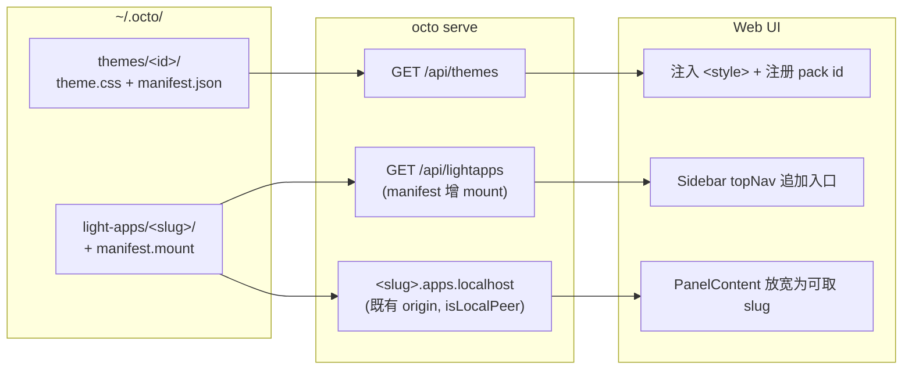

# Web 端插件：主题与面板扩展

octo 的后端能力早就可以扩展——skills、MCP、hooks、workflows、sub-agents 都是给用户留的口子。但界面这一层是零扩展点：11 个 view 写死在 `web/src/views/`，侧边栏导航写死在 `web/src/components/layout/Sidebar.svelte`，主题包写死在 `web/src/lib/theme.ts` 的 `PACKS` 数组。本方案给 UI 层开口子。

## 目标

- 让第三方能做出**可展示、带作者署名的作品**：自定义主题、挂进界面的自定义面板。这是本方案的首要目的——插件本身的技术价值是次要的，它给项目创造"别人的东西"才是。
- 复用已有的 origin 沙箱基础设施，不新建第二套隔离模型。
- 扩展点的契约要窄到内部组件树可以继续自由重构。

## 非目标

- **不做"一切皆插件"。** 不把内置面板（artifacts / diff / light apps）改造成插件，不让插件替换内置组件。
- **不暴露组件级 API。** 插件改不了聊天气泡排版、输入框、整体布局——这些需要把 Svelte 组件树变成公开契约，代价是之后每次重构都要背兼容。想改这些的用户，答案是 fork。
- **不做插件市场与远程安装。** 本地目录 + `git clone` 就是安装方式。
- **不做沙箱逃逸能力。** 插件拿不到宿主页面的 DOM、localStorage、cookie。

## 现状盘点

三块基础设施已经在生产里跑着，方案建立在它们之上。

### 主题：应用里只剩默认包

`web/src/lib/theme.ts` 用两个 `<html>` 属性驱动主题：`data-theme`（light/dark）与 `data-theme-pack`（调色板家族）。色值是 `web/src/app.css` `:root` 块里的 63 个 CSS 变量——**这 63 个名字就是主题作者的全部契约**。

`app.css` 现在只保留默认包 azure（`:root` 与 `:root[data-theme="dark"]`），因为总得有东西能在任何主题文件被读取之前先渲染出来。`PACKS` 相应只剩一项。

octo 自带的其余主题（ocean / blossom / vogue）是 `internal/server/themes/` 下的目录，随二进制 `go:embed`，首次启动写进 `~/.octo/themes/`，此后就是普通用户主题——下游没有任何地方区分它们。这正是把它们搬出去的目的：可读、可改、可删，同时充当三份高质量范本。

每个主题是两块，缺一不可：

```css
:root[data-theme-pack="blossom"]                    { --…: …; }  /* light */
:root[data-theme-pack="blossom"][data-theme="dark"] { --…: …; }  /* dark  */
```

两块特异性相同（0,2,0），主题的样式表后加载，所以只写 light 块会让亮色值泄漏进暗色模式。`web/src/lib/theme.test.ts` 直接对 `internal/server/themes/` 下的三个主题跑这条守卫和 AA 对比度检查——守卫跟着主题走，而不是跟着 app.css。

### Light Apps：面板插件的骨架已经存在

`dev-docs/light-apps-design.md` 定义的 Light App 就是"用户放一个目录，在 iframe 里跑"：

```
~/.octo/light-apps/<slug>/
├── manifest.json     # slug / name / description / icon / created_at
└── index.html
```

服务端 `internal/server/lightapp_origin.go` 把它挂在独立 origin `<slug>.apps.localhost` 上（常量 `lightAppHostSuffix`），入口经 `serveArtifactEntry` 过 CDN 闸，同级资源按扩展名放行。`internal/server/lightapps_handlers.go` 的 `lightAppManifest` 结构提供列表/读取/删除，存储根是 `datahome.Path("light-apps")`。宿主在 `web/src/components/ArtifactsPanel.svelte` 的 `$panelContent === 'lightapps'` 分支里渲染。

`internal/server/lightapp_bridge.js` 是服务端注入进 Light App 的 postMessage 桥，用 `__laBridge` 信封，**当前只承载两件事**：一次性 localStorage 迁移，和桌面 webview 下的下载转交。

**缺口有两个：桥不通向 octo 的会话数据；Light App 只能在 lightapps 列表里被打开，不能声明自己挂在哪。**

### Artifact origin：授权模型的先例

`internal/server/artifact_origin.go` 给每个 HTML 制品发一个 24h TTL 的 grant（`artifactGrantTTL`），token 是 16 随机字节的 hex，挂在 `<token>.artifacts.localhost`。`handleGrantArtifactOrigin` 的三道闸——可预览类型、绝对路径、transcript 证明本会话写过——是"授权访问一份本地文件"的现成写法。Light App 不发 token：它是用户主动保留的东西，而且**稳定的 hostname 本身就是目的**，localStorage 要跨会话和重启存活。

### 硬约束：`*.localhost` 只在同机可用

浏览器把 `*.localhost` 解析到本机，所以跑在这些 origin 上的东西只在浏览器与 `octo serve` 同机时可用。两侧都已显式处理：

- `serveLightAppOrigin` 对非本地 peer 直接 403（`isLocalPeer`，文案 "light apps are available only from the local machine"）。
- `handleGrantArtifactOrigin` 对非本地请求返 409——不是 403，语义是"没有被禁止，这个 origin 对你不存在"——前端落到 local-only 提示并保留代码视图。IPv6 字面量 host 同样 409，因为 CSP 的 host-source 语法没有方括号形式，`frame-ancestors` 写不出 `[::1]`。

前端已有现成判定：`ArtifactsPanel.svelte` 的 `laAvailable = $localAccess && !laHostIsIPv6`，两个坑都盖住了。

**推论：面板插件在手机端、tunnel 远程访问下不可用。** 这是设计约束不是缺陷，但 mount 会把它变成一个可见问题——见下。主题包不受影响，它是纯 CSS，走主 API。

## 设计

两个口子，一次发布。



### 一、主题包

`~/.octo/themes/<id>/` 放 `manifest.json`（id / name / 可选 names / author / homepage / swatch）、`theme.css`，以及样式表引用的资源（壁纸、字体）。服务端扫目录，`GET /api/themes` 返回清单，`GET /api/themes/<id>/<file>` 提供样式表与资源。前端为每个主题追加一个 `<link>`，并把 id 并入可选列表，picker 自然多出几项。

资源走白名单扩展名并逐一固定 Content-Type。**SVG 被刻意排除**：这些文件来自用户可写的目录、从应用自身 origin 提供，而 SVG 能携带脚本。

资源必须用完整接口路径引用（`url('/api/themes/<id>/x.webp')`），不能用相对路径：自定义属性里的相对 URL 在**使用处**而非声明处解析，而 `--chat-bg-image` 是被 `ChatView` 打包后的样式表消费的，相对路径会被解析到 `/assets/` 底下并静默失败。

`names` 让主题按界面语言命名（深海 / 少女 / 时尚）。这三个名字原本是 i18n key，搬成文件后必须由 manifest 自己带，否则中文界面会退化成英文名——而按来源特判 UI 是不做的。

seed 只投放一次：`~/.octo/themes/.seeded` 记录已投放的 id，所以用户删掉的主题不会在下次启动时回来，改过的也不会被升级覆盖；而新版本新增的主题仍然会被送达。

主题作者的契约就是 app.css `:root` 里那 63 个变量名——已整理为 `docs/.../guides/themes.mdx`，不需要新概念。一个主题包就是：

```css
:root[data-theme-pack="ocean"]                    { --text: …; --bg-layout: …; }
:root[data-theme-pack="ocean"][data-theme="dark"] { --text: …; --bg-layout: …; }
```

注入的 CSS 用 `data-theme-pack` 选择器天然限定作用域，未选中就不生效。风险面是 CSS 注入——可改外观，不能读数据、不能发请求——与用户往数据目录放 skill 同级别的信任。

`normalizePack` 的回退逻辑要从"未知 id 回退默认"扩展到"用户包被删除后回退默认"，不能再假设 id 集合是编译期常量。

### 二、mount：让 Light App 声明自己挂在哪

`lightAppManifest` 增加一个可选字段：

```json
{ "slug": "sketch", "name": "绘图板", "mount": "view" }
```

| 值 | 效果 |
|---|---|
| 缺省 | 今天的行为——只在 Light Apps 页的卡片列表里出现 |
| `"view"` | 侧边栏导航多一项，点击后整页渲染这个 app |

缺省即现状，老 Light App 一行不用改。

落点是四处，都很浅：

1. `lightAppManifest` 加 `Mount string \`json:"mount,omitempty"\`` ，服务端校验只接受 `"view"`，其余当缺省。
2. `Sidebar.svelte` 的 `topNav` 数组（形状 `{icon, label, v}`）追加声明了 `mount: "view"` 的项。`view` store 是 `writable('chat')`，纯字符串无联合类型约束，插件 slug 直接作为 view 值即可。
3. 右侧面板不参与：它属于会话（artifacts / diff），app 不是会话的一部分，`PanelContent` 保持
   `'session' | 'lightapps' | 'diff'`。

**mount 带出的新问题：远程用户会看到一个点不开的入口。** 内置 lightapps 至少还是个列表页，而 mount 到侧边栏的入口在手机上点进去只会拿到 403，看起来像坏功能。解法是复用现成判定——`laAvailable`（`$localAccess && !laHostIsIPv6`）为 false 时，mount 入口整个不渲染。不新建机制，不加提示文案：一个远程用户看不见的入口，好过一个看得见但坏掉的。

### 桥暂不扩展

`__laBridge` 这一版不动，插件拿不到会话数据。理由是第一版要验证的假设是"有没有人写"，不是"能写多复杂"——而一个绘图板、一个计算器、一个看板，要的是一块画布和挂载点，不是会话流。等第一版收到真实反馈再决定给哪些 op（候选：`session.read` / `session.subscribe` / `session.send`，宿主按 manifest 的 `permissions` 放行，凭据永远只在宿主侧）。

## 第一版验收标准

**主题**

1. 往 `~/.octo/themes/ocean/` 放 `manifest.json` + `theme.css`，刷新 Web UI，设置里的主题包 picker 多出 "Ocean"，选中后界面变色，light/dark 切换各自生效。
2. 删除该目录后刷新，picker 回到四项，原先选中 ocean 的用户回落到默认包且不报错。
3. 文档列出全部 63 个可覆盖变量，附一个可直接复制的最小 theme.css 模板，并写明「两块都必须写」的特异性坑。

**mount**

4. 一个声明 `"mount": "view"` 的 Light App 出现在侧边栏，点击整页渲染。
5. 不声明 mount 的老 Light App 行为完全不变（仍只在列表页出现）。
6. 非法 mount 值不会让列表接口失败，按缺省处理。
7. 远程浏览器（非 `isLocalPeer`）下，mount 入口不出现在侧边栏；Light Apps 列表页本身的行为不变。

**示例**

8. 一个示例面板（绘图板）以 `mount: "view"` 的 Light App 形态跑通，作为给插件作者的模板。

## 风险

- **没人写。** 插件生态需要先有一小撮活跃用户。第一版小到只亏一个周末，就是对这个风险的定价。
- **主题包漂移。** 变量重命名会悄悄让第三方主题失效。缓解：把 app.css 的变量名视为公开契约，重命名走废弃期；`normalizePack` 已有的回退保证坏包不会白屏。
- **mount 稀释 Light App 的定位。** Light App 原本是"对话生成、持久可用的小程序"，mount 让它同时承担"UI 插件"。两者的目录、origin、沙箱完全相同，合并承载比新建一套便宜得多——但文档要把两种用法讲清楚，否则用户不知道该不该写 mount。
